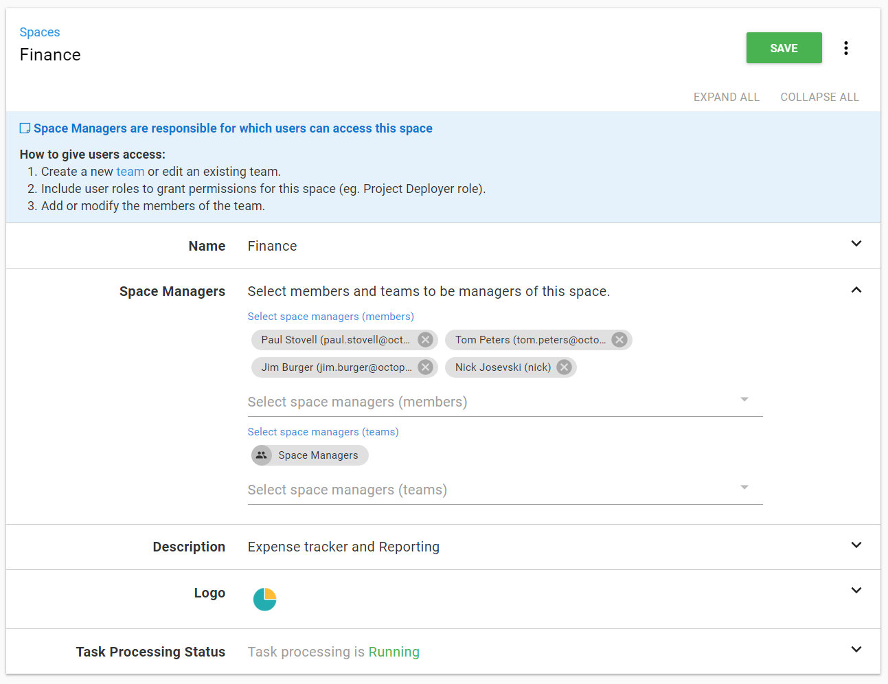
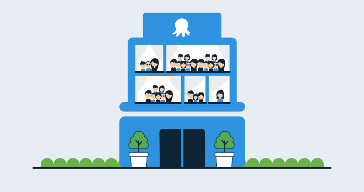

Octopus Deploy helps teams automate the deployments of their application and services. As time goes on, and as they keep adding projects, environments, and machines, it can become difficult to find the things they're working on. If this sounds familiar, you might have scrolled for ages to find the project you want to deploy, scrolled horizontally to find the latest version deployed to an environment, or looking through drop-down lists with hundreds of items.

This can be frustrating and we're very happy to share that we've been working on a solution called Spaces. Spaces are a new way to organize your Octopus Server. It will make it easy to group your team's projects, environments, machines, tenants, library resources and more into a 'Space' just for you and your team.

## Built for teams

Spaces is a feature built for teams.

Most developers work in teams building and maintaining one or more projects and the associated infrastructure. This includes environments, machines, Azure or AWS accounts, step templates, variable sets and so on. Companies are different though. Some companies organize their teams by department. Some organize them by function. Spaces enables teams to organize their projects and infrastructure as it suits them and they can be a member of multiple Spaces. Our Spaces switcher makes it easy to jump between Spaces, so instead of seeing dozens or hundreds of unrelated projects and other Octopus resources, you'll just see the resources for that Space.

## Space Owners

After speaking with customers, it was clear that one of the key driving factors for Spaces is being able to delegate a set of responsibilities. This way, Octopus administrators can hand over full control of a Space and be completely hands off if they choose. Leaving the administrator to focus on system concerns like adding new users, managing any system teams, and the configuration of the installation. For the administrator who wants to be directly involved in a team's Space they can add themselves as a member of a team with Space access.

## Hard Walls

> A Project within Space A should not be able to deploy to a Machine from Space B

Spaces is about isolation not about sharing. We wanted to ensure we got the security and isolation right first. It is easy to imagine scenarios for anything in Octopus to be shared. As we started to build Spaces and got into the implementation details it became clear to us that without true isolation the state of your Octopus could become very complicated.

We’ve drawn a line in the sand for Spaces, and everything that’s fundamental in deploying your projects to targets in environments and tenants, is within a Space.

## Space, When You Need It

Spaces is entirely opt-in. We have done extensive work and testing to ensure the feature is as backwards compatible as possible. We've introduced the concept of a "Default Space" which allows us to support the majority of the API as it is today. Spaces will be there when you need it, and moving to Spaces can be a gradual transition.

The way you use Octopus today for the most part will not change, we will have specific details closer to release. In summary, Octopus will enforce permissions more consistently and some API endpoints around managing the installation have changed, e.g. [Teams/Permissions](/blog/2018-05/team-configuration-improvements.md).

## Licensing

After talking with our existing customers, their ideas and desires for segregation of business units and various teams and infrastructure drove the design of Spaces.

Deployment Targets that exist in each Space that represent the same physical hardware will each be counted towards your machine limit.

 ### Self-hosted

 - Customers using a grandfathered Community (free), Professional, Team, or Enterprise license are limited to one Space. You can upgrade to a newer license to split your Octopus into multiple Spaces.
 - Customers using a grandfathered High Availability license get unlimited Spaces.
 - Customers with a Standard license will get three Spaces. You can upgrade to Data Center to get more Spaces.
 - Customers with a Standard Unlimited or Data Center license will get unlimited Spaces.

 ### Octopus Cloud

 - New and existing Standard edition customers will get unlimited Spaces.
 - Existing customers on the old Starter edition will get 1 Space.

## Conclusion

We've been working hard on Spaces and we're happy that it's nearly finished. We're planning to ship it in January 2019. Stay tuned for another post coming soon with some further details.

In the meantime, if you haven't already, have a look at our [recent webinar where we discussed Spaces alongside Workers](https://hello.octopus.com/webinar-spaces-workers/on-demand).
