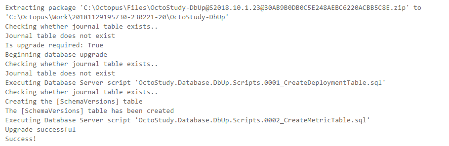
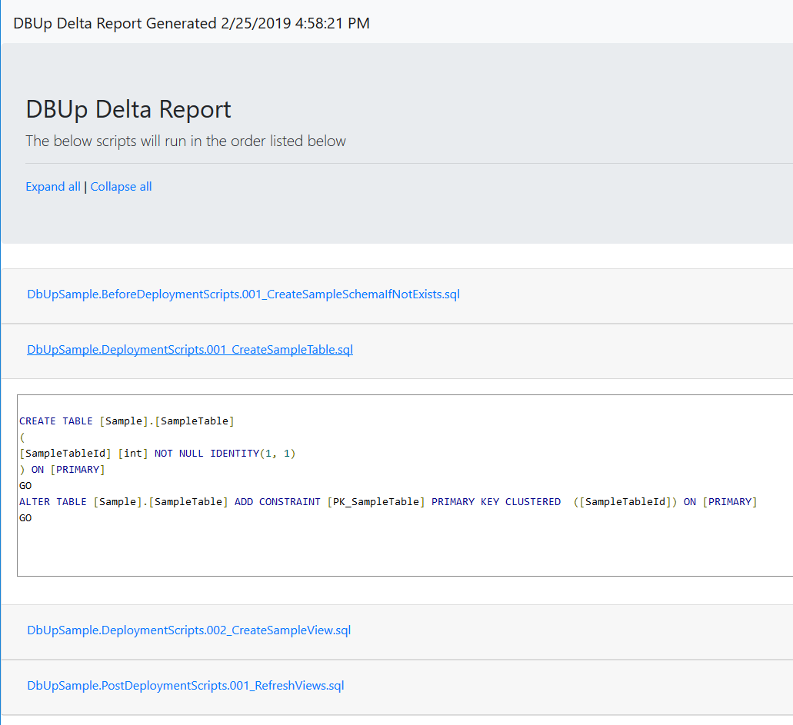
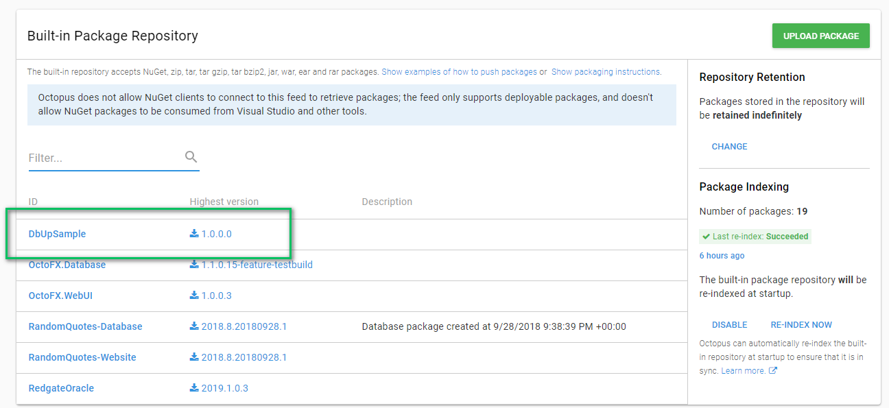
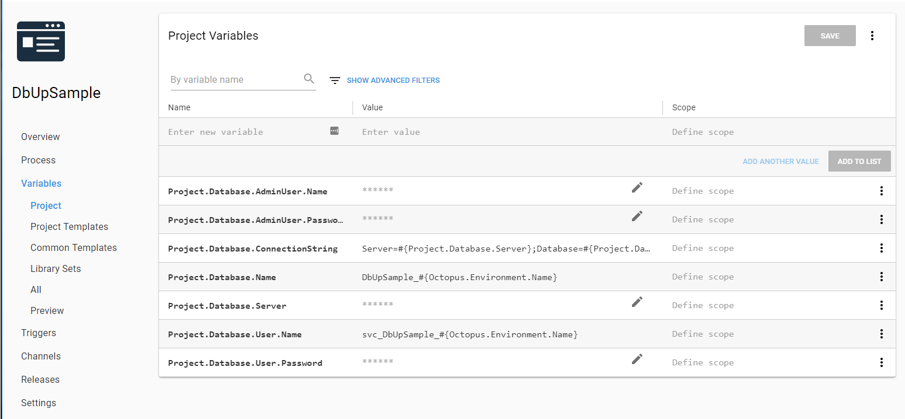
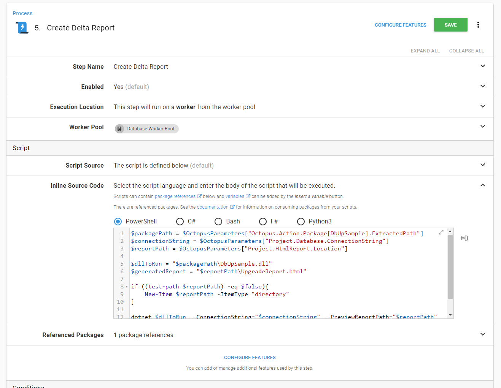
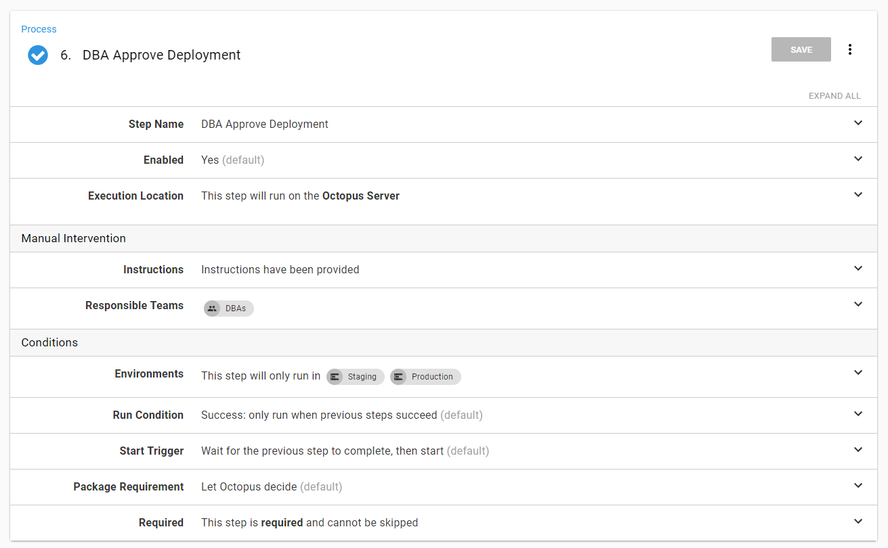
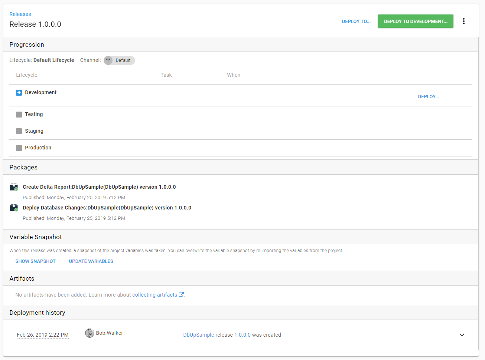
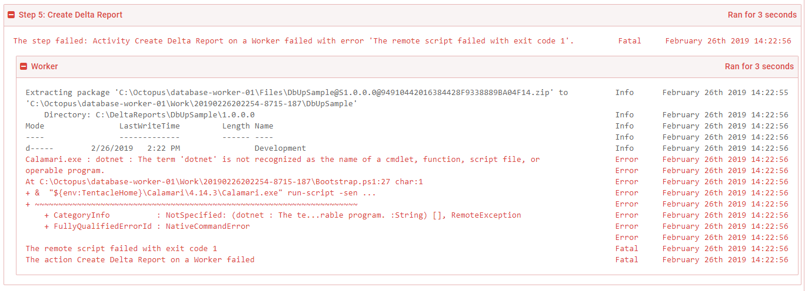
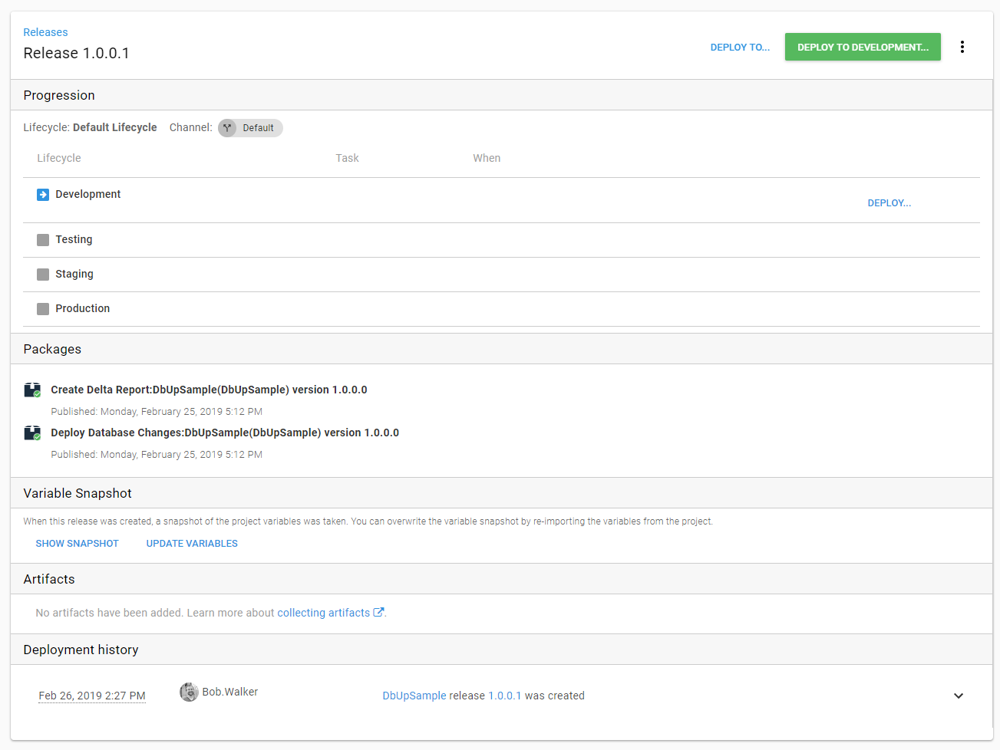

One of the most exciting aspects of database deployments is the number of tools released in the last 10 years.  Looking at my [previous posts](https://octopus.com/blog/tag/Database%20Deployments) on this topic and I have shown a clear bias towards Redgate's tooling.  I do have a bit of a bias towards their tools.  I'm a [friend of Redgate](https://www.red-gate.com/hub/events/friends-of-rg/friend/BobWalker) for a reason.  

I'm going to switch gears a bit and focus on a different tool for this post, [DbUp](https://dbup.readthedocs.io/en/latest/).  DbUp is a free, open-source tool, which we use here at Octopus Deploy for our database deployments.  Anytime you install or upgrade Octopus Deploy, DbUp is the one who runs the scripts to update your database.  Our founder, Paul Stovell, wrote a [blog post back](https://github.com/DbUp/DbUp/graphs/contributors) in 2012 on how to use DBUp to deploy to a SQL Server.  For the most part, that blog post still holds up today.  Except for the outdated images.  Want to see what Octopus Deploy looked like years ago?  Check out that post.  

This post is an update to that old post.  I am going to walk through some of the new features recently added to DbUp and create a process to use DbUp for production deployments.  It even includes a review step for a DBA to approve!  Read on!

!toc

## Changes to DbUp

At it's core, DbUp is a script runner.  Each change made to the database is done by a script.

- Script001_AddTableA.sql
- Script002_AddColumnTestToTableA.sql
- Script003_AddColumnTestAgainToTableA.sql

DbUp is then run through a console application you write yourself.  You control which options to use.  The amount of code needed is pretty small.

```C
static int Main(string[] args)
{
    var connectionString =
        args.FirstOrDefault()
        ?? "Server=(local)\\SqlExpress; Database=MyApp; Trusted_connection=true";

    var upgrader =
        DeployChanges.To
            .SqlDatabase(connectionString)
            .WithScriptsEmbeddedInAssembly(Assembly.GetExecutingAssembly())
            .LogToConsole()
            .Build();

    var result = upgrader.PerformUpgrade();

    if (!result.Successful)
    {
        Console.ForegroundColor = ConsoleColor.Red;
        Console.WriteLine(result.Error);
        Console.ResetColor();

        return -1;
        }
    }

    Console.ForegroundColor = ConsoleColor.Green;
    Console.WriteLine("Success!");
    Console.ResetColor();
    return 0;
}
```

You bundle up those scripts and tell DbUp to run them.  It compares that list against a list stored in the destination database.  Any scripts not in that destination's database list will be ran.  The scripts are run in alphabetical order.  The results of each script is displayed.  Very simple to implement.  Very simple to understand.  



And that works great...when deploying to a development or test environment.  A lot of companies I talk to prefer a DBA approve scripts prior to going to production.  And, maybe a staging or pre-production environment as well.  Especially starting out.  When the trust in the process is low.  

### HTML Report

Migration scripts are a double edged sword.  Just like memory management in C++.  You have total control, which gives you a lot of power.  But it is also easy to mess up.  It all depends on the type of change being done and the SQL Skills of the writer.  The trust of the DBAs will be very low when have inexperienced C# developers writing these migration scripts.  Especially if you are starting down the automated database deployment path.  

Recently I added in the the functionality to DbUp to generate an HTML report.  It is an extension method where you give it the path of the report you wish to generate.  That means this section goes from:

```C
var result = upgrader.PerformUpgrade();

if (!result.Successful)
{
    Console.ForegroundColor = ConsoleColor.Red;
    Console.WriteLine(result.Error);
    Console.ResetColor();

    return -1;
    }
}
```

To:

```C
// --generateReport is the name of the example argument.  You can call it anything
if (args.Any(a => "--generateReport".Equals(a, StringComparison.InvariantCultureIgnoreCase))) 
{
    upgrader.GenerateUpgradeHtmlReport("C:\\DeploymentLocation\\UpgradeReport.html");
}
else
{
    var result = upgrader.PerformUpgrade();

    if (!result.Successful)
    {
        Console.ForegroundColor = ConsoleColor.Red;
        Console.WriteLine(result.Error);
        Console.ResetColor();
        return -1;
    }
}
```

This will generate a report containing all the scripts which are going to be run.


### Always Run Script and Script Grouping

By default DbUp will run a script once.  Majority of the time that is fine.  There are times where it would be nice to always run a script.  An example would be a post deployment script to refresh all the views.  Or a script to rebuild all the indexes and regenerate stats.  You don't want to write a new script for each deployment.

Another feature I added to DbUp is the ability to mark a group of scripts as `always run` and provide a run group.  

```C
var upgradeEngineBuilder = DeployChanges.To
    .SqlDatabase(connectionString, null) //null or "" for default schema for user
    .WithScriptsEmbeddedInAssembly(Assembly.GetExecutingAssembly(), script => script.StartsWith("SampleApplication.PreDeployment."), new SqlScriptOptions { ScriptType = ScriptType.RunAlways, RunGroupOrder = 1})
    .WithScriptsEmbeddedInAssembly(Assembly.GetExecutingAssembly(), script => script.StartsWith("SampleApplication.Scripts."), new SqlScriptOptions { ScriptType = ScriptType.RunOnce, RunGroupOrder = 2})
    .WithScriptsEmbeddedInAssembly(Assembly.GetExecutingAssembly(), script => script.StartsWith("SampleApplication.PostDeployment."), new SqlScriptOptions { ScriptType = ScriptType.RunAlways, RunGroupOrder = 3})
    .LogToConsole();

var upgrader = upgradeEngineBuilder.Build();

var result = upgrader.PerformUpgrade();

// Display the result
if (result.Successful)
{
    Console.ForegroundColor = ConsoleColor.Green;
    Console.WriteLine("Success!");
}
else
{
    Console.ForegroundColor = ConsoleColor.Red;
    Console.WriteLine(result.Error);
    Console.WriteLine("Failed!");
}
```

## Create the DbUp Console Application

With these new features we are going to put together a .NET Core DbUp console application to deploy to SQL Server.  Then we will put together a process in Octopus Deploy for it to run that console application.  

All the code below be found on [GitHub](https://github.com/OctopusSamples/DbUpSample).

**Please Note:** I chose .NET Core over .NET Framework because it could be built and run anywhere.  DbUp is a .NET Standard library.  DbUp will work just as great in a .NET Framework application.  

Alright, let's fire up our IDE of choice and create an .NET Core Console Application.

**Please Note:** I am using JetBrain's Rider to build this console application.  I prefer it over Visual Studio.

### Scaffolding

Alright, we have the console application created.  Now we need to bring in the DbUp NuGet packages.  Let's go to our NuGet Package Manager.


Next we want to select the DbUp-SqlServer package.  This includes the core package as well as the necessary code to deploy to SQL Server.  If you want to deploy to PostgreSQL, MySQL, Oracle, or Sqlite you would pick those.  


The console application needs some scripts to deploy.  I'm going to add three folders and populate them with some script files.  


**Please Note:** It is highly recommended you add a prefix such as 001, 002, etc to the start of your script file name.  DbUp runs the scripts in alphabetical order.  That prefix will help ensure scripts are run in the right order.

By default .NET will not include those scripts files when the console application is built.  We want to include those script files as embedded resources.  Thankfully we can easily add a reference those files by including this code in the `.csproj` file.

```XML
    <ItemGroup>
        <EmbeddedResource Include="BeforeDeploymentScripts\*.sql" />
        <EmbeddedResource Include="DeploymentScripts\*.sql" />
        <EmbeddedResource Include="PostDeploymentScripts\*.sql" />
    </ItemGroup>

```

The entire file would then look like.


### Program.cs file
The final step to get this application going is to add in the necessary code in the `Program.cs` to call DbUp.  The application will accept parameters from the command line.  Octopus Deploy will be configured to send in those parameters.  The parameters we will create in this walkthrough will be:

- ConnectionString -> No need to explain this one.  For this demo, we will be sending as a parameter instead of storing in the config file.  You can use the config file and Octopus Deploy's variable replacement in your code.  Up to you.
- PreviewReportPath -> Full path where to save the preview report.  This is optional.  When it is sent in we will generate a preview html report for Octopus Deploy to make an artifact for.  When it is not sent in the code will do the actual deployment.

Let's start with pulling the connection string from the command line argument.

```C
static void Main(string[] args)
{    
    var connectionString = args.FirstOrDefault(x => x.StartsWith("--ConnectionString", StringComparison.OrdinalIgnoreCase));

    // We expect the connection string to be there.  If it doesn't this will throw an error.  
    connectionString = connectionString.Substring(connectionString.IndexOf("=") + 1).Replace(@"""", string.Empty);
```

DbUp uses a fluent API.  We need to tell it about our folders, the type of script each folder is and the order we want to run scripts from that folder in.

**Please Note:** If you use the Scripts Embedded In Assembly option with a "StartsWith" search you will need to supply the full NameSpace on your search.

```C
var upgradeEngineBuilder = DeployChanges.To
    .SqlDatabase(connectionString, null)
    // Pre-deployment scripts, set them to always run first
    .WithScriptsEmbeddedInAssembly(Assembly.GetExecutingAssembly(), x => x.StartsWith("DbUpSample.BeforeDeploymentScripts."), new SqlScriptOptions { ScriptType = ScriptType.RunAlways, RunGroupOrder = 0 })
    // Main Deployment scripts, they run once and run in the second group
    .WithScriptsEmbeddedInAssembly(Assembly.GetExecutingAssembly(), x => x.StartsWith("DbUpSample.DeploymentScripts"), new SqlScriptOptions { ScriptType = ScriptType.RunOnce, RunGroupOrder = 1 })
    // Post deployment scripts, always run these scripts and run after everything has been deployed
    .WithScriptsEmbeddedInAssembly(Assembly.GetExecutingAssembly(), x => x.StartsWith("DbUpSample.PostDeploymentScripts."), new SqlScriptOptions { ScriptType = ScriptType.RunAlways, RunGroupOrder = 2 })
    // By default all the scripts are run in the same transaction
    .WithTransactionPerScript()
    // Set this so it can report back to Octopus Deploy how things are going
    .LogToConsole();

var upgrader = upgradeEngineBuilder.Build();

Console.WriteLine("Is upgrade required: " + upgrader.IsUpgradeRequired());
```

The upgrader has been built and it is ready to run.  This section is where will inject the check for the upgrade report parameter.  If that parameter is set, do not run the upgrade.  Instead, generate a report for Octopus Deploy to upload as an artifact.

```C
if (args.Any(a => a.StartsWith("--PreviewReportPath", StringComparison.InvariantCultureIgnoreCase)))
{
    // Generate a preview file so Octopus Deploy can generate an artifact for approvals
    var report = args.FirstOrDefault(x => x.StartsWith("--PreviewReportPath", StringComparison.OrdinalIgnoreCase));
    report = report.Substring(report.IndexOf("=") + 1).Replace(@"""", string.Empty);

    var fullReportPath = Path.Combine(report, "UpgradeReport.html");

    Console.WriteLine($"Generating the report at {fullReportPath}");
    
    upgrader.GenerateUpgradeHtmlReport(fullReportPath);
}
else
{
    var result = upgrader.PerformUpgrade();

    // Display the result
    if (result.Successful)
    {
        Console.ForegroundColor = ConsoleColor.Green;
        Console.WriteLine("Success!");
    }
    else
    {
        Console.ForegroundColor = ConsoleColor.Red;
        Console.WriteLine(result.Error);
        Console.WriteLine("Failed!");
    }
}
```

When we put it all together it will look like this:

```C
using System;
using System.IO;
using System.Linq;
using System.Reflection;
using DbUp;
using DbUp.Engine;
using DbUp.Helpers;
using DbUp.Support;

namespace DbUpSample
{
    class Program
    {
        static void Main(string[] args)
        {
            var connectionString = args.FirstOrDefault(x => x.StartsWith("--ConnectionString", StringComparison.OrdinalIgnoreCase));

            connectionString = connectionString.Substring(connectionString.IndexOf("=") + 1).Replace(@"""", string.Empty);

            var upgradeEngineBuilder = DeployChanges.To
                .SqlDatabase(connectionString, null)
                .WithScriptsEmbeddedInAssembly(Assembly.GetExecutingAssembly(), x => x.StartsWith("DbUpSample.BeforeDeploymentScripts."), new SqlScriptOptions { ScriptType = ScriptType.RunAlways, RunGroupOrder = 0 })
                .WithScriptsEmbeddedInAssembly(Assembly.GetExecutingAssembly(), x => x.StartsWith("DbUpSample.DeploymentScripts"), new SqlScriptOptions { ScriptType = ScriptType.RunOnce, RunGroupOrder = 1 })
                .WithScriptsEmbeddedInAssembly(Assembly.GetExecutingAssembly(), x => x.StartsWith("DbUpSample.PostDeploymentScripts."), new SqlScriptOptions { ScriptType = ScriptType.RunAlways, RunGroupOrder = 2 })
                .WithTransactionPerScript()
                .LogToConsole();

            var upgrader = upgradeEngineBuilder.Build();

            Console.WriteLine("Is upgrade required: " + upgrader.IsUpgradeRequired());
            
            if (args.Any(a => a.StartsWith("--PreviewReportPath", StringComparison.InvariantCultureIgnoreCase)))
            {
                // Generate a preview file so Octopus Deploy can generate an artifact for approvals
                var report = args.FirstOrDefault(x => x.StartsWith("--PreviewReportPath", StringComparison.OrdinalIgnoreCase));
                report = report.Substring(report.IndexOf("=") + 1).Replace(@"""", string.Empty);

                var fullReportPath = Path.Combine(report, "UpgradeReport.html");

                Console.WriteLine($"Generating the report at {fullReportPath}");
                
                upgrader.GenerateUpgradeHtmlReport(fullReportPath);
            }
            else
            {
                var result = upgrader.PerformUpgrade();

                // Display the result
                if (result.Successful)
                {
                    Console.ForegroundColor = ConsoleColor.Green;
                    Console.WriteLine("Success!");
                }
                else
                {
                    Console.ForegroundColor = ConsoleColor.Red;
                    Console.WriteLine(result.Error);
                    Console.WriteLine("Failed!");
                }
            }
        }
    }
}
```

Running the console application with the report parameter enabled generates the report we expected.



### Future Work

Creating the scaffolding and writing the code for program.cs file should only need to be done once.  With what we have setup, all you should need to do is add files to the `PreDeployment,` `PostDeployment,` and `Deployment` folders.  

The temptation is there to delete old files.  DbUp doesn't really like it when you do that.  The idea behind DbUp is it provides a history of all your database changes.  When you want to create a new database, for example on a new developer's machine, you just need to run this command line application.  It will go through and run all the scripts in order to get the database up and running.  Deleting a file might end up removing a key sequence, such as creating a table, adding an important column, or moving columns from one table to another.  There isn't much of a performance hit having extra files around.  DbUp will see they have run and exclude them from the run list.

You could move around the older files into a new folder and add a new command line argument which to pick up those files.  

## Octopus Deploy Configuration

I'm going to assume you know how to build a .NET Core application and package it up.  If you do not, here is the quick TL;DR;  

- Run the `dotnet publish` command on the project.  Set the output path.
- Run `octo.exe pack` to package up the output path (or use the Octopus Deploy build server plug-in).
- Push the package to Octopus Deploy using `octo.exe push` command (or use the Octopus Deploy build server plug-in).

To make your life easier for this demo I have included version 1.0.0.0 of the sample application as a zip file in GitHub repo.  You can find that file in the root directory of the repo.  A quick upload and we now have a package ready to deploy.



I subscribe to the theory a Octopus Deploy project should be responsible for bootstrapping itself.  For database deployments, this means making sure the database exists prior to deployment and creating the necessary SQL Server Users.

Before getting to the process, we need to define some variables.  Because this is a demo for a blog post, I am going to use the same database server for all environments.  



To create the database and user I am using the community step templates I created for earlier blog posts.  You can download those step templates to your Octopus Deploy instance by going to the [library](https://library.octopus.com) Or, you can go to the step template library on your Octopus Deploy instance and add them.

Adding in the first step presents us with a decision.  Where to run the step.  Should it run on a target or on a worker?  For right now, I am going to run this on a worker in the `Database Worker Pool.` I picked the worker pool because I am using SQL Authentication.  If I was using integrated security with this process there is some additional setup to be done.  I will cover that later in the post.  For now, I want to go through the process.


With this process we first want to put the scaffolding in place to create the database, the user and assign the user database.  


The next set of steps will deploy the database changes from DbUp.  If you recall [my previous Redgate articles](https://octopus.com/blog/automated-database-deployments-redgate-sql-change-automation-state-based) this was done via four steps.

1) Download Package
2) Run Redgate Create Database Release
3) DBA Approve Deployment
4) Run Redgate Deploy Database Release

I have a couple of problems with that process.  Namely, the download package step is designed to extract the package and leave it on the tentacle.  By default it will leave it there forever.  Unless [retention policies](https://octopus.com/docs/administration/retention-policies) are configured.  My problem with that is after the deployment is complete there is no need to keep that extracted package on the tentacle.  The SQL Scripts have been run.  The scripts are now just taking up space.  In addition, that process has steps 2 and 4 referencing step 1.  It feels like a lot of extra work.

If you are using Octopus Deploy 2018.8 or higher the good news is we can now reference packages from the `Run a Script` step.  The package will be downloaded and extracted.  Once the step is complete it will delete the extracted package.  Aside from cleaning up unneeded content, using package references in the `Run a Script` step lends itself nicely to running this process on workers.  Each step is isolated from one another.  

The first step in the deployment piece of this process will generate the HTML report and upload it as an artifact to Octopus Deploy.  First things first, we need to add a package reference to the step.  First click on the `Add` button.  


When the modal window appears choose the package to extract.


Now we can add a script to handle the deployment.  Running .NET Core console apps is a little different than running .NET Framework Console apps.

```PS
# How you reference the extracted path
$packagePath = $OctopusParameters["Octopus.Action.Package[DbUpSample].ExtractedPath"]
$connectionString = $OctopusParameters["Project.Database.ConnectionString"]
$reportPath = $OctopusParameters["Project.HtmlReport.Location"]

$dllToRun = "$packagePath\DbUpSample.dll"
$generatedReport = "$reportPath\UpgradeReport.html"

if ((test-path $reportPath) -eq $false){
	New-Item $reportPath -ItemType "directory"
}

# How you run this .NET core app
dotnet $dllToRun --ConnectionString="$connectionString" --PreviewReportPath="$reportPath"

New-OctopusArtifact -Path "$generatedReport" 
```

The entire step will looks like this when you are done:



Nothing super fancy about the manual intervention.  In this example I configured it to run only in Staging and Production and have the DBAs approve this deployment.



The deployment step is similar to the `Generate Delta Report` step except it will deploy the changes, not worry about generating the report.  The PowerShell for this step is:

```PS
# How you reference the extracted path
$packagePath = $OctopusParameters["Octopus.Action.Package[DbUpSample].ExtractedPath"]
$connectionString = $OctopusParameters["Project.Database.ConnectionString"]

$dllToRun = "$packagePath\DbUpSample.dll"

# How you run this .NET core app
dotnet $dllToRun --ConnectionString="$connectionString" --GenerateReport="$reportPath"
```


The final process is now:


The variables are there.  The process is set.  Let's deploy some database changes.



Whoops!  Forgot to install .NET Core on my worker.  One sec.



A quick jump over to the [Script Console](https://octopus.com/docs/administration/managing-infrastructure/script-console) to run a chocolatey install.


That is successful.  Good!


Let's try that release again.  Hindsight being what it is I could've told it to retry the release, but I decided to create a new one.  Why?  Reasons!



This one was successful (actually I had a few more failures because I was trying something else).  You can see the artifact created by the process.

