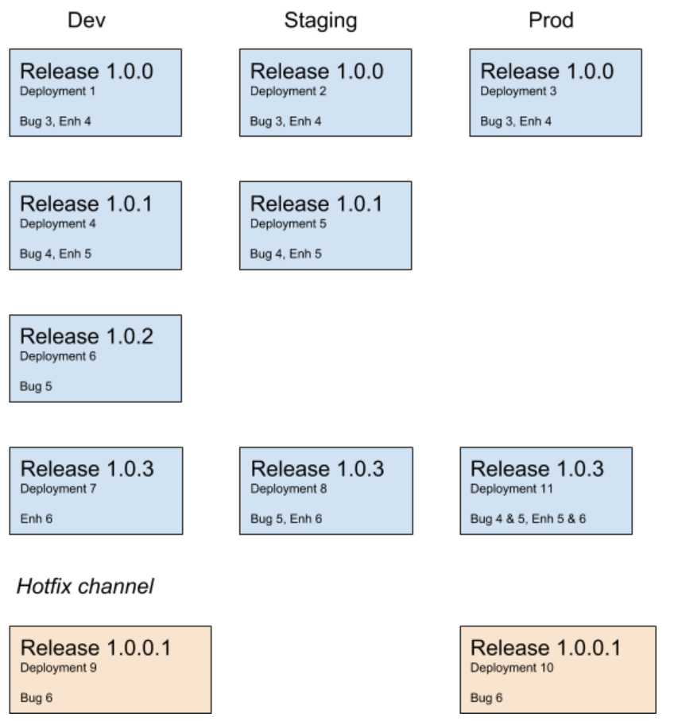

In this post we're excited to announce some new features in Octopus that are focused on tighter integration in your CI/CD pipeline. These features work together to provide feedback on the progression of work through your pipeline.

This functionality dovetails into the new release/deployment functionality Atlassian are introducing in Jira, and we'll be illustrating the integration between Octopus and Jira as we go.

### Work Items and Release Notes

Inherent in building software is the idea that over time the product is the accumulation of the features/issues/bugs that have been built/released/deployed.

It follows then that we commonly want to track which features/issues/bugs are being built into each release of the software, and then which ones are being deployed.

For the new functionality we are introducing, we've used the generalized term _work item_ to refer to a feature, issue or bug. So what we're saying is, Octopus will now be able to track work items from build to deployment.

The value of the work items for the consumer is understanding what is included in a version of the software. The common way to communicate this is using Release Notes. 

The introduction of work items hasn't changed the way Octopus handles release notes on a release itself, the work items have been added as separate information. What we have added though are release notes on a deployment. These aren't something you can manually enter, they are automatically aggregated based on the releases in the deployment. 

Wait, "release**s** in the deployment", isn't a deployment of **a** release? Yes it is, but what we're aggregating are any releases that have occurred since the last release that was deployed to the environment/tenant.

Ok that was a mouthful, let's have a look at an example.

This diagram depicts a number of releases and deployments that have occurred over time, along with which work item details are included for each deployment. In this scenario each release was immediately deployed to the Dev environment, which results in the simplest accumulation because there is only a single release involved.

The deployments for `1.0.3` illustrate a more complex accumulation of work items. As shown, when `1.0.3` is deployed to the Staging environment, it includes the accumulated work items from release `1.0.2` as well as `1.0.3`. Similarly, when it is deployed to the Prod environment the accumulation for that environment also includes the work items from `1.0.1`.

That covers the bulk of the theory, below we'll go through the details of integrating Octopus and Jira.

### Packaging

Key to flowing information through the pipeline is having a method of transport. After considering a number of options we decided to embed a custom file containing metadata into the packages.

This has a number of advantages, but the key one is that the package is always the source of truth for the data. If you are creating releases interactively in Octopus (i.e. separate to the CI/CD pipeline) for any reason, or if you are using ARC for example, the package will always contain the work item metadata.

Currently the metadata is only being read when packages are uploaded to the Octopus built-in package feed, so you must use it in order to use the work item functionality. We are considering options to support reading the metadata in packages sourced from external feeds, but getting the package content onto the Octopus server to be able to read the metadata at the time a release is created is far more complicated than it might first sound.

Ok, so how do you get this work item metadata file into the package then? Well, you use our _Pack Package_ step in your build server (Bamboo and TeamCity will be supported in the initial release with others to follow) and you configure the _Process commit messages_ setting.

The build plugins work on the assumption that the team are referencing the Jira work items in their commit messages. This is the practice when Bamboo is integrated into Jira, for example, to provide updates on when work items have been included in a build. With Octopus integrated into Jira, you then get feedback when the work items have been released and deployed.

As a note, _Development_ here refers to an environment type, not an environment name. The environment name in Octopus in this example was actually Azure-Dev, more on this later.

### Octopus Connect App and the Jira Extension

In the previous section we saw how to configure the pack package step and then the final result of a deployment being displayed in Jira. There are a few things that need to be configured to get to that point, let's look at those now.

Something worth pointing out at this point is that the Jira functionality we're demonstrating here is only available in the SaaS version. There isn't a SaaS requirement on the Octopus side of the integration though, so you can use either an OnPrem or Cloud version of Octopus.

So with that in mind, the first step in the integration is to add the Octopus Connect App in the Jira marketplace.

TODO: add a screenshot of the marketplace tile

To complete the installation of the app from the marketplace you must configure it. This requires aligning a couple of pieces of information from the page that appears in Jira and from the **Configuration / Jira Issue Tracker** page in Octopus. You'll want both of these open in separate browser windows/tabs to complete the configuration. On the Jira side you need to copy the _Octopus Installation Id_ from the Octopus page and on the Octopus side you'll need to copy your Jira instance's base Url and the client secret that appears on the Connect App configuration page

Oh, and don't forget to enable the Jira Issue Tracker extension in Octopus :)

### Project and Environment settings

Ok, so now we have Octopus and Jira connected, there are two other settings that we have to configure in Octopus. First you need to tell your Octopus project which packages in your deployment process contain the work items (we'll see some more of why this is important shortly)

In this example the project is using the primary package from the step named Deploy. You can specify multiple packages if required. As an example of where you might use this, imagine a deployment process that included steps for a Web App and a SQL database schema migration. The packages for both of those form the complete product and either or both could be contributing work items.

The second thing relates back to our earlier note on environment types vs environment names. In Octopus you'll need to map the Jira environment types for the environments that you're going to be tracking work items for.

The fixed list of environment types are important for the tracking in Jira and this configuration allows you the flexibility of easily mapping any existing environments to a type.

### Deploy a release step

???