Recently I had a chance to meet with a customer to talk about their development process. They wanted to know if it's possible to alter their CI/CD pipeline to make it easier and faster to test changes. When they started describing their scenario I couldn't help but smile because I've run into it many times over the past 10+ years.

They have three teams of developers and four main applications. There are some dependencies between the four main applications. Application A might call Application B which calls Application C and so on. There isn't a clear "line in the sand" regarding which team can work on which application. At any given point, two teams might be working on the same application. For example: 

- Team A is adding a new feature to Application A.
- Team B is making some bug fixes to Application A.
- Team C is adding a new feature to Application B.

Team B has a higher priority as it is in the middle of fixing bugs. When can Team A push the new feature for Application A in order for the QA engineers to test and business owners to verify? Is it possible to do it before Team B is finished without stepping all over their work? How can Team C make changes to their application without stopping Team B?

**Please Note**: I paraphrased that meeting quite a bit, my apologies to them if they're reading this and I oversimplified their concerns.

I ran into this scenario multiple times at different jobs before working at Octopus Deploy. At those companies, the collective lack of knowledge, as well as the tooling limitations, led to some, let's say, unusual solutions. Team C was told that whatever changes they made had to be backward compatible. Hide it behind a feature flag if that is what it takes. Work cannot stop for Teams A and B. Team A was told to hold off pushing their changes until Team B had finished their work. Depending on how long that took, Team A might try to sneak in a few minor changes as well, increasing the scope of their changes and causing more work for QA.

That is just three teams. I've worked for companies with 10+ development teams. Imagine trying to juggle all that!

The root problem is the above solution doesn't scale well. Too many manual gates. Too easy to step on toes and cause work to slow down. Each team needs their own "sandbox." Each team's sandbox has a copy of every application needed by each team or developer. This makes the above scenario much easier to handle.

- Team A can push a new feature to their sandbox for testing without stepping all over Team B.
- Team C can push changes to their sandbox for testing and not break Teams A and B.
- Team A and B are not aware of Team C's changes because they are pointing to their own copy of Application B.
- Once Team C's changes have been verified, they will merge their code into a release branch or master, which will kick off a new build and new version. Then Teams A and B will need to bring that latest release into their sandbox.

Sometimes a developer will be working on a spike or another change, and they want to get feedback, maybe from another developer, or from the business owner. In the past when I did this, I had the developer and/or business owner connect directly to my machine. Connecting directly to my machine was a significant pain for me as I could be in the middle of tweaking something else and the code might not be even running. It would've been nice to have someplace I could push to those changes too. At the time if I did that it would go up to the "main" development server and potentially break things.

This is a perfect use case for Octopus Deploy's [multi-tenancy feature](https://octopus.com/docs/deployments/patterns/multi-tenant-deployments). In this article, I am going to walk you through how to configure a private testing sandbox for teams and developers using the multi-tenancy feature in Octopus Deploy.

!toc

## Caveats to this solution

There are a couple of significant caveats to this solution.  

For starters, this will require the entire application to have automated deployments. You can't have your code (C#/JS/TS/PHP/etc.) being deployed through Octopus Deploy while your databases are deployed manually.

Secondly, this solution goes against the mantra of "always be integrating."  It would be best if you were testing against the latest and greatest code as soon as possible.  For example, I worked on a loan origination system, and it depended on a service to pull customer information.  When testing my changes, I want to be pointed at the latest and greatest of the customer service.  Testing against the latest and greatest can find issues sooner, thus reducing the cost.  The solution detailed below pushes that integration to later in the software development life cycle.  

There is some risk in running your code against the latest and greatest as soon as possible.  A bug because of a new feature in the customer service could cause testing on the loan origination system to slow down.  Hard to have a loan without a customer.   When that happened - and it happened just often enough, but on other services as well - I wanted a stable copy of the dependent services to point to.  Once testing has been completed on the new customer service, then I would bring that version into my sandbox.  The risk to that approach is that I might not find out about a bug in my application till later.  That bug might require additional code changes, which adds cost.  Especially if the code changes need to occur in the customer service and it has been recently pushed to production.  

There is risk either way.  It is up to you to determine where you want that risk to occur.  

## Configuring Octopus Deploy

Before diving into the configuration, let's take a step back and look at some use cases. Hopefully, at the end of the article, we meet all of them.

- As a developer on Team C, I want to be able to make and push changes to Application B without affecting the work of other teams working on Application A.
- As a developer working on Application A, I want to be able to pull changes made to Application B once they are completed and verified.
- As a developer, I always want to be able to test what is currently in production in a non-production environment.
- As a developer, I want to be able to make changes and push them up for verification from a business owner without affecting my team.
- As a developer on Application A, I want to know what version of Application B I am connecting to and testing against.
- As a developer on Team A, I want to be able to push a hotfix directly to staging without having to go through development or testing first.
- As a developer on Team A, I want to be able to push my team's changes to a testing area where customers can provide feedback. Getting customer feedback isn't going to happen all the time, but I would like that opportunity.

As stated earlier, we are going to use Octopus Deploy's [multi-tenancy feature](https://octopus.com/docs/deployments/patterns/multi-tenant-deployments) to solve this. I chose this solution over creating separate environments for teams and developers for a few reasons.

1) When you add a new environment, you don't know all the variables you need to configure. With Octopus Deploy's multi-tenancy feature there is a concept of variable templates. If a tenant is missing a variable, there is an indicator in the UI and a central place to configure them.
2) It keeps the lifecycle simple. I am in the camp that any given instance of Octopus Deploy should have 10 or fewer environments.
3) It can scale up as the teams and developers grow. When someone new starts, it is easy to add them as a tenant and get a testing sandbox configured for them in minutes.

## Tenant Tags

To kick this off, I am going to create a tenant tag set called `Tenant Type` for grouping and organizational purposes. Based on the use cases, I am going to need three tags in the `Tenant Type` tag set.

- Release (main or master and hotfix).
- Teams (for the team to test with).
- Person (each developer).

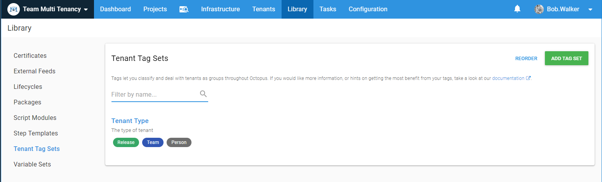

## Global Variables

In my demo instance, I have two variable sets. `Global` will be used across all the projects. `OctoFx` will be used for any OctoFx projects used to deploy components for the OctoFx application.

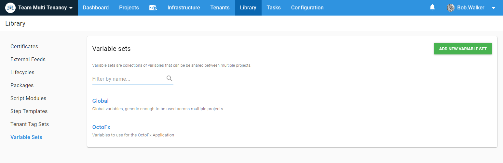

Each environment has its own SQL Server and web servers. I am going to host my tenants on those same servers. Each tenant will get a unique subdomain. The naming convention I am going to use for tenants assigned to the Teams or Person `Tenant Type` will be [EnvironmentShortName][TenantShortName][ApplicationName].OctopusDemos.com. For example, for Bob's copy of the OctoFx application in Development, the name will be DevBobOctoFx.OctopusDemos.com. For the Release `Tenant Type` the naming convention will be [EnvironmentShortName][ApplicationName].OctopusDemos.com. For example, OctoFx in Development will be DevOctoFx.OctopusDemos.com.

I am using the same SQL Server for both Dev and Testing so my database names will be rather odd looking at first. [EnvironmentPrefix]-[TenantShortName]-[ApplicationName] for tenants assigned to the Teams or Person `Tenant Type`. Bob's copy of the OctoFx database in `Development` would be `d-Bob-OctoFx`. Tenants assigned to the Release `Tenant Type` will be [EnvironmentPrefix]-[ApplicationName]. For example, OctoFx in `Development` will be `d-octofx`.

First I am going to create a couple of variables in Global to store the environment short name as well as the environment prefix variable.

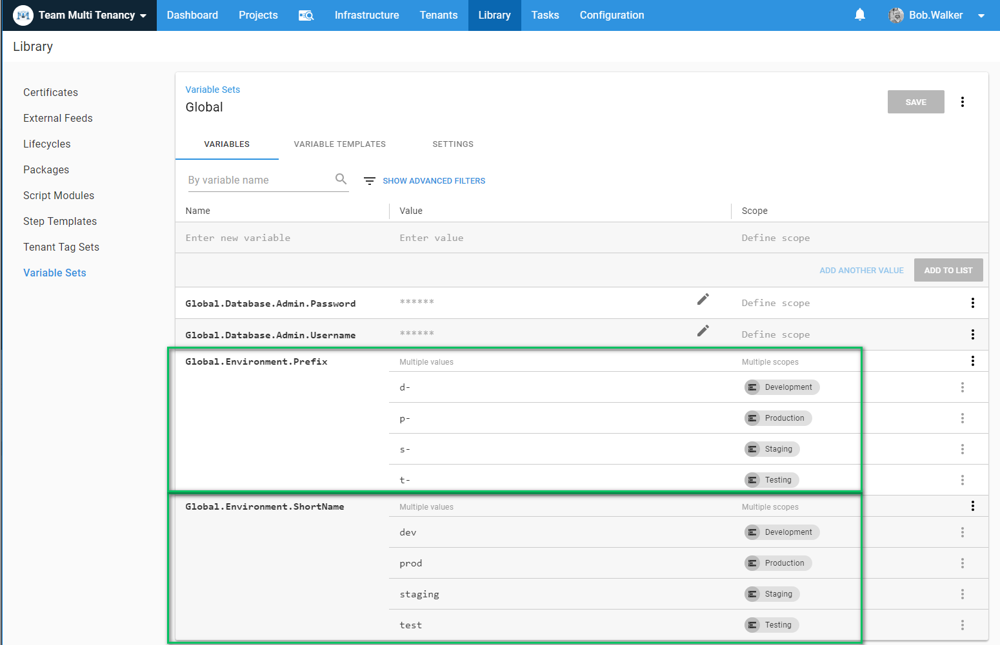

**Please Note:** I like to use the naming scheme [VariableSet].[Component].[Name]. It makes it easier to find when trying to reference them. Moreover, when looking at all variables for a project, they are easier to find.

Then I am going to jump over to the `Variable Templates` tab and add a new template. This will be populated when tenants are created and assigned to various projects.

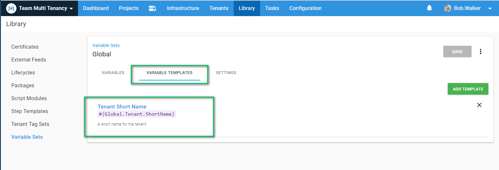

Now I can jump back over variables tab and add two variables, one for the subdomain name and another for the database name. You can scope variables to tenant tags. Make note that I am only scoping one variable to the `Tenant Type` tenant tag. This is because I want any "normal" release to have the same naming convention, even if the project isn't using tenants.

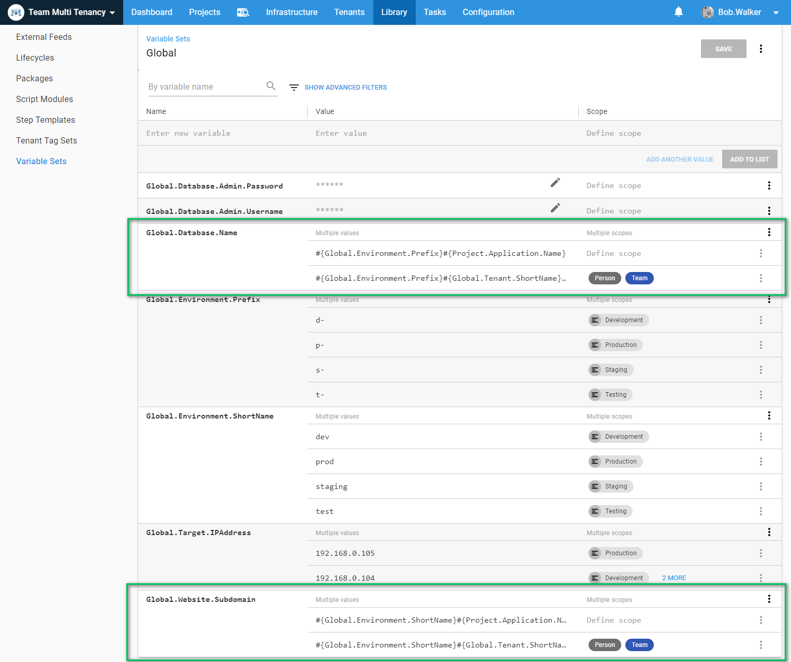

You will notice I am referencing a variable in there called `Project.Application.Name`. That variable will be set at the project level. This is possible because variable replacement is done at runtime. Variable replacement at run time is needed because quite often Octopus doesn't know the value until the step is being run on the machine.

The `OctoFx` variable set is nothing super complex. It stores some database values so it can build up a connection string.

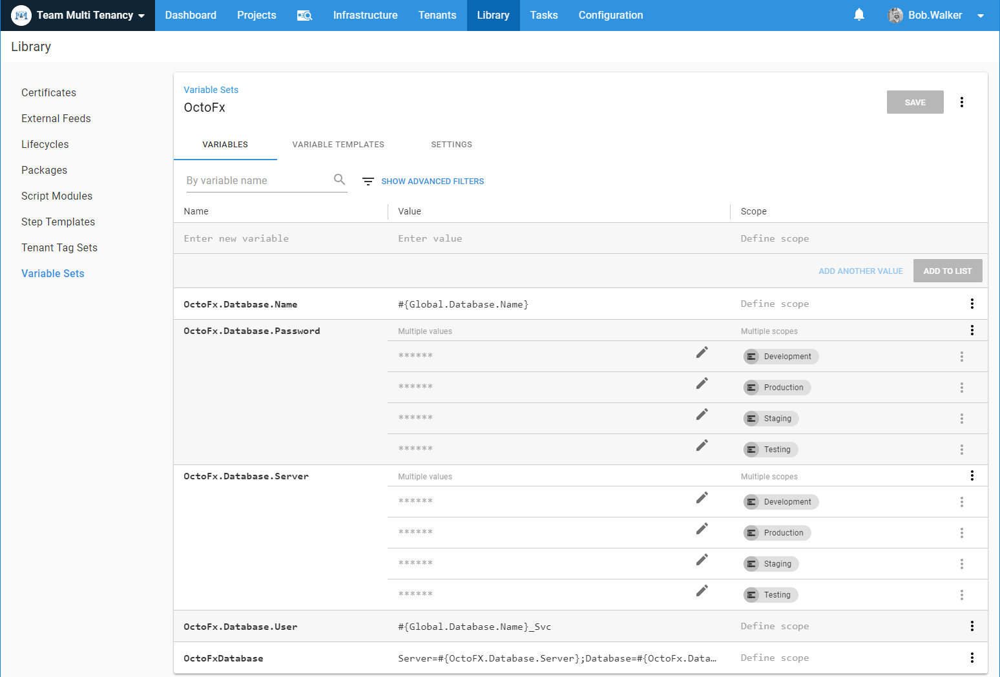

## Infrastructure

As I stated in an earlier section, I am going to be deploying to a SQL Server and multiple web servers. I will be using a worker to deploy to SQL Server. Only the web servers will have tentacles on them. I need to update the tentacle registration to allow for multi-tenant deployments. First, we need to tell Octopus Deploy to allow for both tenant and untenanted deployments to each web server.

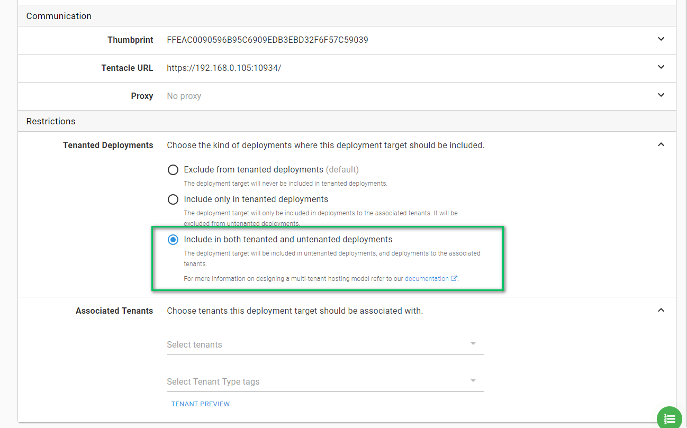

When we do that a new section appears on the screen allowing us to select which tenants to allow. Instead of assigning specific tenants we will use the `Tenant Type` tags. The `Tenant Type` tag used will be dependent on the environment.

- Production: Release `Tenant Type`.
- Staging: Teams and Release `Tenant Type`.
- Testing: All `Tenant Type`.
- Development: All `Tenant Type`.

You might be wondering why staging gets both Teams and Release `Tenant Type` tags. I have seen multiple cases where staging matches production. This includes external access. It is quite common to see staging used as a "beta" site for external customers. A spike or a random change made by a developer isn't likely to be polished enough for customers to test. A new feature created by a team is much more likely to have been tested by multiple people prior to customers testing it.

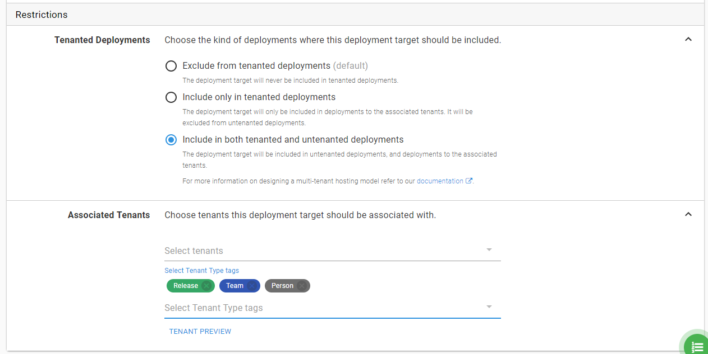

When I am finished updating my machines the overview screen will look like this:

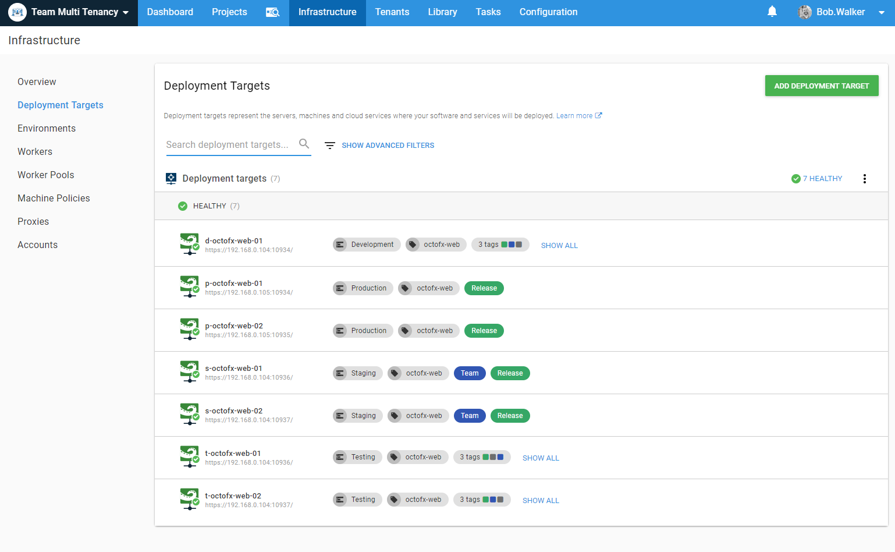

## Projects

Before configuring the tenants, I want to take a look at the `OctoFx` application I will be using as my example. OctoFx consists of two components; a database, and a web interface. Each component has its deployment project in Octopus Deploy. Not every change made to OctoFx requires the full application to be deployed.

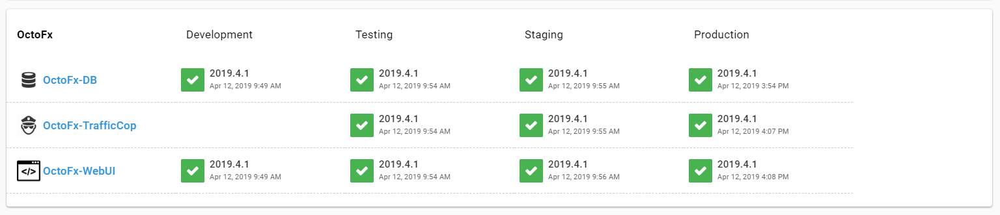

Adding an index to the database shouldn't require the website to be deployed. Updating the CSS shouldn't need the database to be deployed. Separating them helps to save time. That really comes in handy when you have to deploy a hotfix. Having to wait on a database deployment to finish when you really need to fix the website is an exercise in patience.

Each project only has to focus on one thing. The database project just worries about database deployments.

**Please note:** This project was created with the assumption that the database did not exist in that particular environment. It will create a new database and run the necessary scripts to add the schema, data, and users.

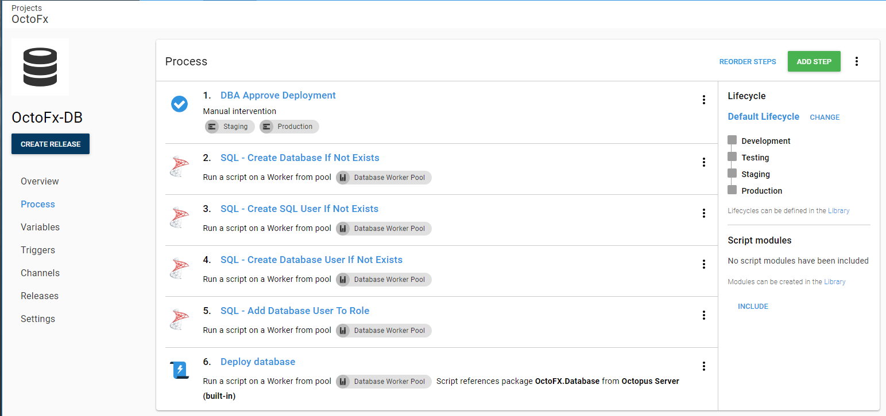

Whereas the web deployment only has to worry about steps for web deployments. Just like the database project, it was written with the assumption the website didn't already exist. The deploy to IIS will create the site on the server. It then has a step to add the website to DNS.

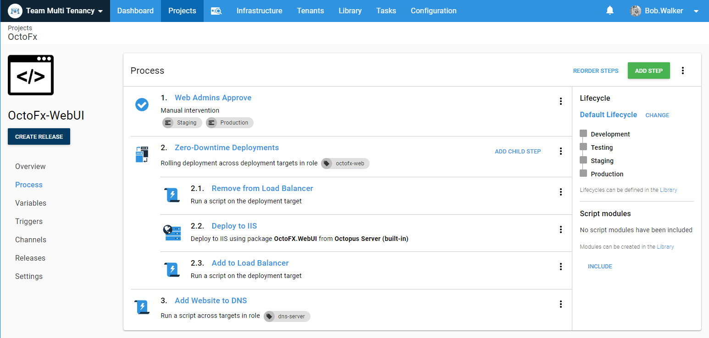

There are cases when you want to deploy the entire stack at the same time. That is where the "Traffic Cop" project comes in. It uses the deploy a release step to deploy the components in the correct order.

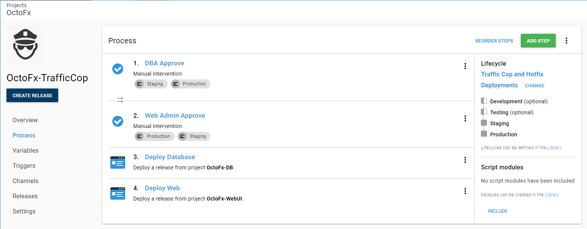

The build server is responsible for creating the releases for each component. A person will come in and create the release for the traffic cop project. Make note that the lifecycle for the traffic cop project allows you to deploy straight to staging, skipping `Development` and `Testing`. Skipping those environments is to handle those cases when individual components are pushed to `Testing` manually.

**Please note:** The projects on my example instance were created with the assumption the database and/or website didn't exist. Each project performs the necessary steps to get the component up and running. For this sandbox approach to work, your projects will need to be created with a similar concept. You don't have to repeat the exact process I used in my projects.

The only other significant adjustment needing to be made is configuring the projects to allow for multi-tenancy deployments. That configuration can be found by going to the settings section on the project and changing the multi-tenant setting. In my example, I am choosing to require a tenant for deployments. If you were transitioning a project over to multi-tenancy the first time, it would make more sense to allow for deployments with and without a tenant.

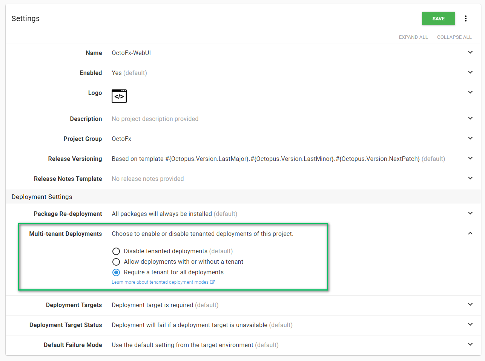

## Branching, Lifecycles, and Channels

Now is as good as time as any to discuss branching strategies. The branches will correspond to a lifecycle and project channel in Octopus Deploy. I am going to have my build server append a pre-release tag to any package build from non-release branch. The build server will also determine the tenant and channel based on the branch name.

- Release branch (release/*): Deploy to Development -> Testing -> Staging -> Production. 95% of all production releases will go through this lifecycle.
- Hotfix branch (hotfix/*): Can skip Development and Testing and go straight to Staging and then Production. 5% of all production releases should go through this lifecycle. This allows for a clear path to production while providing the ability to test.
- Team Branch ([TeamName]/*): Can only go to Development -> Testing -> Staging. This branch will have a pre-release tag appended to the package name.
- Developer Branch ([DeveloperName]/*): Can only go to Development -> Testing. This branch will have a pre-release tag appended to the package name.

In Octopus Deploy I created the following lifecycles. The Team and Dev Lifecycle has the `Development` and `Testing` environment set as optional. This is to give the freedom to pick and choose which environments are updated.

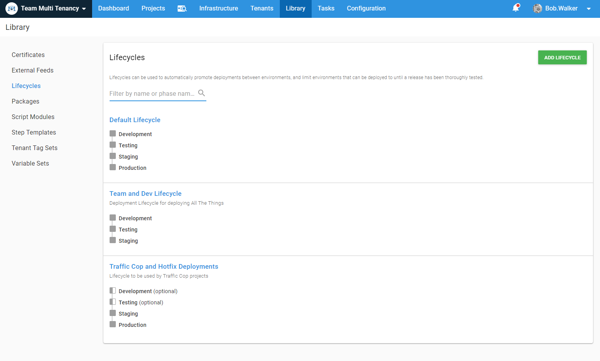

Each project will have the following channels to support the various use cases.

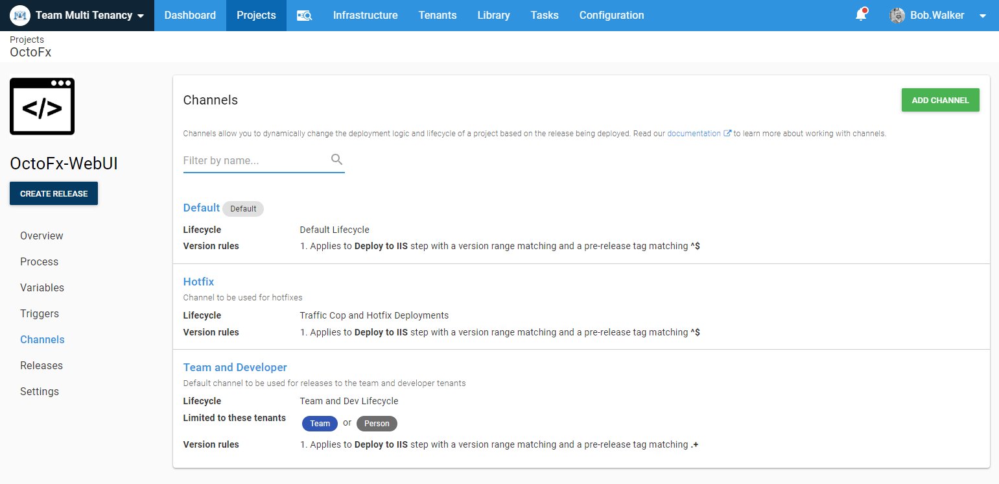

Each channel is using has a version rule for the pre-release tag for the package. For Team and Developer deployments the filter is `.+`, which means it must have a pre-release tag. For all the other channels the filter is `^$`, which means no pre-release tag allowed.

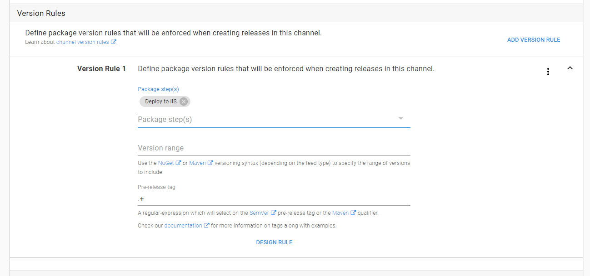

Build server configuration comes a bit later in the article.

You will notice any tenant can use the default channel. Does this mean each tenant can deploy to production? No. When you link a tenant to a project, you tell Octopus the environments the tenant can deploy to.

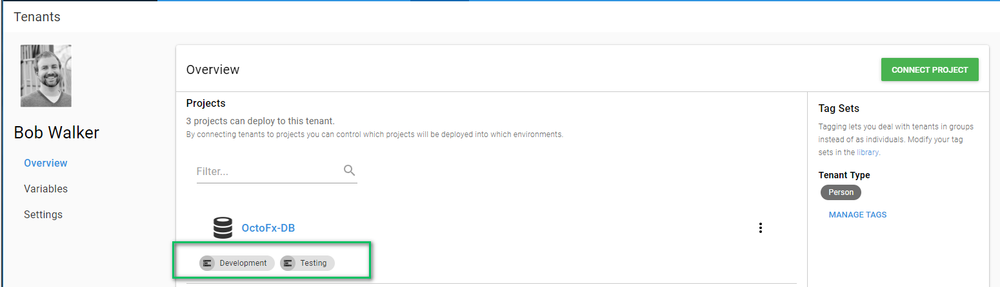

## Tenants

The tenant tags are in place. The lifecycles have been configured. The projects have been configured. The necessary infrastructure changes have been made. It is finally time to create some tenants.

For each tenant, I am going to assign a tenant tag.

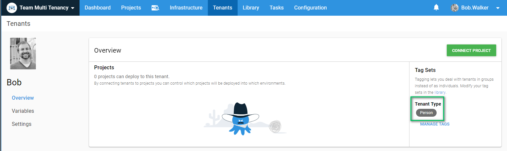

Then I am going to connect my projects. Because this is a Person `Tenant Type` I am only allowing deployments to the `Development` and `Testing` environments.

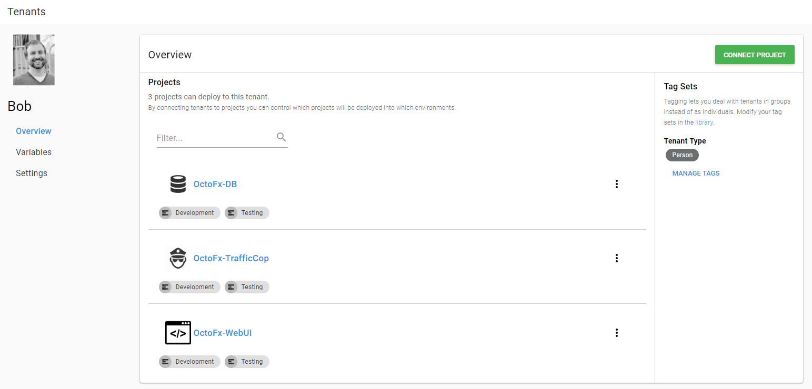

If you recall, the `Global` variable set has a variable template. Now that the projects are connected I will need to populate that variable template by going to variables and then selecting `Common Templates`.

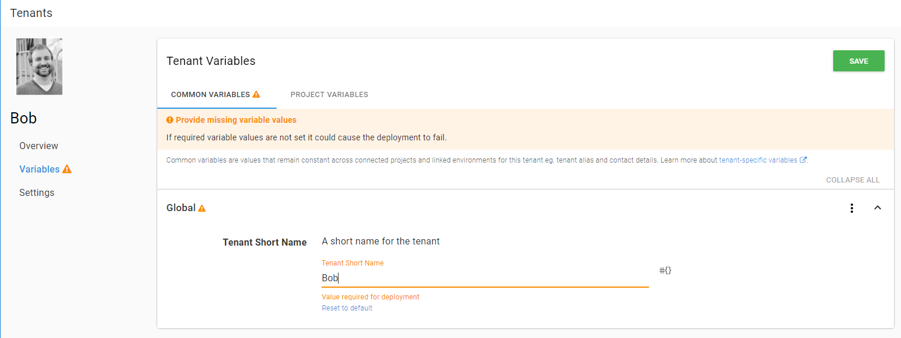

When it is all said and done, I created two tenants for the release `Tenant Type`.

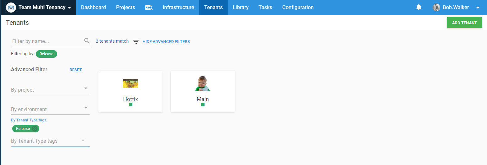

Three tenants for the team `Tenant Type`. We name our teams pod-[Octopus Type].

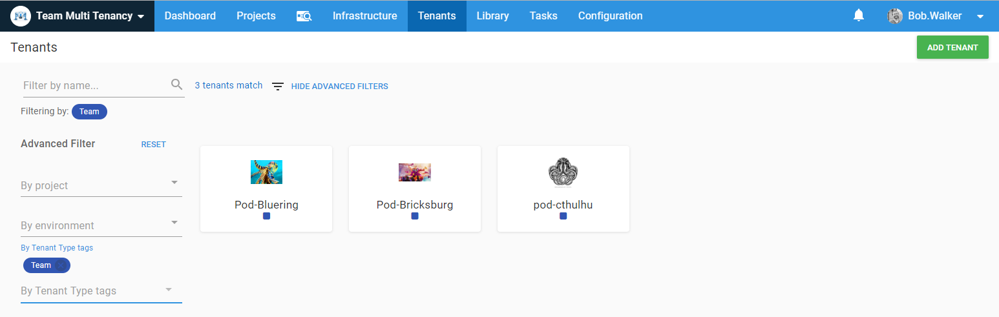

And finally, several tenants assigned the person `Tenant Type`.

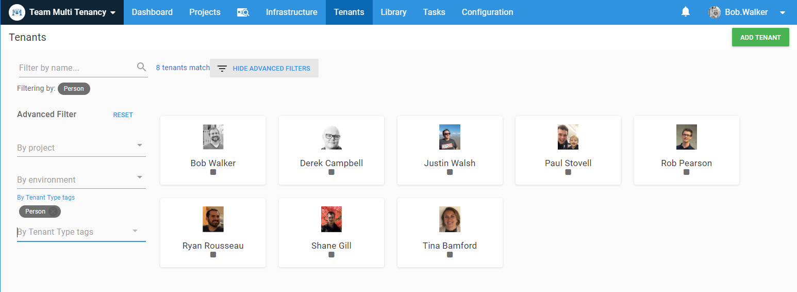

The tenant screen can filter by `Tenant Type`. Filtering by `Tenant Type` makes it easier to find a specific tenant. As well as taking screenshots after the fact. Which I totally did.

Now the project overview screen will show all the tenants.

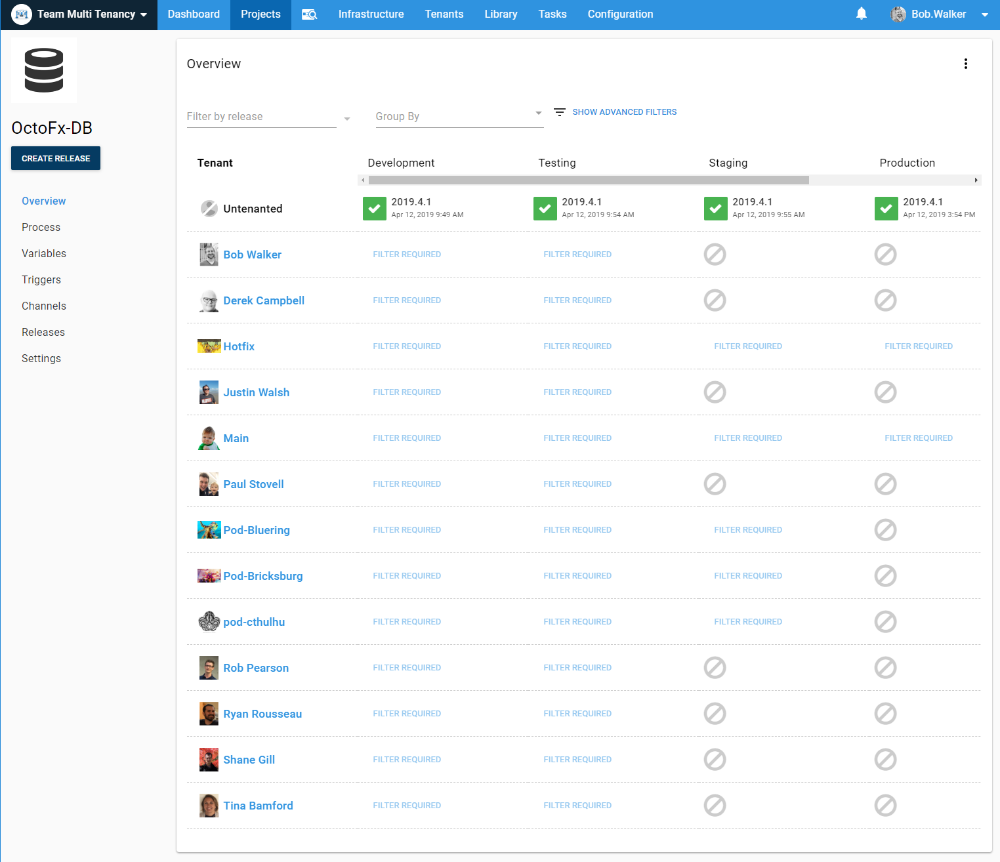

I can deploy to a specific tenant by selecting a release.

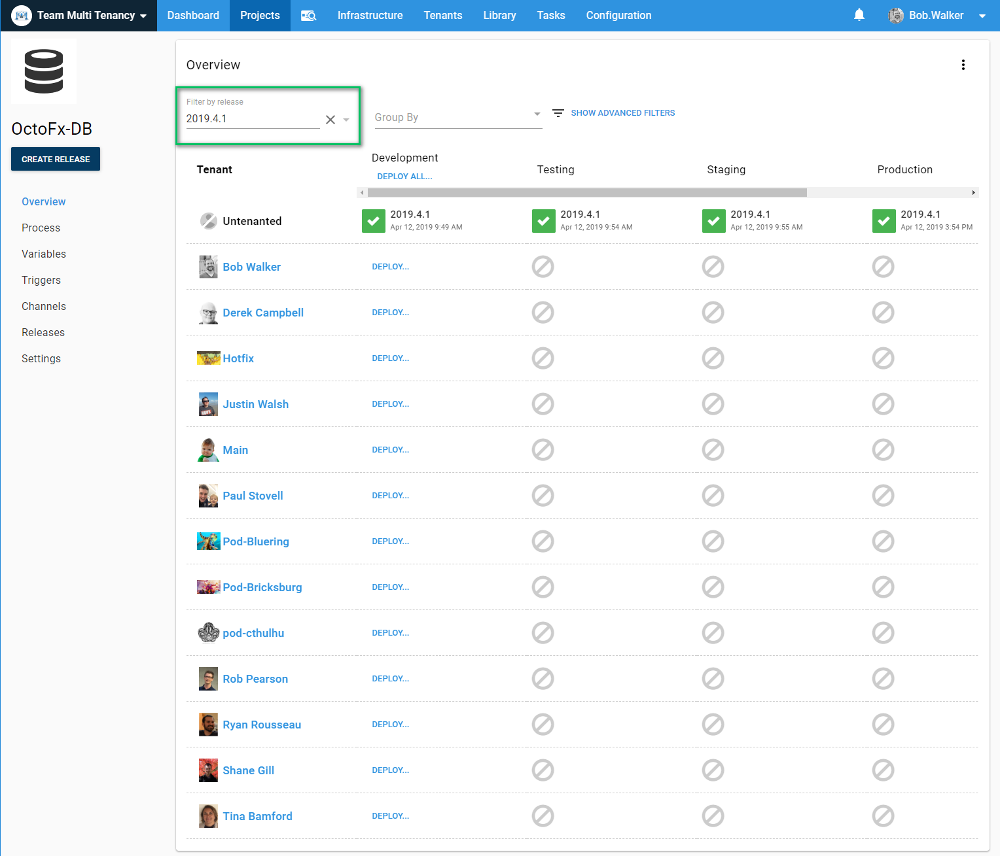

When you get to the deploy screen, you can choose to deploy to a specific tenant or tenants by tenant tag. If you look at the bottom of the screenshot, it will show you all the tenants who will be deployed to.

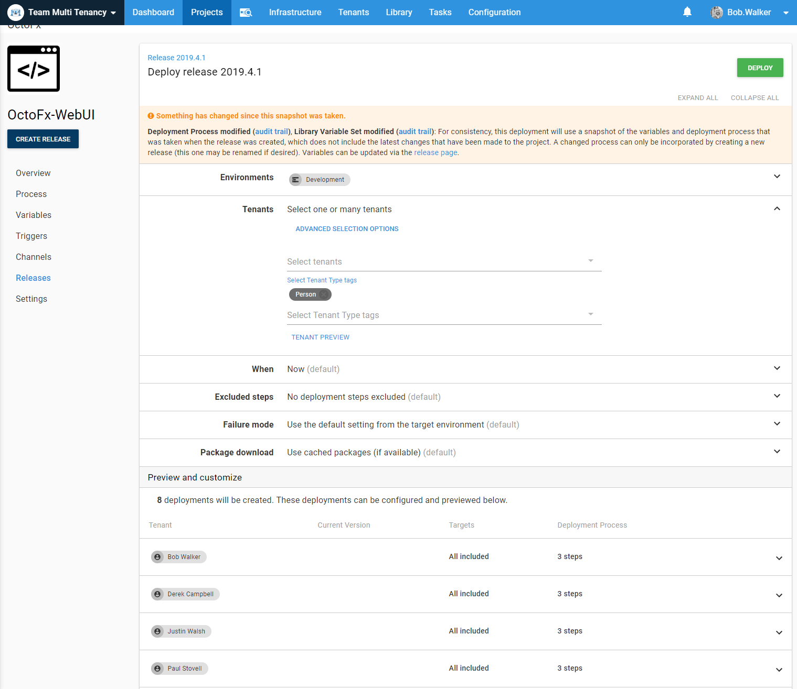

The project overview screen also provides the ability to group tenants by tenant tag. When we group by tenant type the screen will group all the tenants by their tenant type.

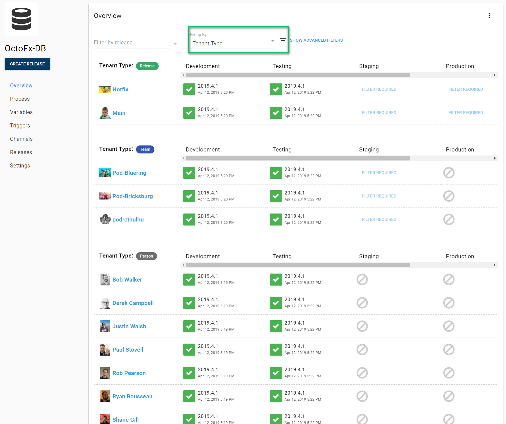

## Build Server

I will be using TeamCity for this example. The same core concept will apply for your build server of choice.

At the start of my build, I am running a PowerShell script to set various output parameters.

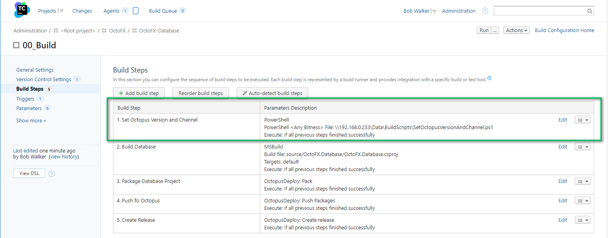

In my case, the PowerShell script is setting these three parameters.

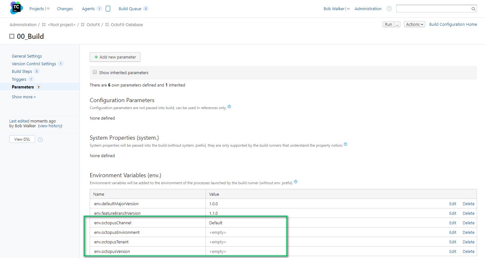

Those parameters are then used in the create release step.

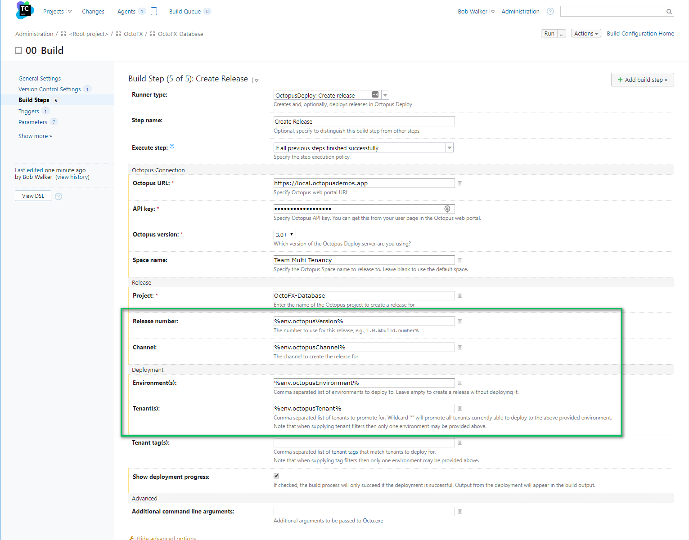

The PowerShell being called isn't anything super complex. Check the branch name against a list of rules and go from there. At the end of the script, it uses TeamCity specific formatting to set the output variables.

```PS
Param(.   
    [string]$currentBranch,
    [string]$buildNumber,
    [string]$defaultMajorVersion,
    [string]$featureBranchVersion
)

Write-Host "BuildNumber: $buildNumber"
Write-Host "DefaultMajorVersion: $defaultMajorVersion"
Write-Host "FeatureBranchVersion: $featureBranchVersion"

$channelName = "Default"
$releaseVersion = "$defaultMajorVersion.$buildNumber"
$environmentName = "Development"
$tenantName = "Main"

Write-Host "The branch that is building is: $currentBranch"

if ($currentBranch -like "refs/heads/hotfix*") {    
    Write-Host "Hotfix Branch Detected, deploying to staging and using the hotfix channel"
    $channelName = "Hotfix"    
    $releaseVersion = "$defaultMajorVersion.$buildNumber"
    $environmentName = "Staging"
    $tenantName = "Hotfix"
}
elseif ($currentBranch -like "refs/heads/team-*") {    
    Write-Host "Team branch detected, deploying to a team tenant"
    $channelName = "Team and Developer"
    $environmentName = "Development"

    $preReleaseTag = $currentBranch.replace("refs/heads/team-", "").replace(" ", "").replace("/", "-")
    $releaseVersion = "$featureBranchVersion.$buildNumber-$preReleaseTag"

    $teamName = $currentBranch.replace("refs/heads/team-", "")
    $teamName = $teamName.substring(0, $teamName.indexOf("/"))

    $tenantName = $teamName
}
elseif ($currentBranch -like "refs/heads/developer-*") {    
    Write-Host "Dev branch detected, deploying to the team or team tenant"
    $channelName = "Team and Developer"
    $environmentName = "Development"

    $preReleaseTag = $currentBranch.replace("refs/heads/developer-", "").replace(" ", "").replace("/", "-")
    $releaseVersion = "$featureBranchVersion.$buildNumber-$preReleaseTag"

    $devName = $currentBranch.replace("refs/heads/developer-", "")
    $devName = $devName.substring(0, $devName.indexOf("/")).replace("-", " ")

    $tenantName = $devName
}
else{
    Write-Host "Master or release branch detected, using the defaults"
    $channelName = "Default"
    $releaseVersion = "$defaultMajorVersion.$buildNumber"
    $environmentName = "Development"
    $tenantName = "Main"
}

Write-Host "Tenant Name: $tenantName"
Write-Host "Environment Name: $environmentName"
Write-Host "Release Version: $releaseVersion"
Write-Host "Channel Name: $channelName"

"##teamcity[setParameter name='env.octopusChannel' value='$channelName']"
"##teamcity[setParameter name='env.octopusVersion' value='$releaseVersion']"
"##teamcity[setParameter name='env.octopusEnvironment' value='$environmentName']"
"##teamcity[setParameter name='env.octopusTenant' value='$tenantName']"
```

The final piece is telling your build server, in my case TeamCity, to monitor all branches, or to monitor branches which match your requirements.

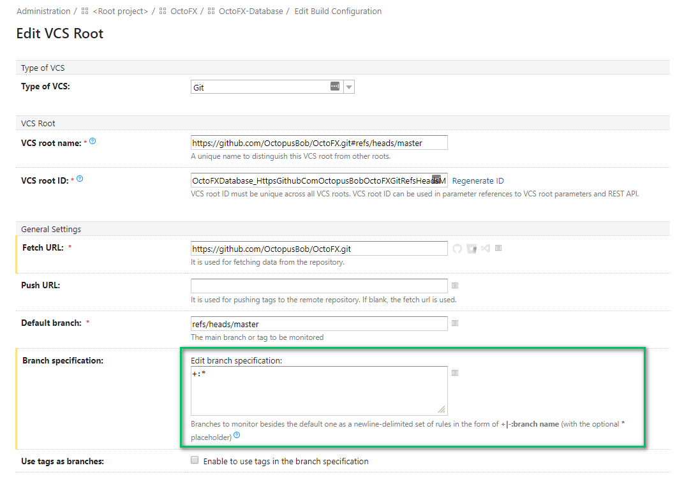

## Seeing it in action

Time to test this. I created a test branch for my developer and pushed it up to the server.

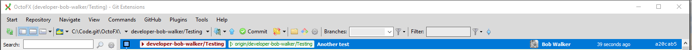

TeamCity picked up the new branch.

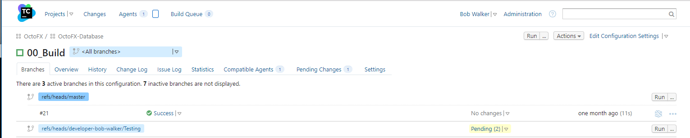

The log indicated it found everything successfully.

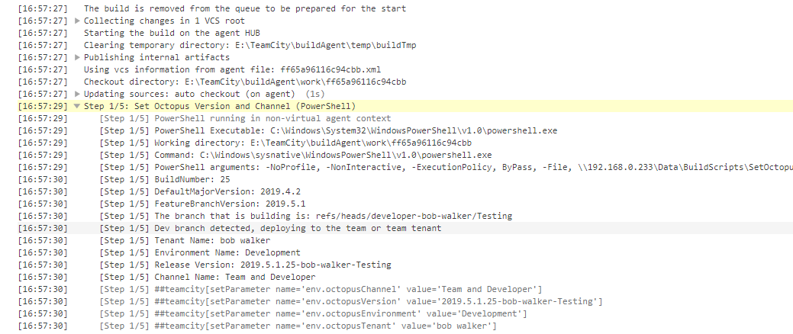

And the deployment is kicked off for the tenant.

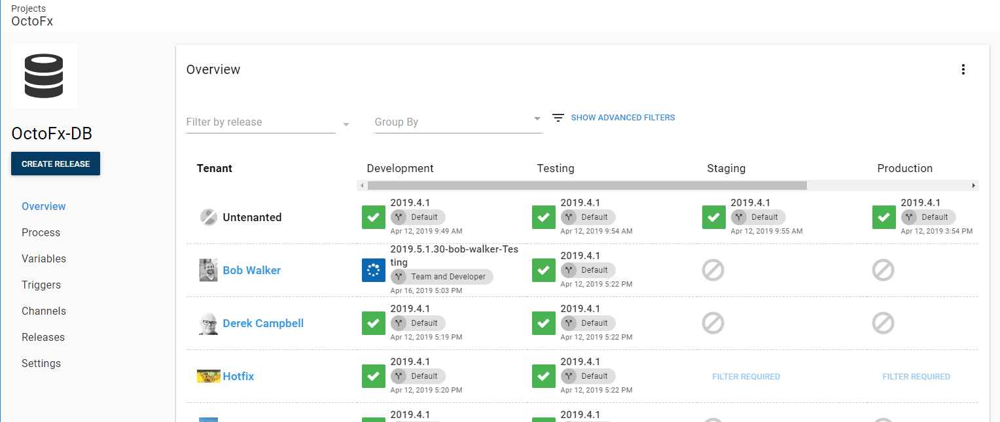

I also have a specific package for that branch which can then be shared with other developers.

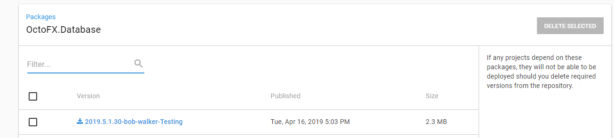

So if Derek wanted to bring those changes into his sandbox, we would first change the release to my release number. Then we would click on the deploy button.

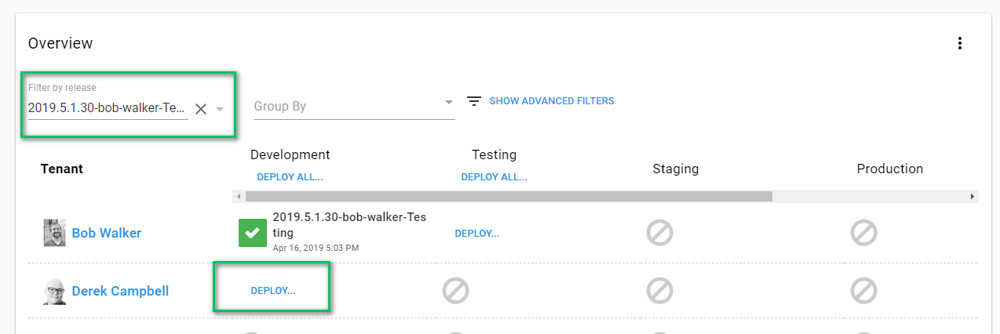

## Standing up an entire sandbox

So far we have been focused on a single application, OctoFx. I'm willing to bet you have more than one application in your development shop. To solve for that, I created a project called `Deploy All The Things`. The project's lifecycle allows it to go to Development, Testing, and Staging, with Development and Testing optional. It is intended to be used by tenants with the Person or Team `Tenant Type` tenant tag.

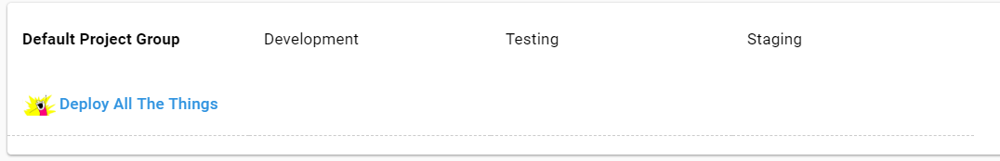

Right now it is only deploying OctoFx. In the future, it can deploy other applications, and in the order they need to be deployed.

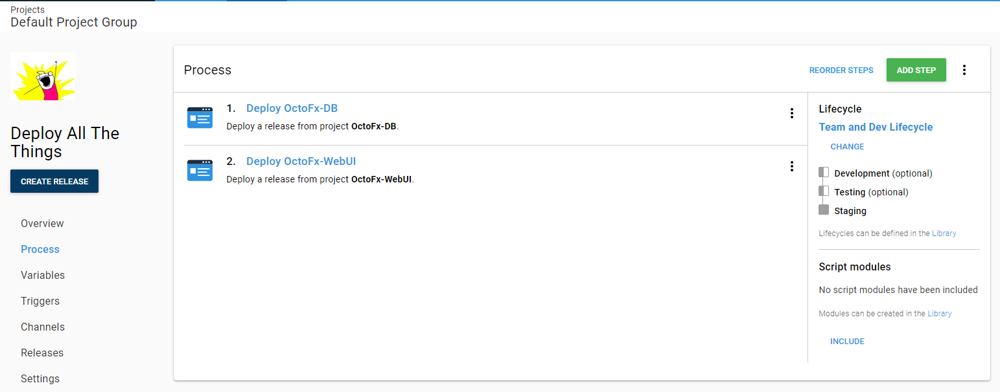

One note about the deploy a release step. When you create a release, that is when you choose the release version of the child projects, it is entirely possible with this project to have a release only be deployed to a single tenant on an environment.

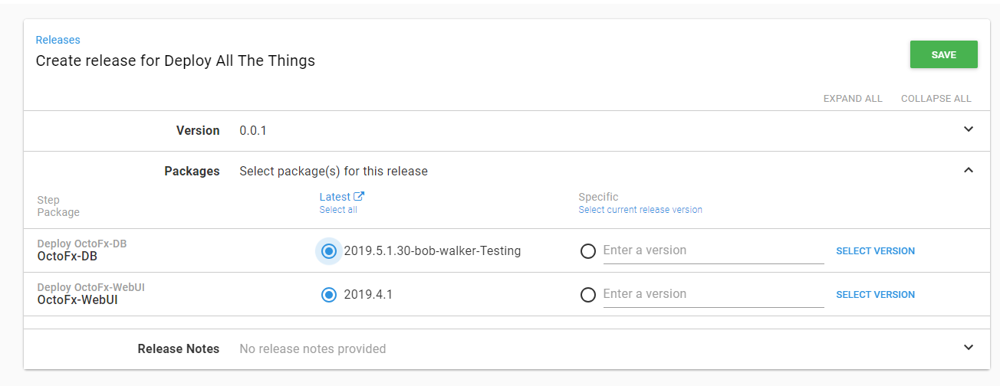

## Conclusion

It takes a bit of setup, but it is possible to configure Octopus Deploy so that each team and each developer have their own sandbox to deploy to. Having a separate sandbox will allow teams and developers to get feedback on in-progress work without having to coordinate with other teams on when changes can be made. Let's go through the use cases one more time to make sure we solved them.

- As a developer on Team C, I want to be able to make and push changes to Application B without affecting the work of other teams working on Application A. -> Solved, each team has its own sandbox. The team working on Application B would push to their sandbox for testing.
- As a developer working on Application A, I want to be able to pull changes made to Application B once they are completed and verified. -> Solved, the teams can wait until the changes are merged into a release branch and pushed up to the main tenant or they can choose the release created for the tenant and pull that into their sandbox.
- As a developer, I always want to be able to test what is currently in production in a non-production environment. -> Solved, the main tenant in the non-production environments will only be changed once a feature has been verified in a team sandbox. The amount of time a change sits in the lower environments on the main tenant should be low since it has already been tested.
- As a developer, I want to be able to make changes and push them up for verification from a business owner without affecting my team. -> Solved, each developer gets their own tenant, which means they get their own sandbox.
- As a developer on Application A, I want to know what version of Application B I am connecting to and testing against. -> Solved, each team and developer have full control over what version is in their sandbox.
- As a developer on Team A, I want to be able to push a hotfix directly to staging without having to go through development or testing first. -> Solved, with the channels and hotfix tenant it is possible to push a change directly to staging.
- As a developer on Team A, I want to be able to push my team's changes to a testing area where customers can provide feedback. Getting customer feedback isn't going to happen all the time, but I would like that opportunity. -> Solved, any tenant with the Team `Tenant Type` can push to staging.

One final thought about the hotfix tenant. You don't have to include that. I did that because the customer I was talking to had a separate "hotfix" subdomain in their staging environment. It made sense for them. It might not make sense for you. I would encourage you to test this out for yourself and tweak the process to meet your needs.

Until next time, Happy Deployments!
