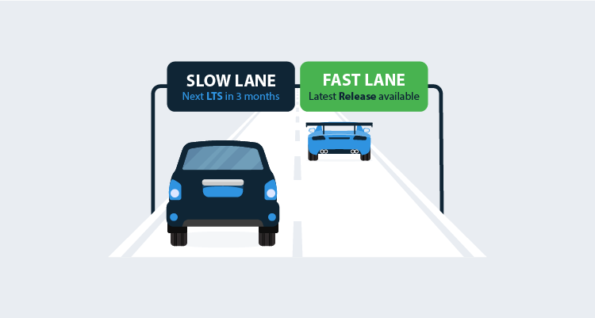

!toc

Octopus Server `2019.3 LTS` is the second release in our long-term support program (LTS). It comes with six months long-term support and we recommend this release for most self-hosted customers.

You can [download](https://octopus.com/downloads) Octopus Server 2019.3 LTS now!

Our LTS releases will be in the slow lane with a new LTS release approximately every three months - for all the LTS related details please have a read of our [long term support documentation](https://octopus.com/docs/administration/upgrading/long-term-support).

## What features does 2019.3 LTS have?

Octopus Server `2019.3 LTS` is essentially the same as `2019.2`. It comes with [Spaces](https://octopus.com/blog/octopus-release-2019.1). A great deal of enhancements and bug fixes in a variety of areas including; Kubernetes and the Octopus Migrator. Along with the Database Performance and Cloud Dependency updates from `2018.11`. So have a read through [the change log](https://octopus.com/downloads/compare?from=2018.10.5&to=2019.2.8).

## Breaking Changes

`2019.3 LTS` Includes [Spaces](https://octopus.com/docs/administration/spaces), which has a significant set of breaking changes, which you can find on [the change log](https://octopus.com/downloads/compare?from=2018.10.5&to=2019.2.8).

While we try our best to minimise breaking changes, in order to support Spaces and deliver long needed improvements to how you [configure teams](https://octopus.com/blog/team-configuration-improvements), unfortunately we were forced to change the API change in a few areas. If you have automation around Teams, User Roles and Permissions they will need to change.

## When should I install 2019.3 LTS?

There is no time like the present! You can upgrade to Octopus Server `2019.3 LTS` now. We've had hundreds of customers upgrade smoothly to `2019.2` and the upgrade to `2019.3 LTS` is cut from the same code.

You can [download Octopus Server 2019.3 LTS](https://octopus.com/downloads) now!

## Wrapping up

LTS for Octopus Server has arrived, and you can bank on it. Happy long-term deployments!

## Learn more

* [Self-hosted? Download the latest version](https://hubs.ly/H0gCMqJ0)
* Blog Series: [Automating your database deployments with Octopus Deploy](https://hubs.ly/H0gCMRR0)
* [DevOps best practice: How Octopus handles rollbacks](https://hubs.ly/H0gCMRX0)
* [Announcing Octopus Cloud](https://hubs.ly/H0gCMqM0)
* Documentation: [Upgrading your Octopus](https://hubs.ly/H0gCMS40)
* Documentation: [High Availability](https://hubs.ly/H0gCMqN0)
* Documentation: [Spaces](https://hubs.ly/H0gCMSb0)
