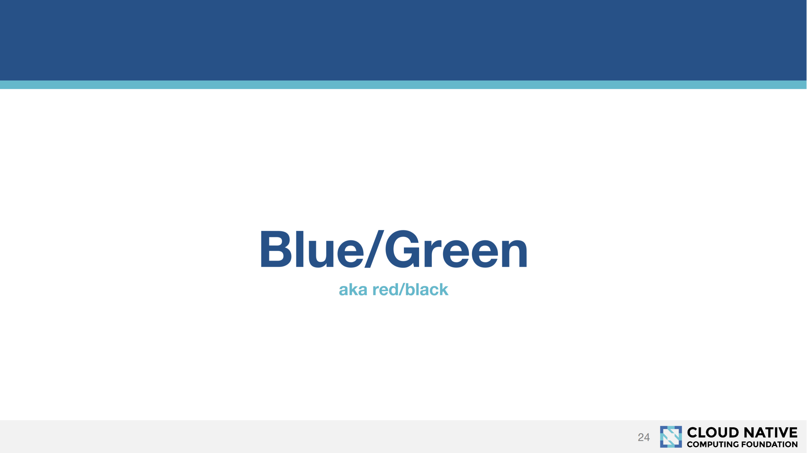

When deploying new versions of a centralized application like a web service, there is a strategy you can use to direct production traffic to the new version only after it has been successfully deployed and optionally tested. This strategy goes by the name blue/green or red/black, with each color representing a copy of the target environment. Traffic is routed to one color or the other (or potentially both in a canary deployment or during A/B testing, but that's a story for another time). Having two environments running side by side hosting different versions of an application means traffic can be switched over, and back again if an issue is found, with little to no downtime.

So why is this strategy referred to as both green/blue and red/black? Do these colors imply technical differences?

This is part of a series of articles about [software deployment](https://octopus.com/devops/software-deployments/).

## StackOverflow says...

Our first stop is to StackOverflow, where we find the question [What's the difference between Red/Black deployment and Blue/Green Deployment?](https://stackoverflow.com/questions/45259589/whats-the-difference-between-red-black-deployment-and-blue-green-deployment).

The highest voted answer indicates that there is indeed a difference between these two terms:

> in [blue-green deployment](https://octopus.com/devops/software-deployments/blue-green-deployment/), both versions may be getting requests at the same time temporarily, while in red-black only one of the versions is getting traffic at any point in time

The answer then goes on to say that:

>  But red-black deployment is a newer term being used by Netflix, Istio, and other frameworks/platforms that support container orchestration

I've frequently seen the term red/black being attributed to tools created by Netflix and container platforms in general, so let's go to their documentation to see how they define these strategies.

## Netflix, Kubernetes, and Istio say...

Spinnaker is a deployment tool written by Netflix, and it has been open sourced and is available for anyone to use. The tool includes some documentation on the concepts it implements, including a section on [deployment strategies](https://www.spinnaker.io/concepts/#deployment-strategies):

> Spinnaker supports the red/black (a.k.a. blue/green) strategy, with rolling red/black and canary strategies in active development.

So, contrary to the answer on StackOverflow, Netflix treats blue/green and red/black as the same thing. The documentation even includes a nice diagram colored in blue and green to drive the point home.

Slides from a Kubernetes presentation titled [Deployment Strategies on Kubernetes](https://www.cncf.io/wp-content/uploads/2018/03/CNCF-Presentation-Template-K8s-Deployment.pdf) made by the Cloud Native Computing Foundation also document blue/green and red/black as synonyms.

Likewise, the [Istio blog](https://istio.io/blog/2017/0.1-canary/) refers to blue/green and red/black as the same thing:

> this approach is only useful when we have a properly tested version that we want to deploy, i.e., more of a blue/green, a.k.a. red/black, kind of upgrade than a “dip your feet in the water” kind of [canary deployment](https://octopus.com/devops/software-deployments/canary-deployment/).

## Conclusion

Over the years, I have heard many different descriptions for the differences between blue/green and red/black. Some related to how the traffic was directed (DNS vs load balancer), some referenced solutions targeting physical servers vs containerized applications, some distinguished between a hard cutover of all traffic vs session draining. However, I have never seen these distinctions used with any consistency, and indeed when you dig into how terms like blue/green and red/black are used by the tools that implement them, often they are used interchangeably or explicitly called out as being interchangeable.

It is safe to say that you can not reliably determine a specific technical aspect of a deployment strategy simply because it has been referred to as implementing either the blue/green or red/black strategy. At a high level (and explicitly called out in product documentation for tools like Spinnaker, Kubernetes, and Istio), both these terms refer to the same thing, and any technical difference between the two will likely be meaningful only within a particular team or company.
