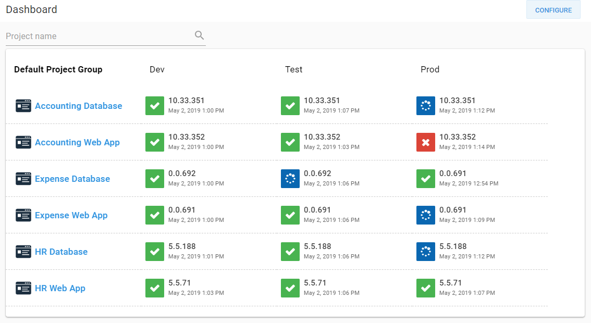
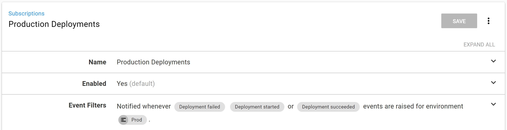
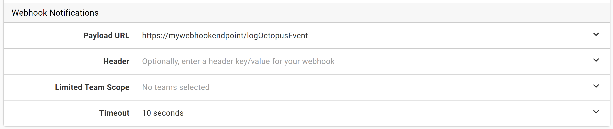
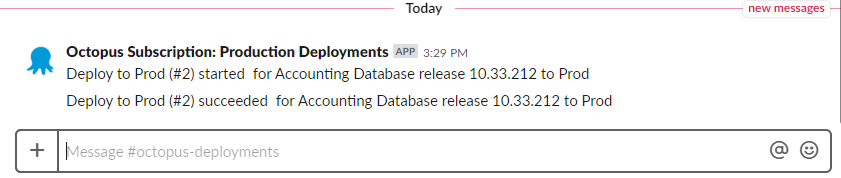
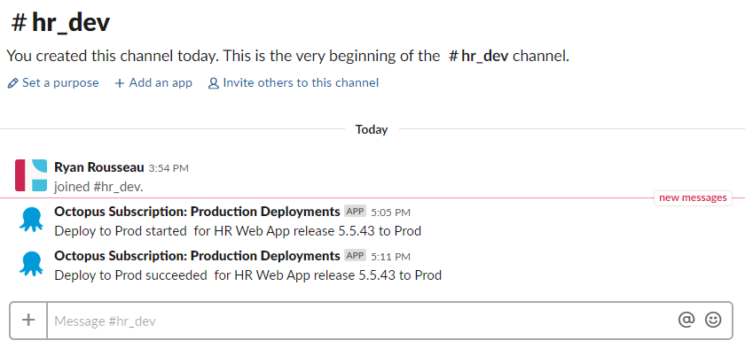
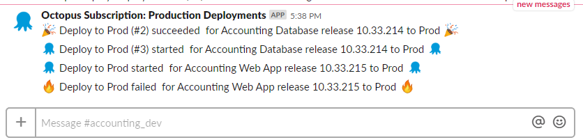
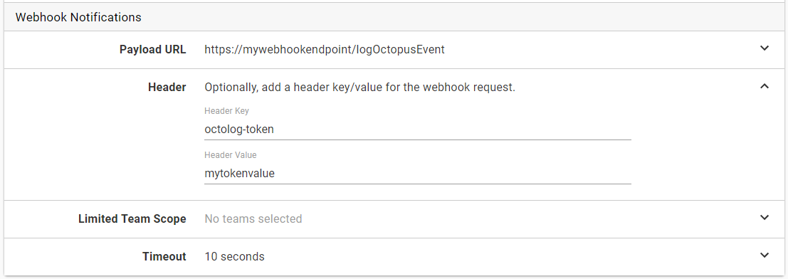

!toc

## Intro

Hey there! In a recent episode of [Ask Octopus](https://www.youtube.com/watch?v=rKwYkDN_IPU&t=22s), I talked about how using Octopus [Subscriptions](https://octopus.com/docs/administration/managing-infrastructure/subscriptions) and custom webhooks can solve many problems. I presented the use case of sending a slack notification for every production deployment. I wanted to explore this idea in more detail which led me to write this post.  So let's get to it and set up Slack notifications for all of our production deployments.

## Setup

I have six existing projects without any notifications built into their processes.  The number of projects isn't essential here. The same approach will work whether you have one project or hundreds. 



## Webhook

I'm going to start with configuring the webhook for two reasons. The first reason is that I need a webhook URL to configure the subscription. The second is that I want to use the webhook to inspect the payload so that I know what data to expect. I'll start with a simple function that accepts the web request and logs the body of that request. I'm using Firebase Cloud Functions as my endpoint for this demo. 

```javascript
exports.logOctopusEvent = functions.https.onRequest((req, res) => {
    console.log(JSON.stringify(req.body));

    return res.status(200).end();
});
```

## Subscription

We've got a rudimentary webhook so let's set up that subscription and run a deployment.

I have chosen three event categories that should be sent to the webhook for processing: Deployment Started, Deployment Succeeded, and Deployment Failed. I also set the environment filter to Production only. When you are configuring a webhook for the first time, you might choose to limit it to development or test environments first as you build out your logic.

I have also set the Payload URL to my webhook's URL.





## Payload

After running a deployment, I pulled the payload body from the function logs. There's a lot of information here, including the details of the subscription that triggered the request.

The information we are most interested is in the Payload.Event section. In particular, we are going to use Category, Message, and RelatedDocumentIds.

```javascript
{
    "Timestamp": "2019-04-26T18:37:44.1581725+00:00",
    "EventType": "SubscriptionPayload",
    "Payload": {
        "ServerUri": "https://myoctopusurl",
        "ServerAuditUri": "https://myoctopusurl/#/configuration/audit?environments=Environments-246&eventCategories=DeploymentFailed&eventCategories=DeploymentStarted&eventCategories=DeploymentSucceeded&from=2019-04-26T18%3a37%3a12.%2b00%3a00&to=2019-04-26T18%3a37%3a42.%2b00%3a00",
        "BatchProcessingDate": "2019-04-26T18:37:42.7832114+00:00",
        "Subscription": {
            "Id": "Subscriptions-161",
            "Name": "Production Deployments",
            "Type": 0,
            "IsDisabled": false,
            "EventNotificationSubscription": {
                "Filter": {
                    "Users": [],
                    "Projects": [],
                    "Environments": [
                        "Environments-246"
                    ],
                    "EventGroups": [],
                    "EventCategories": [
                        "DeploymentFailed",
                        "DeploymentStarted",
                        "DeploymentSucceeded"
                    ],
                    "EventAgents": [],
                    "Tenants": [],
                    "Tags": [],
                    "DocumentTypes": []
                },
                "EmailTeams": [],
                "EmailFrequencyPeriod": "01:00:00",
                "EmailPriority": 0,
                "EmailDigestLastProcessed": null,
                "EmailDigestLastProcessedEventAutoId": null,
                "EmailShowDatesInTimeZoneId": "UTC",
                "WebhookURI": "https://mywebhookurl/logOctopusEvent",
                "WebhookTeams": [],
                "WebhookTimeout": "00:00:10",
                "WebhookHeaderKey": null,
                "WebhookHeaderValue": null,
                "WebhookLastProcessed": "2019-04-26T18:37:12.4560433+00:00",
                "WebhookLastProcessedEventAutoId": 187275
            },
            "SpaceId": "Spaces-83",
            "Links": {
                "Self": {}
            }
        },
        "Event": {
            "Id": "Events-189579",
            "RelatedDocumentIds": [
                "Deployments-15970",
                "Projects-670",
                "Releases-6856",
                "Environments-246",
                "ServerTasks-318123",
                "Channels-690",
                "ProjectGroups-302"
            ],
            "Category": "DeploymentStarted",
            "UserId": "users-system",
            "Username": "system",
            "IsService": false,
            "IdentityEstablishedWith": "",
            "UserAgent": "Server",
            "Occurred": "2019-04-26T18:37:34.3616214+00:00",
            "Message": "Deploy to Prod (#3) started  for Accounting Database release 10.33.210 to Prod",
            "MessageHtml": "<a href='#/deployments/Deployments-15970'>Deploy to Prod (#3)</a> started  for <a href='#/projects/Projects-670'>Accounting Database</a> release <a href='#/releases/Releases-6856'>10.33.210</a> to <a href='#/environments/Environments-246'>Prod</a>",
            "MessageReferences": [
                {
                    "ReferencedDocumentId": "Deployments-15970",
                    "StartIndex": 0,
                    "Length": 19
                },
                {
                    "ReferencedDocumentId": "Projects-670",
                    "StartIndex": 33,
                    "Length": 19
                },
                {
                    "ReferencedDocumentId": "Releases-6856",
                    "StartIndex": 61,
                    "Length": 9
                },
                {
                    "ReferencedDocumentId": "Environments-246",
                    "StartIndex": 74,
                    "Length": 4
                }
            ],
            "Comments": null,
            "Details": null,
            "SpaceId": "Spaces-83",
            "Links": {
                "Self": {}
            }
        },
        "BatchId": "e6df5aae-a42a-4bd8-8b0d-43065f82d5f0",
        "TotalEventsInBatch": 1,
        "EventNumberInBatch": 1
    }
}
```

## Webhook Revisited

The initial webhook is configured. The subscription is sending events over to it. Let's add some real logic to the function.

First, we check if we have a payload. If we don't have one, we send back a Bad Request response.

Then we extract the Subscription name and message and use that to create a Slack message.

```javascript
exports.logOctopusEvent = functions.https.onRequest((req, res) => {
    const payload = req.body.Payload;

    if (payload) {
        return sendSlackMessage({
            "text": payload.Event.Message,
            "username": `Octopus Subscription: ${payload.Subscription.Name}`
        }).then(() => {
            return res.status(200).send();
        });
    }
    else {
        console.warn('No payload provided');
        return res.status(400).send('No payload provided');
    }
});
```

After pushing that change and triggering another deployment, we get some notifications to our channel!



## Routing and Styling Messages

Our Slack webhook sends messages to the #octopus-deployments channel by default. However, what if we want to send notifications to a different channel based on the project?

We can pull the project ID from the related document IDs.

```javascript
const projectId = payload.Event.RelatedDocumentIds.find(id => id.startsWith('Projects-'));
```

We can create a mapping from a project ID to the channel that should be used.

```javascript
const projectToChannel = {
    "Projects-670": "#accounting_dev",
    "Projects-665": "#accounting_dev",
    "Projects-668": "#expense_dev",
    "Projects-667": "#expense_dev",
    "Projects-669": "#hr_dev",
    "Projects-666": "#hr_dev"
};
```

And then provide that channel to our Slack function.

```javascript
return sendSlackMessage({
    "channel": projectToChannel[projectId],
    "text": payload.Event.Message,
    "username": `Octopus Subscription: ${payload.Subscription.Name}`
}).then(() => {
    return res.status(200).send();
});
```



Great! Now let's add some flair to our messages using the category. In the same way we set up the channel mapping, we can set up a mapping from a category to an emoji.

```javascript
const categoryToEmoji = {
    "DeploymentStarted": ":octopusdeploy:",
    "DeploymentFailed": ":fire:",
    "DeploymentSucceeded": ":tada:"
}
```

And then use that mapping to choose the emoji and add it to our message.

```javascript
const projectId = payload.Event.RelatedDocumentIds.find(id => id.startsWith('Projects-'));
const channel = projectToChannel[projectId];
const emoji = categoryToEmoji[payload.Event.Category];

return sendSlackMessage({
    "channel": channel,
    "text": `${emoji} ${payload.Event.Message} ${emoji}`,
    "username": `Octopus Subscription: ${payload.Subscription.Name}`
}).then(() => {
    return res.status(200).send();
});
```



You might even want to take the DeploymentFailed category and send some direct messages to a user or send out a text message or email. We'll leave that experiment for another day.

## Tidying Up

I'm storing my mappings in a database and fetching them when the function runs. The code is starting to get pretty busy, so let's start splitting these functions up and calling them in a pipeline.

```javascript
function getPayload([req, res]) {
    const payload = req.body.Payload;

    if (payload) {
        return Promise.resolve(payload);
    }

    return Promise.reject({
        code: 400,
        message: 'No payload provided'
    });
}

function loadMappings(payload) {
    if (categoryToEmojiMapping && projectToChannelMapping) {
        return Promise.resolve([payload, categoryToEmojiMapping, projectToChannelMapping]);
    }

    const collection = db.collection("mappings");
    const categoryToEmojiPromise = collection.doc('categoryToEmoji').get();
    const projectToChannelPromise = collection.doc('projectToChannel').get();

    return Promise.all([categoryToEmojiPromise, projectToChannelPromise])
        .then(([categoryToEmojiDoc, projectToChannelDoc]) => {
            categoryToEmojiMapping = categoryToEmojiDoc.data();
            projectToChannelMapping = projectToChannelDoc.data();

            return [payload, categoryToEmojiMapping, projectToChannelMapping];
        });
}

function createSlackOptions([payload, categoryToEmoji, projectToChannel]) {
    const projectId = payload.Event.RelatedDocumentIds.find(id => id.startsWith('Projects-'));
    const channel = projectToChannel[projectId];
    const emoji = categoryToEmoji[payload.Event.Category];

    return {
        "channel": channel,
        "text": `${emoji} ${payload.Event.Message} ${emoji}`,
        "username": `Octopus Subscription: ${payload.Subscription.Name}`
    };
}

function sendSlackMessage(options) {
    const slackUri = functions.config().slack.uri;

    const requestOptions = {
        method: 'POST',
        uri: slackUri,
        body: {
            "channel": options.channel,
            "username": options.username,
            "icon_emoji": ":octopusdeploy:",
            "text": options.text
        },
        json: true
    }

    return rp(requestOptions);
}

exports.logOctopusEvent = functions.https.onRequest((req, res) => {
    return getPayload([req, res])
        .then(loadMappings)
        .then(createSlackOptions)
        .then(sendSlackMessage)
        .then(() => { return res.status(200).send(); });
});
```

Perfect! This code is starting to look a lot better.

## Authorization

We haven't addressed authorization for our webhook yet. As it stands, anyone can send a request that matches the structure we expect. That is because I'm using a public Firebase Cloud Function. If you're using an internal service or something hosted but with locked down access, you might not worry about this portion too much.

We can fix that by adding a header to our request that contains an authorization token that we trust on the webhook side.

I've named my header octolog-token, but you can name it anything you like. You may even choose to use a standard header name like Authorization. It's also important to note here that the header value is stored in plain text. You'll want to keep that in mind when deciding what header values to use and what teams to grant access to subscriptions.



Let's add a function to handle authorization and insert it into our pipeline.

```javascript
function authorizeRequest(req, res) {
    const providedToken = req.get('octolog-token');
    const token = functions.config().octolog.authtoken;

    if (!providedToken || providedToken !== token) {
        return Promise.reject({
            code: 401,
            message: 'Missing or invalid token'
        });
    }

    return Promise.resolve([req, res]);
}

exports.logOctopusEvent = functions.https.onRequest((req, res) => {
    return authorizeRequest(req, res)
        .then(getPayload)
        .then(loadMappings)
        .then(createSlackOptions)
        .then(sendSlackMessage)
        .then(() => { return res.status(200).send(); });
});
```

Now requests without the header or with an invalid token will be rejected.

## Process an Event Only Once

I want to call out this hint from our subscriptions documentation.

_While we make every effort to ensure events are only ever sent once to a given email or webhook subscription, we can offer no guarantees and advise that you design your consuming API with this in mind._

In this case, a duplicate Slack notification is confusing at worst. That's no reason to ignore the guidance in the doco though! Let's add some logic to make sure we only process each event once. The Firestore database supports transactions so we'll use that to make sure we aren't processing any events already in our database.

```javascript
function checkForDuplicate(payload) {
    return db.runTransaction((transaction) => {
        const eventReference = db.collection("deployments").doc(payload.Event.Id);

        return transaction.get(eventReference).then((eventDoc) => {
            if (eventDoc.exists) {
                return Promise.reject({
                    code: 200,
                    message: `Event ${payload.Event.Id} has already been processed.`
                });
            }

            transaction.set(eventReference, payload);
            console.log("Document written with ID: ", payload.Event.Id);

            return payload;
        });
    });
}

exports.logOctopusEvent = functions.https.onRequest((req, res) => {
    return authorizeRequest(req, res)
        .then(getPayload)
        .then(checkForDuplicate)
        .then(loadMappings)
        .then(createSlackOptions)
        .then(sendSlackMessage)
        .then(() => { return res.status(200).send(); });
});
```

## Handling Rejections

You might have noticed some calls to Promise.reject sprinkled throughout the functions. You might have also noticed that we're not handling those rejections anywhere.

In our rejections, we're sending back an object with a code and a message. We can check for that format when we handle the rejection. If it matches, we'll use that code and message. If not, we'll send back a generic Bad Request response.

```javascript
function handleRejection(res, reason) {
    if (reason.message) {
        console.warn(reason.message);
        return res.status(reason.code).send(reason.message);
    }

    console.warn(reason);
    return res.status(400).send();
}

exports.logOctopusEvent = functions.https.onRequest((req, res) => {
    const sendOkResponse = () => { return res.status(200).send(); };
    const callHandleRejection = (reason) => {
        return handleRejection(res, reason);
    }

    return authorizeRequest(req, res)
        .then(getPayload)
        .then(checkForDuplicate)
        .then(loadMappings)
        .then(createSlackOptions)
        .then(sendSlackMessage)
        .then(sendOkResponse)
        .catch(callHandleRejection);
});
```

## Wrap Up

That's it! We started with nothing and built a webhook function that not only sends Slack notifications for all production deployments, but also routes them to the appropriate channel.

I hope that was a helpful walkthrough for you. I've saved the sample payload and function file over at [Github](https://gist.github.com/ryanrousseau/2f9b42f4c20681f73001c42205d6c5c3).

Please leave any feedback or ask any questions below in the comments.  If you've had success with subscriptions and webhooks, share your story with us!
