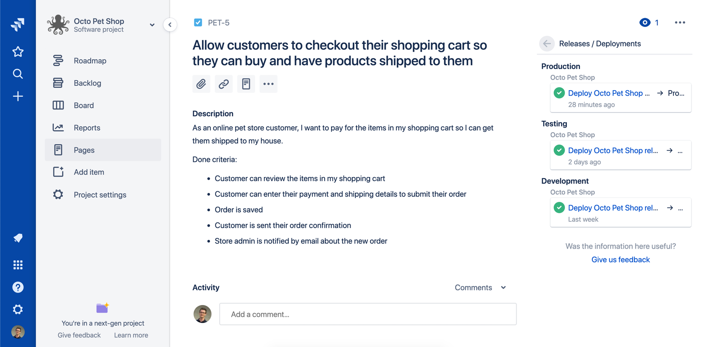
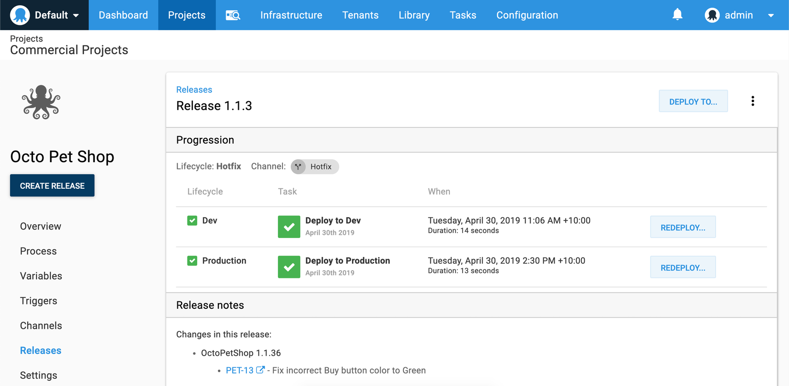

<iframe width="560" height="315" src="https://www.youtube.com/embed/7wWLM0rzVQ4" frameborder="0" allowfullscreen></iframe>

Octopus is proud to launch our [Octopus Deploy plugin for Jira](https://marketplace.atlassian.com/apps/1220376/octopus-deploy-for-jira), which unlocks some pretty useful scenarios.

Building great software often requires using multiple tools and services, but finding the right ones and getting them to talk to each other can be a headache. Atlassian's [Jira Software](https://atlassian.com/jira) is a popular application that helps teams to plan, track, and manage software releases, whereas Octopus Deploy helps teams automate their development and operations processes in a fast, repeatable, and reliable manner. Together, they enable teams to get better end-to-end visibility into their software pipelines from idea to production.

Integrating Octopus and Jira Software unlocks three key scenarios:

* **[See when features or bug fixes are deployed to Prod](/blog/2019-05/octopus-jira-integration/index.md#see-when-features-or-bug-fixes-are-deployed-to-prod).** 'Done' means deployed to production, and this is now visible directly in your Jira issues. See when your team finishes a new feature or bug fix and deploys it to production.
* **[See the Jira issues included in Octopus releases](/blog/2019-05/octopus-jira-integration/index.md#see-the-jira-issues-included-in-octopus-releases).** It's now possible to see which Jira issues (work items) Octopus includes in releases with links back to Jira for further details.
* **[Generate release notes automatically](/blog/2019-05/octopus-jira-integration/index.md#generate-and-share-release-notes-automatically).** Octopus can now generate release notes when deploying to your environments like dev, test or production. Share them with your team, managers, or executives via email, slack, and more.

**[Getting started](/blog/2019-05/octopus-jira-integration/index.md#getting-started)** - Learn how to connect the applications and get started.

Note: The Octopus Deploy plugin is only compatible with Jira Software Cloud as Jira Server (on-prem) does not support the APIs required to enable this functionality.

## See when features or bug fixes are deployed to Prod

> Done means deployed to production

If you've ever worked with development teams, you've probably heard someone say a new feature is 98% done and then it takes weeks for it to be completed and deployed to production. This common situation has led teams to say 'done' means deployed to production.

Our Octopus plugin for Jira Software makes it possible to see if an enhancement or bug fix is done and deployed to production or if it's still a work in progress. This new information is available directly in your Jira issues, and you can click through to Octopus for further details. This enables greater visibility and insight for your team and company in the tool that they're most comfortable with.

## See the Jira issues included in Octopus Releases

Software usually runs through a CI/CD pipeline on its way to production. Developers push code to source code repositories like GitHub, and build servers like Bamboo and TeamCity, build it, and Octopus deploys it. Traditionally, the linkages between each of those steps can get lost.

Using our Jira plugin and one of our build server plugins ([see below for links](/blog/2019-05/octopus-jira-integration/index.md#getting-started)), it's now possible to see your Jira issues and build details directly in Octopus. This allows teams to see the Jira issues and build details that contributed to a release giving end-to-end traceability from issue to deployment. You can click through to Jira Software for more information. It can also help in finding the changes that introduce bugs into releases.

## Generate and share Release Notes automatically

Using multiple tools can make it hard to track application releases and the features they include. It's hard to find which features, bug fixes, and enhancements contribute to releases and deployments. Project managers often write release notes to make this easier to understand, but it's generally a manual process. Integrating Octopus and Jira Software enables this process to be fully automated. Octopus knows which issues have already been deployed to an environment so it can quickly generate release notes showing what's new in test or production environments.

Reading release notes in Octopus is useful but sharing them via email, slack, or other mediums is even better. Using our [email notification step](https://octopus.com/docs/deployment-process/steps/email-notifications) or community contributed step templates, like [slack](https://library.octopus.com/step-templates/99e6f203-3061-4018-9e34-4a3a9c3c3179/actiontemplate-slack-send-simple-notification) or [Microsoft teams](https://library.octopus.com/step-templates/110a8b1e-4da4-498a-9209-ef8929c31168/actiontemplate-microsoft-teams-post-a-message), you can send release notes to your team, managers, or executives after every successful deployment to production. This makes it quick and easy to keep everyone in the loop.

## Getting started

If you're team is already using Jira Software and Octopus Deploy, I highly recommend downloading our plugin and trying it out. Read our [docs](https://octopus.com/docs/api-and-integration/metadata/jira) about how to connect the two applications and get started.

[Octopus Deploy plugin for Jira](https://marketplace.atlassian.com/apps/1220376/octopus-deploy-for-jira)

I also recommend installing one of our build server plugins so you can take full advantage of the features above.

* [Atlassian Bamboo plugin](https://marketplace.atlassian.com/apps/1217235/octopus-deploy-bamboo-add-on)
* [Jenkins plugin](https://plugins.jenkins.io/octopusdeploy) - _Full support for Jira issues is coming soon!_
* [Jetbrains TeamCity plugin](https://plugins.jetbrains.com/plugin/9038-octopus-deploy-integration)
* [Microsoft Azure DevOps extension]() - _Full support for Jira issues is coming soon!_

If your team is using either Jira Software or Octopus Deploy, you can try the other service for free to see how it works for you.

* [Try Octopus Deploy for free](https://octopus.com/trial)
* [Try Jira Software Cloud for free](https://www.atlassian.com/software/jira/try)

## Wrap-up

In summary, [Jira Software](https://atlassian.com/jira) and [Octopus Deploy](https://octopus.com) work together to give you better end-to-end visibility into their your software pipelines from idea to production.

Happy deployments!
