In a previous [blog post](https://octopus.com/blog/octopus-and-powershell-dsc), Paul Stovell showed us how to use Octopus Deploy to deploy PowerShell Desired State Configuration (DSC) to servers to manage infrastructure, use Machine Policies to monitor for drift, and even automatically correct drift with a Project Trigger.  This blog post will expand on that idea by separating the configuration data into a configuration data file (.psd1), turning a PowerShell DSC script into a step template, capturing the items that have drifted in a Machine Policy, and taking advantage of the Substitute Variables in Files feature to set properties that need to change for an Environment or Project.

The code sample that Mr. Stovell provided for DSC was a good example of a basic script,

```PS
Configuration WebServerConfiguration
{  
  Node "localhost"
  {        
    WindowsFeature InstallWebServer
    {
      Name = "Web-Server"
      Ensure = "Present"
    }

    WindowsFeature InstallAspNet45
    {
      Name = "Web-Asp-Net45"
      Ensure = "Present"
    }
  } 
}

WebServerConfiguration -OutputPath "C:\DscConfiguration"

Start-DscConfiguration -Wait -Verbose -Path "C:\DscConfiguration"
```

In his example, the Node data is contained within the script itself and the features to be configured are static.  If we separate the Node data from the script into a Configuration Data File, we can make our DSC script more dynamic.

```PS
@{
    AllNodes =  @(
        @{
            
            # node name
            NodeName = $env:COMPUTERNAME
            
            # required windows features
            WindowsFeatures = @(
				@{
					Name = "Web-Server" 
					Ensure = "Present"
					Source = "d:\sources\sxs"
				},
				@{
					Name = "Web-Asp-Net45"
					Ensure = "Present"
					Source = "d:\sources\sxs"
				}
			)
		}
    )
}
```

With the Node data now separated, the DSC script can be changed to be dynamic, installing features that have been specified in the configuration data file

```PS
Configuration WebServerConfiguration
{
    Import-DscResource -ModuleName 'PSDesiredStateConfiguration' # We get a warning if this isn't included

    Node $AllNodes.NodeName
    {
        # loop through features list and install
        ForEach($Feature in $Node.WindowsFeatures)
        {
            WindowsFeature "$($Feature.Name)"
            {
                Ensure = $Feature.Ensure
                Name = $Feature.Name
                Source = $Feature.Source # Needed if for some reason the resource isn't on the OS already and needs to be retrieved from something like a mounted ISO
            }
        }
    }
}

WebServerConfiguration -ConfigurationData "C:\DscConfiguration\WebServer.psd1" -OutputPath "C:\DscConfiguration"

Start-DscConfiguration -Wait -Verbose -Path "C:\DscConfiguration"
```

Great!  We've got a good start for our web server implementation, but there's more to configuring a web server than installing Windows Features.  Let's add some more data to our configuration data file by adding some additional Windows Features, Sites, Applications, setting a default log path for IIS Sites, and harden our security with Ciphers, Hashes, Protocols, Key Exchanges, and specifying our Cipher Suite order.  NOTE: This is just for demonstration purposes, consult your Security team to determine which settings are best for your organization.

```PS
@{
    AllNodes =  @(
        @{
            
            # node name
            NodeName = $env:COMPUTERNAME
            
            # required windows features
            WindowsFeatures = @(
				@{
					Name = "Web-Server" 
					Ensure = "Present"
					Source = "d:\sources\sxs"
				},
				@{
					Name = "Web-Mgmt-Tools"
					Ensure = "Present"
					Source = "d:\sources\sxs"
				},
				@{
					Name = "Web-Default-Doc"
					Ensure = "Present"
					Source = "d:\sources\sxs"
				},
				@{
					Name = "Web-Http-Errors"
					Ensure = "Present"
					Source = "d:\sources\sxs"
				},
				@{
					Name = "Web-Static-Content"
					Ensure = "Present"
					Source = "d:\sources\sxs"
				},
				@{
					Name = "Web-Http-Logging"
					Ensure = "Present"
					Source = "d:\sources\sxs"
				},
				@{
					Name = "Web-ISAPI-Ext"
					Ensure = "Present"
					Source = "d:\sources\sxs"
				},
				@{
					Name = "Web-ISAPI-Filter"
					Ensure = "Present"
					Source = "d:\sources\sxs"
				},
				@{
					Name = "Web-Asp-Net45"
					Ensure = "Present"
					Source = "d:\sources\sxs"
				},
				@{
					Name = "Web-Asp-Net"
					Ensure = "Present"
					Source = "d:\sources\sxs"
				},
				@{
					Name = "Web-Http-Redirect"
					Ensure = "Present"
					Source = "d:\sources\sxs"
				},
				@{
					Name = "Web-Http-Tracing"
					Ensure = "Present"
					Source = "d:\sources\sxs"
				},
				@{
					Name = "Web-Windows-Auth"
					Ensure = "Present"
					Source = "d:\sources\sxs"
				}
			)

            # default IIS Site log path
            LogPath = "c:\logs"

            # Define root path for IIS Sites
            RootPath = "C:\inetpub\wwwroot"

            # define IIS Sites
            Sites = @(
                 @{
					Name = "OctopusDeploy.com"
					Ensure = "Present"
					State = "Started"
					BindingInformation = @(
						@{
							Port = "80"
							IPAddress = "" # leave blank or comment out to set to All Unassigned
							Protocol = "HTTP"
						},
						@{
							Port = "443"
							IPAddress = ""
							Protocol = "HTTPS"
							CertificateStoreName  = "WebHosting" # WebHosting | My
							Exportable = $true
						}
	
					)
					Pool = @{
							PipeLine = "Integrated"
							RuntimeVersion = "v4.0"
							State = "Started"
						}
					Applications = @(
						@{
							Name = "OctoFX"
							FolderName = "OctoFX"
							Ensure = "Present"
							Pool = @{
								Pipeline = "Integrated"
								RuntimeVersion = "v4.0"
								State = "Started"
							}
							Authentication = @{
								Windows = $false
								Anonymous = $true
							}
	
						},
						@{
							Name = "OctopusPetShop"
							FolderName = "OctopusPetShop"
							Ensure = "Present"
							Pool = @{
								Pipeline = "Integrated"
								RuntimeVersion = "v4.0"
								State = "Started"
							}
						}
					)
				}
            )

            # fill in this section to enable or disable encryption protocols, hashes, ciphers, and specify cipher suite ordering
            Encryption = @{
				Ciphers = @(
					@{
						Name = "DES 56/56"
						Enabled = "0" # Disabled = 0, Enabled = -1
					},
					@{
						Name = "NULL"
						Enabled = "0"
					},
					@{
						Name = "RC2 128/128"
						Enabled = "0"
					},
					@{
						Name = "RC2 40/128"
						Enabled = "0"
					},
					@{
						Name = "RC2 56/128"
						Enabled = "0"
					},
					@{
						Name = "RC4 64/128"
						Enabled = "0"
					},
					@{
						Name = "AES 128/128"
						Enabled = "-1"
					},
					@{
						Name = "AES 256/256"
						Enabled = "-1"
					},
					@{
						Name = "Triple DES 168/168"
						Enabled = "-1"
					},
					@{
						Name = "RC4 40/128"
						Enabled = "0"
					},
					@{
						Name = "RC4 56/128"
						Enabled = "0"
					},
					@{
						Name = "RC4 128/128"
						Enabled = "0"
					}
				)
				Hashes = @(
					@{
						Name = "MD5"
						Enabled = "0"
					},
					@{
						Name = "SHA"
						Enabled = "0"
					},
					@{
						Name = "SHA256"
						Enabled = "-1"
					},
					@{
						Name = "SHA384"
						Enabled = "-1"
					},
					@{
						Name = "SHA512"
						Enabled = "-1"
					}
				)
				Protocols = @(
					@{
						Name = "Multi-Protocol Unified Hello"
						Enabled = "0"
					},
					@{
						Name = "PCT 1.0"
						Enabled = "0"
					},
					@{
						Name = "SSL 2.0"
						Enabled = "0"
					},
					@{
						Name = "SSL 3.0"
						Enabled = "0"
					},
					@{
						Name = "TLS 1.0"
						Enabled = "0"
					},
					@{
						Name = "TLS 1.1"
						Enabled = "-1"
					},
					@{
						Name = "TLS 1.2"
						Enabled = "-1"
					}
				)
				KeyExchanges = @(
					@{
						Name = "Diffie-Hellman"
						Enabled = "-1"
					},
					@{
						Name = "ECDH"
						Enabled = "-1"
					},
					@{
						Name = "PKCS"
						Enabled = "-1"
					}
				)
				CipherSuiteOrder = @("TLS_ECDHE_RSA_WITH_AES_256_GCM_SHA384", "TLS_ECDHE_RSA_WITH_AES_128_GCM_SHA256", "TLS_ECDHE_RSA_WITH_AES_256_CBC_SHA384", "TLS_ECDHE_RSA_WITH_AES_128_CBC_SHA256", "TLS_ECDHE_ECDSA_WITH_AES_256_GCM_SHA384", "TLS_ECDHE_ECDSA_WITH_AES_128_GCM_SHA256", "TLS_ECDHE_ECDSA_WITH_AES_256_CBC_SHA384", "TLS_ECDHE_ECDSA_WITH_AES_128_CBC_SHA256", "TLS_RSA_WITH_AES_256_GCM_SHA384", "TLS_RSA_WITH_AES_128_GCM_SHA256", "TLS_RSA_WITH_AES_256_CBC_SHA256", "TLS_RSA_WITH_AES_128_CBC_SHA256")
			}
		}
    )
}
```
As you might have guessed, we'll need to update our DSC script to configure the options we've specified in our configuration data file

```PS
Configuration WebServerConfiguration
{
    Import-DscResource -ModuleName 'PSDesiredStateConfiguration'
    Import-DscResource -Module xWebAdministration

    Node $AllNodes.NodeName
    {
        # loop through features list and install
        ForEach($Feature in $Node.WindowsFeatures)
        {
            WindowsFeature "$($Feature.Name)"
            {
                Ensure = $Feature.Ensure
                Name = $Feature.Name
                Source = $Feature.Source # Needed if for some reason the resource isn't on the OS already and needs to be retrieved from something like a mounted ISO
            }
        }

        # stop default web site
        xWebSite DefaultSite
        {
            Ensure = "Absent"
            Name = "Default Web Site"
            State = "Stopped"
            PhysicalPath = "c:\inetpub\wwwroot"
            DependsOn = "[WindowsFeature]Web-Server"
        }

        # loop through list of default app pools and stop them
        ForEach($Pool in @(".NET v2.0", `
        ".NET v2.0 Classic", `
        ".NET v4.5", `
        ".NET v4.5 Classic", `
        "Classic .NET AppPool", `
        "DefaultAppPool"))
        {
            xWebAppPool $Pool
            {
                Name = $Pool
                State = "Stopped"
                Ensure = "Absent"				 
                DependsOn = "[WindowsFeature]Web-Server"
            }
        }

        # make sure log path exists
        File LoggingPath
        {
            Type = "Directory"
            DestinationPath = $Node.LogPath
            Ensure = "Present"
        }

        # loop through the sites
        ForEach($Site in $Node.Sites)
        {
            # create the folder
            File $Site.Name
            {
                Type = "Directory"
                DestinationPath = "$($Node.Rootpath)\$($Site.Name)"
                Ensure = $(if ($Site.Ensure) {$Site.Ensure} else {"Present"})
            }

            # create the site app pool
            xWebAppPool $Site.Name
            {
                Name = $(if($Site.Pool.Name) {$Site.Pool.Name} else {$Site.Name})
                Ensure = $(if ($Site.Ensure) {$Site.Ensure} else {"Present"})
                ManagedPipelineMode = "$($Site.Pool.Pipeline)"
                managedRuntimeVersion = "$($Site.Pool.RuntimeVersion)"
                State = $Site.Pool.State
                IdentityType = $(if ($Site.Pool.IdentityType) {$Site.Pool.IdentityType} else {"ApplicationPoolIdentity"})
                Credential = $(if (($Credentials | Where-Object {$_.Name -eq "$($Site.Name).AppPoolIdentity"}) -ne $null) {($Credentials | Where-Object {$_.Name -eq "$($Site.Name).AppPoolIdentity"}).Credential} else {$null} )
            }
            
            # create the site
            xWebSite $Site.Name
            {
                Ensure = $(if ($Site.Ensure) {$Site.Ensure} else {"Present"})
                Name = $Site.Name
                State = $Site.State
                PhysicalPath = "$($Node.Rootpath)\$($Site.Name)"
                ApplicationPool = $(if($Site.Pool.Name) {$Site.Pool.Name} else {$Site.Name})
                BindingInfo = @(
                    # loop through the binding information
                    ForEach($BindingInfo in $Site.BindingInformation)
                    {
                    # check for keyword CertificateStoreName
                        MSFT_xWebBindingInformation
                        {
                            Port = $BindingInfo.Port
                            IPAddress  = $BindingInfo.IPAddress
                            Protocol = $BindingInfo.Protocol
                        }                   
                    }
                )

                # Set logging path
                LogPath = $Node.LogPath

                # Set Authentication mechanisms
                AuthenticationInfo = MSFT_xWebAuthenticationInformation {
                    Anonymous = $Site.Authentication.Anonymous
                    Basic = $Site.Authentication.Basic
                    Digest = $Site.Authentication.Digest
                    Windows = $Site.Authentication.Windows
				}
            }

            # Loop through site application collection and create folders
            ForEach($Application in $Site.Applications)
            {
                File "$($Site.Name)-$($Application.Name)"
                {
                    Type = "Directory"
                    DestinationPath = "$($Node.Rootpath)\$($Site.Name)\$($Application.FolderName)"
                    Ensure = $(if ($Application.Ensure) {$Application.Ensure} else {"Present"})
                    Force = $true
                }


                # create application pool
                xWebAppPool $Application.Name
                {
                    Name = $(if($Application.Pool.Name) {$Application.Pool.Name} else {$Application.Name})
                    Ensure = $(if ($Application.Ensure) {$Application.Ensure} else {"Present"})
                    State = $Application.Pool.State
                    ManagedPipelineMode = $Application.Pool.Pipeline
                    managedRuntimeVersion = "$($Application.Pool.RuntimeVersion)"
                    idleTimeout = $Application.Pool.IdleTimeout
                    restartTimeLimit = $Application.Pool.RestartTimeLimit
                    IdentityType = $(if ($Application.Pool.IdentityType) {$Application.Pool.IdentityType} else {"ApplicationPoolIdentity"})
                    Credential = $(if (($Credentials | Where-Object {$_.Name -eq "$($Application.Name).AppPoolIdentity"}) -ne $null) {($Credentials | Where-Object {$_.Name -eq "$($Application.Name).AppPoolIdentity"}).Credential} else {$null} )
                }

                # create application
                xWebApplication $Application.Name
                {
                    #Name = $Application.Name
					Name = $(if($Application.Name -eq $Application.FolderName) {$Application.Name} else {$Application.FolderName.Replace("\", "/")})
                    Website = $Site.Name
                    WebAppPool = $(if($Application.Pool.Name) {$Application.Pool.Name} else {$Application.Name})
                    PhysicalPath = "$($Node.Rootpath)\$($Site.Name)\$($Application.FolderName)"
                    Ensure = $(if ($Application.Ensure) {$Application.Ensure} else {"Present"})
					# Set Authentication mechanisms
					AuthenticationInfo = MSFT_xWebApplicationAuthenticationInformation {
						Anonymous = $Application.Authentication.Anonymous
						Basic = $Application.Authentication.Basic
						Digest = $Application.Authentication.Digest
						Windows = $Application.Authentication.Windows
					}
                }
            }
        }
    }
}

# create credential object
$Credentials = @()

WebServerConfiguration -ConfigurationData "C:\DscConfiguration\WebServer.psd1" -OutputPath "C:\DscConfiguration"

Start-DscConfiguration -Wait -Verbose -Path "C:\DscConfiguration"
```

This isn't a post on how to do PowerShell DSC, so I won't go over everthing that was added.  However, I did want to highlight one line, `Import-DscResource -Module xWebAdministration`.  This xWebAdministration isn't one that is installed by default, like PSDesiredStateConfiguration, and will need to be included when we do a deployment.  We'll discuss more on that later in this post.

Okay!  We have our configuration data separated into its own file, and we've got a DSC script that will configure an IIS Web server.  Now let's start hooking it all together in Octopus Deploy and make our DSC script a Step Template!

We'll start by logging into our Octopus Deploy instance and clicking on the Library tab, then Step Templates


Click on the Add button

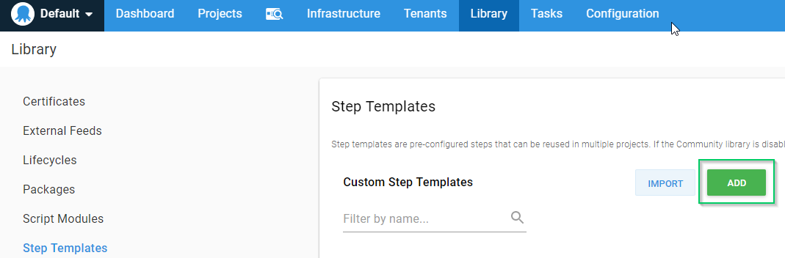

Choose the Run a Script template

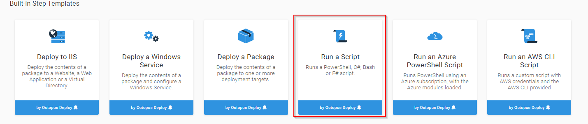

Fill in Settings

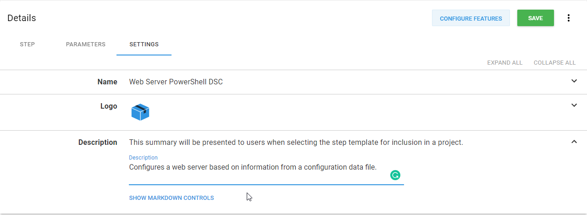

We'll define three Parameters, Configuration Data File step, DSC Path, and Configuration Data file name.  These will be used by our DSC script.

## Configuration Data File step
This step will need the Control type of "A previous deployment step name" so we can retrieve the location of where the datafile was extracted to.


## DSC Path
This is the path where the .MOF file will be written to when DSC executes.


## Configuration Data File name
This is the name of the configuration data file we created, WebServer.psd1


On the Step tab, choose Inline Source Code and past in the PowerShell DSC script that we've created.


Enter Full Screen mode by clicking on the opposing arrows so we can more easily tweak our script to use the Parameters we've defined

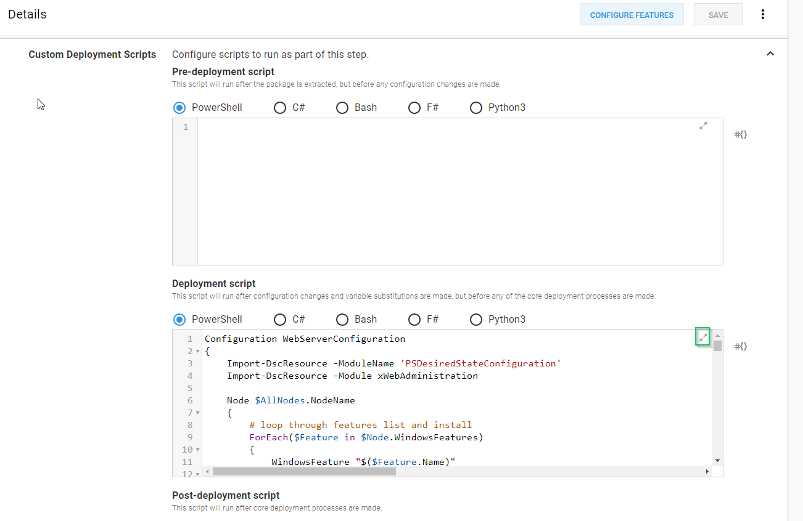

Scroll to the bottom and change

```PS
WebServerConfiguration -ConfigurationData "C:\DscConfiguration\WebServer.psd1" -OutputPath "C:\DscConfiguration"

Start-DscConfiguration -Wait -Verbose -Path "C:\DscConfiguration"
```
To
```PS
# set location for mof files
Set-Location -Path $DSCTempPath

# get the configuration data file
$ConfigurationDataFile = (Get-ChildItem -Path $OctopusParameters["Octopus.Action[$NuGetPackageStep].Output.Package.InstallationDirectoryPath"] | Where-Object {$_.Name -eq $DataFileName}).FullName

# Display which file it's using
Write-Host "The configuration data file is: $ConfigurationDataFile"

# Execute and generate .MOF file
WebServerConfiguration -ConfigurationData $ConfigurationDataFile -OutputPath $DSCTempPath

# Configure the server using the MOF file
Start-DscConfiguration -Wait -Verbose -Path $DSCTempPath
```

Exit Full Screen and click Save

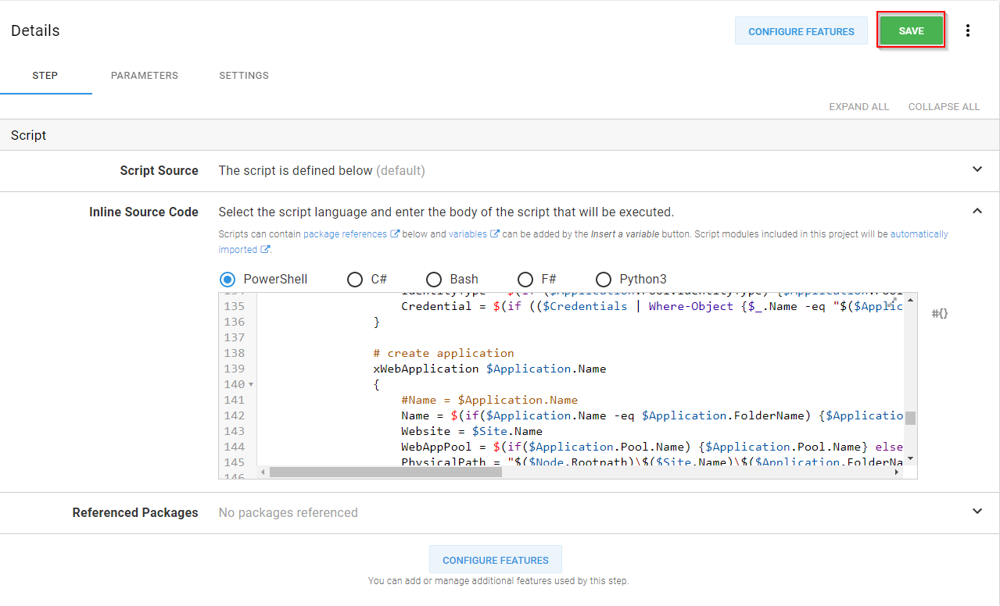

Cool!  We've just created a dynamic, re-usable Step Template that will configure IIS Web servers using PowerShell DSC!  Now we need to create a new project to use it.

## Caveat for PowerShell DSC Resource Modules
Earlier in this post, I talked about the `Import-DscResource -Module xWebAdministration` line in our DSC script.  This is a reference to the xWebAdministration PowerShell DSC resource module, which will need to be downloaded from either the [PowerShell Gallery](https://www.powershellgallery.com/packages?q=xwebadministration) or from [GitHub](https://github.com/PowerShell/xWebAdministration).  The caveat to this is that any DSC Modules referenced in your script must be installed **before** the DSC script executes.  

## Make your configuration data file and your referenced PowerShell DSC modules deployable packages
Presumabely, you have placed your configuration data file and referenced PowerShell DSC modules into source control.  Once in source control, your build server can easily package them and ship them to Octopus Deploy for deployment.

## Configure your project
Now that we have our configuration data file package and our PowerShell DSC Modules package, we can configure our project!

Before we define our process, let's create some variables that will be used in our deployment; Project.PowerShellModulePath, Project.DSCPath, and Project.ConfigurationDataFile.  Click on the Variables tab and fill in the variables like this

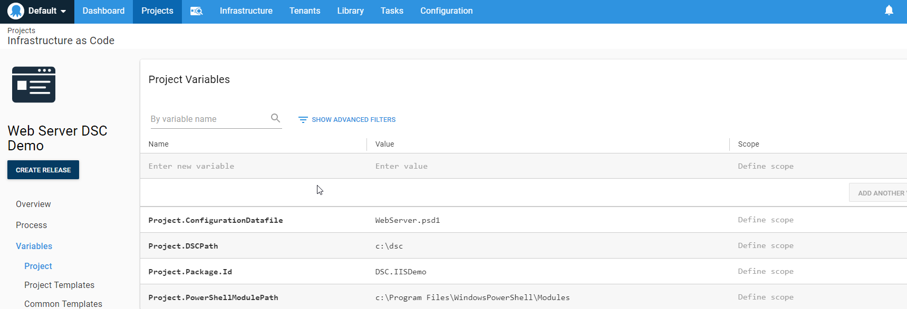

Now let's define our deployment process.

Step 1: Deploy the Powershell DSC Modules <br />
PowerShell DSC will use the paths defined in $env:PSModulePath to find modules.  For the purposes of this demonstration, we're going to place our modules in `c:\Program Files\WindowsPowerShell\Modules` that we defined in our variable Project.PowerShellModulePath variable.  

Add a new step to our Project by clicking on Add Step


Choose the Deploy a Package template

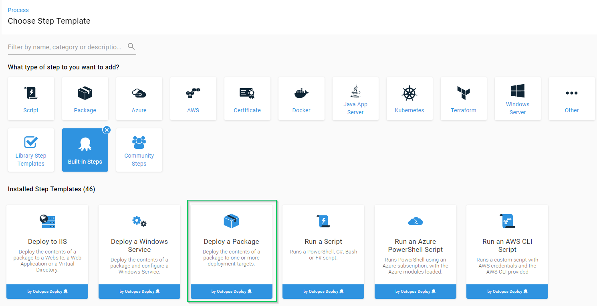

To specify a specific location, click on Configure Features button


Enable Custom Installation Directory

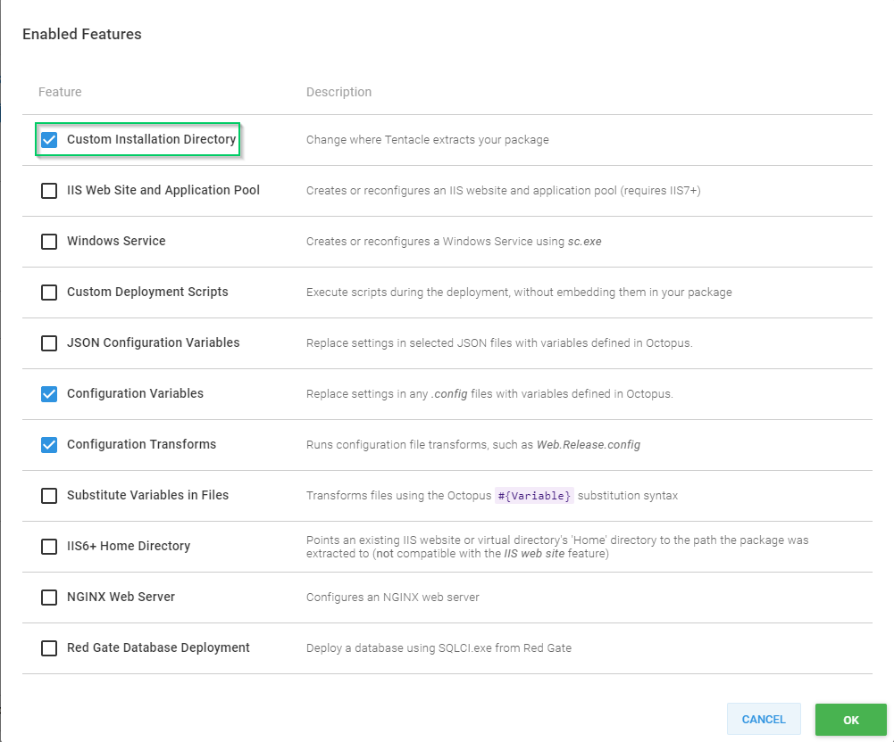

To reference a variable, click on the #{} to bring up the list
and choose Project.PowershellModulePath.  Then click Save. <br />
Warning!  Do **not** choose Purge this directory before installation, there are other modules that PowerShell needs in there.


When done, your step should look something like this


Step 2: Deploy configuration data file <br />
Just like Step 1, this will be a Deploy a Package step, except we will not configure a Custom Install Directory.

Step 3: Our Custom Step Template <br />
The third and final step will be our custom step template that we just created.  For the Configuration Data File step, choose Step 2.  DSC Path will be the variable Project.DSCPath, and Configuration Data File name is going to be the variable Project.ConfigurationDatafile.


And that's it!  Once we've saved our Project, we can create a release and configure a server!

Once the deployment has completed, we should see something like the following


Logging into our Web server, we should find that IIS has been installed with Sites, Application Pools, and Applications defined

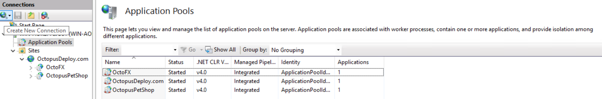

But wait!  In our configuration data file, we've statically set where the IIS Sites log to, what if I want something different per project?  This is where we can use the Substitute Variables in Files feature of Octopus Deploy!  

Okay, let's create another variable!  Create a variable called LogPath for the log location and let's create a variable for our Configuration Data File as well.

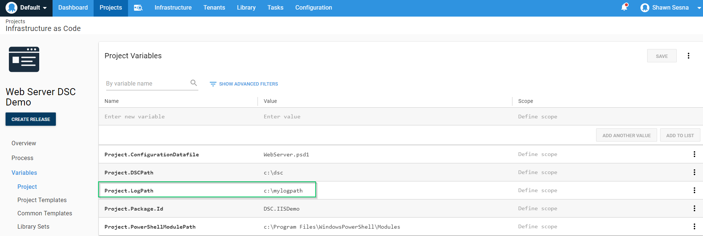

Let's change the `LogPath = "c:\logs"` to `LogPath = "#{Project.LogPath}"` line in our configuration data file.  The #{LogPath} is Octopus Deploy syntax for where the variable LogPath will go.  Don't forget to check the change in so it can be delivered to Octopus Deploy!

Now that we've specified the place holder, we need to enable the Substitute Variables in Files feature for our configuration data file deployment step (Step 2).  To do this, we'll edit Step 2 and click on Configure Features like we did for Step 1.


Enable Substitute Variables in Files


Specify which file it is that needs substitution


With our variables defined and our new configuration data file package delivered to Octopus Deploy, we can create a new release and deploy!  Once the deployment is complete, we'll pop over to our IIS server and we should see that the log file path has been updated.


Wow!  That's awesome!  I can deploy server configuration changes just like I would an application!  What if someone was naughty and made a change manually?  Didn't you say something about monitoring for drift?  Yup, sure did!  We can tweak Paul's Machine Policy script to show us which items are no longer in desired state, mark the machine as unhealthy.

Paul's Machine Policy for monitoring drift looked like this

```PS
$result = Test-DscConfiguration -Verbose -ErrorAction SilentlyContinue

if ($result -eq $false) {
    Write-Host "Machine has drifted"
    Fail-HealthCheck "Machine has drifted"
} elseif ($result -eq $true) {
    Write-Host "Machine has not drifted"
} else {
    Write-Host "No configuration has been applied to the machine yet"
}
```
If we change a few things, we can easily list which resources have drifted

```PS
# Capture the detailed results
$result = Test-DscConfiguration -Detailed

# Check to see if anything is in the NotInDesiredState collection
if ($result.ResourcesNotInDesiredState.Count -gt 0)
{
	# Loop through the resources
	foreach ($resource in $result.ResourcesNotInDesiredState)
	{
		# Display warning
		Write-Warning "Resource $($resource.ResourceId) has drifted!"
	}

	# Fail the health check
	Fail-HealthCheck "Machine has drifted."
}
else
{
	# All good!
	Write-Host "Machine has not drifted."
}
```

Let's test it by stopping the OctopusDeploy.com web site on our IIS server.  After stopping the site, we should see someething like this when running a Health Check on the machine

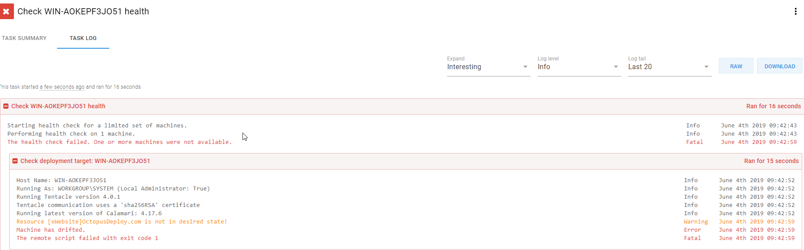

##Summary##
In this post, we created a PowerShell DSC script, converted it into an Octopus Deploy Step Template, separated Node data into a configuration data file, and created a Machine Policy for monitoring for drift.