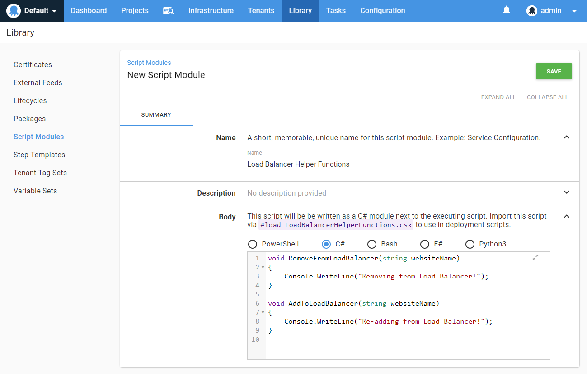
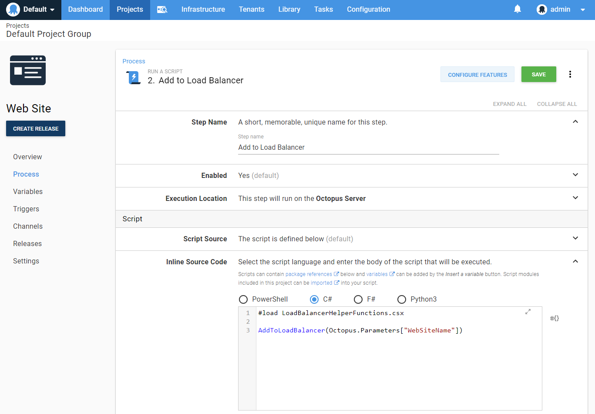
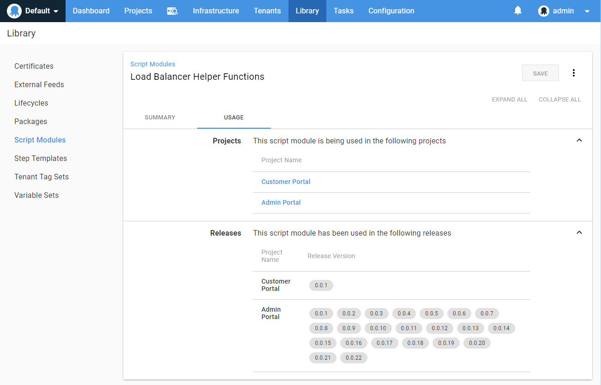

For a long while now, we've been hearing requests for [Script Module](https://octopus.com/docs/deployment-examples/custom-scripts/script-modules) support for languages other than PowerShell. We're happy to share this has just shipped in our latest release - 2019.5.0!

For some people, this is awesome news.  For others, you're probably asking _"What's a Script Module?"_

A Script Module is a collection of functions that can be shared across mutiple projects. These can make your life easier by allowing functions to be centrally defined and managed, instead of copying and pasting code between your projects. Find them under Library -> Script Modules. 

Once you've defined your Script Module, you can use it in your projects. One thing to note is that the new languages require explicit imports; they are not imported automatically as is the case with PowerShell Script Modules.  This has the benefit of making the script module dependency more explicit and prevents naming collisions and unexpected behavior.

In the case of C#, this is achieved by a `#load <scriptmodulefilename.csx>` call at the top of the script:

The help text above the body of your Script Module will show the exact syntax you need.

## Usage

Another great feature we're proud to talk about is Script Module usage. We've surfaced where your Script Module has been used, so that it's easy to see what projects might be impacted by your changes. This will mean less suprises during your deployments, which is always a great thing. We now show which projects and releases have references:

We've also got plans to show this usage on Variable Sets very soon. Stay tuned!

Take a look at [the Script Modules documentation](https://octopus.com/docs/deployment-examples/custom-scripts/script-modules) for a walkthrough and examples for each language.

Happy deployments!
