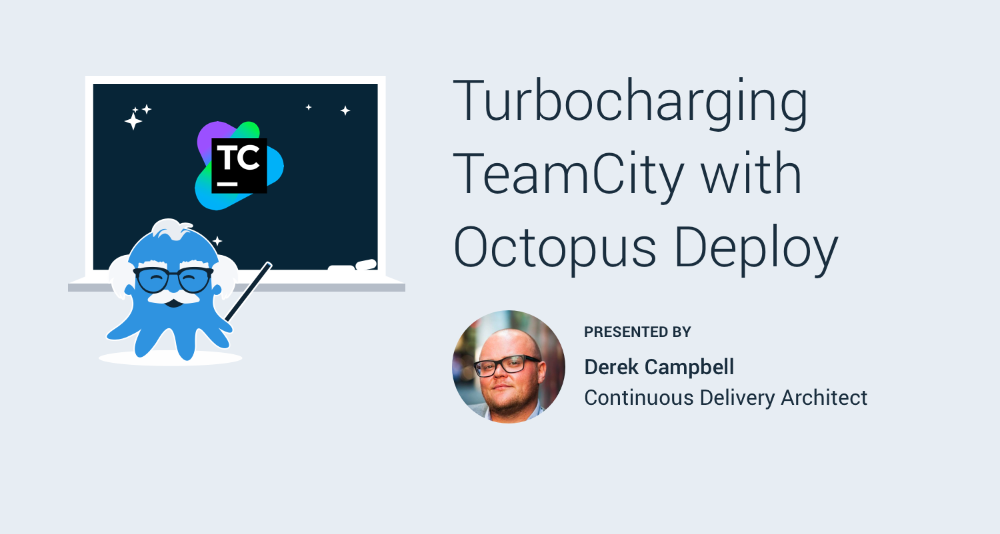

TeamCity and Octopus Deploy go together like cheese and crackers, or peanut butter and jelly for our American friends. In this webinar, [Derek Campbell](https://twitter.com/octoderek) takes you through integrating [TeamCity](https://www.jetbrains.com/teamcity/) and Octopus, building a solution, automating deployment to development and then automatically promoting the release and deploying to test, production and lastly to disaster recovery using a multi-cloud strategy using Azure and AWS.

<iframe width="560" height="315" src="https://www.youtube.com/embed/DlbQUdFFDMU" frameborder="0" allowfullscreen></iframe>
