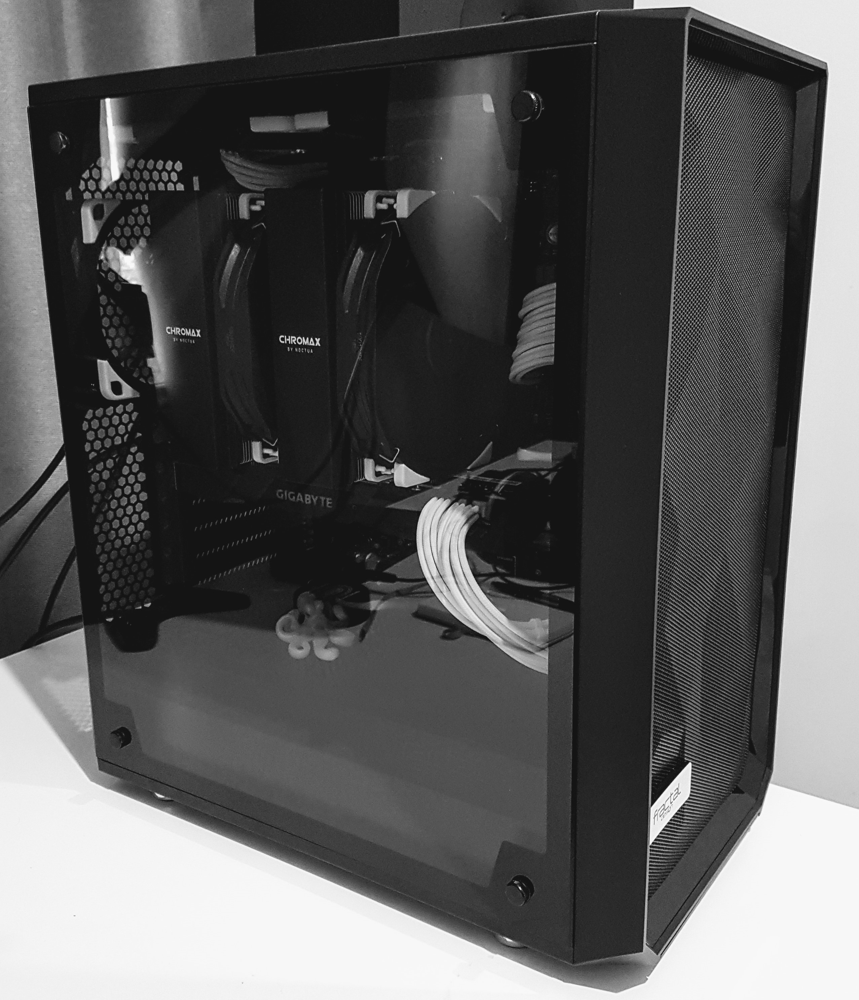

My fifth anniversary at Octopus is fast approaching. To celebrate, I decided to take advantage of the Octopus policy that provides the tool I use most every day: the computer. Among the great benefits of working at Octopus is the computer program, a policy that lets me refresh my hardware every few years and keep (or donate) my old hardware.

Growing up, I had access to a 386 computer, complete with turbo button and 2400bps modem (eat your heart out 5G). I thought it was the best thing in the world, but quickly turned jealous when my friends started getting 486s and then Pentiums. My envy reached its peak watching StarCraft with wonder, sad that it would never run on my dad's clunky 386.

When I started working at Octopus, I got my first taste of a top-of-the-line computer. I chose an MSI WS60 laptop, a great balance of power and portability. I remember arriving at the office on my first day. Paul Stovell (the CEO) had recently returned from a local computer store on his scooter with my laptop strapped to his back. It was magnificent.

As Octopus grew, I became more involved in performance investigations, and Octopus became more remote-centric. My next laptop sacrificed portability for power and storage. Metabox provides laptops with any spec you can imagine, so I opted for a larger Metabox Prime laptop with a lot of grunt and 2TB storage. I appreciated the extra power and my chiropractor appreciated the extra size.

For the fifth anniversary computer, I set out to make the ultimate code compiling work station. It would be called Octobox-V. It would be powerful enough to load Visual Studio in under 10 minutes (zing) but small and sleek enough to sit on my desk. I wanted to get rid of the fan noise and thermal throttling common to laptops. I would build a lean, mean, Octopus desktop machine.

This configuration is what I came up with:

Ryzen 7 2700X, 32GB DDR4 3200, RTX 2070, 1TB PCIe, 2TB SATA

So how does it perform? Compile times have reduced 65% compared to the back-breakingly powerful laptop Octobox-V is replacing. It is completely silent. There is plenty of space for the process dumps and database backups prevalent in performance investigations (so send them in to support@octopus.com). For work away-from-home I have an ultrabook that I use to remote desktop via VPN to Octobox-V, so there is no compromise between performance and portability. Best of all, it plays a mean game of StarCraft.