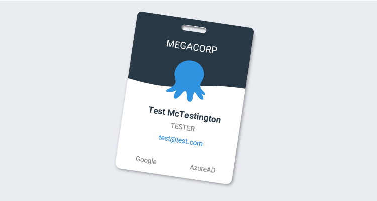
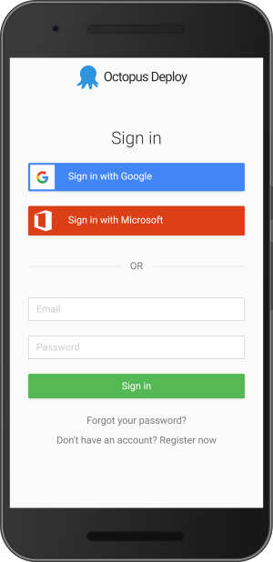
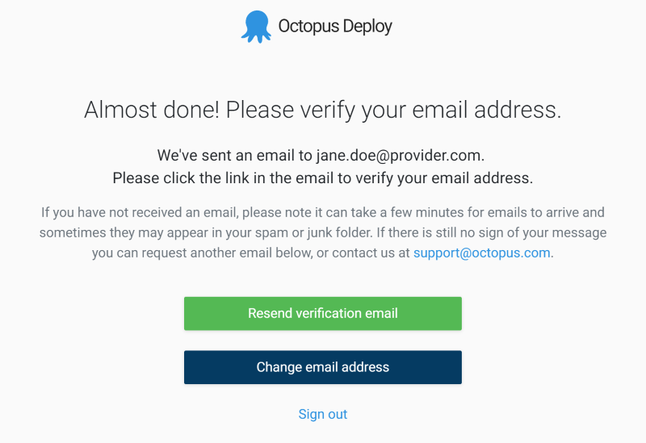
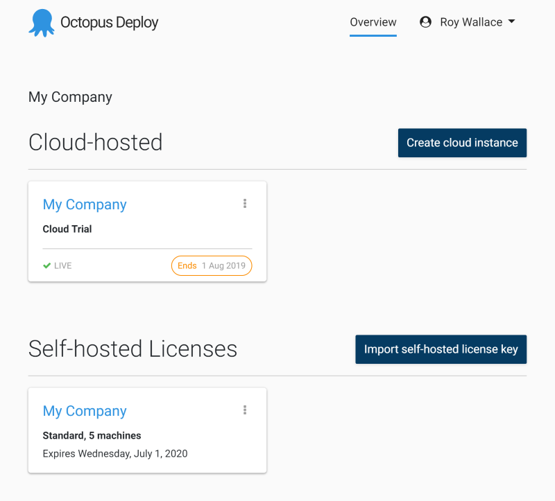

When Octopus Cloud [was announced](https://octopus.com/blog/announcing-octopus-cloud) a year ago, we launched it alongside some rudimentary account management features. There wasn't any convenient way to keep track of all of your [self-hosted](https://octopus.com/pricing/self-hosted) Octopus licenses. You also had to create a new username and password to manage your account, and yet another username and password to log in to your new Octopus Cloud instance.

We want to make your experience interacting with Octopus as simple as possible, so today we're introducing our plans for single sign-on using Octopus ID, starting with a few new account features that we hope will make your life easier, and get you deploying quicker than ever.

## Log in easily with Google or Microsoft

You can now [log in](https://account.octopus.com/) to your account using your existing Google or Microsoft account. For existing users with an old email and password account, don't worry, we continue to support that, and we'll automatically link multiple authentication methods based on your email address. You'll just need to verify your email address as shown below.

You can also choose a profile photo, or control your authentication methods via a simple profile screen:

## Keep track of your self-hosted Octopus licenses

If you've ever started a trial or purchased a copy of self-hosted Octopus Deploy, you would have received a license key via email. If your organization had multiple such licenses, keeping track of these keys manually could be a pain.

Now, you can import your self-hosted license keys into your account. When you go to import a license, we'll use your Octopus ID to automatically detect your licenses if your email is listed as the end user contact, or you can just paste the license key. Once linked, you'll get convenient access to self-service options like renewing your license or changing license limits.

## Spin up a new Cloud trial

You can also use your account to easily try Octopus Deploy in the cloud, as always, free for 30 days. Just [sign in](http://account.octopus.com) and follow the link to create a new Cloud instance and get up and running in a few clicks.

## Future plans

Today, you can already use your Octopus ID to create Cloud instances and manage your self-hosted licenses. In the future, we plan to add the following to the list of services that you can unlock using your Octopus ID.

### Sharing licenses with your team
There's no easy way to invite other people to manage your Octopus Cloud subscription or self-hosted license keys. We plan to make it possible to invite other people to manage them.

### Support forum

At the moment, reaching out for help on [the support forum](https://help.octopus.com/) requires you to sign up with yet another set of credentials. We plan to tweak the forum to instead allow you to reuse your Octopus ID to get you in seamlessly, and get you the help you need sooner.

### Octopus Cloud instances

This will probably be the biggest benefit of Octopus ID. We plan to offer integrated Octopus ID authentication for users of new Octopus Cloud instances. We expect a few benefits from this. For example, while spinning up a new Cloud instance, there will be no need to create and keep track of another username and password for the initial admin user on the instance. Secondly, we hope that Octopus ID will make it [even simpler](https://octopus.com/docs/administration/authentication) for organizations to set up Google or Microsoft authentication for their instances.

You'll be able to set up a rule like "Anyone with a valid login to this Microsoft ID tenant is allowed access to this Octopus instance".

## Wrapping up

We want your interactions with Octopus to be as effortless as possible. With Octopus ID, we hope you find the new sign-in options and account management features useful, and we look forward to bringing you more single sign-on goodness across our support forum and all of your Octopus Cloud instances soon.

Happy deployments!
