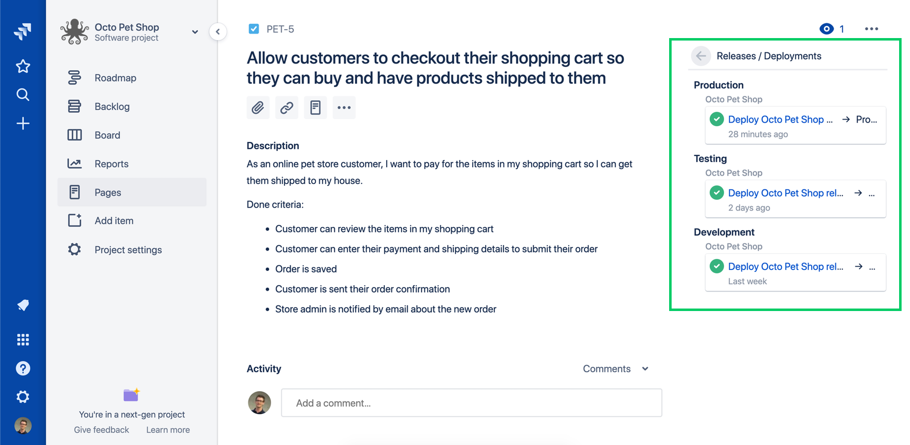
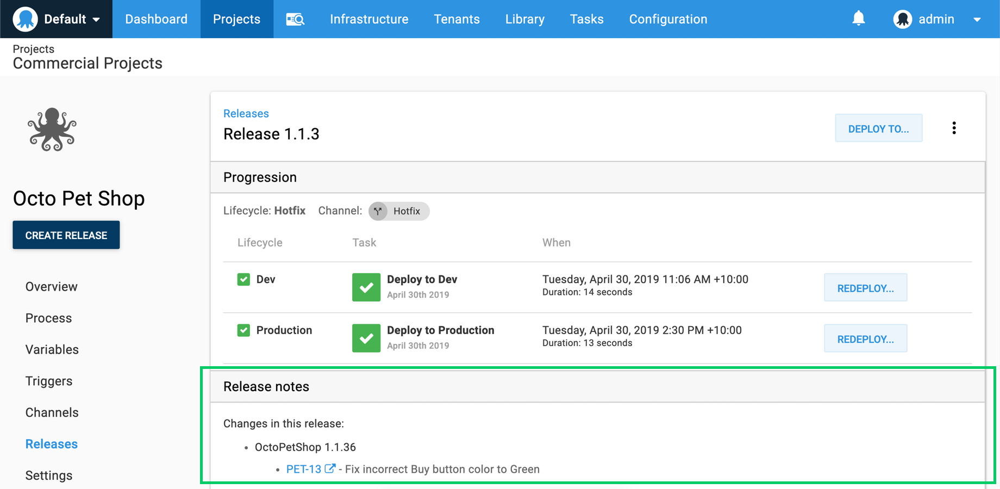
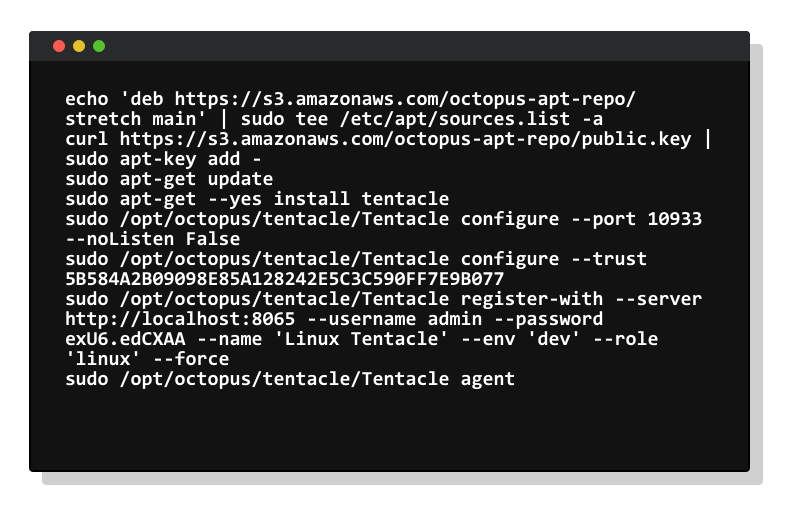

<h2>Octopus Deploy 2019.6 LTS</h2>

Octopus Deploy `2019.6 LTS` is now available for teams running Octopus Deploy self-hosted, and we recommend this release for our self-hosted customers. Our [long-term support (LTS) program](https://octopus.com/docs/administration/upgrading/long-term-support) includes releases with six months of support, including critical bug fixes and security patches. They do not include new features, minor enhancements, or minor bug fixes; these are rolled up into the next LTS release.

<a href="https://octopus.com/downloads" class="btn btn-primary btn-lg">Download now</a>

This is our third release with six months of long term support, and the following table shows our current LTS releases.

| Release               | Long term support           |
| --------------------- | --------------------------- |
| Octopus 2019.6        | Yes                         |
| Octopus 2019.3        | Yes                         |
| Octopus 2018.10       | Expired                     |

Keep reading to learn about what's in this release and any breaking changes.

<h2>In this post </h2>

!toc

## Jira integration

Done means deployed to production. Our new Octopus plugin for Jira Cloud enables teams to see the status of their releases and deployments directly in their Jira issues with deep links back to Octopus for further details. This functionality enables greater visibility and insight for your team and company in the tool that they're most comfortable with.

[Learn more](https://octopus.com/blog/octopus-jira-integration)

## Tracking your work from idea to production

This release introduces build information and work item tracking. It's now possible to see build, commit, and issue details directly in Octopus. This functionality allows teams to view the issues and build details that contributed to a release giving end-to-end traceability from issue to production. You can even click deep links for more information. We support GitHub Issues, Jira Issues, and support for Azure DevOps is coming soon.

[Learn more](https://octopus.com/blog/metadata-and-work-items)

## Generate and share release notes automatically

Octopus can now generate release notes by leveraging metadata from your source code commits and build process to determine what's new in an environment. It can show you which issues and changes are new since your last deployment. You can even share this with your team on Slack or send it to your customers via email. As with work item tracking, we support GitHub Issues, Jira Issues, and support for Azure DevOps is coming soon.

[Learn more](https://octopus.com/blog/release-notes-templates)

## Script module support for C#, F#, Bash, and Python

We added support for script modules in all our support languages. Now you can centrally manage common Bash, C#, F#, and Python script functions, and even see which projects are using the Script Modules.

[Learn more](https://octopus.com/blog/script-modules)

## Linux Tentacle early access

This release also includes early-access for our upcoming Linux Tentacle. [Octopus 3.0](https://octopus.com/blog/deployment-targets-in-octopus-3) introduced support for Linux deployments over SSH; however, in highly secure environments inbound ports cannot be opened on production servers. Our Linux Tentacle agent solves this security concern with support for communication between the Octopus Server and Linux deployment targets in listening and polling modes. Polling mode specifically removes the requirement for open ports as the polling Tentacle establishes communication with the Octopus Server.

We'd love feedback so join the discussion on our [community slack](https://octopus.com/slack) in the `#linux-tentacle` channel.

[Learn more](https://octopus.com/docs/infrastructure/deployment-targets/linux/tentacle)

## Breaking changes

This release includes some minor breaking changes:

* There are some [slight changes](https://github.com/OctopusDeploy/Issues/issues/5392) to the format of the output returned by the `Octopus.Server.exe` `show-configuration` command. This is unlikely to affect teams, but if you are using this to drive automation, please test the new release before upgrading. 
* In order to support some customers who have Active Directory configurations where users share email addresses, we have [removed the uniqueness restriction](https://github.com/OctopusDeploy/Issues/issues/5549) on user email. 
* Health check properties of machine policies have [changed](https://github.com/OctopusDeploy/Issues/issues/5544) to accommodate Linux Tentacle. `TentacleEndpointHealthCheckPolicy` has been renamed to `PowerShellHealthCheckPolicy` and `SshEndpointHealthCheckPolicy` has been renamed to `BashHealthCheckPolicy`. Any custom tools that create machine policies should use the new property names. 
* The `OnlyConnectivity` option that was configured on SSH health check policies is now a [policy-wide setting](https://github.com/OctopusDeploy/Issues/issues/5544). This setting is commonly used for raw scripting on SSH targets. If you are using this setting, a new machine policy will be created during the Octopus Server upgrade. 

## Wrapping up

Octopus Server 2019.6 has arrived, and you can bank on it. Happy long-term deployments!
