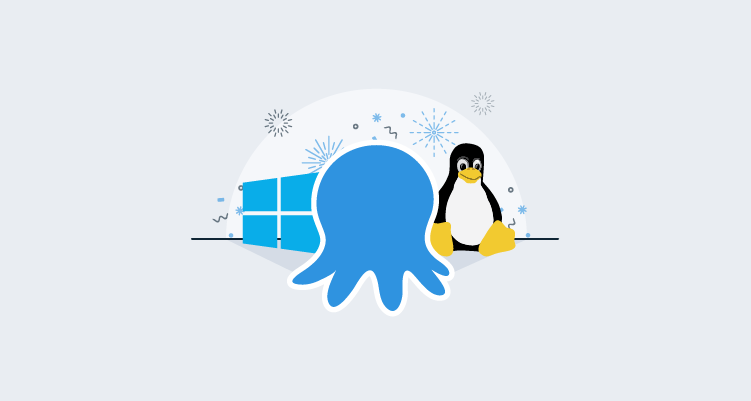

## Intro
While Octopus Deploy supports many types of deployment targets, the most common are Tentacles as they provide the most flexibility in the way they can be configured to communicate to the Octopus Server, the down side being they have been exclusive to Windows.

The existing approach for deploying to a Linux Target has been to configure them as SSH targets in Octopus, and while this approach is fine for most applications it does require that the target machine has an open SSH connection.
So how does a native Linux version of Tentacle solve this problem? Tentacles can be configured in Polling mode and in Polling mode a Tentacle will poll the Octopus server periodically to check if there are any tasks for it to perform. The advantage of a Polling Tentacle is that you don't need to make any firewall changes on the Tentacle side, you only need to allow access to a port on the Octopus server. This is where Tentacles have an advantage over SSH targets, you no longer need to have the SSH server running on your Linux targets, which for a lot of setups can pose serious security concerns.

We have been working hard away at bringing first class support to Linux deployment targets, and we are happy to announce public beta access to [Linux Tentacle](https://octopus.com/docs/infrastructure/deployment-targets/linux/tentacle). If you prefer to wait until the official release, you can keep an eye on this feature and others on our [roadmap](https://octopus.com/company/roadmap) page page as well as the ability to register for updates.

## Example Scenarios 1
Suppose that you are using Octopus Cloud for deploying your applications. You also have 1 or more Linux machines that require an application to be deployed to. with the current version of Octopus, your Linux targets would need to be running an SSH server that is publicly accessible over the internet. while SSH is considered to be one of the more secure remote access methods, it is still advisable that SSH is not open on a public network.
In this scenario configuring your Linux targets as SSH Targets is really the only option and due to security concerns, might not be possible.
Solution: Linux Tentacles! we can now setup the Linux Targets to run the Tentacle service and configure it to communicate to the Octopus Server in polling mode. Using this method we don't require that any inbound ports to be open, we only require that the Linux machine can communicate on a single outbound port (default 10943) and port 80 or 443 to access the Octopus Server web portal.

## Example Scenario 2
Another scenario where Polling Linux Tentacles have an advantage over SSH is if your Linux deployment targets have dynamic IP addresses or are behind a NAT gateway, as Octopus Server will require a valid IP address or DNS record for communicating to SSH deployment targets. In this scenario using a Polling Linux Tentacle will allow your Tentacles to actively poll the Octopus Server without the Octopus Server having to know anything about the IP address of Linux target.

## Linux Tentacle Beta Access
We are currently providing [public beta access](https://octopus.com/docs/infrastructure/deployment-targets/linux/tentacle) to Linux Tentacle. All the details on how to get started can be found on our docs page.
Currently we are building both DEB (Ubuntu/Debian) and RPM (CentOS/Fedora) packages, as well as .tar.gz archive for manual installations. Tentacle is built with .NET core 2.x, so if your version of Linux is [supported](https://docs.microsoft.com/en-us/dotnet/core/linux-prerequisites?tabs=netcore2x) you should be able to run Tentacle.

## Wrapping up
While SSH targets are still useful for a lot of scenarios, it has always felt that deploying to Linux has been slightly less feature rich than deploying to Windows. It has been the goal of this feature to bring all the same features to the Linux ecosystem that we already provide Windows. If you are interested in this feature you can register for updates on our [roadmap](https://octopus.com/company/roadmap) page.

