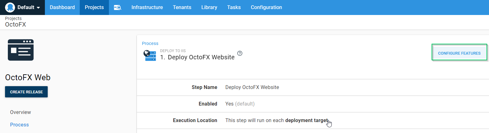
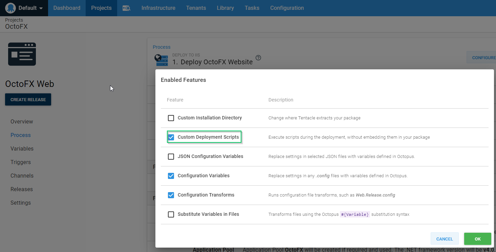
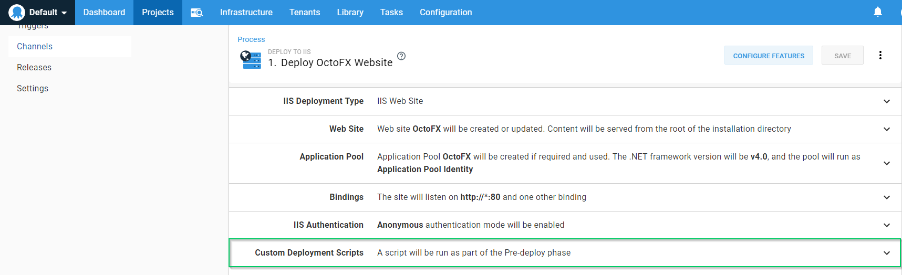

## Introduction
There is nothing worse than having surprises in a deployment process, heck that's one of the reasons Octopus Deploy exists!  To combat surprises, Octopus Deploy provides both consistency and reliability by ensuring the deployment process is always the same from environment to environment.  However, there is one thing that can change when deploying to different environments, Variables.  Since variables can be changed from one environment to the next, we need to check we've spelled them the same and scoped them accordingly. This post provides some examples of how to detect missing or unchanged variables in deployment steps.

## .NET .config Files
Values within a .config file often need to be different based on the environment where you software is being deployed, i.e., connection strings or app settings.  These .config files are often maintained by developers who may not have access to Octopus Deploy. In those cases, it's easy to miss updating or adding the variable, and the problem might not be noticed until the application is deployed to production.

### Check All App Settings
Any step template that offers the feature of Pre-Deployment scripts will work with this solution.  For this example, we're going to use the Deploy to IIS step template.  Once you've added a Deploy to IIS step to your process, click on the Configure Features button:



Next, enable the Custom Deployment Scripts feature:



Now, expand the Custom Deployment Scripts section of the step template:



Enter the following code into the Pre-deployment script window:

```PS
# Get the config file
$configFile = Get-ChildItem -Path $OctopusParameters['Octopus.Action.Package.InstallationDirectoryPath'] | Where-Object {$_.Name -eq "web.config"}

# Create FileMap object
$fileMap = New-Object System.Configuration.ExeConfigurationFileMap

# Set location of exe config file
$fileMap.ExeConfigFilename = $configFile.FullName

# Create Configuration Manager object
$configManager = [System.Configuration.ConfigurationManager]::OpenMappedExeConfiguration($fileMap, [System.Configuration.ConfigurationUserLevel]::None)

# Iterate through appSettings collection
foreach($appSetting in $configManager.AppSettings.Settings)
{
	# Check to see if key is present
    if (!$OctopusParameters.ContainsKey($appSetting.Key))
    {
    	# Fail the deployment
        throw "Octopus Parameter collection does not contain a value for $($appSetting.Key)"
    }
}
```

And that's it!  Now, before the step deploys, we check to make sure that all app setting keys are present in the Octopus parameters collection and fail the deployment if it's not found!

### What About Static App Settings?
Fantastic question!  The above example really only works when you have all of your app settings defined as Octopus Deploy variables.  There are plenty of cases where you have a static list of app settings that never change and it doesn't make sense to make them variables.  For this, we can still use the same approach, but tweak it to exclude a list of key values:

```PS
# Define array of app settings to ignore
$settingsToIgnore = @("somesetting", "someothersetting")

# Get the config file
$configFile = Get-ChildItem -Path $OctopusParameters['Octopus.Action.Package.InstallationDirectoryPath'] | Where-Object {$_.Name -eq "web.config"}

# Create FileMap object
$fileMap = New-Object System.Configuration.ExeConfigurationFileMap

# Set location of exe config file
$fileMap.ExeConfigFilename = $configFile.FullName

# Create Configuration Manager object
$configManager = [System.Configuration.ConfigurationManager]::OpenMappedExeConfiguration($fileMap, [System.Configuration.ConfigurationUserLevel]::None)

# Iterate through appSettings collection
foreach($appSetting in $configManager.AppSettings.Settings)
{
	# Check to see if key is present
    if ((!$OctopusParameters.ContainsKey($appSetting.Key)) -and ($settingsToIgnore -notcontains $appSetting.Key))
    {
    	# Fail the deployment
        throw "Octopus Parameter collection does not contain a value for $($appSetting.Key)"
    }
}
```
This version of the code will ignore any settings defined in the `$settingsToIgnore` array.  This way you ignore everything you don't care about, but catch anything new that might have been added.

## Substitute Variables in Files
Another common pain point when dealing with variables is the Substitute Variables in Files feature.  When using the Substitute Variables in Files feature, Octopus Deploy will only replace variable placeholders in files if it has a matching variable in the collection. If there wasn't a matching variable in the collection for a placeholder in a file, Octopus Deploy does not warn you.  As you can imagine, this can be quite problematic. 

Variable replacement occurs during the Deployment phase, so we're unable to use the Pre-deployment component in this case.  The good news is that the Deployment custom script executes just after Pre-deployment but before the step processes so we can still fail the deployment before the Deploy to IIS step swaps to the newly created folder (note, if you're using Custom Installation Directory, this may not work as expected).  Just like before, we'll expand the Custom Deployment Scripts section of the Deploy to IIS step and paste the following code in the Deployment script window:

```PS
function CheckSubstitutions($file)
{
    Write-Output "Verifying file $file"
   
    # Check to make sure file exists
    if ((Test-Path -Path "$file" -PathType leaf) -eq $true)
    {       
        # Read file
        $stringData = Get-Content -Path "$file" -Raw
        
        # Find placeholders
        $placeholders = [regex]::Matches($stringData, "(#{.*?})")

        # Check for token
        if ($placeholders.Count -gt 0)
        {
            # Something wasn't transformed
            throw "$file still contains #{} syntax. $placeholders"
        }
    }
    else
    {
        # Display message
        Write-Output "Unable to find file $file."
    }
}

# Get list of files that were specified for substitution
$fileList = $OctopusParameters['Octopus.Action.SubstituteInFiles.TargetFiles'].Split([Environment]::NewLine)

# Get base install path
$basePath = $OctopusParameters['Octopus.Action.Package.InstallationDirectoryPath']

# Ensure basePath ends with a \
if (!$basePath.EndsWith("\"))
{
	# Add ending slash
    $basePath += "\"
}

# Loop through list of files that were marked for substitution
foreach ($file in $fileList)
{
    if ($file -Match "\*")
    {
        Write-Output "$file contains wildcard. Get files by mask $($basePath + $file)"
        $files = Get-ChildItem -Path "$($basePath + $file)"

        foreach ($childFile in $files)
        {
            CheckSubstitutions($childFile)
        }
    }
    else 
    {
        CheckSubstitutions($($basePath + $file))
    }
}
```

And there you have it!  You can now proactively verify your files have their placeholders replaced with values!

## Conclusion
Scoping and misspelling will always plague the variables component of any automated deployment system.  The examples provided within this post should help mitigate commonly encountered issues.

Happy deployments!