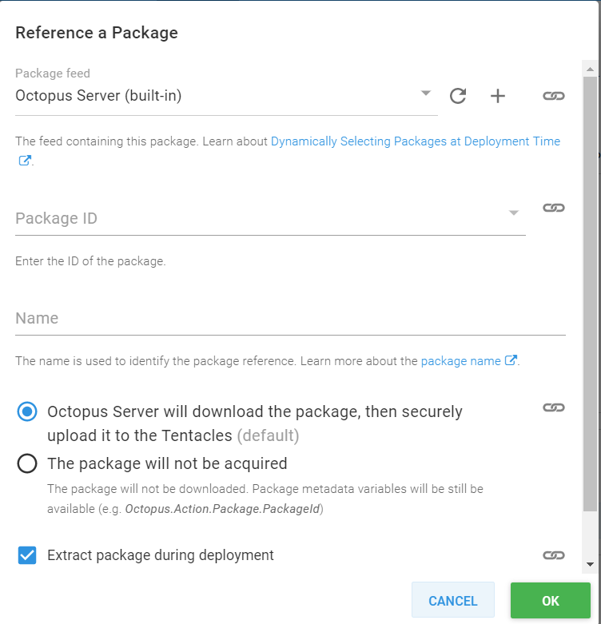
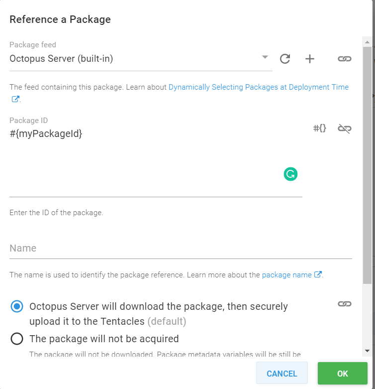

## Introduction

In September of 2018, Michael Richardson wrote a [blog post](https://octopus.com/blog/script-step-packages) introducing the feature of referencing packages within script steps.  The second scenario described in "Why?" explains that prior to this feature, you needed to push the package to a target first, then the script task could execute against what was extracted.  Michael goes on to explain that this method was both more complicated and wouldn't run on an Octopus server or a worker.

## Custom Step Templates

Using Michael's idea, just like the run a script step, we have the ability to reference a package from within a Custom Step Template




We also have the ability to make the referenced package dynamic by assigning the package ID to a parameter of our step template.



This allows us to reference the extracted package files and do something with them:

```PS
$OctopusParameters["Octopus.Action.Package[$myPackageId].ExtractedPath"]
```

## What About Specialized Software?

There are times when simply having the files available on a worker isn't enough to make them worker compatible such as deploying SSIS packages to a SQL server.  The worker will have the .ispac file available to it, but it doesn't have the software installed to know what to do with it.  One way to solve this is to install the software on all of your workers.  This adds complexity in that all of your workers need to be maintained to make sure the right version of the software is installed and/or updated. Another method is to make use of the PowerShell Gallery to install the necessary PowerShell modules at deploy-time. For the SSIS example, the SqlServer module in the PowerShell Gallery contains the necessary .dlls needed to allow a worker to deploy the .ispac to SQL server.

:::warning
The following scripts are provided for demonstration purposes.
:::

Using the following code, we can check to see if the worker has the necessary modules installed.  If the module is not available, download the specified version (latest if not specified) to a temporary folder and include it so that the cmdlets are available.

First, create our temporary folder within the current work folder:

```PS
# Define PowerShell Modules path
$LocalModules = (New-Item "$PSScriptRoot\Modules" -ItemType Directory -Force).FullName
```

Next, we'll add this folder to the PowerShell Module Path for this session:

```PS
# Add folder to the PowerShell Modules Path
$env:PSModulePath = "$LocalModules;$env:PSModulePath"
```

Now, let's define a function that will check to see if the module is installed:

```PS
function Get-ModuleInstalled
{
    # Define parameters
    param(
        $PowerShellModuleName
    )

    # Check to see if the module is installed
    if ($null -ne (Get-Module -ListAvailable -Name $PowerShellModuleName))
    {
        # It is installed
        return $true
    }
    else
    {
        # Module not installed
        return $false
    }
}
```

And then a function that will install it if it's missing:

```PS
function Install-PowerShellModule
{
    # Define parameters
    param(
        $PowerShellModuleName,
        $LocalModulesPath
    )

    # Save the module in the temporary location
    Save-Module -Name $PowerShellModuleName -Path $LocalModulesPath -Force

    # Display
    Write-Output "Importing module $PowerShellModuleName ..."

    # Import the module
    Import-Module -Name $PowerShellModuleName
}
```

Lastly, we'll define a function that will load the .dll(s) so their namespaces can be used:

:::warning
If using this for the SqlServer module, you'll next to add an Exclude to the Get-ChildItem:

`Get-ChildItem -Path $ModulePath -Exclude msv*.dll`
:::

```PS
Function Load-Assemblies
{
    # Declare parameters
    param(
        $PowerShellModuleName
    )

    # Get the folder where the module ended up in
    $ModulePath = [System.IO.Path]::GetDirectoryName((Get-Module $PowerShellModuleName).Path)

    # Loop through the assemblies
    foreach($assemblyFile in (Get-ChildItem -Path $ModulePath | Where-Object {$_.Extension -eq ".dll"}))
    {
        # Load the assembly
        [Reflection.Assembly]::LoadFile($assemblyFile.FullName) | Out-Null
    }    
}
```

Once those are defined, call our functions and install if necessary:

```PS
# Check to see if SqlServer module is installed
if ((Get-ModuleInstalled -PowerShellModuleName "SqlServer") -ne $true)
{
	# Display message
    Write-Output "PowerShell module SqlServer not present, downloading temporary copy ..."

    # Download and install temporary copy
    Install-PowerShellModule -PowerShellModuleName "SqlServer" -LocalModulesPath $LocalModules

    # Dependent assemblies
    Load-Assemblies -PowerShellModuleName "SqlServer"
}
else
{
    # Load the IntegrationServices Assembly
    [Reflection.Assembly]::LoadWithPartialName("Microsoft.SqlServer.Management.IntegrationServices") | Out-Null # Out-Null supresses a message that would normally be displayed saying it loaded out of GAC
}
```
For our SSIS example, our worker now has the necessary components available to it to deploy the .ispac file!

## Summary
In this post, we learned how to reference a package from a custom step template, make the package ID reference dynamic by making it a step template parameter, and dynamically download and install PowerShell modules to make worker friendly templates.
