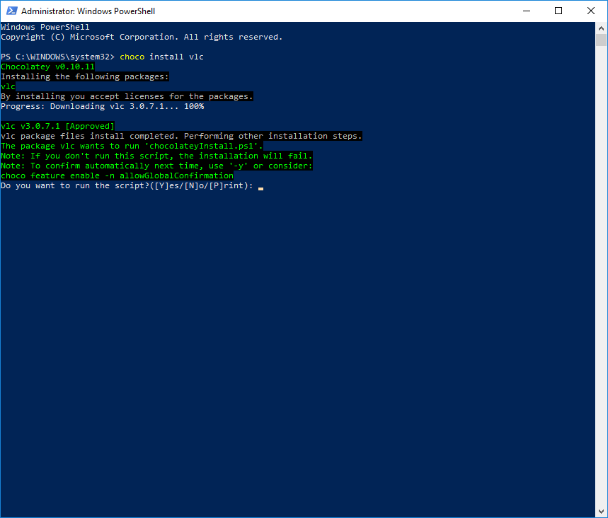
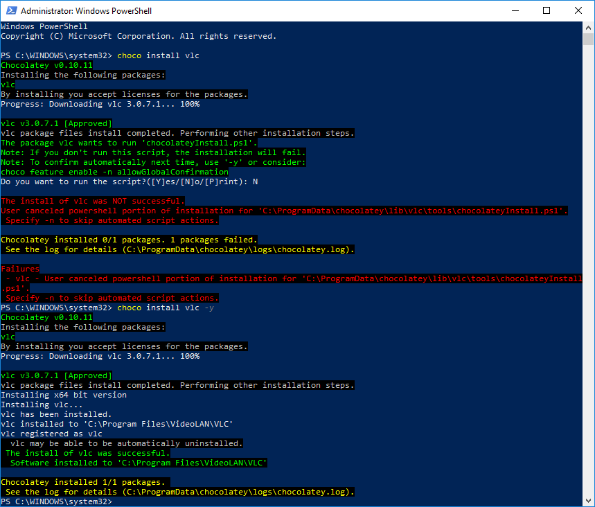
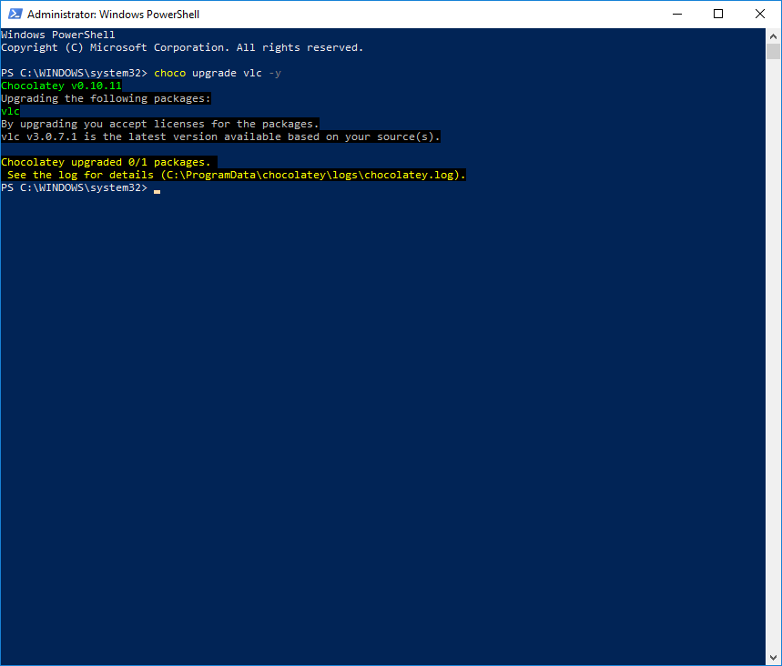

Back when I was at university, I would reinstall Windows every six months or so.  I went to university back in the days of Windows 9x/ME.  It seemed everyone, from websites to TechTV, recommended doing that.  I loved that feeling of a clean install.  No applications are slowing down my machine's start-up.  After I got a fresh install of Windows, I would then spend the rest of the night reinstalling all my favorite applications.  Flash-forward to today, and it seems like not a lot has changed.  Quite often, the first day of a new development job is spent installing and configuring various applications.  Much time is wasted performing a Google search and manually downloading each application.  

However, this is 2019, so much has changed since I was in university.  In this case, the advent of [Chocolatey.org](https://chocolatey.org/).  Chocolatey has allowed me to go from a fresh install of Windows to an available machine in around 30 minutes.  Of course, sans Windows Update.  This post will go through how I landed on using Chocolatey, how I use it to set up a development machine and other potential uses for it.

!toc

## Why Chocolatey?

I've worked for a variety of companies before joining Octopus Deploy.  Every one of them ran into the same question: how to get developers going quickly?  The proposed solutions always fell into one of two buckets: a developer images or a heavy-handed tool such as SCCM.  

The first bucket contained the developer image.  People talked about developer images like it was going to cure cancer.  Hard drive crashed?  No worries,  swap out the hard drive, use the image, and the developer is up and running in under an hour.  Is a new developer going to start?  Order a new laptop, install the image, and the developer won't have to set up anything.  They'll be ready to go before they walk in the door.

Okay...cool.  Fun fact, developer tools release new versions all the time.  It feels like a week hasn't gone by without Visual Studio bugging me to update to the latest version.  Who is going to maintain that image?  How often is that image going to be updated?  What ended up happening with the image is the developers ended up spending more time updating and uninstalling old tools that it actually slowed them down.  It made a lot more sense for a core Windows image, with the latest patches, to be created and let the developers go from there. 

The second bucket contains heavy-handed tools such as [SCCM](https://docs.microsoft.com/en-us/sccm/apps/deploy-use/deploy-applications).  The tools I've used have a web interface where I selected the software I wanted to install on my machine, which sounds great.  Until you see your favorite tool missing or the version on the list is three years old.  Adding it to the list involved multiple steps and, in some cases, approvals.  Do you want to install Visual Studio Code?  Cool, that will take several hours to make its way through the bureaucracy.  The list is never updated because developers take the path of least resistance.  Why fight through bureaucracy when it takes less than 10 minutes to download and install the latest version?  Tools like SCCM work great for non-developer machines.  Alternatively, when everyone has to have a standard package of software such as a specific version of Microsoft Office.

Chocolatey falls outside of those two buckets described above.  If you are a .NET developer, then you should be familiar with NuGet.  Chocolatey is NuGet for Windows.  If Linux is your preferred OS, then Chocolatey is the package manager, such as apt or RPM.  It falls outside of those two buckets because it is light-weight, a quick script to install it, and it installs the latest version of a package by default.  It will also install any dependencies the package will need, such as a hotfix or another package.  A package in Chocolatey wraps an MSI.  It could be an Octopus Tentacle, Visual Studio, or the .NET Core SDK.  

## Getting Started

First, you need to install Chocolatey.  You can do that by running the scripts [found here](https://chocolatey.org/install).  After you do that, you can start using Chocolatey to install applications.  You can find which applications are available by going to the [Chocolatey Package page](https://chocolatey.org/packages).  I don't have VLC installed on my computer, so I will install that by typing in `choco install vlc.`  Doing so causes a prompt to appear.



That prompt is kind of annoying.  However, it does tell me I can avoid that by including the `-y` switch in my command.  Let's cancel this and then retry with the `-y` switch.



Now I have VLC installed on my machine.  If I wanted to update it, I need to run the command `choco upgrade vlc -y.`  As you can see, because I just installed it, I have the latest version.



## Automating Development Machine Setup

When I first started using Chocolatey, my PowerShell knowledge was lacking.  So my scripts looked something like this:

```PowerShell
Write-Host "Installing Google Chrome"
choco install googlechrome -y

Write-Host "Installing Firefox"
choco install firefox -y

Write-Host "Installing Redis"
choco install redis-64 -y

Write-Host "Installing 7-zip"
choco install 7zip -y
```

For a few packages, copy/pasting commands isn't too bad.  For 20+ packages, copy/pasting the same command gets old pretty fast.  What I'd like to do is put all those applications into a comma-separated list at the top and tear through that list.

```PowerShell
$chocolateyAppList = "googlechrome,firefox,redis-64,7zip,dotnetcore-sdk,dotnetcore-windowshosting"
if ([string]::IsNullOrWhiteSpace($chocolateyAppList) -eq $false){   
    Write-Host "Chocolatey Apps Specified"  
    
    $appsToInstall = $chocolateyAppList -split "," | foreach { "$($_.Trim())" }

    foreach ($app in $appsToInstall)
    {
        Write-Host "Installing $app"
        & choco install $app /y
    }
}
```

### Windows Features

If you are a web developer for Windows, there is an excellent chance you will need IIS installed on your machine.  IIS is not an MSI, but a Windows feature.  The good news is that Chocolatey can install those as well.  It does this by leveraging what is known as [DISM, or Deployment Imaging Service Management](https://docs.microsoft.com/en-us/windows-hardware/manufacture/desktop/what-is-dism).  

To find out what features are available to you, you can run the command `Dism /online /Get-Features.`


The command to install DISM features through Chocolatey is `choco install [Feature Name] /y /source windowsfeatures`, for example, `choco install IIS-ManagementService -y -source windowsfeatures`

Using the same logic as above, we can include DISM features in our script.

```PowerShell
$dismAppList = "IIS-ASPNET45,IIS-CertProvider,IIS-ManagementService"

if ([string]::IsNullOrWhiteSpace($dismAppList) -eq $false){
    Write-Host "DISM Features Specified"    

    $appsToInstall = $dismAppList -split "," | foreach { "$($_.Trim())" }

    foreach ($app in $appsToInstall)
    {
        Write-Host "Installing $app"
        & choco install $app /y /source windowsfeatures | Write-Output
    }
}
```

### Visual Studio and other missing applications

At the time of this writing, the latest version of Visual Studio in Chocolatey is Visual Studio 2017.  Visual Studio 2019 came out in April of 2019.  The lack of the latest Visual Studio highlights the one weakness of the Chocolatey public repository. You are at the mercy of the company who creates the app to create the package or someone from the community to update the package.  However, you do have the ability to [create your own packages](https://chocolatey.org/docs/create-packages).  You can even set up an [internal repository](https://chocolatey.org/docs/how-to-host-feed) (just like you can with NuGet packages).  Internal repositories are free, but consider [purchasing Chocolatey](https://chocolatey.org/pricing) for your team and/or company.  

### Creating a re-usable script

So far, all the script examples had hardcoded variable values for a small team or company that works fine. As more teams use this, you need to provide some flexibility.  I've seen several situations where .NET teams in the same company use a different toolset due to the applications they work on.  One team might need WIX for a Windows Form application while another team only works on Angular Websites with ASP.NET WebApi back ends.  The script should accept parameters.

Another thing to consider is we don't know when the script will be run, and if the person running it already has Chocolatey installed.  The script should be able to handle that scenario and install Chocolatey if needed.

```PowerShell
Param(    
    [string]$chocolateyAppList,
    [string]$dismAppList    
)

if ([string]::IsNullOrWhiteSpace($chocolateyAppList) -eq $false -or [string]::IsNullOrWhiteSpace($dismAppList) -eq $false)
{
    try{
        choco config get cacheLocation
    }catch{
        Write-Output "Chocolatey not detected, trying to install now"
        iex ((New-Object System.Net.WebClient).DownloadString('https://chocolatey.org/install.ps1'))
    }
}

if ([string]::IsNullOrWhiteSpace($chocolateyAppList) -eq $false){   
    Write-Host "Chocolatey Apps Specified"  
    
    $appsToInstall = $chocolateyAppList -split "," | foreach { "$($_.Trim())" }

    foreach ($app in $appsToInstall)
    {
        Write-Host "Installing $app"
        & choco install $app /y | Write-Output
    }
}

if ([string]::IsNullOrWhiteSpace($dismAppList) -eq $false){
    Write-Host "DISM Features Specified"    

    $appsToInstall = $dismAppList -split "," | foreach { "$($_.Trim())" }

    foreach ($app in $appsToInstall)
    {
        Write-Host "Installing $app"
        & choco install $app /y /source windowsfeatures | Write-Output
    }
}
```

We can now have a script per team specifying the applications to install.  

```PowerShell
$chocolateyAppList = "googlechrome,firefox,redis-64,7zip,dotnetcore-sdk,dotnetcore-windowshosting"
$dismAppList = "IIS-ASPNET45,IIS-CertProvider,IIS-ManagementService"

Invoke-Expression "InstallApps.ps1 ""$chocolateyAppList"" ""$dismAppList"""
```

## Additional Usage

Take a look at the above PowerShell scripts and answer this question, is there anything development machine-specific to those scripts?  There's not.  Now that is an interesting thought, as you can use that script to bootstrap Windows Server machines, not just development machines.  That thought raises the next question, why do that over creating an image or using a tool such as DSC?  Portability and ease of configuration.  

Just like developer machines, servers also have different applications which need to be installed.  Attempting to create "one image to rule them all" isn't feasible.  It's much easier to use a core Windows image with the latest patches and install the necessary applications onto that.  Or, if you are using a cloud provider, use one of the Windows images provided.  

You can use Chocolatey and DSC together.  Or you can use just one tool.  I prefer to use Chocolatey over DSC.  The [learning curve for DSC](https://www.red-gate.com/simple-talk/sysadmin/powershell/powershell-desired-state-configuration-the-basics/) is much steeper than Chocolatey.  But it is also much more powerful.  My advice, look at the tools available and see which one makes the most sense.  

My team creates and destroys our demo infrastructure each day.  At 2 AM CDT, the infrastructure comes online.  At 9 PM CDT the infrastructure is destroyed.  We are standing up servers, installing the needed components using Chocolatey, and installing tentacles to get the latest code.  The server isn't going to live for a long time; I don't need the overhead of DSC.  

## Conclusion

Prior to this, when I would get a new machine, I would spend an hour or so installing Windows updates and then several hours downloading and installing my favorite applications.  It was not uncommon to waste a couple of evenings or a whole day doing that.  Now that ratio has flipped.  I still have to spend an hour or so installing Windows updates, but now I kick off the PowerShell script, and about a half-hour later I am ready to roll.  Now my only hassle is keeping my Chocolatey application list up to date.