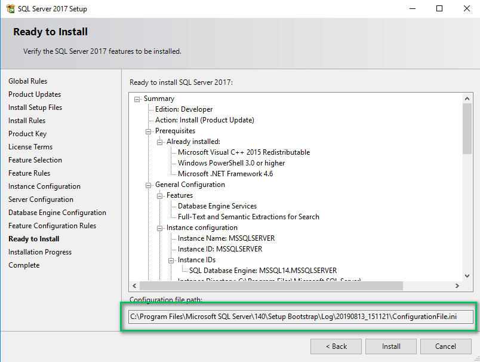

A few years ago, I worked at a company that made a big push to automate database deployments using Redgate's tooling. We opted for the dedicated database model, rather than the shared database model, which meant the 100+ developers at the company all had to install SQL Server Developer on their laptops.

My team was the first to adopt the new tooling. At first, we tried going through each screen in the installation wizard together to ensure a similar setup, but that wasn't going to scale to 100+ developers, and we didn't want to repeat that process every time a new developer joined the organization.

Thankfully, you can install SQL Server using the command line. [Microsoft's documentation](https://docs.microsoft.com/en-us/sql/database-engine/install-windows/install-sql-server-from-the-command-prompt?view=sql-server-2017) provides a good starting point, but there's a lot to digest in that documentation. It took me quite a bit of time to get everything working to our standards, but in the end, it was worth the effort and removed a lot of potential headaches.

At Octopus, I recently watched one of our senior engineers sit with a new engineer to help them set up their system.  They walked through the GUI to select which options to choose when they installed SQL Server on his machine.

This post provides a working example with PowerShell, that automates installing SQL Server Developer to make the process of onboarding new team members smoother.

!toc

## Download the SQL Server Developer ISO

First, you need to download the [SQL Server Developer ISO](https://www.microsoft.com/en-us/sql-server/sql-server-downloads). When the download has finished, run the .exe file and select the `Download Media` option to download the .iso file.


I recommend putting that .iso in a shared directory on your network. That way, you can make a standard PowerShell install file for everyone to use.

## SQL server GUI installer

I recommend going through the GUI installer and setting the options you want everybody on the team to use, but don't install SQL Server using the GUI. The reason for doing this is the installer creates a `ConfigurationFile.ini` as you go through the installation, and it tells you the location of the file.



Copy the `ConfigurationFile.ini` file from that directory to a new location. That will be the *master* copy of the file for others to use.

## Modify the ConfigurationFile.ini file

We need to modify the *master* `ConfigurationFile.ini` so that it can work through the command line.

First, change quiet mode switch to `true` and delete the UIMode entry.

The old Configuration File:

```
QUIET="False"

; Setup will display progress only, without any user interaction.

QUIETSIMPLE="False"

; Parameter that controls the user interface behavior. Valid values are Normal for the full UI,AutoAdvance for a simplied UI, and EnableUIOnServerCore for bypassing Server Core setup GUI block.

UIMODE="Normal"

; Specify whether SQL Server Setup should discover and include product updates. The valid values are True and False or 1 and 0. By default SQL Server Setup will include updates that are found.
```

The updated Configuration File:

```
QUIET="True"

; Setup will display progress only, without any user interaction.

QUIETSIMPLE="False"

; Parameter that controls the user interface behavior. Valid values are Normal for the full UI,AutoAdvance for a simplied UI, and EnableUIOnServerCore for bypassing Server Core setup GUI block.
```

Next, add `IACCEPTSQLSERVERLICENSETERMS="True"`. I added mine toward the top of the file:

```
;SQL Server 2017 Configuration File
[OPTIONS]

IACCEPTSQLSERVERLICENSETERMS="True"
```

Next, we need to update the current user account, which is set to admin on the instance. As you can see, the file shows my current user:

```
; Windows account(s) to provision as SQL Server system administrators.

SQLSYSADMINACCOUNTS="HOME\bob.walker"

; The default is Windows Authentication. Use "SQL" for Mixed Mode Authentication.

SECURITYMODE="SQL"
```

That means anyone who uses this will have me as the admin. Thankfully, we are running this through PowerShell, so we can replace some text with the current user before running the installer.

```
; Windows account(s) to provision as SQL Server system administrators.

SQLSYSADMINACCOUNTS="##MyUser##"

; The default is Windows Authentication. Use "SQL" for Mixed Mode Authentication.

SECURITYMODE="SQL"
```

Finally, if we look at the bottom of the file, we can see that TCP and Named Data Pipes are disabled:

```
; Specify 0 to disable or 1 to enable the TCP/IP protocol.

TCPENABLED="0"

; Specify 0 to disable or 1 to enable the Named Pipes protocol.

NPENABLED="0"

; Startup type for Browser Service.

BROWSERSVCSTARTUPTYPE="Automatic"
```

On my development machine, I like to enable TCP and Named Pipes. Doing so makes my life a lot easier, especially when trying to get .NET to connect to it. For my configuration, I opt for mix mode authentication, which means I need to add an SA Password. By default, the installer sets SQL Server to use integrated security only. My personal preference is to have both modes enabled for my development machine. If you opt to keep only integrated security, then you don't have to add an SA Password:

```
; Specify 0 to disable or 1 to enable the TCP/IP protocol.

TCPENABLED="1"

; Specify 0 to disable or 1 to enable the Named Pipes protocol.

NPENABLED="1"

; Startup type for Browser Service.

BROWSERSVCSTARTUPTYPE="Automatic"

; SQL Password

SAPWD="CHANGE THIS PASSWORD"
```

That was a lot of changes. To see a complete sample file, please go to the GitHub repo where you'll see the sample [ConfigurationFile.ini]](https://github.com/OctopusSamples/SQLServerInstall/blob/master/ConfigurationFile.ini) file created for this blog post.

## PowerShell script

In this example, we are going to run the installer from PowerShell. PowerShell gives us a lot of control over what is happening and provides some helpful built-in commands to mount and dismount ISO files.

We want the PowerShell script to:

1. Copy the master `ConfigurationFile.ini` to a temp location.
2. Replace ##MyUser## with the current user in the cloned `ConfigurationFile.ini`.
3. Mount the image.
4. Run the installer.
5. Capture the output from the installer and write it to the shell.
6. Dismount the image.

**Please Note**: The PowerShell script is going to run an installer. As such, you must run this script as an admin.

```PowerShell

$isoLocation = ## Put the location here
$pathToConfigurationFile = ## Path to original file here
$copyFileLocation = "C:\Temp\ConfigurationFile.ini"
$errorOutputFile = "C:\Temp\ErrorOutput.txt"
$standardOutputFile = "C:\Temp\StandardOutput.txt"

Write-Host "Copying the ini file."

New-Item "C:\Temp" -ItemType "Directory" -Force
Remove-Item $errorOutputFile -Force
Remove-Item $standardOutputFile -Force
Copy-Item $pathToConfigurationFile $copyFileLocation -Force

Write-Host "Getting the name of the current user to replace in the copy ini file."

$user = "$env:UserDomain\$env:USERNAME"

write-host $user

Write-Host "Replacing the placeholder user name with your username"
$replaceText = (Get-Content -path $copyFileLocation -Raw) -replace "##MyUser##", $user
Set-Content $copyFileLocation $replaceText

Write-Host "Mounting SQL Server Image"
$drive = Mount-DiskImage -ImagePath $isoLocation

Write-Host "Getting Disk drive of the mounted image"
$disks = Get-WmiObject -Class Win32_logicaldisk -Filter "DriveType = '5'"

foreach ($disk in $disks){
 $driveLetter = $disk.DeviceID
}

if ($driveLetter)
{
 Write-Host "Starting the install of SQL Server"
 Start-Process $driveLetter\Setup.exe "/ConfigurationFile=$copyFileLocation" -Wait -RedirectStandardOutput $standardOutputFile -RedirectStandardError $errorOutputFile
}

$standardOutput = Get-Content $standardOutputFile -Delimiter "\r\n"

Write-Host $standardOutput

$errorOutput = Get-Content $errorOutputFile -Delimiter "\r\n"

Write-Host $errorOutput

Write-Host "Dismounting the drive."

Dismount-DiskImage -InputObject $drive

Write-Host "If no red text then SQL Server Successfully Installed!"
```

## Post installation

After running the script, you will have a fresh install of SQL Server Developer Edition. Next, you need to decide what will create the databases your applications will connect to, and depending on the authentication mode, what should create the database users? If your applications create an empty database if they can't find an existing database, you can skip the next section.

For everyone else, your PowerShell script needs to create empty databases and users. Depending on the database deployment tooling you are using, you might be able to automate the creation of the schema. I can't provide scripts for every database deployment tool, but I can provide scripts to create databases, user accounts, and assign that user to the newly created databases. You can find those scripts in the sample GitHub repo for this blog post:

- [Create Database](https://github.com/OctopusSamples/SQLServerInstall/blob/master/CreateDatabase.ps1)
- [Create SQL Account](https://github.com/OctopusSamples/SQLServerInstall/blob/master/CreateSQLAccount.ps1)
- [Create Database User and Assign them a role](https://github.com/OctopusSamples/SQLServerInstall/blob/master/CreateDatabaseUserAndAssignRole.ps1)

## Troubleshooting

The installer output is very verbose. If something fails, be prepared to scroll through the output to find out why the failure occurred. The good news is the installer is very good at letting you know what went wrong.

If for some reason, the PowerShell script doesn't output the install log, then you will need to find it. Typically it is found at `C:\Program Files\Microsoft SQL Server\[Version]\Setup Bootstrap\Log\[DateTimeStamp]\`. That path is dependent on the version you are installing and if Microsoft has changed the log file destination. The version is the internal version number. For instance, SQL Server 2017 is Version 14 of SQL Server.

## Lessons learned

Now you should have a fully automated install of SQL Server for your developers to run.  Before ending this post, I wanted to share some lessons I learned after I handed this script over to developers.

The first lesson is how important realistic expectations are. For the most part, the script ran correctly the first time; this was particularly true for fresh installs of Windows. There seemed to be a direct correlation between the age of the computer and the number of problems I saw when running this script. Some developers already had an older version of SQL Server installed, and others had a strange setup with a D:\ drive where they installed apps.  

This leads me to my second lesson. I wanted to help the developers who ran into issues as much as I could, and I spent time researching and altering the script to cover a lot of different scenarios.  Eventually, I realized some developers' machines had such unique configuration, it didn't make sense spending the time and effort to update the script to solve it. To account for that, I provided documentation on which options to select, and if I needed to, I'd sit with the developer and walk them through the GUI. Thankfully this was only the case for a handful of developers.  

## Conclusion

Even with some of the issues we ran into, the installation was successful. We rolled this out across the company in a few weeks, and 80% of the developers had something working in less than 20 minutes. In the end, it was worth it, and we standardized our configuration and provided an automated way to install SQL Server Developer.
