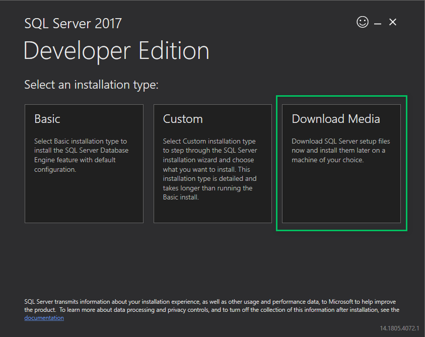

A few years ago, before joining Octopus Deploy, I had a bit of a problem on my hands. The company I was working for at the time was making a big push to automate database deployments using Redgate's tooling. We opted for the dedicated database model, rather than the shared database model. That meant one thing, every developer (100+) had to install SQL Server Developer on their laptop. My team was the first group to adopt the new tooling. Which meant we had to blaze a trail on getting SQL Server Developer installed. The first attempt...left a lot to be desired. I booked a meeting, and we all went through each screen in the installation wizard to ensure a similar setup. That wasn't going to scale to 100+ developers. And what is going to happen when we add new developers to the organization or even my team? 

That is when I discovered it was possible to install SQL Server using the command line. [Microsoft's documentation](https://docs.microsoft.com/en-us/sql/database-engine/install-windows/install-sql-server-from-the-command-prompt?view=sql-server-2017) provides a good starting point. However, let's face it; there is a lot to digest in that documentation. It took me quite a bit of time to get everything working to our standards. 

If that all happened a few years ago, why write about it now? I work for a different company now. Well, a funny thing happened recently. I watched one of our senior engineers sit with a new engineer to help them get set up.  He walked the new engineer through the GUI to have him select what options to choose on how to install SQL Server on his machine. I had to solve that a few years ago. I should write something up to help out new hires to make our onboarding smoother. Someone suggested to me, why not make that a blog post?

The goal of this blog post is to provide a working example using PowerShell from that documentation you can use. My hope is you can learn from my mistakes and get something working a lot quicker.

!toc

## Downloading the SQL Server Developer ISO

First up, we need to download the SQL Server Developer ISO. You can do that by going to [this site](https://www.microsoft.com/en-us/sql-server/sql-server-downloads). In the likely event that link is no longer valid, please use Google or your search engine of choice to find the ISO. SQL Developer is free, so it should be easy to find.

If you use the download link for SQL Developer from the above website, you'll download a .exe. When you run the .exe, you will be presented with three choices. Choose the `Download Media` option to download the .iso file. 



I recommend putting that .iso in a shared directory on your network. That way you can make a standard PowerShell install file everyone can use. 

## SQL Server GUI Installer

To get started on the command line, you first have to learn SQL Server GUI Installer. It seems strange to begin with that. Typically you learn the command line; then you learn the GUI. However, there are so many options to install SQL Server, that the GUI makes them easier to digest.

One blink and you'll miss it feature of the GUI installer is the fact it creates a ConfigurationFile.ini as you are going through it. The installer also tells you the location of the file. 


My recommendation is to go through the installer and set all the various options you want everyone on your team/organization/division/company to use. Don't install SQL Server using the GUI though. Copy the ConfigurationFile.ini file from that directory to a new location. That will be the "master" copy of the file for others to use. 

## Modifying the ConfigurationFile.ini file

We will need to modify the "master" ConfigurationFile.ini for it to work through the command line. 

First, change quiet mode switch to true and delete the UIMode entry. 

Old Configuration File:
```
QUIET="False"

; Setup will display progress only, without any user interaction. 

QUIETSIMPLE="False"

; Parameter that controls the user interface behavior. Valid values are Normal for the full UI,AutoAdvance for a simplied UI, and EnableUIOnServerCore for bypassing Server Core setup GUI block. 

UIMODE="Normal"

; Specify whether SQL Server Setup should discover and include product updates. The valid values are True and False or 1 and 0. By default SQL Server Setup will include updates that are found. 
```

Updated Configuration File:
```
QUIET="True"

; Setup will display progress only, without any user interaction. 

QUIETSIMPLE="False"

; Parameter that controls the user interface behavior. Valid values are Normal for the full UI,AutoAdvance for a simplied UI, and EnableUIOnServerCore for bypassing Server Core setup GUI block. 
```

Next, add IACCEPTSQLSERVERLICENSETERMS="True" to the file. I added mine towards the top of the file.

```
;SQL Server 2017 Configuration File
[OPTIONS]

IACCEPTSQLSERVERLICENSETERMS="True"
```

Next up is updating the current user account, which is set to be an admin on the instance. As you can see, the file shows my current user.

```
; Windows account(s) to provision as SQL Server system administrators. 

SQLSYSADMINACCOUNTS="HOME\bob.walker"

; The default is Windows Authentication. Use "SQL" for Mixed Mode Authentication. 

SECURITYMODE="SQL"
```

Well, that is no good. That means anyone who uses that will have me as the admin. Thankfully, we are going to be running this through PowerShell. Meaning we can replace some text with the current user before running the installer. 

```
; Windows account(s) to provision as SQL Server system administrators. 

SQLSYSADMINACCOUNTS="##MyUser##"

; The default is Windows Authentication. Use "SQL" for Mixed Mode Authentication. 

SECURITYMODE="SQL"
```

Finally, if we look at the bottom of the file, we will see that TCP and Named Data Pipes is disabled. Also, the file doesn't include the SA Password. Fun fact, if you don't provide the SA Password during the install, it will fail. 

```
; Specify 0 to disable or 1 to enable the TCP/IP protocol. 

TCPENABLED="0"

; Specify 0 to disable or 1 to enable the Named Pipes protocol. 

NPENABLED="0"

; Startup type for Browser Service. 

BROWSERSVCSTARTUPTYPE="Automatic"
```

On my development machine, I like to enable TCP and Named Pipes. Doing so makes my life a lot easier, especially when trying to get .NET to connect to it. For my configuration I opted for mix mode authentication, which means I need to add in a SA Password.  By default, the installer sets SQL Server to use integrated security only.  My personal preference is to have both modes enabled for my development machine.  If you opt to keep integrated security only then you won't have to worry about an SA Password.

```
; Specify 0 to disable or 1 to enable the TCP/IP protocol. 

TCPENABLED="1"

; Specify 0 to disable or 1 to enable the Named Pipes protocol. 

NPENABLED="1"

; Startup type for Browser Service. 

BROWSERSVCSTARTUPTYPE="Automatic"

; SQL Password

SAPWD="CHANGE THIS PASSWORD"
```

That was a lot of changes I threw at you. To see a complete sample file, please go to the [GitHub repo](https://github.com/OctopusSamples/SQLServerInstall/blob/master/ConfigurationFile.ini) created for this blog post. 

## PowerShell Script

In this example, we are going to be running the installer from PowerShell. PowerShell gives a lot of control over what is happening and provides some helpful built-in commands to mount and dismount ISO files.

What we want the PowerShell script to do is:

1) Copy the master ConfigurationFile.ini to a temp location
2) Replace ##MyUser## with the current user in the cloned ConfigurationFile.ini
3) Mount the image
4) Run the installer
5) Capture the output of the installer and write it to the shell
6) Dismount the image

**Please Note:** The PowerShell script is going to be running an installer. As such, you must run this script as an admin.

```PowerShell

$isoLocation = ## Put the location here
$pathToConfigurationFile = ## Path to original file here
$copyFileLocation = "C:\Temp\ConfigurationFile.ini"
$errorOutputFile = "C:\Temp\ErrorOutput.txt"
$standardOutputFile = "C:\Temp\StandardOutput.txt"

Write-Host "Copying the ini file."

New-Item "C:\Temp" -ItemType "Directory" -Force 
Remove-Item $errorOutputFile -Force
Remove-Item $standardOutputFile -Force
Copy-Item $pathToConfigurationFile $copyFileLocation -Force

Write-Host "Getting the name of the current user to replace in the copy ini file." 

$user = "$env:UserDomain\$env:USERNAME"

write-host $user

Write-Host "Replacing the placeholder user name with your username"
$replaceText = (Get-Content -path $copyFileLocation -Raw) -replace "##MyUser##", $user
Set-Content $copyFileLocation $replaceText

Write-Host "Mounting SQL Server Image"
$drive = Mount-DiskImage -ImagePath $isoLocation 

Write-Host "Getting Disk drive of the mounted image"
$disks = Get-WmiObject -Class Win32_logicaldisk -Filter "DriveType = '5'"

foreach ($disk in $disks){
 $driveLetter = $disk.DeviceID
}

if ($driveLetter)
{
 Write-Host "Starting the install of SQL Server"
 Start-Process $driveLetter\Setup.exe "/ConfigurationFile=$copyFileLocation" -Wait -RedirectStandardOutput $standardOutputFile -RedirectStandardError $errorOutputFile
}

$standardOutput = Get-Content $standardOutputFile -Delimiter "\r\n"

Write-Host $standardOutput

$errorOutput = Get-Content $errorOutputFile -Delimiter "\r\n"

Write-Host $errorOutput

Write-Host "Dismounting the drive."

Dismount-DiskImage -InputObject $drive

Write-Host "If no red text then SQL Server Successfully Installed!"
```

## Post Installation

After running that script you should have a fresh install of SQL Server Developer Edition.  Which is great, but applications typically like to have databases to connect to.  This raises an interesting question, what should create those databases?  And depending on the authentication mode, what should create the database users?  I've seen it where the application itself will create an empty database if it can't find one.  If that is what your applications are doing, awesome.  You can skip to the next section.  For everyone else, your PowerShell script will need to create empty databases and users.  Depending on the database deployment tooling you are using, you might be able to automate the creation of the schema.  I can't provide scripts for every database deployment tool, but I can provide scripts to create databases, user accounts, and assign that user to newly created databases.  You can find those scripts in the sample GitHub repo for this blog post.

- [Create Database](https://github.com/OctopusSamples/SQLServerInstall/blob/master/CreateDatabase.ps1)
- [Create SQL Account](https://github.com/OctopusSamples/SQLServerInstall/blob/master/CreateSQLAccount.ps1)
- [Create Database User and Assign them a role](https://github.com/OctopusSamples/SQLServerInstall/blob/master/CreateDatabaseUserAndAssignRole.ps1)

## Troubleshooting

The installer output is very verbose. Prepare yourself for that. If something fails, you will need to scroll through it to find out why the failure occurred. The good news is the installer is very good at letting you know what went wrong. 

If for some reason, the PowerShell script doesn't output the install log, then you will need to find it. Typically it is found at `C:\Program Files\Microsoft SQL Server\[Version]\Setup Bootstrap\Log\[DateTimeStamp]\`. That path is dependent on the version you are installing and if Microsoft has changed the log file destination. The version is the internal version number. SQL Server 2017 is Version 14 of SQL Server. I could put the version numbers here, but they'd probably go out of date. Use Google to find which server year match up with what version. 

## Conclusion

Now you should have a fully automated install of SQL Server for your developers to run.  Before ending this post I wanted to talk about some lessons I learned after I handed this script over to developers.  The first lesson I quickly learned was it is important to have realistic expectations.  For the most part, the script ran correctly the first time.  Especially when it was run on a fresh install of Windows.  There seemed to be a direct correlation between the age of the computer and the number of problems I saw when running this script. Some developers already had an older version of SQL Server installed. Others had a strange setup where they somehow had a D:\ drive where they installed apps to.  Even with the issues, it was successful.  But I didn't think it at the time.  I needed to take a step back and go, wow, we were able to roll this out in a few weeks, and 80% of the developers had something working in less than 20 minutes.  

This leads me to my second lesson.  I wanted to help the developers who ran into issues as much as I could.  I spent time researching and altering the script to cover a lot of different scenarios.  Eventually I reached a point where some developers' machines had such a unique configuration that it didn't make sense to spend the time and effort to update the script to solve it.  To account for that I provided documentation on which options to select and if I needed to, I would sit with the developer and walk them through the GUI.  Thankfully this was only the case for a handful of developers.  

In the end, it was worth it.  Before we had to have an external connection.config and localconnection.config the web.config file would point to.  It caused such a headache when a developer accidentally checked in their personal connection.config file.  I didn't know how that was possible with that file included in the .gitignore file, but somehow that happened.  By doing this we were able to standardize on our configuration.  We could have a standard local connection string in our web.config file.  