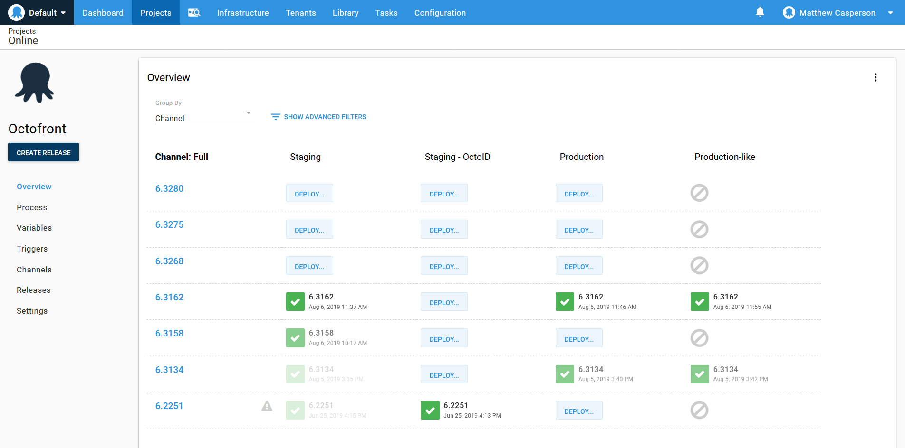

The terms "Continuous Integration" and "Continuous Deployment" tend to be combined in the acronym CI/CD, often without any distinction between the two. From this, it is easy to assume that CD is an extension of CI, and the execution of both processes is the responsibility of a single tool.

However, assuming the CI/CD is "just CI with a deployment step" ignores some fundamental differences between the two processes, and in this blog post we'll look at:

* The reasons why CI and CD are different
* The features provided by good CD tools
* And why you may consider using separate tools for your CI/CD workflow

## What is Continuous Integration?
At a high level, CI is all about taking the code written by developers and compiling it into an artifact, running automated tests, and capturing the log files so any failed builds or tests can be resolved. A CI server facilities this process by running builds and tests with each commit.

The CI process can then be described as the equation:

`code + dependencies + build tools + execution environment = test results + logs + compiled artifact`.

The left side of the function takes the code written by developers, any dependencies of the code, a build tool and the environment where the build and tests are executed. Once those inputs are available, a CI server will complete the build to produce elements in the right side of the equation.

An important aspect of this equation is that there is no manual intervention on behalf of a human. Once a CI server has been configured correctly, each commit to a code repository results in the build being run, and thus solving the equation.

This means that the CI process is machine-driven, so much so that it is common for CI servers to have read-only user interfaces, like the Jenkins Blue Ocean UI.

The other important aspect of the CI equation is that the inputs are provided by developers, and the outputs are created for developers or other technical roles. Employees outside of the IT department will rarely interact with the CI server.

## What is Continuous Deployment?
Taken literally, CD takes the compiled artifacts from a successful build performed by the CI server and deploys them into the production environment. In this scenario, CD is quite rightly an extension of CI, to the point where the distinction between the two becomes arbitrary.

Such commit-to-consumer pipelines are common in simple projects. More complex projects can also have a completely automated development pipeline, so long as the appropriate tests and monitoring systems have been put in place.

But while fully automated deployments have many benefits, it is not uncommon for deployments to involve human decision making. There are many valid reasons for not automatically deploying every commit to the master branch into production including:

* Coordinating deployments with legacy systems
* Signoff from product owners
* Usability testing that is impossible to automate
* Regulatory requirements
* Dogfooding your own product
* Not having 100% confidence in your tests

What this means is that while CI is machine-driven, for many teams CD is human-driven. Much of the grunt work of performing a deployment will still be automated, but the decision to promote a release through to production is a human one. Importantly, the decision may not be made by technical employees, but rather product owners, managers or someone who stayed up until midnight to click the deploy button.

## So why use separate CI and CD tools?

This was a slide from a talk titled [How to build cloud-native CI/CD pipelines with Tekton on Kubernetes](https://developers.redhat.com/blog/2019/07/22/how-to-build-cloud-native-ci-cd-pipelines-with-tekton-on-kubernetes/?sc_cid=701f2000000RtqCAAS]) that hit my inbox recently. It is a classic example of how simple projects merge CI and CD into a single process where a production deployment is done as soon as the code has been compiled.

There is nothing wrong with this process, and it works as intended so long as every part of the pipeline remains fully automated. But what happens if a human needs to test and approve the application before it is released?

To enable this decision to be made, the deployment process must be interrupted. For example, we may first deploy the application to a test environment, allow the appropriate parties to verify the changes, and then when everyone is happy the release is promoted to production.

This single decision point means our once machine-driven equation now:
* Requires a UI to expose the releases that have been made to the testing environments
* Introduces auditing and security concerns so we can limit and then review who promoted what where
* Requires a UI to allow deployments to be promoted to the next environment
* Requires a system that can model environments in a first-class manner so they can be reliably secured and managed through the UI, API and reporting interfaces

*Dashbords with deploy buttons for humans.*

This focus on the human element is frequently lost when CI/CD is presented as nothing more than a deployment step automatically performed once the code has been compiled. A good example of this is the [Jenkins documentation](https://jenkins.io/doc/pipeline/tour/deployment/#stages-as-deployment-environments) which recommends that the test and production environments be modelled as stages in a CI pipeline.

At first glance, this example appears to provide a point in the process for a human to approve the deployment. But what happens to a build that was never intended to be pushed to production?  Such a build would be cancelled before the application is exposed to customers, resulting in a failed build. These failed builds are difficult to distinguish from builds that failed to compile or failed their tests, even though not promoting to production is a perfectly valid outcome of the CD process.

In short, a good CD tool facilitates the human decision-making process that is so common (if not essential) to deployments, while also automating the deployment so promotions between environments are easy and reliable.

Recognizing the different requirements between a machine-driven CI process and a human-driven CD process is essential to delivering features to your customers in a fast, reliable and repeatable manner, which is why using dedicated tools for CI and CD can make sense.
