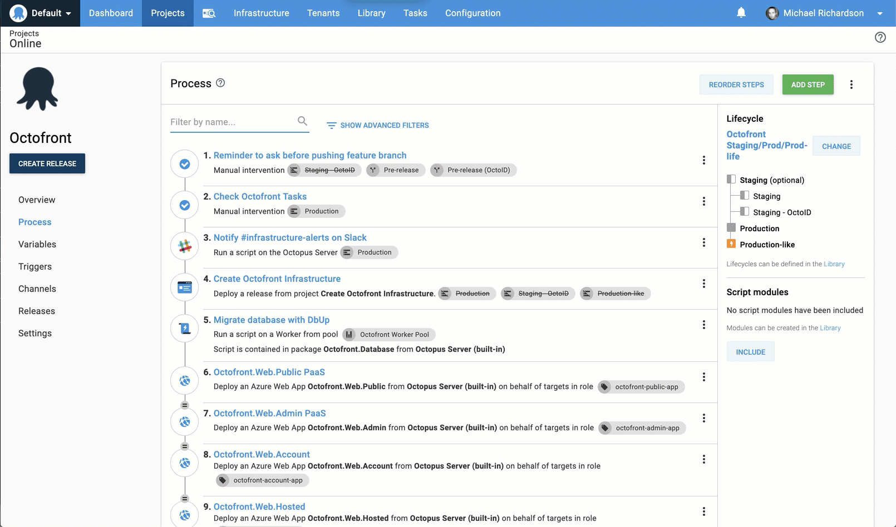
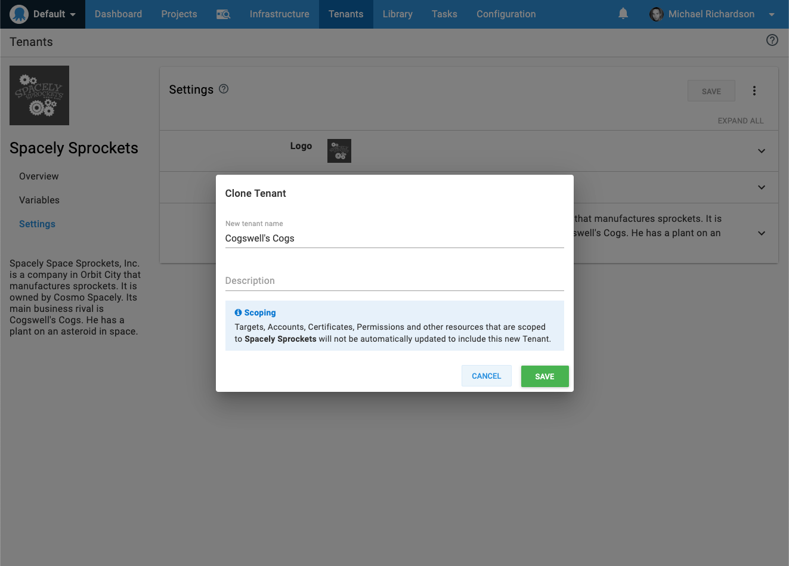
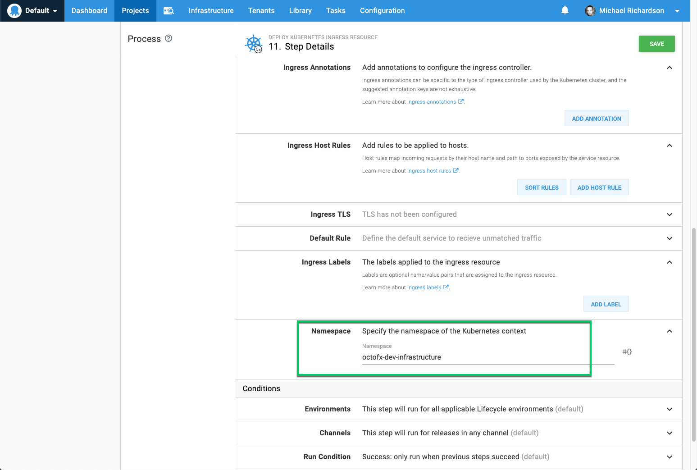
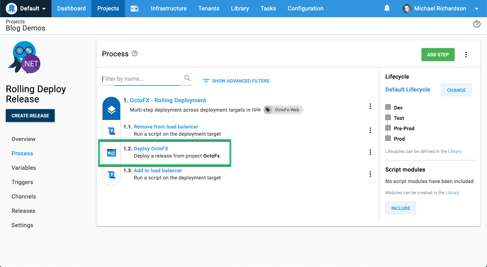
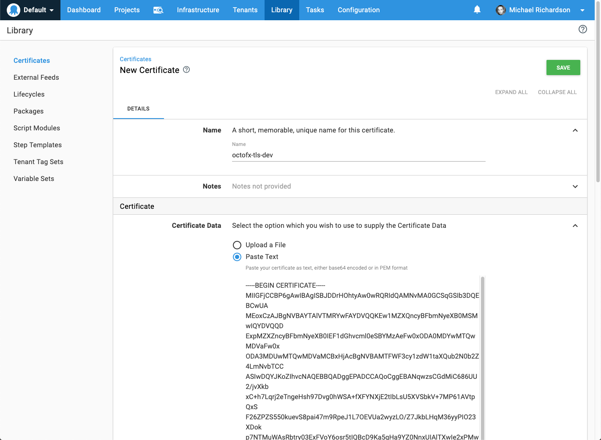

Octopus Deploy 2019.8 is now available. 

The most visible change is an improvement to the deployment process editor, but there are many other enhancements, all of which have come from user requests.  Hopefully, there's something for everyone in this release. 

## Streamlined deployment process editor

2019.8 brings an improved experience when navigating between steps in a deployment process:



This update delivers two key advantages:

- Visibility: You can now see the entire process while editing a step.  This is particularly useful when referencing other steps names in scripts or variables.
- Usability: Jumping between deployment steps could previously be painful, especially for processes with many steps.  This change will hopefully save some precious seconds (and reduce the wear on your mouse). 

This represents the first iteration of our deployment process editor improvements, and we'd love your feedback in the comments. 

## Cloning Tenants 

Speaking of saving mouse clicks, it's now possible to clone tenants. Creating a new tenant, applying the relevant tags, linking it to the appropriate projects and environments, and entering the variable values can be tedious, but you can now skip this process by cloning an existing tenant. 



## More health check scheduling options 

Previously, you could only configure the interval between health checks in a machine's policy. Octopus 2019.8 brings the ability to supply a cron expression or to configure health checks not to run. 


## Overriding the namespace available in all Kubernetes step types

While the _Upgrade a Helm Chart_ step allowed specifying the namespace, the other Kubernetes steps always used the namespace from the Kubernetes deployment target.  From Octopus 2019.8, the ability to override the target namespace by specifying it directly on the step is available to all Kubernetes step types. 



## Rolling deployments can now include Deploy Release steps

[Rolling deployments](https://octopus.com/docs/deployment-patterns/rolling-deployments) can now include [Deploy Release steps](https://octopus.com/docs/deployment-process/projects/coordinating-multiple-projects/deploy-release-step#rolling-deployments).  Previously, rolling deployments excluded this step type, but as many of you pointed out, there are scenarios where this makes sense. 



## New Variable Filter expressions

We've added some new [variable filters](https://octopus.com/docs/deployment-process/variables/variable-filters) to help with slicing and dicing variable values:

- `Trim`
- `Substring`
- `Truncate`
- `UriEscape` 
- `UriDataEscape` 

For example, given a variable `Application` with a value of `Octopus Deploy`

```
#{ Application | Substring 7}
```

will evaluate to `Octopus`

## Copy and paste to add certificates 

Uploading certificates into the Octopus certificate library previously required selecting the certificate as a file. This requirement was inconvenient when the base64 or PEM representation was sitting on your clipboard. 

Now when storing a certificate, it can be pasted directly into the portal. 



## Upgrading

As usual, please follow the [normal steps for upgrading Octopus Deploy](https://octopus.com/docs/administration/upgrading). Please see the [release notes](https://octopus.com/downloads/compare?to=2019.8.0) for further information.

* Self-hosted Octopus customers can start using these features today by installing [Octopus Server 2019.8](https://octopus.com/downloads). Note `2019.8` is a fast lane release without [long-term support](https://octopus.com/docs/administration/upgrading/long-term-support). This feature-set will be included in the next [LTS](https://octopus.com/docs/administration/upgrading/long-term-support) release of Octopus at the end of Q3 2019.

* Octopus Cloud customers will start receiving the latest bits in about 2 weeks during their maintenance window.

## Wrap up

That's it for this month. Feel free to leave us a comment and let us know what you think. 

Happy deployments!
