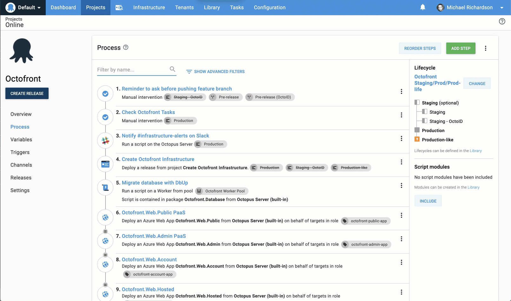

We are shipping Octopus Deploy 2019.8.  The most visible change is an improvement to the deployment process editor, but there are a bunch of other enhancements our users have requested.  Hopefully there's something for everyone in this release. 

## Streamlined deployment process editor

2019.8 brings an improved experience when navigating between steps in a deployment process:



This delivers two key advantages:

- Visibility: You can now see the entire process while editing a step 
- Usability:  Jumping between deployment steps could previously be painful, especially for processes with many steps.  This change will hopefully save some precious seconds (and reduce the wear on your mouse). 

## Cloning Tenants 

While we're speaking of saving mouse clicks... 
Creating a new tenant, applying the applicable tags, linking it to the projects and environments, and entering the variable values can be labourious.  Existing tenants can now be easily cloned. 

## More health check scheduling options 

Machine policies previously allowed only the interval between health checks to be configured. 2019.8 brings the ability to supply a cron expression, or to configure health checks to never run. 


## Allow overriding namespace in Kubernetes steps

While the _Upgrade a Helm Chart_ allowed specifying the namespace, the other Kubernetes steps always used the namespace from the Kubernetes deployment target.  From 2019.8, the ability to override the target namespace by specifying it directly on the step has been added to all Kubernetes step types. 


## Deploy Release steps can now be used in rolling deployments

[Deploy Release steps](https://octopus.com/docs/deployment-process/projects/coordinating-multiple-projects/deploy-release-step) were prevented from being used in [rolling deployments](https://octopus.com/docs/deployment-patterns/rolling-deployments).  As many of you pointed out, there are certainly scenarios where this makes sense. [So now they can](https://octopus.com/docs/deployment-process/projects/coordinating-multiple-projects/deploy-release-step#rolling-deployments). 

## New Variable Filter expressions

We've added some new [variable filters](https://octopus.com/docs/deployment-process/variables/variable-filters) to help with slicing and dicing variable values:

- `Trim`
- `Substring`
- `Truncate`
- `UriEscape` 
- `UriDataEscape` 

For example, given a variable `Application` with a value of `Octopus Deploy`

```
#{ Application | Substring 7}
```

would evaluate to `Octopus`

## Copy and paste to add certificates 

Uploading certificates into the Octopus certificate library previously required selecting the certificate as a file. This is inconvenient when the base64 or PEM representation is sitting in your clipboard. 

Now you can paste a certificate directly into the portal when storing a certificate.


## Upgrading

As usual, please follow the [normal steps for upgrading Octopus Deploy](https://octopus.com/docs/administration/upgrading). Please see the [release notes](https://octopus.com/downloads/compare?to=2019.8.0) for further information.

* Self-hosted Octopus customers can start using these features today by installing [Octopus Server 2019.8](https://octopus.com/downloads). Note `2019.8` is a fast lane release without [long-term support](https://octopus.com/docs/administration/upgrading/long-term-support). This featureset will be included in the next [LTS](https://octopus.com/docs/administration/upgrading/long-term-support) release of Octopus at the end of Q3 2019.

* Octopus Cloud customers will start receiving the latest bits in about 2 weeks during their maintenance window.

## Wrap up

That's it for this month. Feel free to leave us a comment and let us know what you think. 

Happy deployments!
