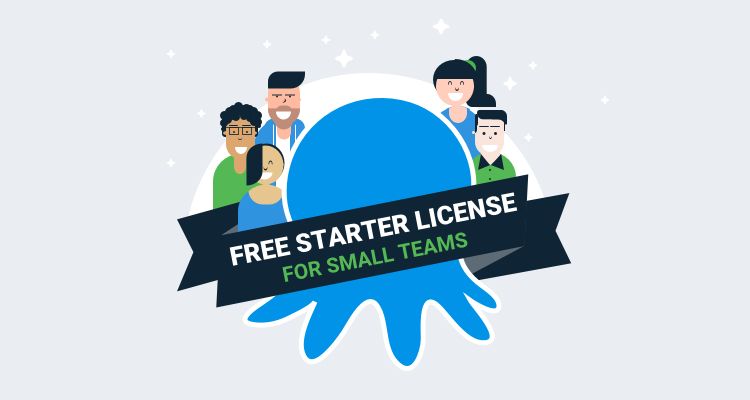

Octopus Deploy: Starter is a new edition of Octopus Deploy. It allows small teams to run a self-hosted Octopus Server, and deploy up to 10 targets, all free. Forever. Here's a summary of the capabilities and limits:

<ul class="icon-list">
    <li class="check">Up to 10 active deployment targets</li>
    <li class="check">A single <a href="https://octopus.com/docs/administration/spaces">space</a></li>
    <li class="check">A single <a href="https://octopus.com/docs/administration/high-availability">Octopus Server node</a></li>
    <li class="check">All users have administrator-level permissions and can't be restricted</li>
    <li class="check">You can only run two deployments in parallel</li>
    <li class="check">Not a time-limited trial</li>
    <li class="check">Production and commercial use <strong>is</strong> permitted</li>
</ul>

[Register for a Starter license](https://octopus.com/starter). 

## Why the change

If you've been a long time customer, you might remember that we previously had a free license tier for Octopus Deploy. It was called our Community edition, and it existed from when Octopus was a hobby project in 2011, through to early 2018 when we [discontinued it](https://octopus.com/blog/removing-free-tier), so for 7 years it was the main way most teams began using Octopus. 

When we discontinued the free tier in 2018, it was mostly due to the costs of supporting so many free customers. Since then, we've grown our support team (we now have team members in the US, UK and Australia), as well as our Customer Success team. We've also got the numbers to back it up - discontinuing the free tier didn't dramatically cut the number of support tickets that we thought it would. 

Talking to customers this past year, it became clear why the old free tier meant so much. Getting teams to adopt software is hard, and even with a 30-day trial, it can be hard to convince everyone that Octopus is the direction to go in. At NDC Oslo this year, I spoke to a dozen customers who told stories about how they started with the free tier, sometimes for over a year, before they convinced the rest of their team and management to buy a license. Although we offered a 30-day trial (and really helpful support if you got stuck), it still made adoption difficult for these customers. 

For all these reasons, we decided to bring the free tier back. The new license is specifically designed for small teams. Where the old Community license was limited to 5 deployment targets, the new one allows up to 10. There are some other limitations though, which are listed above, which based on our telemetry most small teams would be unlikely to hit. Since we license based on the number of targets, and there are ways to use Octopus to deploy to things that are not targets, or Kubernetes clusters which might be enormous but only count as one, these extra limits allow us to make that less attractive for large teams. 

## Refunding 5 and 10 target licenses

If you bought a 5 or 10 target license recently, you might be surprised that we just made the Starter license with 10 targets completely free. We can't go back in time and change it, but we think it's the right thing to do to offer your money back. 

Your paid license doesn't have many of those other limits listed above, so if those limits matter to you, it might be best to stick with the paid license. 

However, if those limits seem fine, and you'd rather have your money back, we're happy to refund you. We'll refund the remaining term on the license - e.g., if your license is 6 months into the yearly term, we'll refund the remaining 6 months. If you purchased or renewed your license after August 1st, 2019, we'll refund you in full. You can then switch to the Starter license. 

To arrange a refund, contact sales@octopus.com with your license serial number. 

## Your Octopus account

When you create your free Starter license, you'll also create an **Octopus Account**. If you use Octopus Cloud, or have used our [support forum](https://help.octopus.com) recently, you've probably created an account already. You can also use your Octopus Account to manage self-hosted licenses, including your paid license keys, finding old orders, and renewing existing licenses. 

Each Starter license is issued with a 12 month validity period. This is because under the old Community license, we never knew how many people were still using their license or not, so it was hard to estimate how many Octopus instances there were out there. With Starter, we ask you to sign in to your Octopus account and renew your Starter license (just by clicking a button) every 12 months just so we know you're still using it. 

I hope this post explains what the new Starter license can be used for, why we re-introduced a free tier, and what it means for you. If you have any questions, please ask in the comments below. 

Happy deployments!
