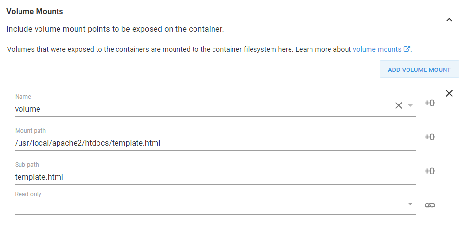

If you have ever deployed an application in octopus before, you have probably made use of variable replacement in files as a way of taking a generic application package and injecting environment specific configuration during deployment. This process is convenient because you can produce as single application artifact, and each environment is then responsible for customizing it to match the local infrastructure.

Replacing files in application packages like ZIPs or NUPKGs is straight forward because theses files are standard archives, and can be easily modified after they are downloaded from the artifact repository but before they are deployed to their final target.

Docker image files aren't quite as convenient. For a start, there is some magic in the way the layers are built up to ensure that both new and deleted files are respected, meaning unpacking a Docker image file is not as simple as untar-ing the individual layers. Second, Kubernetes expects to pull down an image from a repository, which removes Octopus from the pipeline as far as handing out modified, but not published, artifacts is concerned.

The good news is that we can take some open source tools created by the community for download and unpacking Docker images, and then use the native ability in Kubernetes to mount files into Pods to achieve much the same result.

## Working with Docket Images, Without Using Docker

The first step in this process is to download and unpack a Docker image. Typically all interaction with Docker images and repositories had to be done with the `docker` cli tool. Always having to run the Docker daemon isn't terribly efficient though, and so additional third party tools have been developed to handle Docker images outside of the Docker daemon.

The first tool is called [skopeo](https://github.com/containers/skopeo). We'll use `skopeo` to download a Docker image and save it as a single, self container file on the local disk.

The second tool is called [umoci](https://umo.ci/). We'll use `umoci` to unpack the file downloaded by `skopeo`, allowing us access to the final directory structure created by all the individual layers in a Docker image.

While both these tools are open source, getting binary builds can be challenging. For this exercise I am using a SUSE Linux Enterprise VM as an Octopus worker. SUSE created `umoci` and provides [binary downloads from the GitHub releases page](https://github.com/openSUSE/umoci/releases), while the standard SUSE package repositories contain a build of `skopeo`, which means we don't have to go through the pain of trying to build these tools ourselves.

## Downloading and Extracting the Docker Image

Let's take a look at the script that will download, extract and save the contents of a file from a Docker image.

```
read_file () {
	CONTENTS=""
  while read -r line || [ -n "$line" ]; do
		CONTENTS="${CONTENTS}${line}";
	done < ${1}
  printf -v "${2}" '%s' "${CONTENTS}"
}

skopeo copy docker://mcasperson/dockerfilereplacement:0.0.1 oci:image:latest
umoci unpack --image image --rootless bundle

cd bundle/rootfs/usr/local/apache2/htdocs
read_file template.html TemplateHtml
echo -e $TemplateHtml

set_octopusvariable "TemplateHtml" ${TemplateHtml}
```

We start with a bash function that reads the contents of the file, supplied as the first argument, line by line. The resulting contents is then saved back into a global variable whose name is passed in as the second argument (because bash functions can only return integer exit codes) using `printf`.

```
read_file () {
	CONTENTS=""
  while read -r line || [ -n "$line" ]; do
		CONTENTS="${CONTENTS}${line}";
	done < ${1}
  printf -v "${2}" '%s' "${CONTENTS}"
}
```

The Docker image is downloaded by `skopeo`, and saved in an Open Container Initiative (OCI) bundle called `image`.

```
skopeo copy docker://mcasperson/dockerfilereplacement:0.0.1 oci:image:latest
```

This file is then unpacked with `umoci`.

```
umoci unpack --image image --rootless bundle
```

At this point we have the files that make up the Docker image extracted locally. The template file we are interested in is `/usr/local/apache/htdocs/template.html`. Using the bash function we created earlier, the contents of this file is read into a variable called `TemplateHtml`. The contents of the file is printed to the screen with `echo` to confirm that we have the content we expect.

```
cd bundle/rootfs/usr/local/apache2/htdocs
read_file template.html TemplateHtml
echo -e $TemplateHtml
```

Once we have the contents of the file, we save it as an output variable.

```
set_octopusvariable "TemplateHtml" ${TemplateHtml}
```

## Creating the ConfigMap

With the contents of the file saved as an Octopus variable, the next step is to create a ConfigMap that holds the processed value. We'll do this with the `Deploy raw Kubernetes YAML` step in Octopus.

```yaml
apiVersion: v1
kind: ConfigMap
metadata:
  name: templateconfigmap
data:
  template.html: "#{Octopus.Action[Extract File].Output.TemplateHtml}"
```

The `template.html` field is the important part of this config map. The key defines the filename that we are replacing, and the value of `"#{Octopus.Action[Extract File].Output.TemplateHtml}"` will result in the contents of the file that we extracted in the last step being processed and then set. This is important, because it means that any nested variables references in the variable `Octopus.Action[Extract File].Output.TemplateHtml` will be replaced.

The end result is a ConfigMap that holds the original contents of the `template.html` file, but with any variable replacements performed.

## Mouting the ConfigMap

The final step is to take the value from the ConfigMap and have it mounted back into the Kubernetes Pod, thus replacing the original, unprocessed file.

This is done by defining a Volume that references the ConfigMap created in the pervious step.


The ConfigMap is then mounted into the Pod. The trick here is to set the `Mount path` to the full path of the individual file to be replaced, and set the `Sub path` to the entry from the ConfigMap that has the contents of the file.

With this configuration we will mount a single file in the Pod using the value from the ConfigMap, replacing the contents of the original file.


