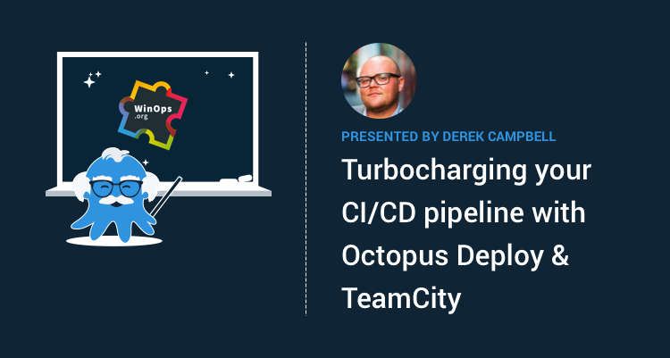

WinOps London is happening on 23-24 September, and Octopus will be there! I'm excited to share that I'm leading a DevOps workshop and speaking about how to turbocharge Azure DevOps Deployments with Octopus.

## Turbocharging your CI/CD pipeline workshop

Have you outgrown your current CI/CD pipeline? Is it to slow, manual or requires tweaking too many settings too often? Have you accidentally become the person in charge of “DevOps”?

Fear no more, in this hands-on workshop, I will walk you through CI/CD core concepts and best practices, as well as review real-world release management and automation problems and how to overcome them.

During this half-day workshop on September 23rd, 2019, you will get hands-on access to [TeamCity](https://www.jetbrains.com/teamcity/) & [Octopus Cloud](https://octopus.com/docs/octopus-cloud) with [OctoFX](https://github.com/OctopusSamples/OctoFX) which is a sample application we use to demonstrate Octopus. You will configure its build, run automated tests, design your deployment process, and finally promote it through Dev, Test, and Production environments.

Requirements

* Laptop
* VS Code or Visual Studio 2017+
* Modern Web browser

## Turbocharging Azure DevOps with Octopus Deploy talk

At Octopus Deploy, we are passionate about automation, be it code, databases, or infrastructure.  Which is why we are excited to announce that I, [Derek Campbell](https://twitter.com/octoderek) will continue this discussion in our presentation on "Turbocharging Azure DevOps with Octopus Deploy" at the [WinOp's London Event](https://www.winops.org/london/) on the 24th of September 2019.

In this session, I will take you through how to integrate Azure DevOps and Octopus Deploy using the Azure DevOps extension. He will then demo an Azure pipeline and lastly pass this through to Octopus Deploy which will then deploy to Azure from a single build and test all the way to Production.

## Event Details and Discount

There is still time to register!  You can use the code _**Octopus10**_ to register with a 10% Discount and can get your tickets [here](https://www.winops.org/london/#TicketCTA)

WinOps is running The All Women Track which is Track 1 on the agenda which is a dedicated track for Female speakers. You can see the full agenda [here](https://www.winops.org/london/agenda/)

If you're already coming, then be sure to say hi to the team and grab some Octopus stickers!
