For quite some time, SQL Server has been a docker image.  Running SQL Server on Docker could solve two of the major headaches I have with running SQL Server Developer edition as a Windows Service, which I covered how to automate the installation in my [previous article](https://octopus.com/blog/automate-sql-server-install). Running SQL Server locally is a double-edge sword.  It's nice to have a SQL Server I have total control over; I can make mistakes, try out new things, and no one else is blocked.  However, that SQL Server is running all the time which consumes resources, and I am responsible for patching it.  When I was a full-time developer, I needed to run SQL Server all the time.  With my new role, I only want SQL Server running some of the time, and I don't want to worry about having to patch it.  Can running SQL Server on Docker solve that?  In this article I answer that question, along with how I accomplished configuring SQL Server to run on Docker.

!toc

## The Scenario

In a couple of months, I will be speaking at [TechBash 2019](https://techbash.com/sessions). The presentation will cover how my automated database deployment process progressed from being purely on TeamCity to being TeamCity + Octopus Deploy.  I have all that running on VMs hosted on a hypervisors in my office, but I need to migrate that setup to my laptop.  However, I don't need or want all of that running all the time.  Only when I am prepping or practicing my demo.  In other words, I want to spin up and down an entire CI/CD pipeline using Docker.

## A Brief Introduction to Docker

To ensure we are talking the same lingo, I want to go over the basics of Docker.  Think of Docker as an virtualization host, similar to Hyper-V or VMWare.  But instead of VMs, in Docker hosts containers, which run applications.  Containers store all the application's binaries and dependencies in a completely isolated environment.  

Unlike VMs, which require the full OS, only the bare essentials needed to run the application are included in the container.  These make containers much less resource intensive than full on VMs.  However, the trade-off is unlike with VMs all communication with Docker containers has to occur over a network interface.  Websites and Windows Services such as SQL Server, Octopus Deploy, or TeamCity will work fine in Docker.  Applications which require a WinForms or WPF interface, such as Visual Studio or JetBrains Rider will not work with Docker.

Below is a list of [Docker nomenclature](https://docs.docker.com/engine/docker-overview/) which will be used in this article:

- **Images:** An image is a read-only template for creating the Docker Container.  I like to think of them like an ISO file.  You can use images provided by the community via [Docker Hub](https://hub.docker.com/), or you can create images yourself.  Images are typically built upon other images.  Think of it like inheritance in source code.  Object C is a child object of Object B, which is a child object of Object A.  Typically, you'd create custom images to host your applications.  This article will use images found in the Docker Hub, it will not go into how to create your own image (there are tons of articles which do that).  
- **Container:** A container is a runnable instance of an image with configuration options specified.  For this article, we are going to be taking the SQL Server, TeamCity, and Octopus Deploy images located on Docker Hub and run them in containers.  
- **Volumes:** By default, containers are considered stateless, any changes made to the container while it is running will not persist when it shuts down.  If you were to create a database in a container hosting SQL Server it would not be there the next time it starts up.  Volumes allow for data to be persisted by accessing the host's file system.  This article will be making use of volumes to store all the configuration information for the CI/CD pipeline.
- **Docker Compose:** Docker Compose makes it easy to define multi-container Docker applications.  It uses YAML to define all the containers needed for the application.  This article will be using Docker Compose to spin up and down the CI/CD pipeline on my local machine.

## Prep Work

Some prep work needs to be done before jumping in and writing scripts.  My work laptop is running Windows 10 Professional.  Here are the steps I took to get Docker installed and ready for use on my laptop.

Right now, Octopus Deploy has to run in a Windows based container.  That should hopefully change with our port to .NET core and the fact Octopus Cloud v2 is running on Linux containers.  But until that time, everything in my CI/CD pipeline will run as Windows containers.  

### Enable CPU Virtualization
When it comes down to it, Docker is a virtualization host.  Just like any other virtualization host, the CPU has to support virtualization and that has to be enabled.  Typically virtualization is enabled in the BIOS.  Which means you'll have to do a Google search on how to to enable it in your computer manufacturer's BIOS.  Intel calls their virtualization technology [Intel VT](https://www.intel.com/content/www/us/en/virtualization/virtualization-technology/intel-virtualization-technology.html), along with Intel VTx.  AMD calls their virtualization technology [AMD V](https://www.amd.com/en/technologies/virtualization), sometimes you'll see it called VDI or SVM.  

### Installing Docker for Windows
After the quick BIOS update, it is time to install Docker for Windows.  I will be using Docker for Windows instead of Docker on Windows.  Docker on Windows only includes the base Docker engine.  I want to leverage Docker Compose and at some point in the future (aka not for this post), the Docker CLI.  The whole process to install Docker for Windows is [nicely documentation](https://docs.docker.com/docker-for-windows/install/).  No need to repeat that.

One thing to note, if you don't have Hyper-V enabled, the installer will enable it for you.  That will require a restart of the computer.  

### Configuring Shared Drives
By default, Docker treats all containers as stateless.  Any changes made to the container, such as a creating a database, will be deleted when the container is removed.  This problem can be solved by making use of volumes in docker.  I setup a folder on my hard drive, C:\Docker\Volumes, to store those volumes.

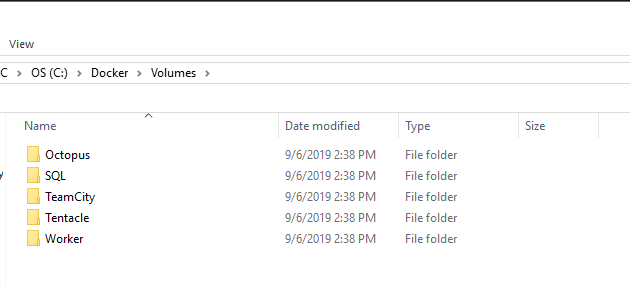

It is important to note that if I were running these as Linux based containers I would need to follow the steps listed in the [Docker documentation on sharing drives](https://docs.docker.com/docker-for-windows/#shared-drives).

### Anti-Virus Configuration
One downside of running a Windows container (aside from the space overhead), is anti-virus products can and will block them from downloading.  This is because of how Docker stores images on the Windows file system.  Essentially, another folder called Windows will appear in a random location.  When anti-virus scanners see that they freak out.  Make sure you are using the latest version of your anti-virus of choice.


## Configuring the SQL Server Developer Container
As stated before, by default all containers are stateless.  This makes things a bit tricky as SQL Server, TeamCity, and Octopus Deploy are much stateful applications.  Before attempting to configure TeamCity and Octopus Deploy I will need to get SQL Server up and running in Docker.  

For each of the containers I will be running in my CI/CD pipeline I need to solve for the following:

1. Get the container up and running with no fancy configuration.
2. Persist data created in a container, such as a SQL Database, to a volume.
3. Have a static IP or hostname to keep configuration easy.
4. Communicate between containers, such as Octopus Deploy -> SQL Server or TeamCity -> Octopus Deploy.

I am going to solve those issues with SQL Server first as that is the backbone of my CI/CD pipeline.

### Running SQL Server Developer Container for the first time
That is a pretty ambitious list to solve Docker newbies such as myself.  I am going to take it a step of a time.

```PowerShell
docker pull microsoft/mssql-server-windows-developer
```

Brew up some tea or coffee and sit back, because this might take a while to complete.  It has to download the image, along with all the images it depends on.  


Now that the image is downloaded, it is time to get it fired up and run some SQL scripts.  Thankfully, the documentation [Microsoft added to Docker Hub](https://hub.docker.com/r/microsoft/mssql-server-windows-developer) makes this easy.  Please make note of the `--name` parameter being sent in.  This will make it easier later when we need to figure out how to connect to it.  Along with naming the instance, I will be setting the port to the default SQL Server port, 1433.  

```PowerShell
docker run --name SQLServer -d -p 1433:1433 -e sa_password=Password_01 -e ACCEPT_EULA=Y microsoft/mssql-server-windows-developer
```


The SQL Server container is running.  The container is a assigned an IP Address, such as `172.19.98.212`, which is different than a standard local instance of SQL server, where it is possible to connect to it via `.` or `127.0.0.1`.  The below command will get the IP address of that instance.

```PowerShell
$docker = docker inspect SQLServer | convertfrom-json
$docker[0].NetworkSettings.Networks.nat.IpAddress
```

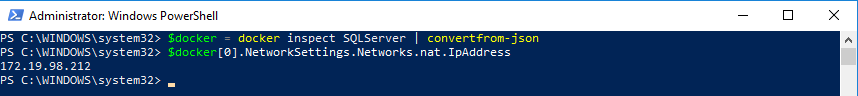

Now it is just a matter entering that IP Address, along with `sa` as the username / password defined above, to connect SQL Server Management Studio(SSMS) to that database.  

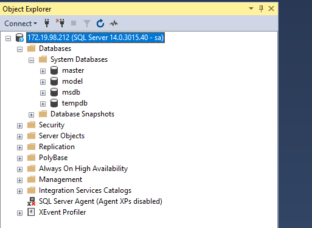

Just like regular SQL Server, everything works as expected.  I can create a database and tables without any issue.

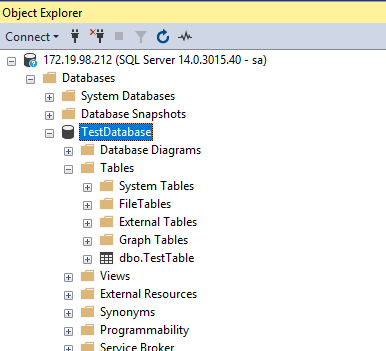

Let's see what happens when we shut down this instance, remove it, and start up a fresh one.

```PowerShell
docker stop SQLServer
docker rm SQLServer
docker run --name SQLServer -d -p 1433:1433 -e sa_password=Password_01 -e ACCEPT_EULA=Y microsoft/mssql-server-windows-developer
```

Note that the container has a new IP Address associated with it.

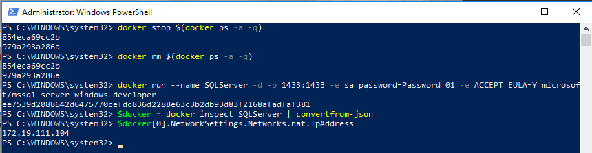

And as expected, the databases were all deleted.  


But you'll notice that I am not only running the `stop` command, I am also running the `rm` command, which is short for remove.  Let's see what happens when I change the command to this:

```PowerShell
docker stop SQLServer
docker start SQLServer
```

The IP Address changes when I do that.

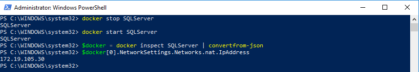

The database still exists after I just do a simple restart.


The answer is simple then, just stop and start the same image over and over again.  Well not so fast.  Containers are immutable.  That means when an update for SQL Server (or Octopus Deploy or TeamCity) is released then I have to destroy the container and create a new one.  As you saw, once I destroyed a container the database created in the container were also destroyed.  That is not ideal.  Especially, if we want to connect TeamCity and OctopusDeploy to it.

### Persisting Data with Volumes
The database files need to be persisted.  That will be accomplished using a volume will be pointed at `C:\Docker \Volumes\SQLServer`. There are [many](https://blog.sixeyed.com/docker-volumes-on-windows-the-case-of-the-g-drive/), [many articles](https://github.com/docker/labs/blob/master/windows/sql-server/part-3.md) about [Docker Volumes](https://docs.docker.com/storage/volumes/).  THe TL;DR; is add the `--volume` switch to `docker run` to add a volume.  If the container is already running it needs to be destroyed before adding a volume.

```PowerShell
docker run --name SQLServer -d -p 1433:1433 --volume c:\Docker\Volumes\SQLServer:c:\SQLData -e sa_password=Password_01 -e ACCEPT_EULA=Y microsoft/mssql-server-windows-developer
```

When I connect to that SQL Server instance, all my database create commands need to specify `C:\SQLData\` as the directory for the data.  I know I will need a database for Octopus Deploy and another for TeamCity, so let's get those created.

```SQL
CREATE DATABASE [OctopusDeploy]
 CONTAINMENT = NONE
 ON  PRIMARY 
( NAME = N'OctopusDeploy', FILENAME = N'C:\SQLData\OctopusDeploy.mdf' , SIZE = 8192KB , FILEGROWTH = 65536KB )
 LOG ON 
( NAME = N'OctopusDeploy_log', FILENAME = N'C:\SQLData\OctopusDeploy_log.ldf' , SIZE = 8192KB , FILEGROWTH = 65536KB )
GO
CREATE DATABASE [TeamCity]
 CONTAINMENT = NONE
 ON  PRIMARY 
( NAME = N'TeamCity', FILENAME = N'C:\SQLData\TeamCity.mdf' , SIZE = 8192KB , FILEGROWTH = 65536KB )
 LOG ON 
( NAME = N'TeamCity_log', FILENAME = N'C:\SQLData\TeamCity_log.ldf' , SIZE = 8192KB , FILEGROWTH = 65536KB )
GO
```

The databases were created successfully.


And they now show up in the directory on the host system.


Now that those databases exist, we can pass in the names and paths of those databases next time we create that container using the `attach_dbs` environment variable.

```PowerShell
$attachDbs = "[{'dbName':'OctopusDeploy','dbFiles':['C:\\SQLData\\OctopusDeploy.mdf','C:\\SQLData\\OctopusDeploy_log.ldf']},{'dbName':'TeamCity','dbFiles':['C:\\SQLData\\TeamCity.mdf','C:\\SQLData\\TeamCity_log.ldf']}]"
docker run --name SQLServer -d -p 1433:1433 --volume c:\Docker\Volumes\SQLServer:c:\SQLData -e sa_password=Password_01 -e ACCEPT_EULA=Y -e attach_dbs=$attachDbs microsoft/mssql-server-windows-developer
```

Those databases are now mounted when the container is recreated.  


### Setting the IP Address and Host Name
Up until this point I have been using this command to get the IP Address for the SQL Server container.  

```PowerShell
$docker = docker inspect SQLServer | convertfrom-json
$docker[0].NetworkSettings.Networks.nat.IpAddress
```

As I build out my CI/CD pipeline, I don't want to have to calculate the IP address each time the container is spun up.  That is going to make it tricky to connect via SSMS or through a web browser for Octopus Deploy and TeamCity. What would be even better is to not have to worry about IP Addresses at all.  This is where [Docker Compose](https://docs.docker.com/compose/) enters the picture.  Docker Compose handles a lot of the behind the scenes work for us.  All it takes is converting the existing commands we have been using to a YAML file.

```YAML
version: '3.7'
services:
  SQLServer:
   image: microsoft/mssql-server-windows-developer
   environment:
     - ACCEPT_EULA=Y
     - SA_PASSWORD=Password_01   
     - attach_dbs=[{'dbName':'OctopusDeploy','dbFiles':['C:\\SQLData\\OctopusDeploy.mdf','C:\\SQLData\\OctopusDeploy_log.ldf']},{'dbName':'TeamCity','dbFiles':['C:\\SQLData\\TeamCity.mdf','C:\\SQLData\\TeamCity_log.ldf']}]
   ports:
     - '1433:1433'
   volumes:
     - c:\Docker\Volumes\SQLServer:c:\SQLData
```

I saved that docker-compose file in the C:\Docker folder on my hard drive.  

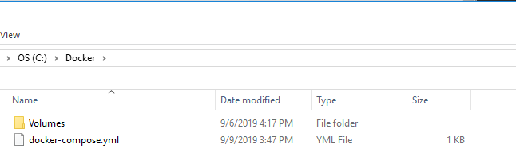

Then I ran this command in PowerShell.

```PowerShell
Set-Location C:\Docker
docker-compose Up
```

Now I can access my SQL Server, which is running in Docker, by connecting to localhost instead of an IP address.

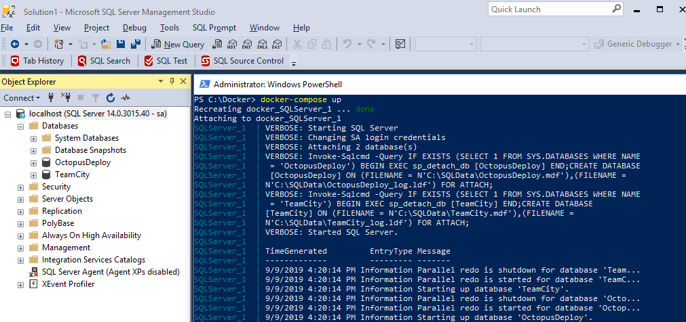

If you are only reading this post to see how to host SQL Server in Docker on your developer machine you can stop now.  The remainder of this article will cover setting up the rest of the CI/CD pipeline.

## Configuring TeamCity and Octopus Deploy

SQL Server is up and running.  The databases are being persisted.  It is now time to download TeamCity and Octopus Deploy images and get them up and running.  From here on out, I will be modifying the docker-compose file.  

### TeamCity
I need to pull the [server image](https://hub.docker.com/r/jetbrains/teamcity-server) along with the [build agent image](https://hub.docker.com/r/jetbrains/teamcity-agent).  One thing I am starting to like about Docker is how what I need is included in the image.  For example, the build agent image for TeamCity includes the .NET Core SDK along with MSBuild tools.  Very nice.  

For right now, I want to worry about TeamCity up and running, and connecting to SQL Server, without worrying about build agents.  In looking at the documentation provided on [Docker Hub](https://hub.docker.com/r/jetbrains/teamcity-server), the Docker Compose file needs to specify two directories on the host, one for the configuration and the other for the logs.

```PowerShell
docker run -it --name teamcity-server-instance
    -v <path-to-data-directory>:C:/ProgramData/JetBrains/TeamCity
    -v <path-to-logs-directory>:C:/TeamCity/logs
    -p <port-on-host>:8111
    jetbrains/teamcity-server
```

The ``docker-compose.yml`` file will be updated to include TeamCity, but also specify the port and directories.

```YAML
version: '3.7'
services:
  SQLServer:
   image: microsoft/mssql-server-windows-developer
   environment:
     - ACCEPT_EULA=Y
     - SA_PASSWORD=Password_01   
     - attach_dbs=[{'dbName':'OctopusDeploy','dbFiles':['C:\\SQLData\\OctopusDeploy.mdf','C:\\SQLData\\OctopusDeploy_log.ldf']},{'dbName':'TeamCity','dbFiles':['C:\\SQLData\\TeamCity.mdf','C:\\SQLData\\TeamCity_log.ldf']}]
   ports:
     - '1433:1433'
   volumes:
     - c:\Docker\Volumes\SQLServer:c:\SQLData
  TeamCity:
   image: jetbrains/teamcity-server   
   ports:
     - '8111:8111'
   volumes:
     - c:\Docker\Volumes\TeamCity\Configuration:c:\ProgramData\JetBrains\TeamCity
     - C:\Docker\Volumes\TeamCity\Logs:c:\TeamCity\Logs
   links:
     - SQLServer
```

Running `docker-compose up` on that file will now kick off two docker containers, one for SQL Server and another for TeamCity.

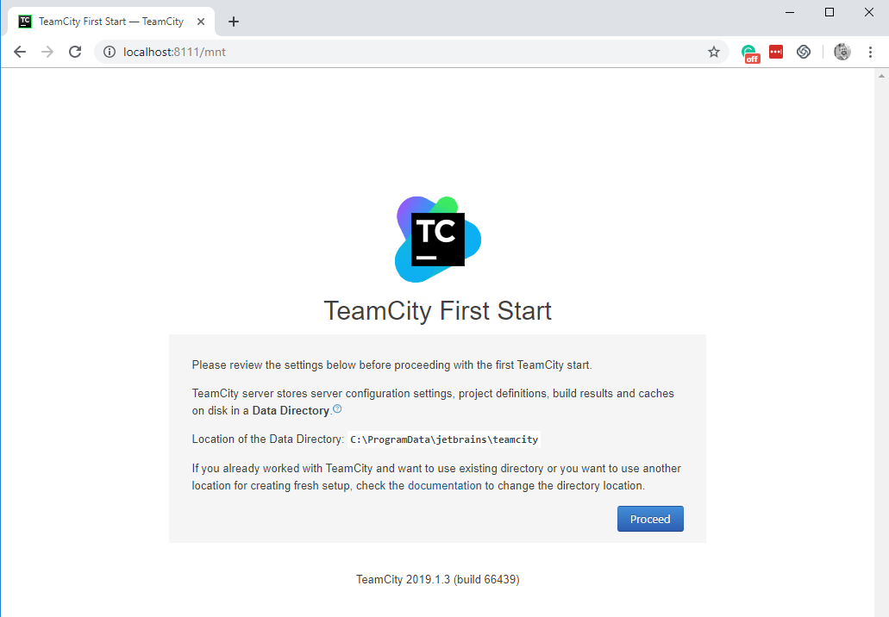

Now it is a matter of clicking through the wizard until the screen to configure the database appears.  In this case I am going to select SQL Server, which will prompt me to download the JDBC driver.  Then I specify the details of the connection string.

I should point out using the SA account for anything but a local configuration is a huge security hole and shouldn't be done.  

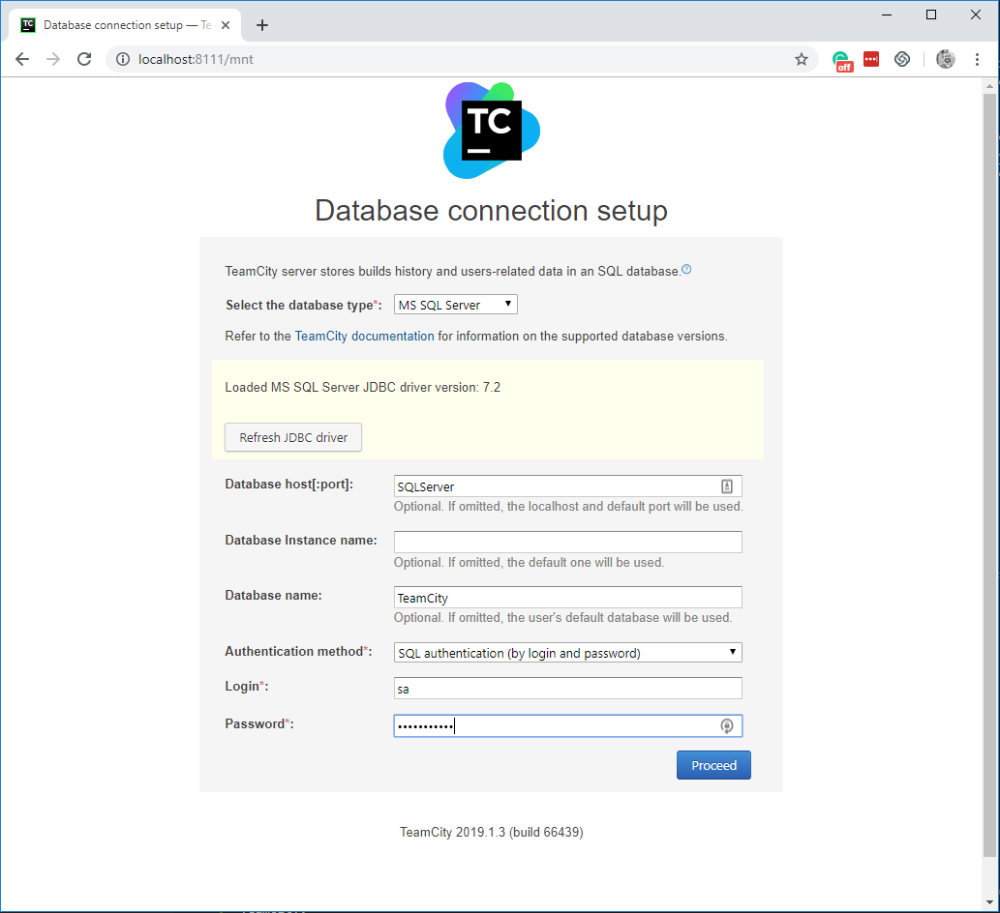

Assuming TeamCity can see the SQL Server container, everything will be created, including all the tables in the database.

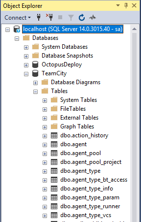

After completing the setup wizard, I now have TeamCity running in docker.

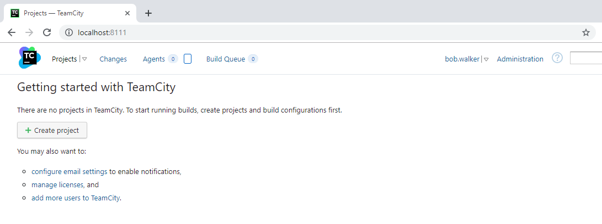

I am going to destroy these containers.  Hopefully I have everything setup correctly.

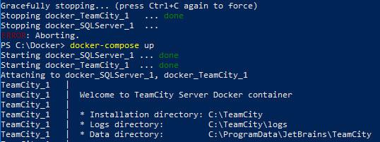

Success, the server came back up without me going through the setup wizard.

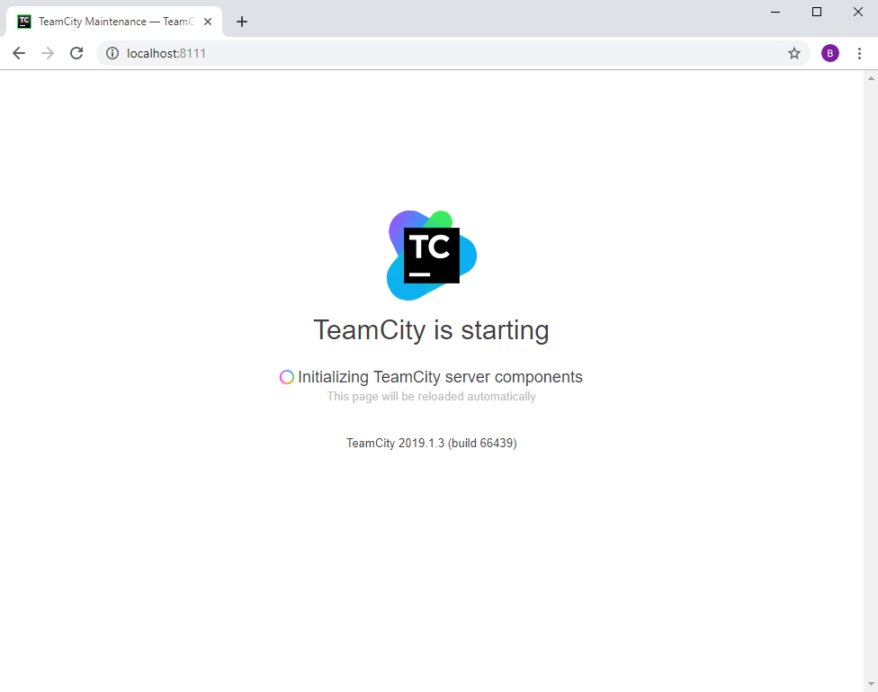

Next, the TeamCity build agent will be added to the `docker-compose.yml` file.

```YAML
version: '3.7'
services:
  SQLServer:
   image: microsoft/mssql-server-windows-developer
   environment:
     - ACCEPT_EULA=Y
     - SA_PASSWORD=Password_01   
     - attach_dbs=[{'dbName':'OctopusDeploy','dbFiles':['C:\\SQLData\\OctopusDeploy.mdf','C:\\SQLData\\OctopusDeploy_log.ldf']},{'dbName':'TeamCity','dbFiles':['C:\\SQLData\\TeamCity.mdf','C:\\SQLData\\TeamCity_log.ldf']}]
   ports:
     - '1433:1433'
   volumes:
     - c:\Docker\Volumes\SQLServer:c:\SQLData
  TeamCity:
   image: jetbrains/teamcity-server   
   ports:
     - '8111:8111'
   volumes:
     - c:\Docker\Volumes\TeamCity\Configuration:c:\ProgramData\JetBrains\TeamCity
     - C:\Docker\Volumes\TeamCity\Logs:c:\TeamCity\Logs
   links:
     - SQLServer
  TeamCityBuildAgent01:
   image: jetbrains/teamcity-agent   
   environment:
     - SERVER_URL=TeamCity:8111
   volumes:
     - c:\Docker\Volumes\TeamCity\BuildAgent01:c:\BuildAgent\Conf     
   links:
     - TeamCity
```

After re-running `docker-compose up` on that file an agent shows up as unauthorized.

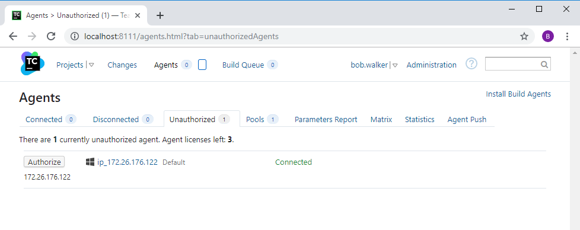

TeamCity is good to go.  Now it is on to Octopus Deploy.

### Octopus Deploy
Just like with TeamCity, I want to get the Octopus Deploy server setup then add in deployment targets.  The core setup of Octopus Deploy and TeamCity are similar, both need to persist data to a volume and both need to connect to SQL Server.  However, Octopus Deploy has a master key which is used to encrypt and decrypt data in the database.  Octopus will fail if the database exists and an it attempts to connect to it without the master key.  

Before worrying about that, the [server image](https://hub.docker.com/r/octopusdeploy/octopusdeploy) and [tentacle image](https://hub.docker.com/r/octopusdeploy/octopusdeploy) need to be pulled down from Docker Hub.  In thinking through this a bit, Octopus Deploy expects the SQL Server to be there when it starts up.  This turns into a bit of a race condition.  SQL Server and Octopus Deploy containers will start up, but the SQL Server may or may not be ready for Octopus Deploy to connect to it.  

**Please note:** The example in [the Octopus documentation](https://octopus.com/docs/installation/octopus-in-container/docker-compose) has a health check and tells the Octopus Deploy image to wait until that health check report healthy.  That documentation was written for Docker Compose 2.4.  I have been using the latest version, which at the time of this writing is 3.7.  That functionality is no longer supported.  

What I need to do is delay the start-up of Octopus Deploy until after SQL Server starts up.  Here is a simple script to check if the container can connect to the SQL Server container.

```PowerShell
Param(
    [string]$connectionString
)

Write-Host "This is the connection string I'm using $connectionString"

$canConnect = $false
$retryCount = 0

$sqlConnection = New-Object System.Data.SqlClient.SqlConnection
$sqlConnection.ConnectionString = $connectionString

while ($canConnect -eq $false -and $retryCount -lt 30)
{
    try{
        Write-Host "Trying to connect to $connectionString"
        $sqlConnection.Open()
        $sqlConnection.Close()
        $canConnect = $true
        Write-Host "I was able to connect dawg!"
    }
    catch{
        write-host "Cannot Connect sleeping for 10 seconds"
        Start-Sleep -Seconds 10
        $retryCount += 1
    }    
}

if ($canConnect -eq $true)
{
    exit 0
}

exit 1
```

I do have to attach a volume to the container.  In that volume will be a simple script that will try to open a connection multiple times.


To execute that script the command option will be added the `docker-compose.yml` file.  Please note, the path to the file is the path on the container, not the host.  In this case it is `C:\Octopus\CheckSqlServer.ps1`.

```YAML
command: powershell -executionpolicy bypass -command "C:\Octopus\CheckSqlServer.ps1 'Server=SQLServer,1433;Initial Catalog=OctopusDeploy;Persist Security Info=False;User ID=sa;Password=Password_01;MultipleActiveResultSets=False;Connection Timeout=30;'"
```

All that is needed for this step is to get the Octopus Deploy server up and running.  The TeamCity section from the `docker-compose.yml` file will be omitted for a bit to keep things simple.  

