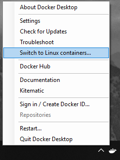
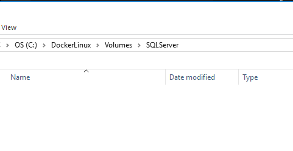
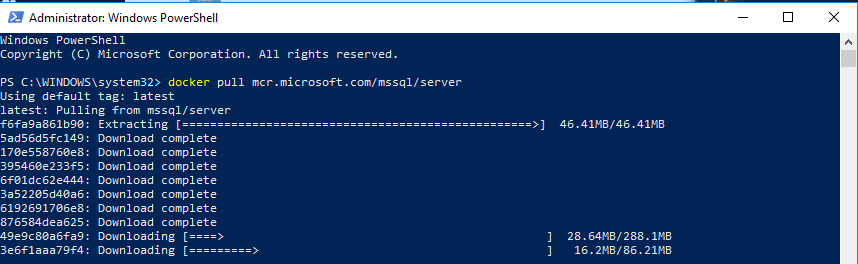
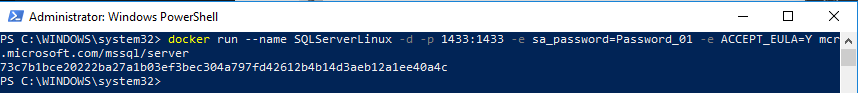

My [previous article](TO DO) walked through how to SQL Server up and running in a Windows based Docker Container.  However, Docker was designed to host Linux based containers.  Linux based containers offer much less overhead, have more features available, more images are created for them, and there are more examples using them.  The previous article's goal was to learn the basics of Docker.  It felt like too much to learn Docker AND Linux at the same time.  

SQL Server can run on Linux based containers.  In this article I will go through what is necessary to SQL Server up and running in a Linux based container.

!toc

## Prep Work

This article will be using [Docker Desktop](https://hub.docker.com/editions/community/docker-ce-desktop-windows).  [My previous article](TO DO) walks through what is needed to install Docker Desktop.  I don't want to repeat that here.

The only downside with Docker Desktop is you can either run Windows containers or Linux containers.  If you are running Windows containers you will need to switch over to Linux containers by right clicking on the Docker icon in the task bar and selecting `Switch to Linux containers...`.



By default, Docker treats all containers as stateless.  Expect any changes made to the container, such as creating a database, to be destroyed.  We are going to solve that problem using volumes.  Once you have switched over to Linux Containers, right-click on the Docker desktop icon in the the task bar and go to settings.  In settings select the shared drives option.  Click the checkbox to share the drive of your choice with Docker.  In my case, I only have the `C:\` drive.


I want to store the databases in the folder `C:\DockerLinux\Volumes\SQLServer` folder on my `C:\` drive.  I don't want to give Docker access to everything on my `C:\` drive.



## Configuring the SQL Server Developer Container
Just like before, I want to be able to use this for actual development work.  In the last article I ended up creating a Docker Compose file to kick off SQL Server.  Rather than starting there, I want to do the same process as before. Methodically get SQL Server up and running in a Linux container.  This will make it easy to troubleshoot when I hit that eventual brick wall.  

1. Get the container up and running with no extra configuration.
2. Connect to it via SSMS.
3. Persist databases created in a container.
4. Have a static IP or hostname to keep configuration easy.

### Running SQL Server Developer Container for the first time
First, let's run a simple command to pull down the SQL Server Windows Developer image from Docker Hub.

```PowerShell
docker pull mcr.microsoft.com/mssql/server
```

The Windows based image for SQL Server took a long time to download.  Not so with the SQL Server Linux based container.  It took me longer to type this paragraph and capture the screenshot.



The [documentation provided](https://hub.docker.com/_/microsoft-mssql-server) for the Linux based container for SQL Server makes it easy to get the container up and running.  Please make a note of the `--name` parameter being sent in.  That parameter will make it easier later when we need to figure out how to connect to it.  Along with naming the instance, I will be setting the port to the default SQL Server port, `1433`.  

:::warning
The environment variable names are case-sensitive; sa_password will not work, it has to be SA_PASSWORD.
:::

```PowerShell
docker run --name SQLServerLinux -d -p 1433:1433 -e "SA_PASSWORD=Password_01" -e "ACCEPT_EULA=Y" mcr.microsoft.com/mssql/server
```



### Connecting to the container from SSMS on the host

The SQL Server container is running.  But how can SSMS running on the host connect to it?  In the above command we supplied the `-p` parameter, which exposes the port to the host on `localhost`.  To connect to SQL Server running in a Linux container from SSMS we just need to type in `localhost` and provide the sa username/password.


Just like regular SQL Server, everything works as expected.  I can create a database and tables without any issue.


### Persisting databases created in a container

What happens if the container needs to be restarted?

```PowerShell
docker stop SQLServerLinux
docker start SQLServerLinux
```

The database still exists after the restart.  


If the container needs to be re-created, for an upgrade or a configuration change then we would need to call the `rm` command to remove it after stopping it.  

```PowerShell
docker stop SQLServerLinux
docker rm SQLServerLinux
docker run --name SQLServerLinux -d -p 1433:1433 -e "SA_PASSWORD=Password_01" -e "ACCEPT_EULA=Y" mcr.microsoft.com/mssql/server
```

When that happens, all the databases in that container are deleted.


## Wrapping Up


Until next time, Happy Deployments!