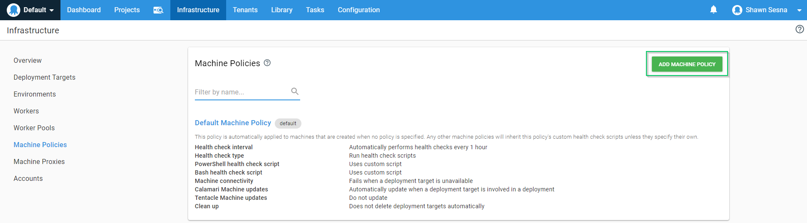

## Introduction
Manually installing Tentacle on deployment targets is fairly painless when you have a small amount of machines, just a couple of clicks and you're done.  However, it is not uncommon for the number of machines to increase exponentially as adoption of Octopus Deploy becomes more prevalent, especially in large organizations.  In more advanced implementations, targets are sometimes created dynamically as part of scaling and having to manually install Tentacle just isn't feasible.  This is where Infrastructure as Code (IaC) comes in handy.

Infrastructure as Code is an awesome and powerful concept.  Having the ability to programmatically define how your Infrastructure should be set up leads to consistency and predictability for application deployments.  One method of IaC is PowerShell Desired State Configuration (DSC).  Not only can DSC configure a machine, it also gives us the added benefit of being able to monitor the machine for drift and correct it automatically.  In this post, I'll be walking you through using the OctopusDSC DSC module to install and configure a tentacle machine.

!toc

## Install the NuGet Package Provider
There is a drawback to using DSC, any external module that you use will need to be present on the machine before the DSC script will run.  What this means is that you have to separate the installation of the external module from the DSC script itself.

In order to download external modules, we first need to install the NuGet package provider.  Depending on your server configuration, it may be necessary to include use of TLS 1.2.

```PS
# Include use of TLS 1.2
[System.Net.ServicePointManager]::SecurityProtocol = [System.Net.ServicePointManager]::SecurityProtocol -bor [System.Net.SecurityProtocolType]::Tls12


# check to see if Nuget is installed
if($null -eq (Get-PackageProvider | Where-Object {$_.Name -eq "NuGet"}))
{
    # install the nuget package provider
    Install-PackageProvider -Name NuGet -Force
}
```

## Download OctopusDSC module
Great!  Now that we have the NuGet package provider installed, we'll be able to contact the PowerShell gallery to download and install the modules that we need.

```PS
if ($null -eq (Get-Package | Where-Object {$_.Name -eq "OctopusDSC"}))
{
    # download specified module
    Install-Module -Name "OctopusDSC" -Force
}
```

## Setting up the DSC resource
Now that we've taken care of the pre-requisite components, it's time to set up our OctopusDSC cTentacleAgent resource!  There are a bunch of parameters that we can pass to this resource outlined [here](https://github.com/OctopusDeploy/OctopusDSC/blob/master/README-cTentacleAgent.md).  For this example, we'll be configuring a Listening tentacle as a deployment target.  If we wanted this to be a worker instead, we'd empty out the Role and Environment arrays and define the entries we want in the WorkerPools array.

```PS

# configure Ocotpus Deploy
Configuration OctopusSetup
{
    # define parameters
    Param([string]$OctopusAPIKey,
        [string[]]$OctopusRoles,
        [string[]]$OctopusEnvironments,
        [string]$OctopusServerUrl,
        [string]$DefaultApplicationDirectory,
        [string]$TentacleHomeDirectory,
        [string[]]$WorkerPools,
        [PSCredential]$TentacleServiceCredential,
        [string]$TentacleInstanceName = "Default",
        [ValidateSet("Listen", "Poll")]
        [string]$CommunicationMode = "Listen",
        [ValidateSet("PublicIp", "FQDN", "ComputerName", "Custom")]
        [string]$PublicHostNameConfiguration = "ComputerName"
    )

    # import necessary resources
    Import-DscResource -Module OctopusDSC
    Import-DscResource -ModuleName PSDesiredStateConfiguration

    # create localhost configuration node
    Node 'localhost'
    {
        cTentacleAgent OctopusTentacle
        {
            Name = $TentacleInstanceName
            DisplayName = $env:COMPUTERNAME
            Ensure = "Present"
            State = "Started"
            ApiKey = $OctopusAPIKey
            OctopusServerUrl = $OctopusServerUrl
            Environments = $OctopusEnvironments
            Roles = $OctopusRoles
            CommunicationMode = $CommunicationMode
            DefaultApplicationDirectory = $DefaultApplicationDirectory
            TentacleHomeDirectory = $TentacleHomeDirectory
            WorkerPools = $WorkerPools
            PublicHostNameConfiguration = $PublicHostNameConfiguration
            TentacleServiceCredential = $TentacleServiceCredential
        }
    }
}


# Example roles
$OctopusRoles = @("ExampleRole")

# Example Environments
$OctopusEnvironments = @("Development")

# Example worker pools
$WorkerPools = @()

# Set the APIKey
$OctopusAPIKey = "API-XXXXXXXXXXXXXXXXXXXXXX"

# Set the Octopus Server URL
$OctopusServerUrl = "https://<YourOctoupsServer>"

# Set directories
$DefaultApplicationDirectory = "c:\octopus"
$TentacleHomeDirectory = "c:\octopus\tentaclehome"

# run configuration
OctopusSetup -OctopusAPIKey $OctopusAPIKey -OctopusRoles $OctopusRoles -OctopusEnvironments $OctopusEnvironments -OctopusServerUrl $OctopusServerUrl -OutputPath "c:\dsc" -DefaultApplicationDirectory $DefaultApplicationDirectory -TentacleHomeDirectory $TentacleHomeDirectory -WorkerPools $WorkerPools -TentacleServiceCredential $serviceCredential

# start the configuration
Start-DscConfiguration -Path "c:\dsc" -Verbose -Wait

```

# Putting it all together
So far, we've set up individual components which is good so that you get an understanding of what we're trying to do.  Now, let's take all of this and put it into a single script!

:::hint
Even though we will be running the script blocks on a remote computer, the PowerShell is evaluated on our local machine first.  If you recall my statement about how the DSC resource must exist before it'll work, this means we need to have the OctopusDSC resource on the machine we're running from.  Annoying, I know, but that's how it works.
:::

```PS
# Get credentials that have rights to the server
$elevatedCredentials = Get-Credential

# Create remote session
$remoteSession = New-PSSession -ComputerName <ComputerName> -Credential $elevatedCredentials

# Download and install the Nuget package provider
Invoke-Command -Session $remoteSession -ScriptBlock {
    # Include use of TLS 1.2
    [System.Net.ServicePointManager]::SecurityProtocol = [System.Net.ServicePointManager]::SecurityProtocol -bor [System.Net.SecurityProtocolType]::Tls12

    # check to see if Nuget is installed
    if((Get-PackageProvider | Where-Object {$_.Name -eq "NuGet"}) -eq $null)
    {
        # install the nuget package provider
        Install-PackageProvider -Name NuGet -Force
    }
}

# Download and install the OctopusDSC module
Invoke-Command -Session $remoteSession -ScriptBlock{
    if ($null -eq (Get-Package | Where-Object {$_.Name -eq "OctopusDSC"}))
    {
        # download specified module
        Install-Module -Name "OctopusDSC" -Force
    }
}

# Run the DSC configuration
Invoke-Command -Session $remoteSession -ScriptBlock{

    # configure Ocotpus Deploy
    Configuration OctopusSetup
    {
	    # define parameters
	    Param([string]$OctopusAPIKey,
		    [string[]]$OctopusRoles,
		    [string[]]$OctopusEnvironments,
		    [string]$OctopusServerUrl,
		    [string]$DefaultApplicationDirectory,
		    [string]$TentacleHomeDirectory,
		    [string[]]$WorkerPools,
		    [PSCredential]$TentacleServiceCredential,
            [string]$TentacleInstanceName = "Default",
            [ValidateSet("Listen", "Poll")]
            [string]$CommunicationMode = "Listen",
            [ValidateSet("PublicIp", "FQDN", "ComputerName", "Custom")]
            [string]$PublicHostNameConfiguration = "ComputerName"
	    )

	    # import necessary resources
	    Import-DscResource -Module OctopusDSC
	    Import-DscResource -ModuleName PSDesiredStateConfiguration

	    # create localhost configuration node
	    Node 'localhost'
	    {
            cTentacleAgent OctopusTentacle
		    {
			    Name = $TentacleInstanceName
                DisplayName = $env:COMPUTERNAME
                Ensure = "Present"
			    State = "Started"
			    ApiKey = $OctopusAPIKey
			    OctopusServerUrl = $OctopusServerUrl
			    Environments = $OctopusEnvironments
			    Roles = $OctopusRoles
                CommunicationMode = $CommunicationMode
                DefaultApplicationDirectory = $DefaultApplicationDirectory
                TentacleHomeDirectory = $TentacleHomeDirectory
			    WorkerPools = $WorkerPools
                PublicHostNameConfiguration = $PublicHostNameConfiguration
                TentacleServiceCredential = $TentacleServiceCredential
		    }
	    }
    }

    # Example roles
    $OctopusRoles = @("ExampleRole")

    # Example Environments
    $OctopusEnvironments = @("Development")

    # Example worker pools
    $WorkerPools = @()

    # Set the APIKey
    $OctopusAPIKey = "API-XXXXXXXXXXXXXXXXXXXXXX"

    # Set the Octopus Server URL
    $OctopusServerUrl = "https://YourOctopusServer"

    # Set directories
    $DefaultApplicationDirectory = "c:\octopus"
    $TentacleHomeDirectory = "c:\octopus\tentaclehome"

    # run configuration
    OctopusSetup -OctopusAPIKey $OctopusAPIKey -OctopusRoles $OctopusRoles -OctopusEnvironments $OctopusEnvironments -OctopusServerUrl $OctopusServerUrl -OutputPath "c:\dsc" -DefaultApplicationDirectory $DefaultApplicationDirectory -TentacleHomeDirectory $TentacleHomeDirectory -WorkerPools $WorkerPools -TentacleServiceCredential $serviceCredential

    # start the configuration
    Start-DscConfiguration -Path "c:\dsc" -Verbose -Wait
}

```

Using this script, we can install and configure a tentacle machine without having to RDP to it!  This is especially useful in the scaling scenarios I spoke of in the beginning! 

## Testing for drift and Octopus machine policies
As the name implies, DSC is what we want the desired state to be.  For example, the above configuration configured the tentacle to have the role and only the role of ExampleRole.  If someone were to add an additional role to this tentacle, it would no longer be in the desired state.  We're able to determine this by running

```PS
(Test-DscConfiguration -Detailed).ResourcesNotInDesiredState
```
Using the Machine Policy feature of Octopus Deploy, we can create a new policy that will automatically correct drift if it is detected.

To accomplish this, navigate to the Infrastructure tab and click on Macine Policies.  Once there, click the Add Machine Policy button



Select the Use Custom Script radio button and paste the following


```PS
$tentacleConfiguration = (Test-Configuration -Detailed)

if ($null -ne $tentacleConfiguration.ResourcesNotInDesiredState)
{
    # Display what resources are not in desired state
    foreach ($resource in $tentacleConfiguration.ResourcesNotInDesiredState)
    {
        Write-Warning "Resource $($resource.ResourceId) is not in desired state!"
    }

    Write-Output "Running last DSC configuration to correct drift..."
    Start-DscConfiguration -Path "c:\dsc"
}
```
Now, when drift is detected it will automatically run the last DSC configuration for us and put the machine back in the desired state!  In our example above, where someone added an additional role to a Tentacle, this policy will detect the drift and remove the added role.  If the role is something that is needed, you will need to add it to the `$OctopusRoles` variable in our original script and then run the new configuration to set the new desired state.

## Summary
In this post I demonstrated how to install and configure a Tentacle machine with one simple script as well as a method for detecting drift.  Utlizing a method such as DSC helps to ensure that all of your installations are done consistently.