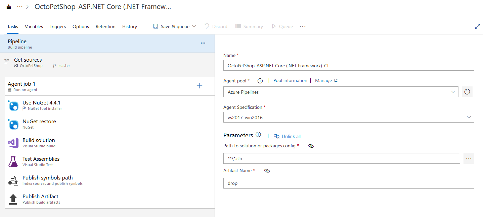

You might have heard about Make and makefiles in the past, but don't worry if you haven't because you are about to. Make is a build automation tool, and a makefile is a file that contains the instructions Make needs to build an application. It can also be used to run related tasks like cleaning the build directory.

Many variants of Make have appeared over the years as developers have wanted to use their preferred languages to define their build process. Rake (Ruby Make) became very popular alongside Ruby on Rails.

In the .NET world, you have a few options based on your language of choice. There's [PSake](https://github.com/psake/psake) (PowerShell), [FAKE](https://fake.build/) (F#), and [Cake](https://cakebuild.net/) (C#). We're focusing on Cake today, but check out the others if you'd rather script with PowerShell or F#.

## Benefits of Cake

One of the top benefits of using Cake is that you can use the same script to build your applications locally and from your CI server. Think about that for a second. Barring any environmental issues on your build agent, the same Cake script will run on your machine, your team member's machine, and on your CI server. Your CI project configuration could be simplified to Step 1, check out from source control and Step 2, run this Cake script.

Speaking of source control, your Cake script lives in your project repository. Your build process is versioned and can be changed and reviewed with the same code review process as your application code. Committing your script also couples your application code with the build process so that you won't have to change the build steps separately in your CI server. This linking of the application and build script is one of the reasons that YAML is becoming a popular choice for modeling build pipelines. Cake has the added benefit that you can run those build steps right on your machine.

## Example Cake Script

You can see a full example Cake script for our OctoPetShop sample project at Github.

### Tools, Addins, and Modules

The first section in your Cake script will be to import any external tools, addins, or modules that you will use in your build process. In our case, we have added a #tool directive and specified that we want OctopusTools version 6.13.1 from NuGet. Then we add a using statement for the `Cake.Common.Tools.OctopusDeploy` namespace.

```cs
#tool "nuget:?package=OctopusTools&version=6.13.1"

using Cake.Common.Tools.OctopusDeploy;
```

We're only using the Octopus Deploy tooling in this script so far, but Cake has built-in support for many tools including NuGet, testing frameworks, and more.

### Arguments and Global Variables

In the next section, we set up some arguments and variables to use during the script execution.

With the Argument alias, Cake will give you the value of an argument that was provided to from the command line or a default value that you specify. We have arguments for the target task to run, what build configuration to use, what version and prerelease tag to use for versioning, and information for integrating with our Octopus server.

After that, we have a simple class for collecting information on our projects and a few variables that we'll populate in `Setup`.

```cs
var target = Argument("target", "Default");
var configuration = Argument("configuration", "Release");
var version = Argument("packageVersion", "0.0.1");
var prerelease = Argument("prerelease", "");
var databaseRuntime = Argument("databaseRuntime", "win-x64");
var octopusServer = Argument("octopusServer", "https://your.octopus.server");
var octopusApiKey = Argument("octopusApiKey", "hey, don't commit your API key");

class ProjectInformation
{
    public string Name { get; set; }
    public string FullPath { get; set; }
    public string Runtime { get; set; }
}

string packageVersion;
List<ProjectInformation> projects;
```

### Setup

Let's take a look at that `Setup` method.

We check if we're running the build locally. If we are and no prerelease tag was provided, we set the prerelease tag to "-local."

Then we set our global variables `packageVersion` and `projects`.

```cs
Setup(context =>
{
    if (BuildSystem.IsLocalBuild && string.IsNullOrEmpty(prerelease))
    {
        prerelease = "-local";
    }

    packageVersion = $"{version}{prerelease}";

    projects = GetFiles("./**/*.csproj").Select(p => new ProjectInformation
    {
        Name = p.GetFilenameWithoutExtension().ToString(),
        FullPath = p.GetDirectory().FullPath,
        Runtime = p.GetFilenameWithoutExtension().ToString() == "OctopusSamples.OctoPetShop.Database" ? databaseRuntime : null
    }).ToList();

    Information("Building OctoPetShop v{0}", packageVersion);
});
```

### Tasks

Tasks define your build process. They are analogous to build steps in your traditional CI project or pipeline.

Let's take a look at our first task, `Clean`. We define it with the `Task` method and provide a name. Then we use the `Does` method to define what this task does. In this case, we're cleaning our publish and package directories and then calling `DotNetCoreClean` for our projects.

```cs
Task("Clean")
    .Does(() =>
        {
            CleanDirectory("publish");
            CleanDirectory("package");

            var cleanSettings = new DotNetCoreCleanSettings { Configuration = configuration };

            foreach(var project in projects)
            {
                DotNetCoreClean(project.FullPath, cleanSettings);
            }
        });
```

### Dependencies

Let's skip down to the `Build` task. It looks similar to `Clean`, but it has a new piece - `IsDependentOn`. This method lets us create a dependency chain between our tasks. When we call the `Build` task, Cake will make sure that both `Clean` and `Restore` have been called first.

```cs
Task("Build")
    .IsDependentOn("Clean")
    .IsDependentOn("Restore")
    .Does(() =>
    {
        foreach(var project in projects)
        {
            var buildSettings = new DotNetCoreBuildSettings()
                {
                    Configuration = configuration,
                    NoRestore = true
                };

            if (!string.IsNullOrEmpty(project.Runtime))
            {
                buildSettings.Runtime = project.Runtime;
            }

            DotNetCoreBuild(project.FullPath, buildSettings);
        }
    });
```

We have another task named `Publish` that depends on `Build`. Running the `Publish` task will run `Clean`, `Restore`, and `Build` first.

```cs
Task("Pack")
    .IsDependentOn("Publish")
    .Does(() =>
    {
        foreach(var project in projects)
        {
            OctoPack(
                project.Name,
                new OctopusPackSettings()
                {
                    Format = OctopusPackFormat.NuPkg,
                    BasePath = System.IO.Path.Combine("./publish", project.Name),
                    OutFolder = "./package",
                    Version = packageVersion
                });
        }

        // pack infrastructure
        OctoPack(
            "OctopusSamples.OctoPetShop.Infrastructure",
            new OctopusPackSettings()
            {
                Format = OctopusPackFormat.NuPkg,
                BasePath = System.IO.Path.Combine("./publish", "OctopusSamples.OctoPetShop.Infrastructure"),
                OutFolder = "./package",
                Version = packageVersion
            });
    });
```

Finally, we have these lines at the end of our script. This creates a Default task that will run the Build task and its dependencies.

The last line calling the RunTarget method is what kicks off the build process. Here we pass in the global variable `target` which is provided by the user, CI server, or defaults to "Default".

```cs
Task("Default")
    .IsDependentOn("Build");

RunTarget(target);
```

## Executing Cake Locally

Cake provides a [PowerShell or shell bootstrap script](https://cakebuild.net/docs/tutorials/setting-up-a-new-project) that you can use to execute your Cake script.

```ps
.\build.ps1 -Target Pack -ScriptArgs '--packageVersion=1.2.3 --prerelease=-dev'
```

That's it! The script starts up and after a short wait, we have our NuGet packages built locally and this handy report.

```
Task                          Duration
--------------------------------------------------
Setup                         00:00:00.1393865
Clean                         00:00:04.3372474
Restore                       00:00:04.7199868
Build                         00:00:10.4872332
Publish                       00:00:06.7151122
Pack                          00:00:12.4005419
--------------------------------------------------
Total:                        00:00:38.7995080
```

We can upload those packages to our Octopus server directly or commit our changes, knowing that our build works.

There are also extensions for Visual Studio and Visual Studio Code that provide IntelliSense, syntax highlighting, and the ability to run your script from the IDE.

## Executing Cake from a CI Server

Now that we have our Cake script running locally, we can take it to our CI server. In this example, we are using Azure DevOps, which has an extension to run Cake scripts.

Here's a snippet of the steps generated when you create a new ASP.NET Core build pipeline. It's very similar to the steps we created in our Cake script.



After installing the Cake extension, we can add a Cake step to our build, and in this case, it's the only step that we need. We provide the path to the cake script, the target we want to run, and some additional arguments for the version number and Octopus server information.


After running a build, not only do we get the full output of the cake script in the logs, we also get our task summary just as we did when running locally.

```
Task                          Duration
--------------------------------------------------
Setup                         00:00:00.0403755
Clean                         00:00:13.3532270
Restore                       00:01:08.3918289
Build                         00:00:27.3176623
Publish                       00:00:06.2938190
Pack                          00:00:11.7965962
PushPackages                  00:00:14.1897835
CreateRelease                 00:00:05.4657168
DeployRelease                 00:02:08.3872655
--------------------------------------------------
Total:                        00:04:35.2362747
```

## Wrap Up

Build automation frameworks like Cake let your team apply your development process to build scripts and run builds locally with the same steps as your CI server without losing the benefits of a CI server or access to other tools.
