Elastic Beanstalk is a Platform as a Service (PaaS) offering from AWS that allows developers to deploy code written in a variety of languages such as .NET, Java, PHP, Node.js, Go, Python and Ruby onto preconfigured infrastructure. You simply upload your application, and Elastic Beanstalk automatically handles the details of capacity provisioning, load balancing, scaling, and application health monitoring.

The lifecycle of a Beanstalk application shares much in common with Octopus. Beanstalk defines the idea of an application being deployed to multiple isolated environments, with each environment potentially having unique settings. The overlap means Octopus can add a lot of value to deployments in Beanstalk.

However Beanstalk has some unique requirements that we need to take into account in order to properly integrate it with Octopus. In this blog post we'll explore a sample deployment script that allows Octopus to deploy a .NET Core application to AWS Elastic Beanstalk.

## An overview of the Beanstalk infrastructure

Before we can deploy to Beanstalk we need to understand how Beanstalk is organized.

At the top level of any Beanstalk infrastructure is the Application. Conceptually, an Application is a space that contains Application Versions and Environments. Typically an Application would be named to identify the deployment that it represents. In this blog post we will be deploying the [Random Quotes](https://github.com/OctopusSamples/RandomQuotes) application, so the Beanstalk Application will be called Random Quotes.

An Application Version is a copy of the code that is deployed to an Environment. Each Application Version has a unique Version Label. The Version Label doesn't mandate any particular versioning scheme though, just that each is unique.

Finally we have the Environments. An Environment is the physical infrastructure that runs your code. Beanstalk provides a wide variety of environment platforms preconfigured for the supported programming languages, as well as supporting Docker containers. You also have the option of creating your own custom platform for more advanced scenarios. Each Environment is independent of the others, and can have any Application Version deployed to them.


*The Beanstalk deployment lifecycle.*

## The Beanstalk application packaging requirements

The other major consideration we need to take into account is how Beanstalk expects packages to be structured for deployment.

The types of packages accepted by Beanstalk depends largely on the programming language that was used to create the code.

For simple deployments, Beanstalk will accept a standard ZIP file, or in the case of Java a JAR or WAR file. These files work well with Octopus, as they can all be stored in the built in feed and easily consumed in deployment steps.

However in some cases Beanstalk expects to receive nested archives, and .NET Core deployments are one such case where nested archives are required.

In the case of .NET Core, the deployable artifact is a ZIP file containing a JSON manifest file and a second nested ZIP file containing the application code. You can see these files in the screenshot below. The file `aws-windows-deployment-manifest.json` is the Beanstalk manifest file, and the file `site.zip` contains the .NET Core code.

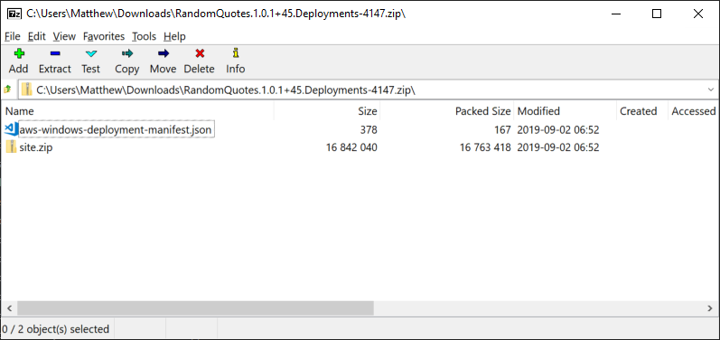

*The contents of a ZIP file containing a .NET Core application to be deployed to Beanstalk.*

We will have to keep these nested archives in mind in order to take full advantage of the features provided by Octopus as part of the deployment process.

## The sample application

The sample application we will be deploying is called [Random Quotes](https://github.com/OctopusSamples/RandomQuotes). This is a simple .NET Core web application, which hasn't necessarily been designed to be deployed to Beanstalk.

The generic nature of this application highlights some challenges that deployments to Beanstalk must take into account, specifically concerning how environment specific settings can be implemented without maintaining environment specific artifacts.

Beanstalk Environments can define their own set of environment variables, which is the preferred way to configure the environment specific aspects of the applications they run. Storing all configuration in environment variables is the approach recommended by the [12 Factor App](https://12factor.net/config) methodology.

But our sample application still has configuration baked into files, specifically the [appsettings.json](https://github.com/OctopusSamples/RandomQuotes/blob/master/RandomQuotes/appsettings.json) file. While we could leverage the `ASPNETCORE_ENVIRONMENT` environment variable to [select an appropriate settings file](https://visualstudiomagazine.com/articles/2019/03/01/managing-production-and-development.aspx), for this deployment process we'll customize the `appsettings.json` file directly during deployment.

To allow Octopus to modify files during deployment, we can not package the compiled code in a nested ZIP archive. Octopus has may features to replace values in files like [variable substitution](https://octopus.com/docs/deployment-process/configuration-features/substitute-variables-in-files) and [JSON configuration variables](https://octopus.com/docs/deployment-process/configuration-features/json-configuration-variables-feature), but these features all rely on processing archives that contain text files rather than additional nested archives.

This means that the packaged code hosted by Octopus will contain the files generated by calling `dotnet package`. It is then going to be up to us to repackage this file into the nested archive required by Beanstalk.

Random Quotes has leveraged GitHub Actions to build the code, and you can see the workflow [here](https://github.com/OctopusSamples/RandomQuotes/blob/master/.github/workflows/aspnetcore.yml). There are 4 important jobs in this workflow that highlight how we package this application.

First, we build the code.

```YAML
- name: Build with dotnet
  run: dotnet build --configuration Release
```

Next, we package the code to place all the files required to run this application into a directory called `site`.

```YAML
- name: Publish with dotnet
  run: dotnet publish -o site --configuration Release
```

The directory called `site` is bundled up into a ZIP file by the Octo CLI.

```YAML
- name: Pack Beanstalk App
  run: >-
    /opt/octo/Octo pack .
    --outFolder /home/runner/work/RandomQuotes/RandomQuotes
    --basePath /home/runner/work/RandomQuotes/RandomQuotes/RandomQuotes/site
    --id RandomQuotes
    --version $(cat /home/runner/work/RandomQuotes/RandomQuotes/version.txt)
    --format zip
```

And the package is pushed to the Octopus server.

```YAML
- name: Push to Octopus
  run: >-
    if [[ ! -z "${{ secrets.OctopusUrl }}" && ! -z "${{ secrets.OctopusApiKey }}" ]]; then
    /opt/octo/Octo push
    --server ${{ secrets.OctopusUrl }}
    --apiKey ${{ secrets.OctopusApiKey }}
    --package /home/runner/work/RandomQuotes/RandomQuotes/RandomQuotes.$(cat /home/runner/work/RandomQuotes/RandomQuotes/version.txt).zip
    --overwrite-mode IgnoreIfExists;
    fi
```

The end result of this process is a ZIP file containing the DLLs and other configuration files required to run the application. In the screenshot below you can see the contents of this ZIP file.

Importantly, this ZIP file is not something we can deploy to Beanstalk in its current form. Creating an archive that can be deployed to Beanstalk is done as part of the Octopus deployment.

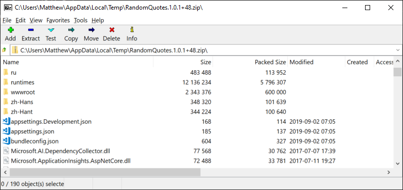

## Creating the Beanstalk Application

We now need to create the Beanstalk Application and Environments. There are many ways to create the Beanstalk infrastructure, but for the sake of simplicity we have created it here via the AWS console.

So we have an Application called `Random Quotes` with two Environments: `Development` and `Test`.

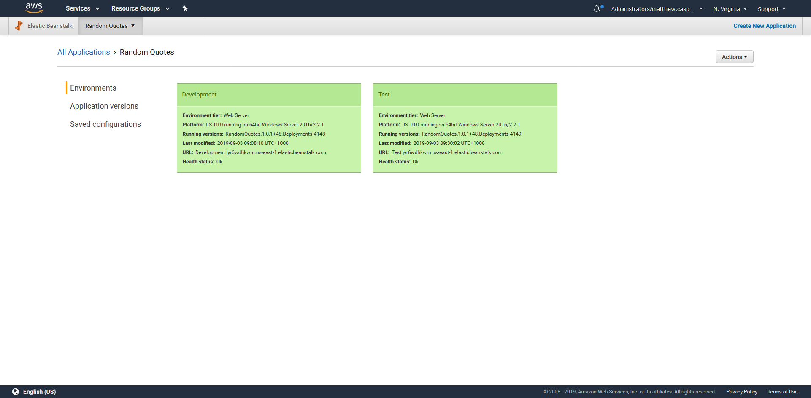

## Preparing the Octopus project

Before we can start deploying anything, our Octopus project needs to have a number of variables configured. Here is a table of the variables that we must define.

|Name|Description|
|-|-|
| `Application`  | The name of the Beanstalk Application  |
| `AppSettings:EnvironmentName`  | The value of the `EnvironmentName` property in the `appsettings.json` file. This variable is used by the JSON Configuration Variables feature. |
| `AWS`   | The AWS account that will be used to perform the deployments.   |
| `BucketName`   | The name of the S3 bucket that will hold the Beanstalk deployment archive.  |
| `Environment`   | A mapping of the Octopus environments to the Beanstalk Environments.  |

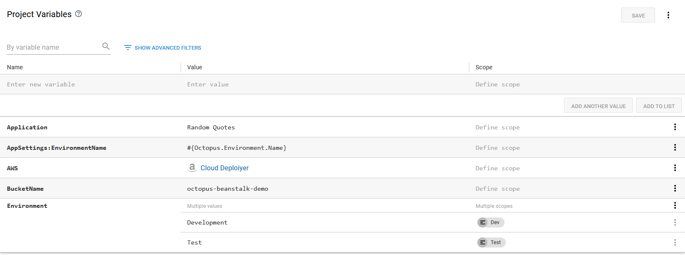

*The variables defined for the Octopus project.*

## The Octopus deployment

Now that we have the Beanstalk Application and Environments created, and our .NET Core application code packaged and uploaded to Octopus, it is time to implement the deployment.

Octopus does not have a dedicated step to deploy to Beanstalk, but we can take advantage of the `Run an AWS CLI script` step to use the bundled AWS CLI to perform the deployment.

The code below is the content of the Octopus step that will perform the deployment.

```powershell
<#
.DESCRIPTION Waits for the given environment to finish any processing
.PARAMETER application The name of the Beanstalk application
.PARAMETER environment The name of the Beanstalk environment
#>
function Wait-ForEnvironmentToBeReady ($application, $environment) {
    do {
      $result = aws elasticbeanstalk describe-environments `
          --environment-names $environment `
          --application-name $application `
          --output json |
          ConvertFrom-Json |
          Select-Object -ExpandProperty Environments |
          Select-Object -First 1

      if ($null -eq $result) {
          throw "Could not find the environment $environment in the application $application"
      }

      Write-Host "Environment $environment is $($result.Status)"
      Start-Sleep 10
    } while (-not ($result.Status -in @("Ready", "Terminated")))
  }

  <#
  .DESCRIPTION Creates a new application version
  .PARAMETER application The name of the Beanstalk application
  .PARAMETER version The name of the Beanstalk application version
  .PARAMETER s3Bucket The S3 bucket that holds the application code
  .PARAMETER s3Key The S3 file of the application code
  #>
  function New-ApplicationVersion($application, $version, $s3Bucket, $s3Key) {
    Write-Host "Creating application version $version"
    aws elasticbeanstalk create-application-version `
        --application-name $application `
        --version-label $version `
        --source-bundle S3Bucket="$s3Bucket",S3Key="$s3Key" |
        Out-Null

  }

  <#
  .DESCRIPTION Uploads a file to S3
  .PARAMETER file The file to upload
  .PARAMETER s3Bucket The S3 bucket that holds the application code
  .PARAMETER s3Key The S3 file of the application code
  #>
  function Add-File($file, $s3Bucket, $s3Key) {
    Write-Host "Uploading File"
    aws s3 cp $file "s3://$s3Bucket/$s3Key" | Out-Null
  }

  <#
  .DESCRIPTION Updates a Beanstalk environment with the supplied application version
  .PARAMETER application The name of the Beanstalk application
  .PARAMETER environment The name of the Beanstalk environment
  .PARAMETER version The name of the Beanstalk application version
  #>
  function Update-Environment($application, $environment, $version) {
    Write-Host "Updating Environment $environment to $version"
    aws elasticbeanstalk update-environment `
        --application-name $application `
        --environment-name $environment `
        --version-label $version |
        Out-Null
  }

  function New-ManifestFile($name, $file) {
      Set-Content -Path "aws-windows-deployment-manifest.json" -Value @"
      {
        "manifestVersion": 1,
        "deployments": {
            "aspNetCoreWeb": [
            {
                "name": "$name",
                "parameters": {
                    "appBundle": "$file",
                    "iisPath": "/",
                    "iisWebSite": "Default Web Site"
                }
            }
            ]
        }
    }
"@
  }

  $VersionLabel = $OctopusParameters["Octopus.Action.Package[RandomQuotes].PackageId"] +
      "." +
      $OctopusParameters["Octopus.Action.Package[RandomQuotes].PackageVersion"] +
      "." +
      $OctopusParameters["Octopus.Deployment.Id"]

  New-ManifestFile "random-quotes" "site.zip"

  # Compress the extracted DotNET application code
  Compress-Archive `
      -Path "$($OctopusParameters["Octopus.Action.Package[RandomQuotes].ExtractedPath"])\*" `
      -DestinationPath "site.zip"

  # Compress the application code with the manifest file to create the Beanstalk deployment    
  Compress-Archive `
      -Path "site.zip", "aws-windows-deployment-manifest.json" `
      -DestinationPath "$VersionLabel.zip"

  # Upload the Beanstalk deployment to S3    
  Add-File "$VersionLabel.zip" $BucketName "$VersionLabel.zip"

  # Use the new file in S3 to create a Beanstalk application version
  New-ApplicationVersion $Application $VersionLabel $BucketName "$VersionLabel.zip"

  # Wait for any pending changes to the environment to finish
  Wait-ForEnvironmentToBeReady  $Application $Environment

  # Deploy the application version to the environment
  Update-Environment $Application $Environment $VersionLabel

  # Wait for the new deployment to finish
  Wait-ForEnvironmentToBeReady  $Application $Environment
```

Let's break this code down. We'll start at the end where we call the custom functions that make up the deployment process, and then discuss the functions themselves.

### Creating the Application Version Label

To begin we create a Application Version Label. If you recall, this label has to be unique, but otherwise doesn't enforce any particular format. This code will create a label containing the Octopus package ID, the package version, and the Octopus deployment ID. This combination ensures that any given deployment performed by Octopus will result in a unique Version Label.

The end result of this is a string that looks like `RandomQuotes.1.0.1+45.Deployments-4147`.

```powershell
$VersionLabel = $OctopusParameters["Octopus.Action.Package[RandomQuotes].PackageId"] +
    "." +
    $OctopusParameters["Octopus.Action.Package[RandomQuotes].PackageVersion"] +
    "." +
    $OctopusParameters["Octopus.Deployment.Id"]
```

### Creating the manifest file

As we discussed earlier, the archive deployed to Beanstalk contains a manifest file and a nested archive containing the application code. The artifact we uploaded to Octopus contained only the compiled  .NET code, and not the manifest file. So here we create the [manifest file](https://docs.aws.amazon.com/elasticbeanstalk/latest/dg/dotnet-manifest.html#dotnet-manifest-dotnetcore).

```powershell
New-ManifestFile "random-quotes" "site.zip"
```

The `New-ManifestFile` function saves a JSON file called `aws-windows-deployment-manifest.json`.

```powershell
function New-ManifestFile($name, $file) {
    Set-Content -Path "aws-windows-deployment-manifest.json" -Value @"
    {
      "manifestVersion": 1,
      "deployments": {
          "aspNetCoreWeb": [
          {
              "name": "$name",
              "parameters": {
                  "appBundle": "$file",
                  "iisPath": "/",
                  "iisWebSite": "Default Web Site"
              }
          }
          ]
      }
  }
"@
}
```

The end result of calling the function is a file called `aws-windows-deployment-manifest.json` with the following contents:

```JSON
{
  "manifestVersion": 1,
  "deployments": {
      "aspNetCoreWeb": [
      {
          "name": "random-quotes",
          "parameters": {
              "appBundle": "site.zip",
              "iisPath": "/",
              "iisWebSite": "Default Web Site"
          }
      }
      ]
  }
}
```

### Creating the Beanstalk deployment archive

Now that we have the manifest file, we need to add it to ZIP archive along with a nested archive containing the application code.

The .NET application archive is included in this step as a reference package. We called this package `RandomQuotes` and have set it to be extracted during deployment, which means the contents of the package can be found under the path referenced by the `$OctopusParameters["Octopus.Action.Package[RandomQuotes].ExtractedPath"]` variable.

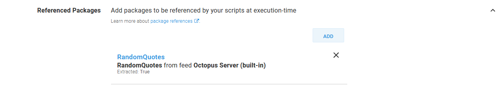

*The summary of the referenced package.*

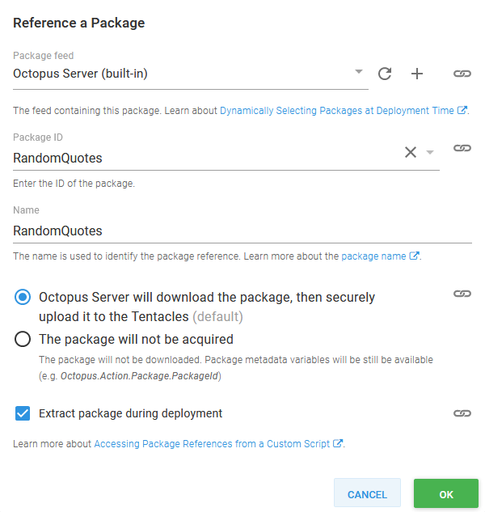

*The details of the referenced package.*

Because we have enabled the `JSON Configuration Variables` feature and configured it to process the file called `appsettings.json`, the value of the Octopus variable `AppSettings:EnvironmentName` will replace the existing `EnvironmentName` in the JSON file. In this way we have created an environment specific deployment from a generic application bundle.

:::hint
You can take advantage of the `Substitute Variables in Files` feature in the same way.
:::

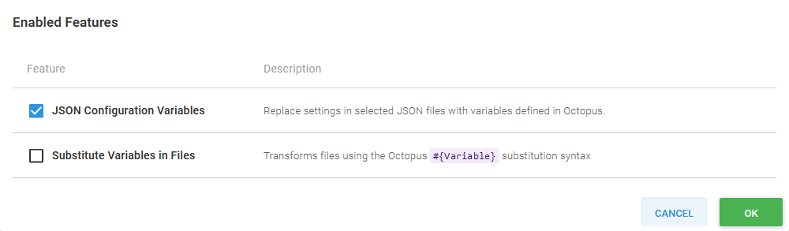

*The step features.*

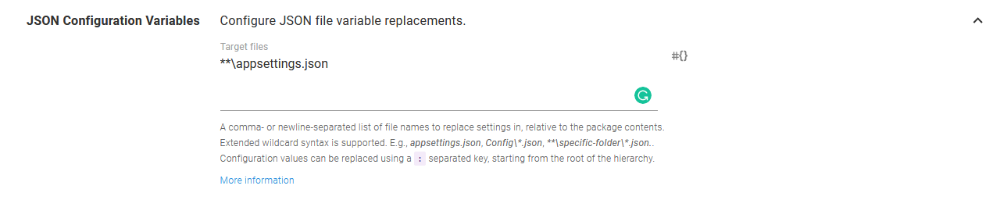

*The JSON Configuration Variables settings.*

Having taken advantage of Octopus to extract and process the contents of the .NET Core application package, we ZIP the files back into a file called `site.zip`.

```powershell
# Compress the extracted DotNET application code
Compress-Archive `
    -Path "$($OctopusParameters["Octopus.Action.Package[RandomQuotes].ExtractedPath"])\*" `
    -DestinationPath "site.zip"
```

Then we create a second archive containing the Beanstalk manifest file and the .NET Core application archive.

```yaml
# Compress the application code with the manifest file to create the Beanstalk deployment    
Compress-Archive `
    -Path "site.zip", "aws-windows-deployment-manifest.json" `
    -DestinationPath "$VersionLabel.zip"
```

The end result of this is a file called something like `RandomQuotes.1.0.1+45.Deployments-4147.zip`.

## Upload the file to S3

The Beanstalk application archive is first uploaded to S3. Most AWS services use S3 as a staging ground to consume application code, and Beanstalk is no different.

```powershell
# Upload the Beanstalk deployment to S3    
Add-File "$VersionLabel.zip" $BucketName "$VersionLabel.zip"
```

The `Add-File` function is a simple call to the AWS CLI to upload the file.

```powershell
function Add-File($file, $s3Bucket, $s3Key) {
  Write-Host "Uploading File"
  aws s3 cp $file "s3://$s3Bucket/$s3Key" | Out-Null
}
```

### Create the application versions

With the code in S3, we can create a new Application Version to associate the artifact with a Version Label.

:::hint
The variables `$Application` and `$BucketName` are provided by Octopus, and map to the values from the project variables.
:::

```powershell
# Use the new file in S3 to create a Beanstalk application version
New-ApplicationVersion $Application $VersionLabel $BucketName "$VersionLabel.zip"
```

The AWS CLI is used to consume the file we uploaded to S3 and assign it a Version Label. Once this is complete, our Beanstalk Application will have a new Application Version that can be deployed to an Environment.

```powershell
function New-ApplicationVersion($application, $version, $s3Bucket, $s3Key) {
  Write-Host "Creating application version $version"
  aws elasticbeanstalk create-application-version `
      --application-name $application `
      --version-label $version `
      --source-bundle S3Bucket="$s3Bucket",S3Key="$s3Key" |
      Out-Null
}
```

### Wait for the environment to be able to accept an new application version

If for some reason the Beanstalk Environment is already being updated (perhaps by a change made through the AWS console), we need to wait for it to be in the `Ready` state. We do this with a call to `Wait-ForEnvironmentToBeReady`.

:::hint
The variable `$Environment` has been provided by Octopus, and maps to the value of the variable scoped to the current deployment environment.
:::

```powershell
Wait-ForEnvironmentToBeReady  $Application $Environment
```

The `Wait-ForEnvironmentToBeReady ` function polls the Environment description waiting for the status to be either `Ready` or `Terminated`.

```
function Wait-ForEnvironmentToBeReady ($application, $environment) {
    do {
      $result = aws elasticbeanstalk describe-environments `
          --environment-names $environment `
          --application-name $application `
          --output json |
          ConvertFrom-Json |
          Select-Object -ExpandProperty Environments |
          Select-Object -First 1

      if ($null -eq $result) {
          throw "Could not find the environment $environment in the application $application"
      }

      Write-Host "Environment $environment is $($result.Status)"
      Start-Sleep 10
    } while (-not ($result.Status -in @("Ready", "Terminated")))
  }
```

### Create the application version, and update the environment

We now have a new Application Version created in Beanstalk, so the next step is to deploy it to an Environment. The call to `Update-Environment` is where the deployment to Beanstalk takes place.

```powershell
# Deploy the application version to the environment
Update-Environment $Application $Environment $VersionLabel
```

In Beanstalk, "updating" and Environment with an Application Version is how we deploy new code.

```powershell
function Update-Environment($application, $environment, $version) {
  Write-Host "Updating Environment $environment to $version"
  aws elasticbeanstalk update-environment `
      --application-name $application `
      --environment-name $environment `
      --version-label $version |
      Out-Null
}
```

### Wait for the deployment to finish

We make one last final call to `Wait-ForEnvironmentToBeReady ` to wait for the new Application Version to be deployed to the Environment. Once this call completes, the deployment is done.

```powershell
# Wait for the new deployment to finish
Wait-ForEnvironmentToBeReady  $Application $Environment
```

## Performing the deployment

Let's go ahead and perform the deployment to the `Dev` environment.

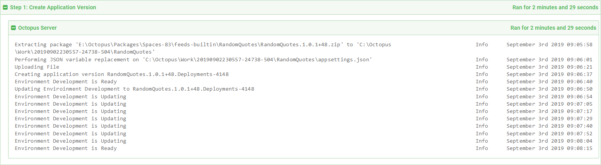

*The deployment logs.*

The log message `Performing JSON variable replacement on 'C:\Octopus\Work\20190902230557-24738-504\RandomQuotes\appsettings.json'` shows that Octopus has successfully processed the `appsettings.json` file and injected the values we wanted to override.

The Beanstalk application package was uploaded to S3.

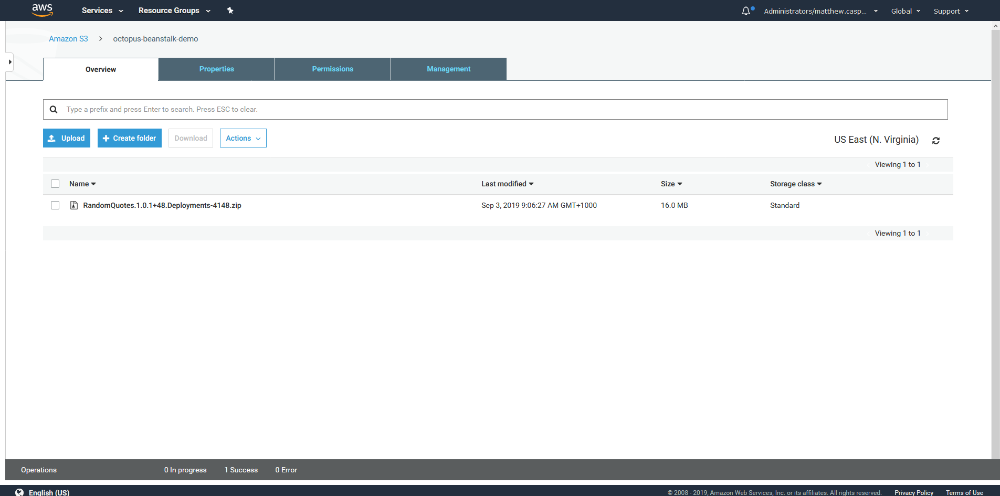

*The S3 bucket.*

The Application Version was created.

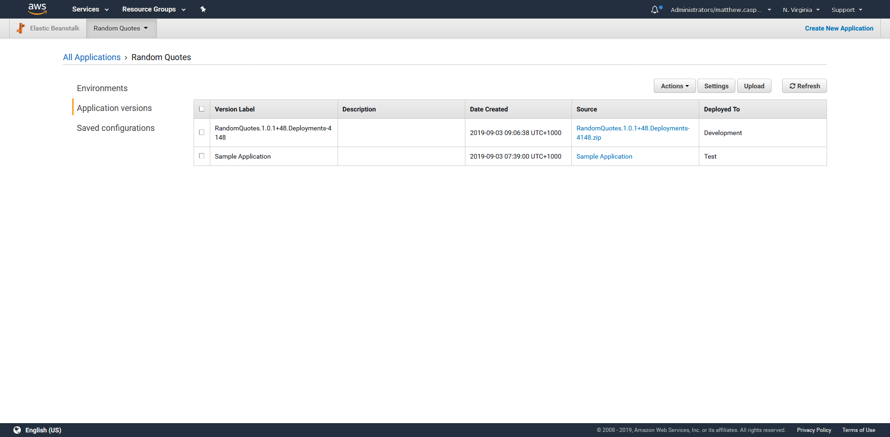

*The Application Versions.*

Finally the Environment was updated with the new Application Version.

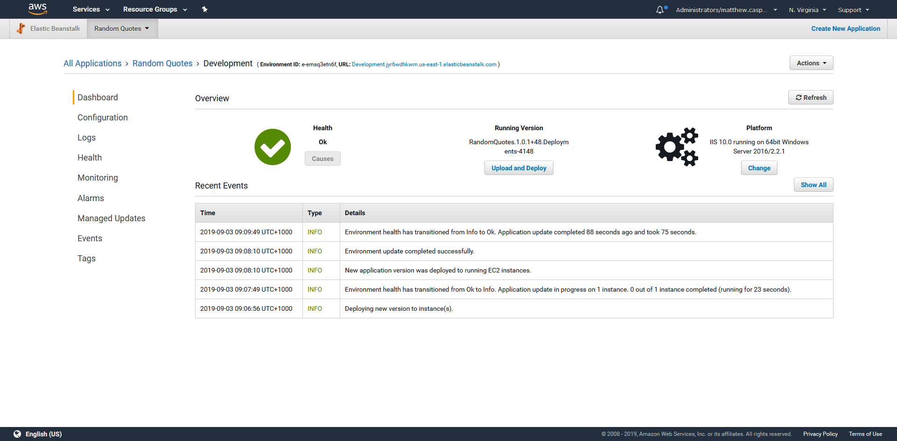

*The Environment.*

If we open up the resulting deployed application, we can see that it shows the environment we deployed to was called `Dev`. This is a subtle change from the default value in the `appsettings.json` file, which listed the environment as `DEV` (in all capitals).

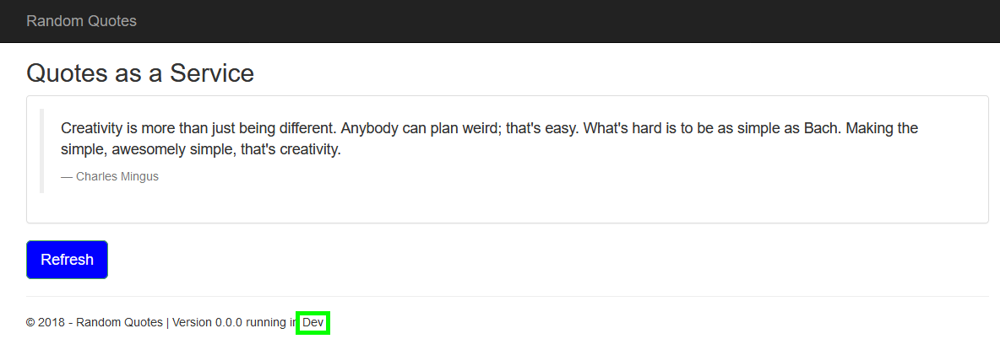

*The deployed application in the Dev environment.*

Promoting the deployment to the `Test` environment makes the substitution clearer.

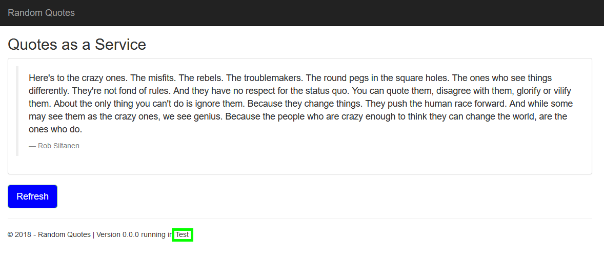

*The deployed application in the Test environment.*

## Conclusion

In this post we discused the high level architecture of the Beanstalk service, and then implemented a custom Powershell script that deploys an application to Beanstalk by:

* Creating a Beanstalk manifest file.
* Creating a Beanstalk archive including the .NET Core application archive and the manifest file.
* Uploading the file to S3.
* Creating an Application Version from the file in S3.
* Updating the Environment with the Application Version.

We've constructed this process in a such a way as to allow us to take advantage of the Octopus features like JSON Configuration Variables. This allowed us to deploy environment specific applications without relying solely on environment variables.
