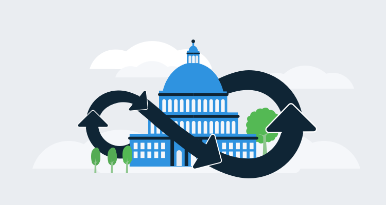

Governments are often slow-moving bureaucracies, but that doesn’t mean it’s impossible to implement better processes within government agencies. 

In 2011, I was hired as a Configuration Manager at a small US state government agency. I had a challenging mandate that took years to achieve:

- Automate the manual processes to improve the reliability of software deployment.
- Reduce the length of time it took to deliver software.
- Eliminate the need to deploy on weekends. 

In this post, I’ll cover the approaches I took to achieve this and some common pitfalls you might face in a similar environment.

## Prioritizing and tackling the biggest problems first

The agency I joined had a lot of problems, so the first thing I did was learn how everything was structured and operated. Then, I prioritized my first steps to improve things. The agency had several in-house applications, and their deployment process left them wide open to problems. Web app builds were done on developer machines, zipped, and copied to a file share. Database changes were handled by zipping up a bunch of scripts with a document listing the execution order, which was then copied to a file share for the DBAs to pick up. Inevitably, deployments failed for any one of the following reasons:

- A developer didn’t mention a third-party dependency that needed to be installed on the web server. 
- The scripts for the database changes weren’t tested against the current state of the production database.
- Good old-fashion human error. 

Things had to change.

## Early wins

I started at the beginning of the process with the builds so I could eliminate the adage, “worked on my machine, ops problem now.” The team used Microsoft Team Foundation Server for source control, which meant the build controller technology was already present. I installed the controller and a couple of agents so that all the software was built against an independent machine. This highlighted dependencies that were present on the developer machines and needed to be installed on the servers.

Next, I wrote a couple of small console applications to deploy the web code and the databases. The first used Microsoft Web Deploy to automate consistent deployments of the web code. We still updated connection strings manually, which isn’t great, but it was a start. The second console application ran a series of database scripts within a single transaction and rolled back the database deployment in the event of a failure. This method reduced the error rate and the time it took for deployments since the DBAs no longer had to open the scripts and manually execute them.

With these two improvements, the skepticism and reluctance to change started to fade. We later merged the console applications into a single automated deployment solution which further reduced the failed deployment rate and sped up the deployment process, all but eliminating the need for weekend work. This progress made for much [happier devs and operations folks](https://octopus.com/devops/continuous-delivery/why-adopt-continuous-delivery/).

## Building vs. buying tools

The team used my in-house deployment solution until a contractor demonstrated a tool he used for automating deployments, Octopus Deploy. I was reluctant to abandon my creation, but I’d also taken on the responsibilities of the Data Team supervisor, which meant I had less time to code, and I couldn’t keep up with feature requests. Octopus Deploy, on the other hand, had a team of developers doing this as their full-time job. Setting aside my pride, I duplicated the functionality of my solution in only a few weeks with Octopus, and full Octopus adoption followed a few months later.

I was happy to implement some early improvements with the in-house tools I developed, but moving to an off-the-shelf solution was the right move for the long term.

## From confrontation to collaboration

As we automated more processes, the tension between the teams, and the constant finger-pointing, began to ease. With well defined and automated processes in place, the teams started working together to solve problems instead of looking for ways to blame each other. It was difficult at first, but I built trust with the teams by talking to them individually to get them on board, and then together to agree on new processes.

## Constant progress and next steps

At this point, the majority of our development and deployment processes were automated, and the next step was to review our priorities across development and operations. One issue that plagued us was inconsistent environments. I learned about Infrastructure as Code and was immediately on board with the concept. Having no experience with any of the existing technologies (Chef, Puppet, Ansible, PowerShell DSC, etc…), I decided to try PowerShell DSC (Desired State Configuration), and I quickly learned why all of the PowerShell courses say something like, “... and then there’s PowerShell DSC, but that’s a whole course in itself.” 

Octopus Deploy gave me a great PowerShell experience, but DSC was a different animal. After a bit of learning, I could demonstrate how to configure a bare metal server (a VM, to be honest) to functional IIS server in minutes. Not only that, I could combine the deployment power of Octopus Deploy with PowerShell DSC and push out configuration to servers just like an application deployment! Now that I had the web administrators on board, I turned to the database administrators. Working with the DBA team, we created a DSC script that would install, configure, and maintain SQL Servers and hooked that up to Octopus as well. The DBA team could now keep tabs on their servers and change things whenever they wanted. This reduced the friction between the Operations team and the DBA team.

DSC also reduced friction between operations and application development because Operations no longer needed to be involved in the installation or configuration of either IIS or SQL Server; their job was solely focused on hardware and Virtual Machine (VM) health.  DSC was being executed through Octopus Deploy using service accounts, which meant non-operations personnel no longer needed administrator rights to servers, which made security personnel very happy. Because DSC is self-documenting and version controlled, if operations needed to see how something was being configured, they could consult version control.

## The (eventual) result

None of this happened overnight. At this point, we’re at the beginning of 2019 and close to the end of my career in state government, but I’d implemented Continuous Integration (CI) with builds that automatically ran whenever a check-in was performed. Most projects had implemented Continuous Delivery (CD), so after a CI build completed, it would automatically deploy to the lower-level environments for the testers and business analysts to begin their approval processes. I’d automated the following:

1. Deployment of ASP.NET web code.
2. Windows Services.
3. Database deployments.
4. SQL Server Reporting Services (SSRS) reports.
5. SQL Server Integration Services (SSIS) packages.
6. Console applications.
7. Java applications to WildFly. 

I remember a compliment from a developer who said he loved the fact he could click merge, go get coffee, and when he got back, his app was deployed. 

## Conclusion

Introducing change and DevOps concepts in a government organization can be slow and challenging, but it’s definitely possible. I was successful by prioritizing and tackling the biggest problems first, buying tools to simplify and standardize, and by focusing on communication and collaboration to get other teams on board we made constant progress that allowed us to chip away at the obstacles one by one.
