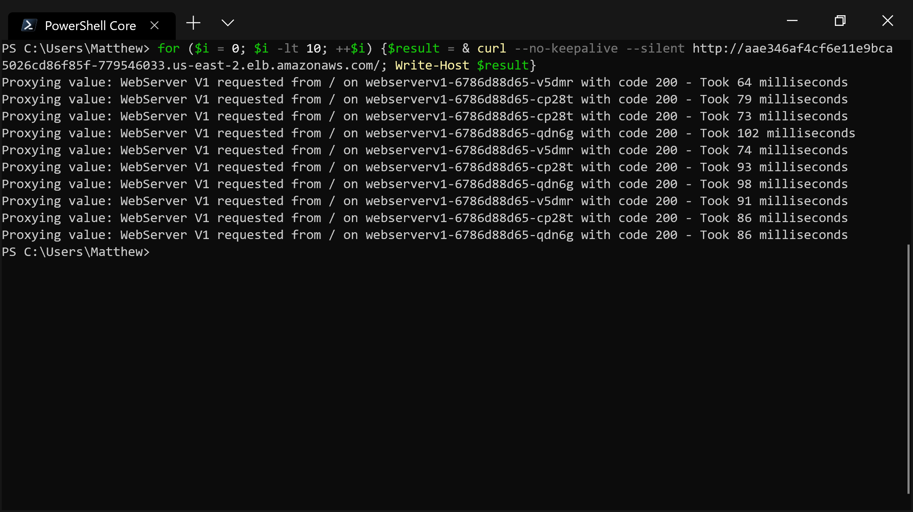
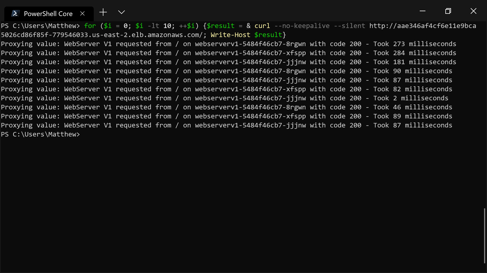

The Istio [DestinationRule](https://istio.io/docs/reference/config/networking/v1alpha3/destination-rule/#LoadBalancerSettings) resource provides a way to configure traffic once it has been routed by a VirtualService. A DestinationRule can be used to configure load balancing, security and connection details like timeouts and maxiumum numbers of connections.

In this blog post we'll add a DestinationRule to our cluster to see how it affects our application.

## Defining Service subsets

In the [previous blog post](/blog/2019-09/istio/istio-virtualservice/index.md) we saw how requests to the `webserver` Service could be redirected to the `webserverv1` Service. This meant that our `proxy` application only requested content from Pods with the label `version: v1`.

Having multiple versions of Pods is quite a common scenario, and while it is possible to create multiple Services in order to direct traffic to Pods with specific label combinations, Istio has a more concise solution.

A DestinationRule can define subsets, which can identify Pods with more specific label combinations than the Service that that DestinationRule is configured against. In the example below we have created two subsets within the Pods referenced by the `webserver` Service. The subsets, named `v1` and `v2`, match the `version` labels on the Pods.

We also then target the `v1` subset of the `webservice` Service from the VirtualService.

The end result is that the `proxy` application only makes requests to the Pods with the `version: v1` label. In this way we achieve the same effect as creating the second Service `webservicev1` and routing traffic to that, but without the duplication in having multiple Services that differ only by their `selector` labels.

```YAML
apiVersion: networking.istio.io/v1alpha3
kind: VirtualService
metadata:
  name: webserver
spec:
  hosts:
  - webserver
  http:
  - route:
    - destination:
        host: webserver
        # Route traffic to the Pods that match the labels defined in the DestinationRule v1 subset
        subset: v1
```

```YAML
apiVersion: networking.istio.io/v1alpha3
kind: DestinationRule
metadata:
  name: webserver
spec:
  host: webserver
  subsets:
  - name: v1
    labels:
      version: v1
  - name: v2
    labels:
      version: v2
```

## Load balancing algorithms

Istio offers multiple different [load balancing](https://istio.io/docs/reference/config/networking/v1alpha3/destination-rule/#LoadBalancerSettings) algorithms to distribute traffic. The default is the round robin algorithm, with cycles through the available targets one by one.

```YAML
apiVersion: networking.istio.io/v1alpha3
kind: DestinationRule
metadata:
  name: webserver
spec:
  host: webserver
  trafficPolicy:
    loadBalancer:
      simple: ROUND_ROBIN
  subsets:
  - name: v1
    labels:
      version: v1
  - name: v2
    labels:
      version: v2
```

Here we can see how traffic was distributed with the round robin algorithm.

Note that you have to disable keeplive connections to see this pattern. If you open the URL in a browser, you won't see the clear cycling through targets because browsers enable keepalive connections. Also it is a known issue that some targets are used twice, which you can see in the output below with the call to `webserverv1-6786d88d65-cp28t`. These issues are all discussed in [this issue](https://github.com/kubernetes/minikube/issues/343).

Otherwise you can clearly see how requests are cycled through the targets with the round robin algorithm.



The DestinationRule can also distribute traffic randomly.

```YAML
apiVersion: networking.istio.io/v1alpha3
kind: DestinationRule
metadata:
  name: webserver
spec:
  host: webserver
  trafficPolicy:
    loadBalancer:
      simple: RANDOM
  subsets:
  - name: v1
    labels:
      version: v1
  - name: v2
    labels:
      version: v2
```

As expected, the targets of the network requests are now selected randomly.


Another option is to send requests to targets with the least open connections.

```YAML
apiVersion: networking.istio.io/v1alpha3
kind: DestinationRule
metadata:
  name: webserver
spec:
  host: webserver
  trafficPolicy:
    loadBalancer:
      simple: LEAST_CONN
  subsets:
  - name: v1
    labels:
      version: v1
  - name: v2
    labels:
      version: v2
```

The result is somewhat similar to the random algorithm, although we don't see requests going to the same target twice in a row.



## Security options

Istio can configure [TLS settings](https://istio.io/docs/reference/config/networking/v1alpha3/destination-rule/#TLSSettings) to insure that the communication between Pods is encrypted through Mutual TLS (mtls).

The effects of these options are transparent to our application, but would prevent traffic from being snooped if Pods were to communicate across nodes.

```YAML
apiVersion: networking.istio.io/v1alpha3
kind: DestinationRule
metadata:
  name: webserver
spec:
  host: webserver
  trafficPolicy:
    tls:
      mode: ISTIO_MUTUAL
  subsets:
  - name: v1
    labels:
      version: v1
  - name: v2
    labels:
      version: v2
```

## Connection pool settings

[Network settings](https://istio.io/docs/reference/config/networking/v1alpha3/destination-rule/#ConnectionPoolSettings) like timeouts, keepalives, number of connections etc. can be defined.

Like the security settings, these values are transparent to our applications, but may improve performance for deployments with high traffic load.

```YAML
apiVersion: networking.istio.io/v1alpha3
kind: DestinationRule
metadata:
  name: webserver
spec:
  host: webserver
  trafficPolicy:
    connectionPool:
      tcp:
        maxConnections: 100
        connectTimeout: 30ms
        tcpKeepalive:
          time: 7200s
          interval: 75s
  subsets:
  - name: v1
    labels:
      version: v1
  - name: v2
    labels:
      version: v2
```


## Summary

[We've seen how a VirtualService can be used to route traffic]/blog/2019-09/istio/istio-virtualservice/index.md, simulate network failures or delays, and implement networking rules that only require an understanding of a service's public API such as URL redirection/rewriting, timeouts and retries.

In this post we have seen how a DestinationRule can be used to implement low level networking options that are closely tied to the implementation of the underlying service including defining subsets, load balancing algorithms, and network connection settings such as timeouts and max connections.

In the next post we will look at the [ServiceEntry](https://istio.io/docs/reference/config/networking/v1alpha3/service-entry/) resource, and how it is used to expose endpoints outside the Kubernetes cluster.
