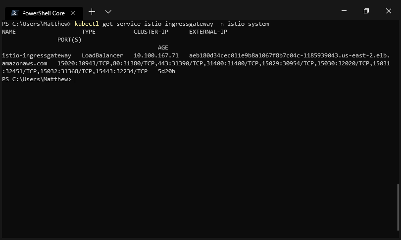
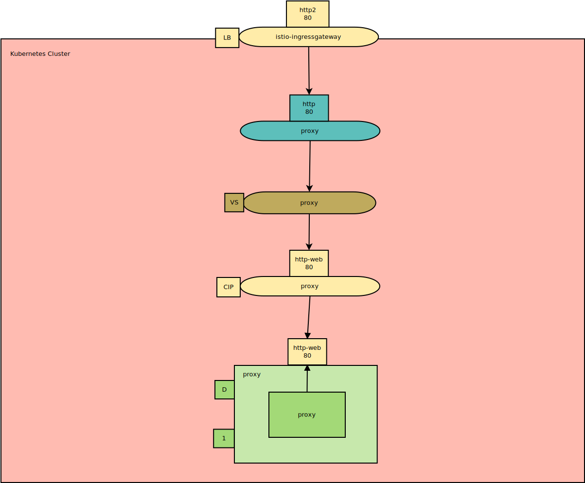
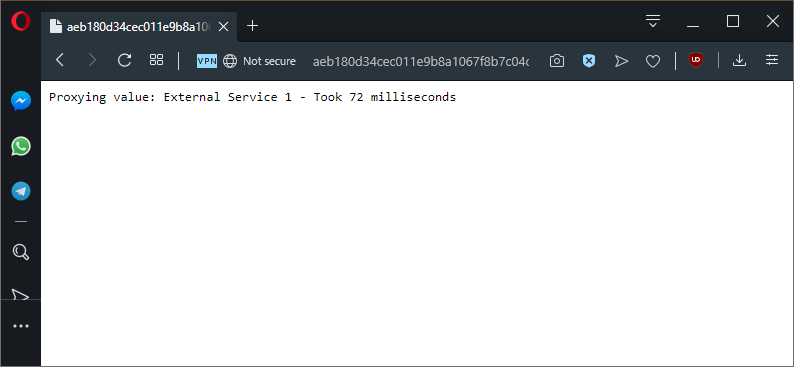

This is part five in a series of posts exploring Istio, a popular service mesh available for Kubernetes. In this post, I'll look at what a Gateway resource is and where it fits in this stack.

* [The Sample application.](/blog/2019-09/istio/the-sample-application/index.md)
* [The VirtualService resource.](/blog/2019-09/istio/istio-virtualservice/index.md)
* [The DestinationRule resource.](/blog/2019-09/istio/istio-destinationrule/index.md)
* [The ServiceEntry resource.](/blog/2019-09/istio/istio-serviceentry/index.md)
* **The Gateway resource.**

---

Up until this point, our Kubernetes cluster has taken traffic from a standard load balancer Service resource, which thanks to the fact that our cluster is hosted by AWS, is exposed by an ELB with a public IP. External traffic hitting this load balancer is directed to our `proxy` application, and from here we have used Istio to route the internal traffic.

As well as routing internal traffic, Istio can also route external traffic entering the cluster. The [Gateway resource](https://istio.io/docs/reference/config/networking/v1alpha3/gateway/) is used by Istio to receive external traffic and route it as it enters the cluster.

In this post, we’ll add a Gateway resource to the cluster to replace the load balancer Service resource we have been relying on.

## Defining the Gateway resource

Here is a minimal example of a Gateway resource:

```YAML
apiVersion: networking.istio.io/v1alpha3
kind: Gateway
metadata:
  name: default-gateway
  namespace: istio-system
spec:
  selector:
    istio: ingressgateway
  servers:
  - hosts:
    - '*'
    port:
      name: http
      number: 80
      protocol: HTTP
```

There are some important settings here to be discussed.

First, this Gateway resource has been created in the `istio-system` namespace:

```YAML
namespace: istio-system
```

This is because this Gateway resource is going to be bound to a load balancer Service resource created when Istio was installed. The Service resource is called `istio-ingressgateway` and has a label of `istio: ingressgateway`.

:::hint
Specifically the `ingressgateway` was created because the Helm option `gateways.istio-ingressgateway.enabled` defaults to `true`. See the [documentation](https://istio.io/docs/reference/config/installation-options/) for more details.
:::



*The load balancer service created by Istio during installation.*

We attach this Gateway resource to the `istio-ingressgateway` Service with the label selectors:

```YAML
selector:
  istio: ingressgateway
```

This Gateway resource will accept all HTTP traffic from any host:

```YAML
- hosts:
  - '*'
  port:
    name: http
    number: 80
    protocol: HTTP
```

## Routing external traffic

Just as we did with [internal traffic](/blog/2019-09/istio/istio-virtualservice/index.md), we’ll use a VirtualService resource to direct traffic from the Gateway resource.

```YAML
apiVersion: networking.istio.io/v1alpha3
kind: VirtualService
metadata:
  name: proxy
spec:
  gateways:
  - istio-system/default-gateway
  hosts:
  - "*"
  http:
  - route:
    - destination:
        host: proxy
```

The difference between the VirtualService resource above and those that we used to direct internal traffic is that this VirtualService resource is bound to the Gateway resource:

```YAML
gateways:
- istio-system/default-gateway
```

We’ll reuse the existing `proxy` Service for this VirtualService resource to direct traffic to. However, now it is no longer necessary for the `proxy` Service to be a public load balancer, as the `istio-ingressgateway` Service will accept the external traffic:

```YAML
http:
- route:
  - destination:
      host: proxy
```

Here is the architecture diagram showing the load balancer `istio-ingressgateway` directing traffic to the `proxy` Gateway, which in turn has traffic routed via the `proxy` VirtualService to the `proxy` cluster IP Service.



*The architecture diagram, with the Gateway (in blue).*

The end result is that we can access the `proxy` application via the hostname assigned to the `istio-ingressgateway` load balancer Service.

This change doesn’t affect any of the functionality that we saw in the previous blog posts, but it does mean that Istio is now effectively assuming the role of an ingress controller by directing traffic from a shared load balancer:



*We access our proxy application through a new hostname, and everything works like it did before.*

## Conclusion

Gateway resources allow Istio to route external traffic entering the cluster in much the same way a standard ingress controller would. This allows the Kubernetes cluster to expose a single public IP address or hostname and have external traffic routed to internal Service resources as needed.
