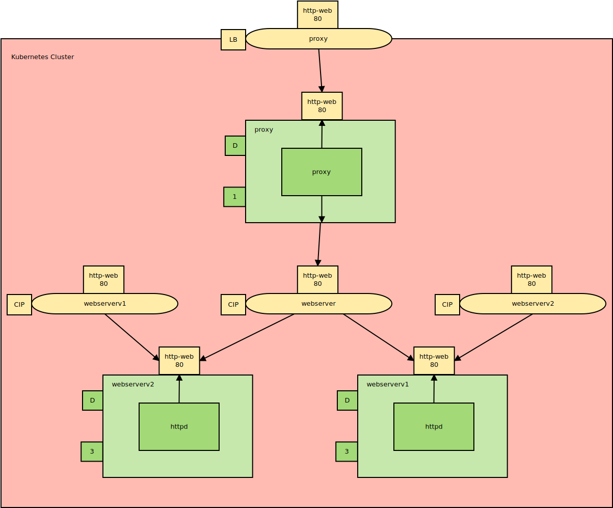
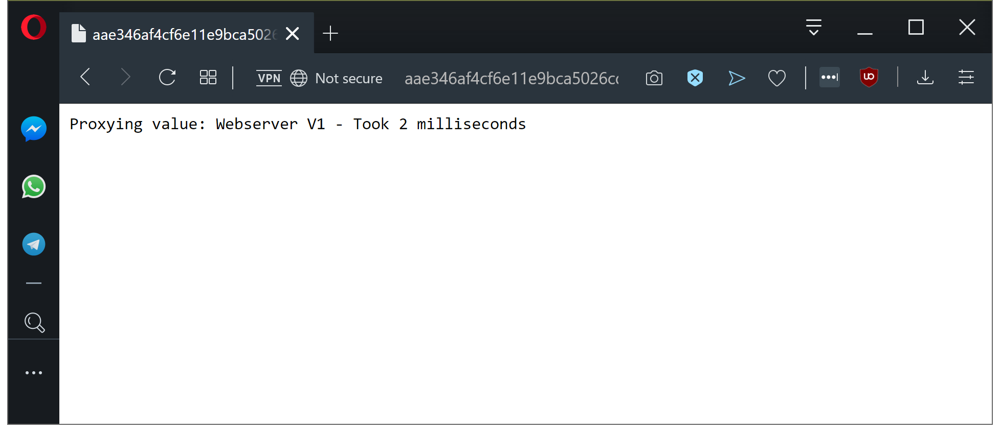

This is part one in a series of posts exploring Istio, a popular service mesh available for Kubernetes. In this post, I'll introduce a sample application that will then be used as we explore the major features of Istio.

* **The Sample application.**
* [The VirtualService resource.](/blog/2019-09/istio/istio-virtualservice/index.md)
* [The DestinationRule resource.](/blog/2019-09/istio/istio-destinationrule/index.md)
* [The ServiceEntry resource.](/blog/2019-09/istio/istio-serviceentry/index.md)
* [The Gateway resource.](/blog/2019-09/istio/istio-gateway/index.md)

---

[Istio](https://istio.io/) is one of the most popular and powerful service meshes available for Kubernetes today. To understand the features it provides, it’s useful to have a very simple sample application to make network requests that we can manipulate and configure via Istio.

The canonical example provided by the Istio project is [Bookinfo](https://istio.io/docs/examples/bookinfo/). Bookinfo is a small polyglot microservice application whose output can be tweaked by modifying network policies.

However, I found Bookinfo too high level to really understand the features of Istio, and so instead, I’ll present a very simple Kubernetes deployment with Node.js applications proxying the requests from various web servers, both internal and external to the cluster. By keeping things very simple, it is easy to see exactly what Istio is doing as network requests are being made.

## The proxy application

The public-facing application in our example is a very simple Node.js web server. This application makes a second network request to the service it is proxying, wraps up the response and returns it along with the time it took to make the request.

We’ll use this proxy frontend to observe how network requests are routed across the network, to display any failed network requests, and to measure how long the requests took.

The code for this application can be found on [GitHub](https://github.com/mcasperson/NodejsProxy):

```javascript
// content of index.js
const http = require('http');
const url = require('url');
const requestService = require('request');
const port = 3030;
const proxyUrl = process.env.PROXYURL || "https://raw.githubusercontent.com/mcasperson/NodejsProxy/master/helloworld.txt";

const requestHandler = (request, response) => {
  const path = url.parse(request.url).pathname;
  const start = new Date().getTime();
  requestService(proxyUrl + (path == "/" ? "" : path), (err, res, body) => {
    const duration = new Date().getTime() - start;
    if (err) {
      response.end(err.toString() + " - Took " + duration + " milliseconds");
    } else {
      response.end("Proxying value: " + body + " - Took " + duration + " milliseconds");
    }
  });
}

const server = http.createServer(requestHandler);

server.listen(port, (err) => {
  if (err) {
    return console.log('something bad happened', err);
  }

  console.log(`server is listening on ${port}`);
});
```

## The external services

Inside this same repository we have two text files [here](https://raw.githubusercontent.com/mcasperson/NodejsProxy/master/externalservice1.txt) and [here](https://raw.githubusercontent.com/mcasperson/NodejsProxy/master/externalservice2.txt). These will serve as mock external services for our proxy to consume thanks to the fact that GitHub allows you to view the raw contents of a file in a hosted repository. This means we don’t have to go to the trouble of deploying a public service to return static content.

## The internal web servers

For the internal web servers we will run a second Node.js application that returns static text, `Webserver V1` and `Webserver V2` in our case, along with the hostname of the container that is running the image. We will spin up 3 instances for each version, which means that we will have 6 instances running 2 versions of the server.

The different versions of the web server will be labeled with `version: v1` or `version: v2`. This configuration will provide us with the opportunity to route and manage network traffic in interesting ways when we start looking at Istio’s VirtualService and DestinationRule resources.

The source code for this application can be found on [GitHub](https://github.com/mcasperson/NodeJSWebServer):

```javascript
const http = require('http');
var url = require("url");
const os = require('os');
const port = 3030;
const content = process.env.SERVERCONTNET || "Hello world";

const requestHandler = (request, response) => {
  const path = url.parse(request.url).pathname;

  if (path == "/failsometimes") {
    if (Math.floor((Math.random() * 3)) == 0) {
      response.statusCode = 500;
    }
  }

  response.end(content + " requested from " + url.parse(request.url).pathname + " on " + os.hostname() + " with code " + response.statusCode);
};

const server = http.createServer(requestHandler);

server.listen(port, (err) => {
  if (err) {
    return console.log('something bad happened', err);
  }

  console.log(`server is listening on ${port}`);
});
```

## An architecture diagram

Here is a top-level overview of the sample application using the [Kubernetes Deployment Language](https://blog.openshift.com/kdl-notation-kubernetes-app-deploy/) (KDL).

The YAML at https://github.com/mcasperson/NodejsProxy/blob/master/kubernetes/example.yaml is a deployable example of this sample project.

We have a load balancer Service resource directing traffic to the Pod resource created by the `proxy` Deployment resource, which in turn requests the content from the Pod resources created by the Deployment resources `webserverv1` and `webserverv2`. The proxied content is then returned back to the browser.

Meanwhile, there are two additional cluster IP Service resources called `webserverv1` and `webserverv2` that aren’t currently accessed. These have been created in preparation for Istio policies that will direct traffic in a more fine-grained manner than we have established with this initial implementation.



*The sample application Kubernetes architecture.*

When we open the application, we’ll see the proxy wrapping up the response from either `webserverv1` or `webserverv2`, because the Service resource points to all the web server Pod resources, and so will contact any of them for any given request. We can also see the time it took to retrieve the proxied value.



*The proxy application returning the value from the web servers.*

## Conclusion

The example application shown here is trivial and does not attempt to replicate a real-world scenario. However, it is well suited as a starting point to which we can add new networking functionality with Istio.

In the [next post](/blog/2019-09/istio/istio-virtualservice/index.md), we’ll introduce the Istio VirtualService resource.
