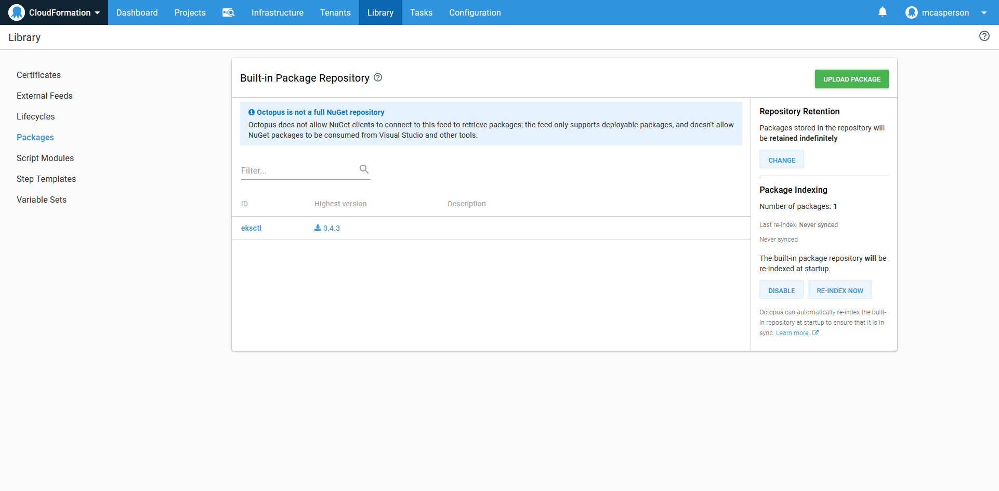
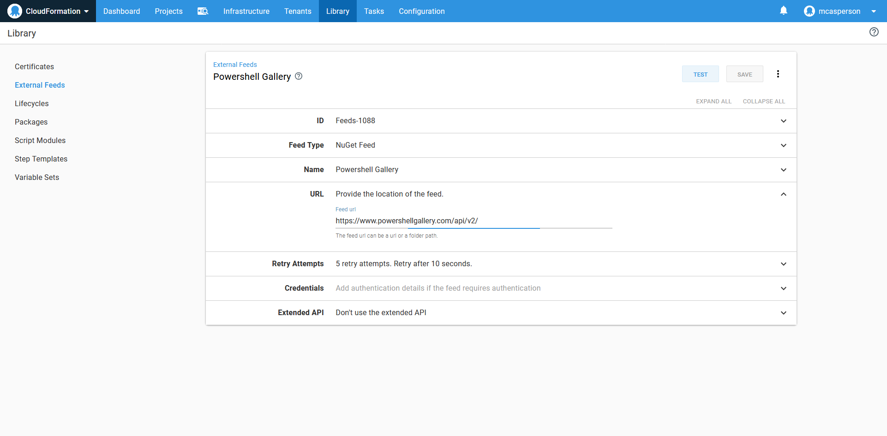
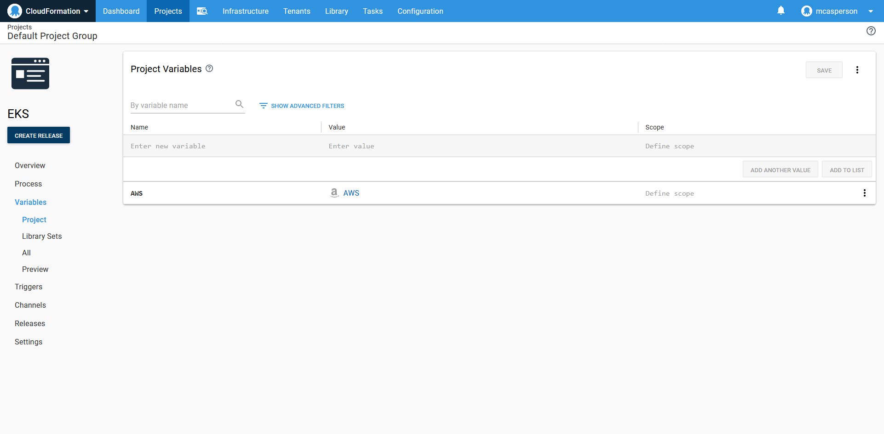
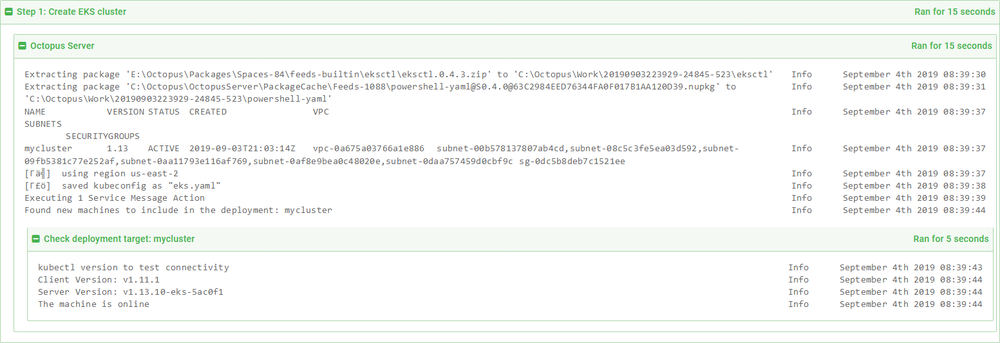
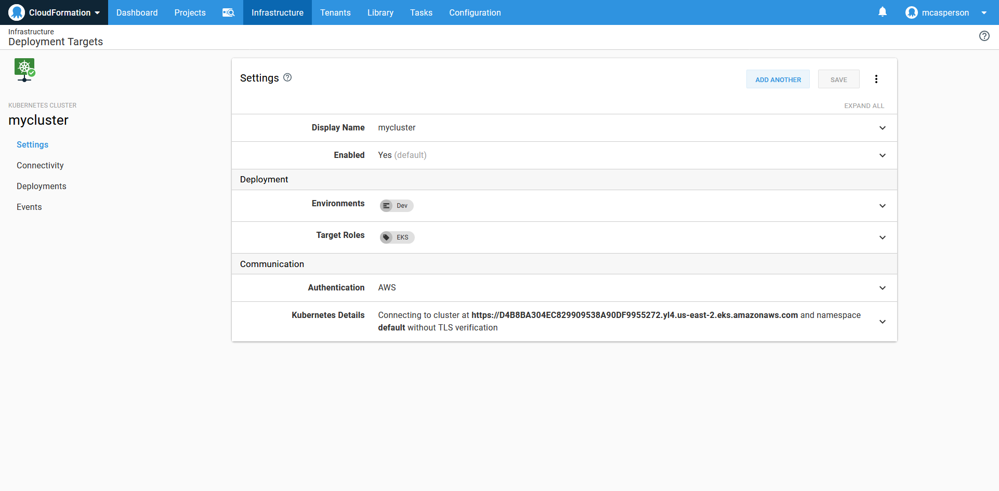

EKS is a managed Kubernetes service provided by AWS. At a high level, EKS is comprised of two components: the managed EKS control plane and the worker nodes. The EKS control plane is a dedicated resource in AWS, having the CloudFormation type [AWS::EKS::Cluster](https://docs.aws.amazon.com/AWSCloudFormation/latest/UserGuide/aws-resource-eks-cluster.html). The worker nodes on the other hand are simply EC2 instances that are configured during deployment to join the Kubernetes cluster.

Previously it was your responsibility to create all these resources yourself, and it was not a trivial task. You were responsible for creating VPCs, subnets, internet gateways, auto scaling groups, IAM roles, EC2 instances and more.

Fortunately today we have [eksctl](https://eksctl.io), which is a command line tool exposing a familiar verb/noun argument structure for creating and managing EKS clusters.

In this blog post well look at how to get a simple EKS cluster deployed and integrated into Octopus using `eksctl`.

## Preparing the Octopus library

For this example we will be using `eksctl` directly from Octopus. To make `eksctl` available in our scripts, we first need to download the binary from the [eksctl GitHub releases](https://github.com/weaveworks/eksctl/releases) page.

The file you download will be called something like `eksctl_Windows_amd64.zip`. Rename this to `eksctl.0.4.3.zip` (replacing `0.4.3` with the version of `eksctl` you downloaded). The new file name embeds the version, and this format is required by Octopus. Once renamed, the file can be uploaded to the Octopus built-in feed.



*The eksctl package uploaded to the built-in feed.*

We are also going to need to inspect YAML files to extract properties from them. Powershell does not natively support YAML parsing, which means we will need to use a third party library.

An easy way to consume Powershell modules is to add the [Powershell Gallery](https://www.powershellgallery.com/) Nuget feed to Octopus. The URL of the feed is https://www.powershellgallery.com/api/v2/.


*The Powershell Gallery Nuget feed.*

## Preparing the credentials

EKS clusters use AWS credentials for authentication. AWS accounts are exposed in Octopus as a dedicated account type. You can find more information on generating AWS access keys in their [documentation](https://docs.aws.amazon.com/IAM/latest/UserGuide/id_credentials_access-keys.html#Using_CreateAccessKey).


*The AWS account.*

## Preparing the environment

We are going to take advantage of dynamically created infrastructure to create new Kubernetes targets pointing to the new EKS cluster.

To enable dynamic infrastructure to be created as part of a deployment, the environments need to enable the `Dynamic Infrastructure` option.


*An environment that allows dynamic infrastructure to be created.*

## The Octopus project

The first thing we need to set up in our Octopus project are the variables. The AWS account we created earlier is referenced by an `AWS Account` variable type in the project.



Now we can add a `Run an AWS CLI Script` step to call `eksctl` to create the EKS cluster and create the Octopus Kubernetes target.

The step references the AWS Account variable we set up earlier to perform the login, and defines an AWS region in which the deployment will take place.


Our script will refernce two additional packages: the packaging containing the `eksctl` executable, and the `powershell-yaml` module from the Powershell Gallery feed. Both additional packages are set to be extracted.


Finally we have the script itself. Here is the complete code.

```PowerShell
Import-Module -Name .\powershell-yaml

$clusterName = "mycluster"

# Check to see if the cluster exists
eksctl\eksctl get cluster --name $clusterName 2>&1

# If the cluster does not exist, create it. Otherwise get the kubeconfig file
if ($LASTEXITCODE -ne 0) {
	eksctl\eksctl create cluster --name $clusterName --kubeconfig eks.yaml
} else {
	eksctl\eksctl utils write-kubeconfig --name $clusterName --kubeconfig eks.yaml
}

# Convert the kubeconfig from YAML
$kubeConfig = Get-Content -Path eks.yaml -Raw
$kubeConfigObject = ConvertFrom-Yaml $kubeConfig
# Extract the cluster URL
$clusterUrl = $kubeConfigObject.clusters[0].cluster.server

# Create an Octopus target
New-OctopusKubernetesTarget `
    -name $clusterName `
    -octopusRoles "EKS" `
    -clusterUrl $clusterUrl `
    -octopusAccountIdOrName $AWS `
    -clusterName $clusterName `
    -namespace "default" `
    -updateIfExisting `
    -skipTlsVerification True
```

Let's break this code down.

We start by importing the `powershell-yaml` module. This will give us access to functions like `ConvertFrom-Yaml` later on.

```
Import-Module -Name .\powershell-yaml
```

The name of the EKS cluster is defined in a variable, as it will be used a number of times in the script.

```
$clusterName = "mycluster"
```

We then check to see if the EKS cluster already exists.

Octopus steps should be designed to be idempotent, which means they can be run multiple times regardless of the state of any external system. Unfortunately, `eksclt` doesn't expose idempotent commands, which means if you try to create a cluster that already exists, you will receive an error. By checking to see if the cluster already exists, we can implement our own create or update logic.

```
# Check to see if the cluster exists
eksctl\eksctl get cluster --name $clusterName 2>&1
```

If the cluster does not exist (which we determine from the return code of the call to `eksctl get cluster`), we create it. The `--name` parameter defines the name of the EKS cluster, and the `--kubeconfig` parameter defines the filename that will hold the details that a client needs to connect to the cluster.

```
# If the cluster does not exist, create it. Otherwise get the kubeconfig file
if ($LASTEXITCODE -ne 0) {
	eksctl\eksctl create cluster --name $clusterName --kubeconfig eks.yaml
}
```

In the event that the cluster already exists, we save the kubeconfig details.

```
else {
 eksctl\eksctl utils write-kubeconfig --name $clusterName --kubeconfig eks.yaml
}
```

At this point, regardless of whether the EKS cluster was newly created or already existed, we have a file called `eks.yaml` that contains the details that a client needs to connect to the cluster. Normally this config file would be used by the `kubectl` command line tool directly, but in this example we want to take the details of that file to create an Octopus Kubernetes target.

To get the details of the file, we convert it from raw YAML into a Powershell object using the `ConvertFrom-Yaml` function that was imported as part of the `powershell-yaml` library.

```
# Convert the kubeconfig from YAML
$kubeConfig = Get-Content -Path eks.yaml -Raw
$kubeConfigObject = ConvertFrom-Yaml $kubeConfig
```

We then extract the URL of the EKS cluster.

```
# Extract the cluster URL
$clusterUrl = $kubeConfigObject.clusters[0].cluster.server
```

The final step is to use the `New-OctopusKubernetesTarget` function to create a new Kubernetes target in Octopus. This function is documented [here](https://octopus.com/docs/infrastructure/deployment-targets/dynamic-infrastructure/kubernetes-target).

Note that the `$AWS` variable is provided to use by Octopus, and is set to the ID of the AWS account.

```
# Create an Octopus target
New-OctopusKubernetesTarget `
    -name $clusterName `
    -octopusRoles "EKS" `
    -clusterUrl $clusterUrl `
    -octopusAccountIdOrName $AWS `
    -clusterName $clusterName `
    -namespace "default" `
    -updateIfExisting `
    -skipTlsVerification True
```

Deploying this project will result in the EKS cluster being created if it does not exist, the `eks.yaml` file generated, and a new Octopus Kubernetes target created or updated.



*The deployment logs.*

We can then see the new Kubernetes target in the Infrastructure page.



*The Kubernetes target created by the call to New-OctopusKubernetesTarget.*
