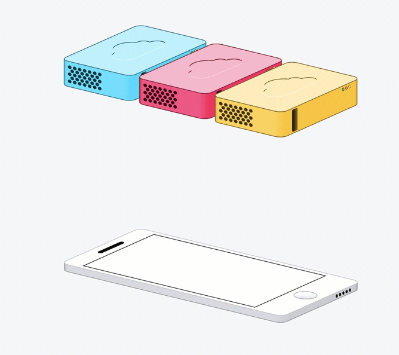
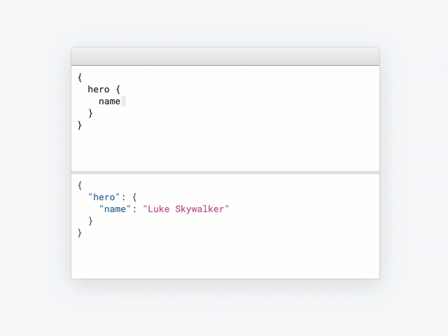
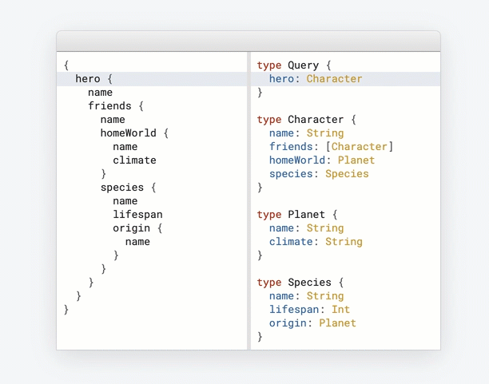
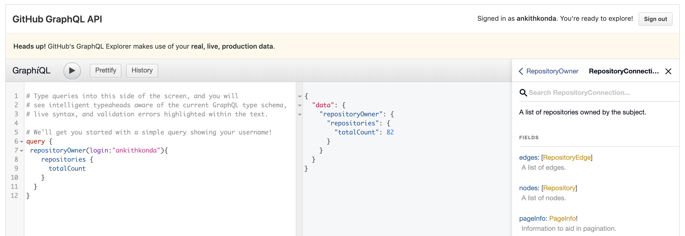
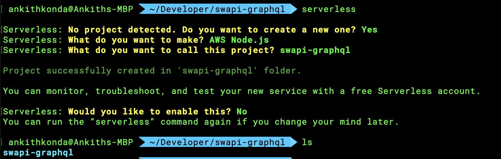
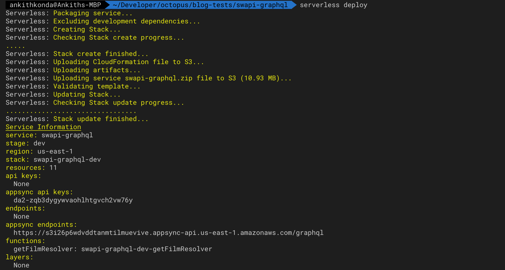
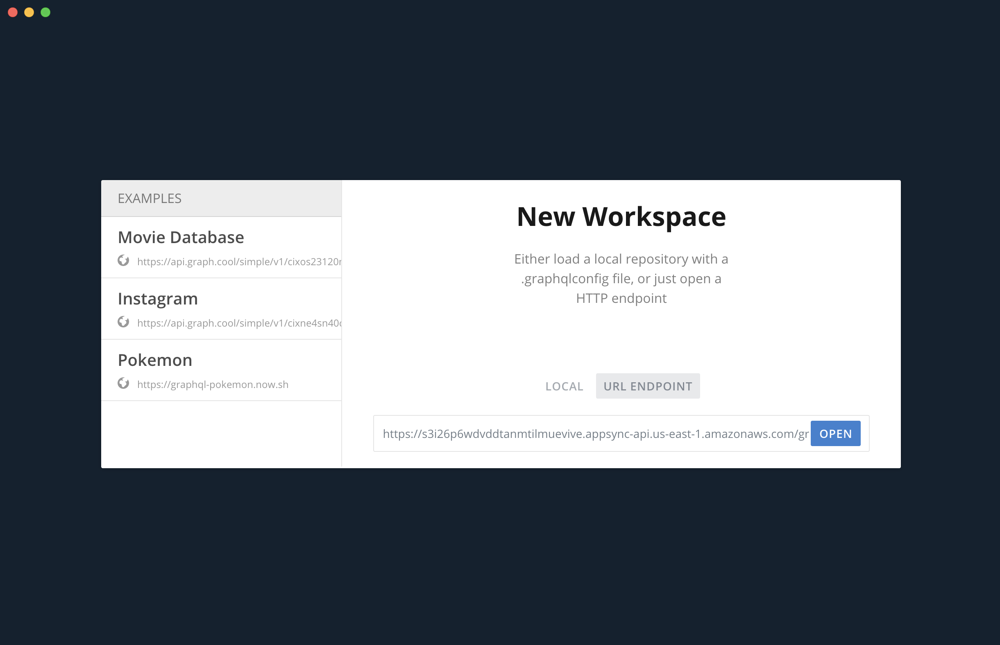
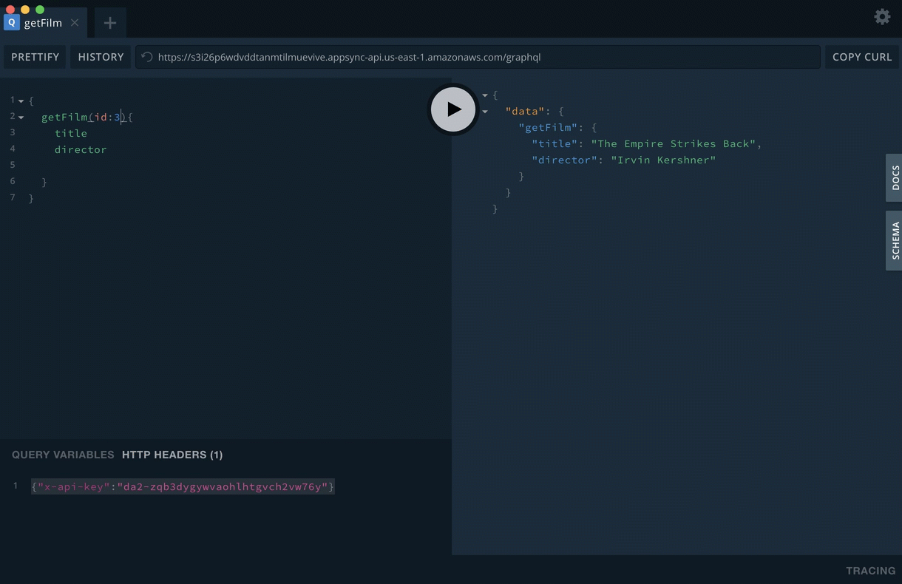

## "I'm happy with REST" (are you though?)

REST APIs have been useful for a long time, however in a mobile first world and in a time where fast iteration of UI is crucial we need to be mindful of a few things when it comes to APIs. Firstly they shouldn't send unnecessary data to the client if the UI only needs 10% of the response, and secondly, the APIs themselves need to be flexibility enough to allow frontend and backend teams to progress independently, and iterate their designs is a quick, timely and less disruptive manner when it comes to app development. A classic example is where the UI needs a specific API change, however the frontend team can't reasonably begin work on the UI until the endpoint is available as the structure of the data could change during server side development.

Also When it comes to mobile applications or even web applications, we tend to forget that although internet speeds are adequate to handle large api responses, the scale at which these API requests operate on can have a very real impact on computing power and energy consumption. So having a well designed API is not only good for user experience, and developer experience, but also good for the planet. I bet you never thought of it that way right? me neither until I started writing this. look at me go saving the planet!

So in order to come up with a better way to design our APIs, we need to first address the common problems we come across. As mentioned before, the size of the response to the client when only 10% of the data is needed for the UI, and another problem is when you need to make multiple requests from the client in order to end up with the data needed for the UI.

So let's do a quick experiment, say you are going to build the next big mobile app, so that you can fulfil your life long dream of making a billion dollars for the sole purpose of buying a small island with 3 llamas 🦙🦙🦙, why three? not sure, it's your dream. So the very first feature you want to build is a profile screen of the user showing their `first name, last name, and the names of two friends, and an enemy`, because why not?!

Now think about what the API call would look like

First we need to call `.../api/v1/user/1/profile/` and the response could look like this -

```json
{
  "id": 1,
  "firstname": "Homer",
  "middle": "Jay",
  "lastname": "Simpson",
  "age": 39,
  "occupation": "Safety Inspector (Sector 7G) at Springfield Nuclear Power Plant.",
  "inventions": [
    "Flaming Homer",
    "Wonder Bat",
    "Electric hammer",
    "Six-legged chair",
    "Armchair-toilet thing"
  ],
  "address": {
    "house_number": 742,
    "street_name": "Evergreen",
    "street_type": "Terrace"
  },
  "friends": [6, 7, 8, 9],
  "enemies": [10, 11],
  "family": {
    "partner": 2,
    "children": [3, 4, 5]
  },
  "favorite_foods": [
    // lets agree that this is a very long list
  ]
}
```

Straight away you can see there is a little problem - there's too much information in this response for such a simple UI. Not only that, we need the names of 2 friends and an enemy and along with 3 more api calls, we have to deal with at least 3x the information you see up there 🙃 ay caramba! No the most ideal workflow, let's imagine we're describing what API is to a non-technical person. Let's use the metaphor of ordering a meal. The process above would go something like this -

> **You:** Hi, can I please order a burger without lettuce and onions? I'd like to also order fries with no salt and drink
>
> **Server:** Sure not a problem, here is your burger with everything on it
>
> **You:** Umm, sorry but I asked for no lettuce and onions, this burger has every possible addon. Not only that, for some reason it has a fish patty on it which i'm allergic to! and i didn't get my fries and drink.
>
> **Server:** Oh sorry you'll have to remove all the items from the burger that you don't want, also you can't order fries and drink in the same order, would you like to place a separate order?
>
> **You:** I guess, can i please order fries and a drink
>
> **Server:** not a problem, we'll need to put them as two separate orders, so please tap your credit card twice.
>
> **You:** Um I got the fries and drink, but once again you added salt and gravy!? and my drink came with an empty cup..
>
> **Server:** sorry once again, you'll need to clean up your fries and we can't seem to find the drink you wanted so we just gave you an empty cup, let us know if you need anything else :)
>
> **You:** Can I get a refund for the drink, I didn't know that getting an empty cup if there was no drink available was a thing.
>
> **Server:** No. We forgot to add that policy to our menu, but you still ordered it anyway. Thank you come again!

The above is a good example of not only the impact on end user experience, due to wait times to complete order and correct or map the response. But also often overlooked aspect of Developer Experience (DX), as a developer you probably already faced the issue of the empty cup, because the documentation of the API has never been updated, and the response you were expecting is completely inconsistent. This makes it really difficult to iterate on UIs without having full trust of the API. Now imagine if the API versions has changed, but the very useful endpoint in v1 was never brought forward to v2 because of a simple oversight, or the response structure of that endpoint changed slightly which broke your UI. Also it's not much fun writing multiple queries for data. An API should give us the data we ask for, and nothing else. And there's the key - `data we ask for`.

I believe you will agree that APIs should not be giving us a heap of data when all we're after is a simple piece of information. It shouldn't be the job of the frontend developer or a consumer of the API to make multiple requests and clean up the tangled bits of info. Let's go back to that burger metaphor, wouldn't it have been much better if the conversation went something like this -

> **You:** Hi, can I please order a burger without lettuce and onions? I'd like to also order fries with no salt. Also it's interesting that in the menu, you just give me an empty cup if you run out of drinks, so I won't order that, but I will write to the head office about maybe fixing that issue as it doesn't seem right to me.
>
> **Server:** Sure not a problem!, here is your burger without lettuce and onions, and fries with no salt
>
> **You:** Thank you! :)

If you believe that's the way an API should be, then what you're looking for is GraphQL - your new best friend! ("What about my dog?!", okay fair point, Cheddar is also you best friend!)

## GraphQL

> GraphQL is a query language for APIs and a runtime for fulfilling those queries with your existing data. GraphQL provides a complete and understandable description of the data in your API, gives clients the power to ask for exactly what they need and nothing more, makes it easier to evolve APIs over time, and enables powerful developer tools.

Simply put `ask for what you want and get exactly that`, nothing more to it than that. That's only one out of many advantages it offers and it's a lot of fun. At a high level GraphQL when it was open sourced by facebook, was just a specification document - [https://graphql.github.io/graphql-spec/](https://graphql.github.io/graphql-spec/). It left the implementation up to the developer, however the level of detail in this document allowed the community to build high quality, multiplatform and multilangauge GraphQL servers and clients. Facebook developed GraphQL to solve much of the issues we face with REST APIs, think back to ordering that burger, it's a nightmare, and it's even worse when the client is a mobile device. Back when facebook first developed the prototype for internal use, there were no 4G networks and loading times were very slow. So it was very important that the client didn't make too many requests and the response small enough to be fetched quickly, otherwise UX would have suffered.

### Ask for what you want and get exactly that




This is a very good example of what a GraphQL request looks like, here the UI requires only a little bit of information about a user, and as you can see the shape of the data being returned is the same as the request. This is possible as you need to build you schema using a typed language called schema definition language, which describes what can be queried and the relationships between models. The following is a simple example and it all starts here.



Before you begin to write any code, you first need to write your GraphQL schema using a typed language called schema definition language.The beauty of this is that it acts as a contract between the frontend and the backend engineers. It describes what can be queried and the relationships between models. Once you agree as a team what the schema is, both sides can work independently, and so UI work can begin at the same time as the API. Let's look at an example of a schema for a person -

```gql
type Person {
  name: String!
  age: Int
  address: String @deprecated(reason: "we now support the addressDetails field")
  addressDetails: {
    streetNumber: Int
    streetName: String
    suburb: String
    city: String
    country: String
  }
  # Description for friends, friends will not include imaginary friends, please use imaginaryFriends field.
  friends: [Person]
}
```

As you can see, once the `Person` type has been agreed on, as in what fields it supports and the type of the field, the frontend engineers can immediately begin work on putting together the UI needed, by faking the values. As name is a `String` and it is never to be null (noted by the `!`), they just use a place holder `Homer` and etc. The engineers building the API can figure out the best architecture to resolve a request and they know they must always send a name of a person in a string type or an empty string, but never null.

If you need to further describe or add a comment about a particular field you can just add it directly into the schema using the comment notation. Also if there is a field that you no longer support you can add directives such as `@deprecated`, for example in the above example we add this deprecated directive to an older field, that our application used prior to upgrading to a brand new JS address framework that was released last night. The schema now supports a more detailed definition of an address, and the user will see warning message when they make a query to the older `address` field, giving the reason provided in the schema.

So this Scheme brings along a lot of additional benefits, first of which is automatically generated documentation, through introspection. You are effectively putting together the documentation as your improve your schema and it's available to anyone with the access to the single GraphQL endpoint. You no longer have to use something like `/api/v324/person/1/friends/all`, you only have 1 endpoint `/graphql`. There will be no need to version your API, if there is a new functionality available, just add it to the schema. Such as adding a new field `imaginaryFriends` and if something is no longer supported, just add the deprecated directive and remove it once you're confident no one is using that field. Here is an example query for requesting a person's name and country -

```gql
{
  getPerson(id: 1) {
    name
    addressDetails {
      country
    }
  }
}
```

response:

```json
{
  "data": {
    "name": "Homer Simpson",
    "addressDetails": {
      "country": "USA"
    }
  }
}
```

I know what you're thinking! there has to be some draw back to this right? GraphQL isn't perfect. One thing that can get a little tricky is file uploads, unfortunately GraphQL can only handle serializable data out fo the box. Hence, if you need to handle file uploads, perhaps find a use a GraphQL file upload middleware or stick with a rest API, there's nothing wrong with that. Error handling can also cause some issue, as GraphQL request will still succeed even when there is an issue within the response - In the Above example, if the database for some reason didn't have the name stored, but the address was fine, you will still get a response with the address, however the name will be returned as null. The only way to tell if something went wrong, is to check the response for `errors` object and as name is a required field, if it returns null, there will be an error in the errors object. If you have a deeply nested query (which is another issue which I address soon) this can be a little tricky to find exactly where the null value is coming from and handling this in an appropriate way. So this brings me to the last limitation I'll go into for now, and that is deeply nested queries, you may try to be funny and run this as a query (I know I have) -

```gql

{
getPerson (id: 1) {
    name
    friends {
      name
        friends {
          name
          friends {
            name
            friends {
              name
              ...
            }
          }
        }
      }
    }
}
```

This is a problem, however it's only a problem if your API don't have a depth limit.

### Case Study

A prime example of a large company taking advantage of GraphQL is Github! They first introduced their GraphQL API in 2016, which powered a very small part of the UI, and now the entire Github UI is powered by GraphQL - [https://developer.github.com/v4/](https://developer.github.com/v4/).


here are a couple of reasons they state for switching over to GraphQL -

> responses were bloated and filled with all sorts of \*\_url hints in the JSON responses to help people continue to navigate through the API to get what they needed. Despite all the information we provided

> It sometimes required two or three separate calls to assemble a complete view of a resource. It seemed like our responses simultaneously sent too much data and didn’t include data that consumers needed.

[Source](https://github.blog/2016-09-14-the-github-graphql-api/)

and here are some keywords from the above source - `Type safety`, `introspection`, `generated documentation`, and `predictable responses`

## AWS AppSync

So you love everything about what you have read, or maybe just skipped to this section, because you already know and love the idea of GraphQL. So how do you put it together? should you teardown out your REST API tonight, put 20 developers on the task of building a shiny new GraphQL API that can be up and running by tomorrow afternoon? absolutely no! We're not entirely in the Javascript world here, you don't have to rewrite your app everyday with a new framework or a library. If you do, no cake for you! The beauty of GraphQL is that you can implement it at your own pace. Start by setting up your schema to replace one small part of your UI, maybe it's a list of countries you need to display. This is exactly what Github did, they loved the idea of GraphQL from the first time they heard of it, but decided to experiment on a very small part of the UI and it just grew from there. You can do the same, and I can show you how in the next section.

One of the best ways to starting putting together a quick API for you application is by using AWS AppSync, It is managed GraphQL service by AWS. What does that mean? well you don't have to manage the physical server and this concept is called `serverless architecture`. If you heard most of the tech buzzwords of recent years. You definitely would have come across serverless architecture. Don't confuse this with Serverless Framework. Serverless Architecture is a broader idea that you as a developer don't need to worry about maintaining physical servers and just focus on what you do best - build your application and let managed services by leading Cloud Providers such as AWS take care of security patches, server updates, specs, load balance and etc.

A really simple example of serverless is AWS S3, specifically the ability to host static websites. You just upload your index.html (and any js css files that go along with it) and enable the static website hosting on your Bucket and va' là! your website is now available to the world, and even if you have 1 user per day or 1 million per hour, S3 will be able to server your website with no issue and you only pay for the number requests.

Just like how you can host a static website on S3 by just providing your index.html and other assets. You can provision your GraphQL API on AWS just by providing your schema and resolvers (and a little configuration) and you're ready to go! So this is where AWS AppSync comes in and with a little help from Serverless `Framework` the setup up is a breeze (we'll cover that soon below)

## Adopting GraphQL without Abandoning REST APIs

So this section is going to be showing you how to setup a quick and simple GraphQL API using AWS AppSync that uses a rest API as a data source

The API we'll be building will be a GraphQL Star Wars API powered by [SWAPI - Star Wars API](https://swapi.co).

> swapi is the world's first quantified and programmatically-accessible data source for all the data from the Star Wars canon universe!

Let's see what a request and response looks like for `Star Wars: A New Hope` to get the title, director and the name and holdervworld of all the characters -

```https
GET https://swapi.co/api/films/1/
__________________________________________________________

HTTP 200 OK
Content-Type: application/json
Allow: GET, HEAD, OPTIONS
Vary: Accept

{
    "title": "A New Hope",
    "episode_id": 4,
    "opening_crawl": "It is a period of civil war.\r\nRebel spaceships, striking\r\nfrom a hidden base, have won\r\ntheir first victory against\r\nthe evil Galactic Empire.\r\n\r\nDuring the battle, Rebel\r\nspies managed to steal secret\r\nplans to the Empire's\r\nultimate weapon, the DEATH\r\nSTAR, an armored space\r\nstation with enough power\r\nto destroy an entire planet.\r\n\r\nPursued by the Empire's\r\nsinister agents, Princess\r\nLeia races home aboard her\r\nstarship, custodian of the\r\nstolen plans that can save her\r\npeople and restore\r\nfreedom to the galaxy....",
    "director": "George Lucas",
    "producer": "Gary Kurtz, Rick McCallum",
    "release_date": "1977-05-25",
    "characters": [
        "https://swapi.co/api/people/1/",
        "https://swapi.co/api/people/2/",
        "https://swapi.co/api/people/3/",
        "https://swapi.co/api/people/4/",
        "https://swapi.co/api/people/5/",
        "https://swapi.co/api/people/6/",
        "https://swapi.co/api/people/7/",
        "https://swapi.co/api/people/8/",
        "https://swapi.co/api/people/9/",
        "https://swapi.co/api/people/10/",
        "https://swapi.co/api/people/12/",
        "https://swapi.co/api/people/13/",
        "https://swapi.co/api/people/14/",
        "https://swapi.co/api/people/15/",
        "https://swapi.co/api/people/16/",
        "https://swapi.co/api/people/18/",
        "https://swapi.co/api/people/19/",
        "https://swapi.co/api/people/81/"
    ],
    "planets": [
        "https://swapi.co/api/planets/2/",
        "https://swapi.co/api/planets/3/",
        "https://swapi.co/api/planets/1/"
    ],
    "starships": [
        "https://swapi.co/api/starships/2/",
        "https://swapi.co/api/starships/3/",
        "https://swapi.co/api/starships/5/",
        "https://swapi.co/api/starships/9/",
        "https://swapi.co/api/starships/10/",
        "https://swapi.co/api/starships/11/",
        "https://swapi.co/api/starships/12/",
        "https://swapi.co/api/starships/13/"
    ],
    "vehicles": [
        "https://swapi.co/api/vehicles/4/",
        "https://swapi.co/api/vehicles/6/",
        "https://swapi.co/api/vehicles/7/",
        "https://swapi.co/api/vehicles/8/"
    ],
    "species": [
        "https://swapi.co/api/species/5/",
        "https://swapi.co/api/species/3/",
        "https://swapi.co/api/species/2/",
        "https://swapi.co/api/species/1/",
        "https://swapi.co/api/species/4/"
    ],
    "created": "2014-12-10T14:23:31.880000Z",
    "edited": "2015-04-11T09:46:52.774897Z",
    "url": "https://swapi.co/api/films/1/"
}
```

Straight away you can see a little problem - In order to get any further details we'll need to make a lot more requests. Just to get all the characters, that's 20 additional requests from the frontend, not a very good experience. and we get extra details that we don't really need.

Let's start by putting together a GraphQL API to make our lives easier and improve UX and DX

### Step 1: Define the Schema

Let's start by creating our GraphQL Schema. Remember you don't need to worry about versioning your API, just keep adding to the schema. So let's begin by putting together a simple schema, with enough detail to get us started. Lucky for us swapi provides a schema endpoint to make it a little easier to define our types [https://swapi.co/api/films/schema](https://swapi.co/api/films/schema) -

> schema.graphql

```gql
type Query {
  # returns a film based on the film id provided
  getFilm(id: Int!): Film
}

type Film {
  # id of this film
  id: Int!
  # The title of this film.
  title: String!
  # The opening crawl text at the beginning of this film.
  openingCrawl: String
  # The director of this film.
  director: String!
  # The producer(s) of this film.
  producer: String!
  # The people resources featured within this film.
  characters: [Character]!
}

type Character {
  # id of this character
  id: Int!
  # The name of this person.
  name: String!
  # The url of the planet resource that this person was born on.
  homeWorld: Planet
}

type Planet {
  # id of this planet
  id: Int!
  # The name of this planet.
  name: String!
  # the terrain of this planet. Comma-separated if diverse.
  terrain: String
}
```

### Step 2: Configure and Deploy Serverless Framework


As mentioned earlier, we will be using Serverless Framework to provision our AppSync API, however here are a couple alternative options -

- AWS Console
  - setup using the AWS console and copy paste the schema in, and using the same technique, write our lambda function bundle it and upload to AWS and link the field to the lambda function.
- AWS Cloudformation
  - we can setup a cloudformation template and provision our services using code - [Cloudformation](https://aws.amazon.com/cloudformation/)

Serverless Framework is a free and open-source web framework built using node.js. THe initial release was in 2015, which focused on building applications using AWS Lambda, however as the product started to improve, more cloud service providers' support was added along with countless plugins and extensions which make it very easy to provision your cloud infrastructure.

How does it work? As with AWS Cloudformation, other cloud providers also offer their own version of an Infrastructure as Code service. Leveraging on this, serverless lets you define your infrastructure and the relationships between the services in a simple config file, which is then translated to the cloud provider's IaC config, which is then used to orchestrate the provisioning of your desired infrastructure and services.

Here's what provisioning a lambda function looks like -

1. Write a function
2. Setup your serverless config
   - specify your cloud provider: AWS
   - specify your function: point to the file containing the function
3. Run `serverless deploy`
4. Serverless packages your function according to the specifications laid out by the cloud provider you specified (AWS)
5. Serverless generates a Cloudformation template
6. Serverless uploads the Cloudformation template file and packaged function to AWS S3
7. Serverless invokes Cloudformation to provision the function
8. Your function is deployed!

There could be some steps I would have missed and there is a little magic that goes on in the background, but the above is a simple breakdown. If you are curious as to how it all works, checkout the serverless github page - [https://github.com/serverless/serverless](https://github.com/serverless/serverless).

So for our purpose we're not just setting up a Lambda function, but also the AppSync service as well. In order to do that, we'll need to use a plugin for Serverless Framework called `serverless-appsync-plugin`.

Let's Begin -

> Note: Make sure you have the latest stable LTS release of NodeJS. at the time of writing this blog my node version is `10.16.3` you can check yours by running `node --version`. If you don't have the latest LTS, go ahead and install it. I recommend using a version manager such as nvm - [https://github.com/nvm-sh/nvm](https://github.com/nvm-sh/nvm)

1. Install serverless - `npm install -g serverless`
2. Create a new project called `swapi-graphql` by running `serverless` -



3. Open the `swapi-graphql` project folder, and you will find 2 main files - `serverless.yml` and `handler.js`
4. Let's open `serverless.yml` and take out all of the commented out code (with exception for stage and region) and rename the function. You should end up with the following.

```yaml
service: swapi-graphql

provider:
  name: aws
  runtime: nodejs10.x
  stage: dev
  region: us-east-1 # replace this with the closest region that supports AppSync and Lambda

functions:
  getFilmResolver: # rename hello to this
    handler: handler.getFilmResolver # rename handler.hello to this
```

5. Let's install plugins/dependencies

   - We need a package.json, so let's run - `npm init -y`
   - Install the serverless appsync plugin - `npm install --save-dev serverless-appsync-plugin`
   - Install serverless-pseudo-parameters - `npm install --save-dev serverless-pseudo-parameters` - we'll need this to get our Account ID
   - Install Axios - `npm install --save axios` - we will need this in our resolver function to query data from the swapi REST API

6. Create a new file for the schema - `schema.graphql` and paste in the schema from above into this new file
7. let's configure AppSync by adding in the plugins in Serverless Framework config and link the lambda function to the getFilm field. It's important that you try and understand this line by line. If you have any questions, please comment below -

> serverless.yml

```yaml
service: swapi-graphql

provider:
  name: aws
  runtime: nodejs10.x
  stage: dev
  region: us-east-1 # replace this with the closest region that supports AppSync and Lambda

plugins:
  - serverless-pseudo-parameters
  - serverless-appsync-plugin

functions:
  getFilmResolver: # rename hello to this
    handler: handler.getFilmResolver # rename handler.hello to this

custom:
  appSync:
    name: ${self:service}-${self:provider.stage} # The name of our API
    schema: schema.graphql # GraphQL Schema
    authenticationType: API_KEY # Other options: AWS cognito, OpenID and IAM
    serviceRole: "AppSyncServiceRole" # name of the role that is to be created
    # Mapping templates is where you specify the fields that map to different data sources, the request and response vtl files are an AppSync requirement and are there to allow you to further process the request and response between AppSync and the Data source.
    mappingTemplates:
      - dataSource: lambda_query_getFilmResolver # Specify the data source
        type: Query # specify which type this data source will apply to
        field: getFilm # specify which field within the type defined above that this data source will apply to
        request: query-getFilm-request.vtl # request mapping template file - we'll create this in the next step
        response: query-getFilm-response.vtl # response mapping template file - we'll create this in the next step
    dataSources:
      - type: AWS_LAMBDA # The type of the data source. Other options - DynamoDB, AWS Elasticsearch, HTTP endpoint
        name: lambda_query_getFilmResolver # name of the data source for AppSync (not the Lamda function name)
        description: "Lambda getFilmResolver DataSource" # short description
        # this config is where we specify the lambda function
        config:
          serviceRoleArn: { Fn::GetAtt: [AppSyncLambdaServiceRole, Arn] } # we need to specify the role this lambda function will assume to allow appsync to invoke.
          functionName: getFilmResolver # the name of the function (this is optional as we provide the arn above)

# here we specify other resources that we'll need, e.g. IAM roles
resources:
  Resources:
    # we specify the role our lambda functions will need for use with AppSync. In short - we're allowing AppSync to invoke our lambda.
    AppSyncLambdaServiceRole:
      Type: "AWS::IAM::Role"
      Properties:
        RoleName: "${self:service}-${self:provider.stage}-Lambda-${self:custom.appSync.serviceRole}"
        AssumeRolePolicyDocument:
          Version: "2012-10-17"
          Statement:
            - Effect: "Allow"
              Principal:
                Service:
                  - "appsync.amazonaws.com"
              Action:
                - "sts:AssumeRole"
        Policies:
          - PolicyName: "${self:service}-${self:provider.stage}-Lambda-${self:custom.appSync.serviceRole}-Policy"
            PolicyDocument:
              Version: "2012-10-17"
              Statement:
                - Effect: "Allow"
                  Action:
                    - "lambda:invokeFunction"
                  Resource:
                    - "arn:aws:lambda:${self:provider.region}:#{AWS::AccountId}:function:${self:service}-${self:provider.stage}-*"
```

8. let's create those vtl files inside `mapping-templates` folder - `mapping-templates/query-getFilm-request.vtl` and `mapping-templates/query-getFilm-response.vtl`

> mapping-templates/query-getFilm-request.vtl

```
{
    "version": "2018-05-29",
    "operation": "Invoke",
    "payload": $util.toJson($context)
}
```

> mapping-templates/query-getFilm-response.vtl

```
$util.toJson($context.result)
```

9. In your handler.js paste the following function, I won't go into the specifics of the logic here as this is not the focus of the blog, there may be much better ways to write this function. For now this will do -

```javascript
"use strict";
const axios = require("axios");

module.exports.getFilmResolver = async event => {
  const film = {
    id: 1,
    title: "unknown",
    openingCrawl: null,
    director: "unknown",
    producer: "unknown",
    characters: []
  };

  await axios.get("https://swapi.co/api/films/1/").then(response => {
    film.title = response.data.title;
    film.openingCrawl = response.data.opening_crawl;
    film.director = response.data.director;
    film.producer = response.data.producer;
    film.characters = response.data.characters;
  });

  const charactersPromises = [];
  const charactersIds = [];

  film.characters.forEach(function(characterLink) {
    charactersPromises.push(axios.get(characterLink));
    charactersIds.push(characterLink.match(/\d+/)[0]);
  });

  const charactersPromise = Promise.all(charactersPromises);

  const charactersResponse = await charactersPromise;

  film.characters = await Promise.all(
    charactersResponse.map(async function(characterResponse, index) {
      const homeworldLink = characterResponse.data.homeworld;

      const homeworld = {
        id: homeworldLink.match(/\d+/)[0],
        name: "unknwon",
        population: 0,
        terrain: null
      };

      await axios
        .get(characterResponse.data.homeworld)
        .then(function(homeworldResponse) {
          (homeworld.name = homeworldResponse.data.name),
            (homeworld.terrain = homeworldResponse.data.terrain);
        });

      return {
        id: charactersIds[index],
        name: characterResponse.data.name,
        homeWorld: homeworld
      };
    })
  );

  return film;
};
```

10. configure your AWS CLI - [https://serverless.com/framework/docs/providers/aws/guide/credentials/](https://serverless.com/framework/docs/providers/aws/guide/credentials/) and run `serverless deploy`

You should see the following output -



In order to test your new GraphQL API, you can either go into the AppSync console or use GraphQL Playground which will save you a lot of time and it's a great opportunity to show you a really nice developer tool. The GraphQL Playground is a simple app, similar to Postman, however is specifically designed to interact with graphql endpoints, and remember when we talked about the benefits of automatic documentation, you'll get to see it first hand due to magic of introspection :).

So let's begin by downloading GraphQL Playground - [https://github.com/prisma/graphql-playground](https://github.com/prisma/graphql-playground) and once installed - open it, copy and paste the `appsync endpoints` output and the `appsync api keys` into the playground as follows -



let's test our query! Make sure the API key is set in the HTTP headers. and you should be able to run your queries and you also get full auto-complete out of the box! have a look -


The documentation is also available in the docs pane on the right, and have a look at how our comments in the schema comes through. It's really nice and elegant. Now if you give someone access to your API, they will know that the documentation they see is coming directly from the schema, and there will be little to no miscommunication.



### You're Done!!

## What's next?

Well that about gives you a quick preview of how you can quickly wrap an existing REST API with GraphQL and also take advantage of serverless. As you can see, the only complexity here was setting up Serverless Framework. But If you look at it from a high level - all we did was create a simple schema, write a basic function that gets data from multiple endpoints, returns a Film object, and then you were able to query for select data such as title and director. We saw how powerful GraphQL introspection can be, by providing us documentation as soon as we connected to the API, and everything just worked!

What we didn't cover is how you can attach resolvers to the fields of a Film, Character and any type instead of handling the query in one function. We could have done this using multiple functions which would have only run based on the query. Another thing we didn't really go into is directives such as @deprecation, but that can be home work for you, go ahead of add it in and see what change it makes to the docs :)

How do we use this in our frontend? I think this would be best left for a another blog :) for now take this API further, add things, break things, improve on things... there's a lot you can do. Think of this as `Part 1`, we've successfully setup our GraphQL API and can query for data with ease. In `Part 2` I will cover how we can use this API in our react frontend using React Hook and GraphQL Apollo.

Bonus points if you can convert the resolver to using Typescript, as this will be a crucial part when it comes to developer experience. If you can't wait go ahead and create your own frontend example.

Keep experimenting and improving this GraphQL API, and if you're willing to share your improvements/experiments via Github, I'll showcase some of the notable projects in `Part 2` and we'll send out some Octopus Stickers for free :)

```gql
  getGoodbyeMessage("part":1){
    date
    message
    signoff
  }
```

```json
{
  "data": {
    "date": "20 September 2019",
    "message": "Thank you so much for following through this blog, please let me know if I missed anything. Comment below on what helped you the most, and also what I can improve on",
    "signoff": "Let's All Go Out For Some Frosty Chocolate Milkshakes"
  }
}
```
