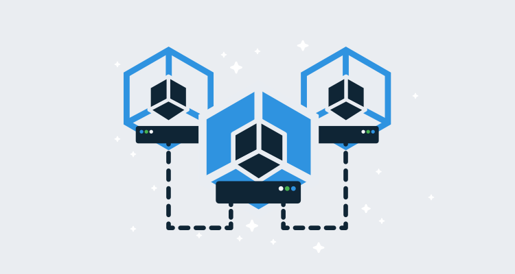

If you have used Kubernetes for any length of time, you will have heard the term Service Mesh. Several big companies are backing service mesh projects, such as Google with [Istio](https://istio.io/) and the Cloud Native Computing Foundation with [Linkerd](https://linkerd.io/).

So what is a Service Mesh, and how is it different from the standard Service and Ingress resources native to Kubernetes?

## What is a Service Mesh?

There are many descriptions of service meshes, but in the video [What’s a service mesh](https://www.youtube.com/watch?v=rhPQHbKoyb8), we hear from William Morgan of Buoyant, which builds LinkerD, and Louis Ryan, who works on the Istio project.

<iframe width="560" height="315" src="https://www.youtube.com/embed/rhPQHbKoyb8" frameborder="0" allowfullscreen></iframe>

William Morgan describes a service mesh as:

> An infrastructure layer that’s dedicated to managing the service to service communication that happens in a microservice application. And by managing I mean the operational side of things, things like reliability features [...], there are security features [...] and also visibility.

> The goal of the service mesh is to basically give you those things as part of the infrastructure rather than having to do it within the applications themselves.

Louis Ryan offers this view:

> We view it as an abstraction of the network, so the application has to think less about the network. Hopefully, operators also have to think less about the structure of the network, and that becomes particularly relevant as the [...] deployment size grows.

So why would you use a Service Mesh?

## Life without a Service Mesh

To understand why we would use a Service Mesh, let’s first look at how networking functionality is implemented in individual applications.

A standard solution to dealing with network issues in microservice applications is to retry requests. Given that HTTP GETs and PUTs are idempotent, consumers of these endpoints can expect to be able to retry a failed network call.

There are many libraries out there that make these retries easy for developers to implement. [Spring retry](https://github.com/spring-projects/spring-retry) and [Polly](https://github.com/App-vNext/Polly#retry) come to mind as two such examples, and both go beyond simply retrying loops to offer features like configurable backoff formulas.

Here is an example of a function in a Spring service that will retry a network call with a custom backoff formula.

```java
@Retryable(maxAttempts=10,value=RuntimeException.class,backoff = @Backoff(delay = 10000,multiplier=2))
public Double getCurrentRate() {
  // ...
}
```

Polly offers similar retry logic:

```CSharp
Policy
  .Handle<SomeExceptionType>()
  .WaitAndRetry(
    5,
    retryAttempt => TimeSpan.FromSeconds(Math.Pow(2, retryAttempt)),
    (exception, timeSpan, context) => {
      // do something
    }
  );
```

These two examples are not particularly complicated, and yet may allow code to survive a momentary connection fault with any services they consume. For this reason, retry logic like this is very commonplace.

## Moving the network logic to the network layer

While this code may be widespread, its configuration is not standard. You can’t expect code written in Java using the Spring retry library to share the same configuration as .NET code using the Polly library.

One of the benefits of the microservice pattern is that each service is written with the language that best suits its needs. And even if you control the code you write, any decently sized Kubernetes cluster will include at least a few third-party services written in languages you have no control over.

Meanwhile, networking concerns are shared across the cluster, and are ideally configured as a whole. Unfortunately, standardizing something as simple as the retry logic becomes difficult when the cluster has applications written with multiple libraries that are all configured in slightly different ways.

Moving these network concerns out of the applications and into the infrastructure layer means standard networking features, like request retries, can be managed cohesively. Specifically:

* Kubernetes will maintain the configuration, taking advantage of any security or auditing policies.
* The standard `kubectl` command-line tool is now used to view or update the networking configuration.
* Standard Kubernetes dashboards can be used to view and manage the networking configuration.
* Operators only need to understand the specific implementation details of a small number of Service Meshes rather than every networking library that has been bundled into the deployed applications.

## What is the distinction between Ingress Controller and Service Mesh?

Kubernetes natively exposes [Ingress resources](https://kubernetes.io/docs/concepts/services-networking/ingress/), which are used to direct traffic from a (usually shared) load balancer. The network traffic is directed to a Kubernetes [Service](https://kubernetes.io/docs/concepts/services-networking/service/), which in turn directs the traffic to a Kubernetes Pod.

An [Ingress Controller](https://kubernetes.io/docs/concepts/services-networking/ingress-controllers/) performs the actual network handling of an Ingress resource, and there are [many Ingress Controllers to chose from](https://kubernetes.io/docs/concepts/services-networking/ingress-controllers/#additional-controllers) such as Nginx, HAProxy, Traefik, etc. Service Mesh platforms like Istio also perform the role of Ingress Controllers.

Some Ingress Controllers are configured by the standard Kubernetes Ingress resource, some are configured through their own custom resources, and some are configured by both custom and the Kubernetes Ingress resources.

For example, Nginx, one of the more popular Ingress Controllers, recently [announced support for two new custom resources called VirtualServer and VirtualServerRoute](https://www.nginx.com/blog/announcing-nginx-ingress-controller-for-kubernetes-release-1-5-0/). These custom resources are an example of an Ingress Controller moving beyond the baseline specification.

So a Service Mesh can be an Ingress Controller, and Ingress Controllers can implement functionality beyond what is defined by the baseline Ingress resource. These blurred lines mean there is no clear distinction between the two concepts. I suspect the distinction between Ingress Controller and Service Mesh will continue to become more arbitrary as platforms continue to add new features to differentiate themselves.

## Conclusion

A Service Mesh provides Kubernetes with a consistent infrastructure layer with rich network monitoring, reliability, and security features. A Service Mesh removes the need for each individual application to expose this networking functionality and existing Kubernetes security, CLI tools, dashboards, and auditing can be leveraged to maintain the infrastructure layer.

The term Service Mesh is not well defined though, and over time expect to see Service Mesh like functionality find its way into many of the projects that are being used as Ingress Controllers today.
