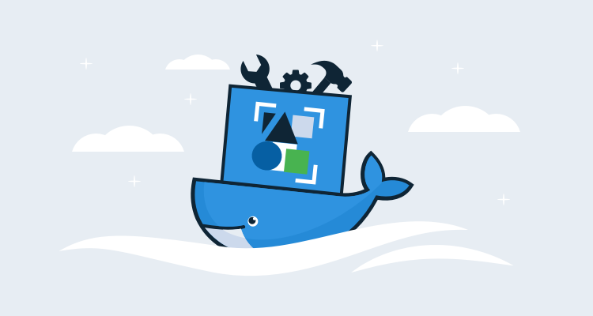
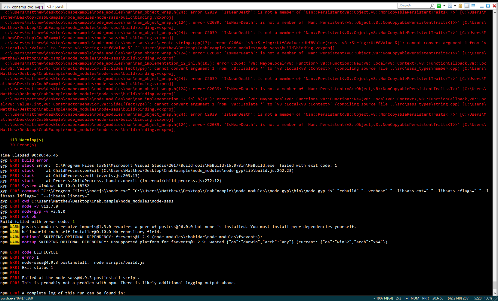

Working with cloud infrastructure can be a daunting task. Each cloud provider maintains their own CLI tools and preferred deployment strategies, cross-platform tools like Terraform, Ansible, Puppet, and Chef take a significant investment to learn, and once you’ve spun up the base infrastructure, you may then be faced with managing yet more deployments to platforms like Docker or Kubernetes.

It is safe to say that these days cloud deployments almost always require multiple tools and credentials, and the Cloud Native Application Bundle (CNAB) specification is a response to the growing complexity of deploying and managing cloud infrastructure.

In this post, we’ll take a look at the kind of problems CNAB solves, the CNAB tool ecosystem, and the pros and cons of using CNAB today.

## What problem does CNAB solve?

To understand the problem CNAB solves, we can look at a problem we’ve faced at Octopus with the [Terraform provider](https://github.com/OctopusDeploy/terraform-provider-octopusdeploy).

The aim of this provider is to allow an Octopus server to be configured via Terraform, and the functionality is exposed as a custom Terraform plugin. However, to use the plugin, you must manually download it, place it in the correct directory and reference it with a command-line argument passed to Terraform. While there is [much discussion](https://github.com/hashicorp/terraform/issues/15252) in the Terraform community about the best way to distribute plugins, it remains a manual process for now.

Because it is a manual process, the burden of providing the plugin and documenting its use falls on us. For cross-platform tools like Terraform, this is not an insignificant burden, as it means the process is ideally documented and tested for Windows, MacOS, and Linux. Wouldn’t it be nice if we could bundle all the required tools and scripts into a single, self-contained deployable artifact?

This is exactly the kind of scenario that CNAB was designed for. A CNAB bundle is essentially a collection of Docker images containing everything required to perform an installation against a remote resource. In this example, the CNAB bundle would contain the Terraform executable, the plugin, the Terraform templates, and the scripts required to execute everything. The resulting bundle removes the need for the end-user to download and configure individual tools and instead gives them a self-contained installer.

In providing a self-contained installation bundle, CNAB addresses a number of common issues that arise when automating complex deployments with features like:

* Credential management
* Offline installations
* Versioned installers
* Signed and verifiable installers
* Audit trails
* Uninstallation processes
* Point and click installers

## How do you use CNAB?

CNAB itself is only a specification, and it’s up to providers to implement it. The [Duffle](https://github.com/deislabs/duffle) project provides a reference implementation of the CNAB specification, and we’ll use this tool throughout the rest of the blog.

The Duffle executable can be downloaded from the project’s [GitHub releases](https://github.com/deislabs/duffle/releases) page. Precompiled binaries are provided for Windows, Linux, and MacOS.

Duffle creates a sample bundle project with the command `duffle create <bundle>`. A directory will be created containing the Duffle project `duffle.json` file, a `Dockerfile` and the example installation script that will be contained in the Docker image.

To convert the Duffle project into a CNAB bundle, we execute `duffle build`. This will take the bundle configuration in the Duffle specific `duffle.json` file and build the Docker image and CNAB bundle.

Building the project means that the bundle is now made available to install. We can see this by running `duffle bundle list`, which shows the available bundles.

To perform an installation, run the command `duffle install <install name> <bundle>:<version>`. This will run the install command from the bundle, which in the case of the sample application prints `hey I am installing things over here` to the screen.

Once an installation has been performed, the command `duffle list` will list the details of the installation.

To uninstall a bundle, run `duffle uninstall <install name>`. This will run the bundle uninstallation script, which for our sample prints `hey I am uninstalling things now` to the screen.

These bundles can also be packaged up into a standalone installer using the [Duffle Bag](https://github.com/deislabs/duffle-bag) project. This provides the end-user with an experience much like any other application installer.

## Is CNAB/Duffle ready to use today?

There are a few issues to work around if you try to use CNAB today.

There are no 1.0 releases from the [projects implementing the CNAB specification](https://cnab.io/community-projects/). [Duffle](https://duffle.sh/), [Porter](https://porter.sh), and [Docker App](https://github.com/docker/app) are all still working on their initial zero release versions, which means you can expect some breaking changes as they move forward.

Installing the CNAB tools themselves is a manual process. Duffle provides binaries from their GitHub releases page, and it is up to the end-user to download, rename, and install them. Ideally, these installers would be made available via the major software repos or stores to make installing and updating them painless, but end-users have to manage this process for themselves for today.

One of the goals of the CNAB specification is to allow bundles to be saved in a central repository. Projects like [CNAB to OCI](https://github.com/docker/cnab-to-oci) are working on this, but like most CNAB tools, it is in the early stages, so your luck may vary.

Finally, for a tool that targets operations folk, creating standalone installers requires a lot of undocumented development tools to be installed. You will need at least Node.js, Python, and a C++ compiler like Visual Studio Tools, and even then you can expect to be debugging esoteric errors during the build. And CNAB hasn’t quite reached the critical mass of Stack Overflow posts to make solving these errors easy.

*Even as a developer, this sea of red was almost enough to walk away from this build.*

Despite these challenges, I was pleasantly surprised at how easy the Visual Studio Code plugins made working with Duffle projects, and after a few initial setbacks, I was happily building and packaging my CNAB bundles. I particularly like the ability to build self-contained and executing installers and the fact that CNAB deals with credentials.

So while anyone jumping on the CNAB bandwagon can expect a few bumps as tooling is updated to reach version 1.0 and the rough edges in the development process are smoothed out, overall CNAB bundles are a convenient way to distribute installers automating complex deployments incorporating multiple tools.
