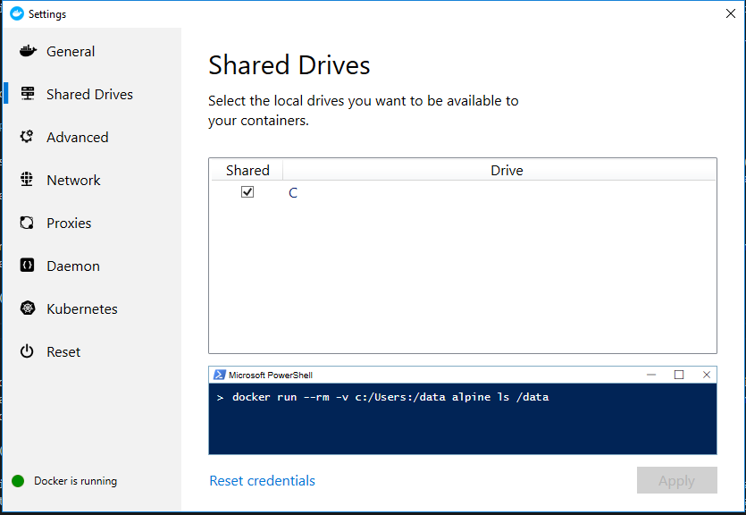
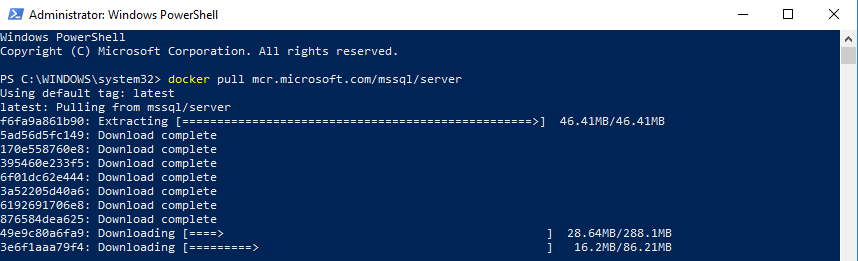
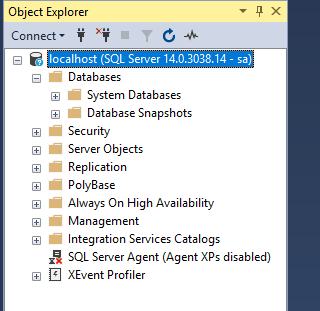
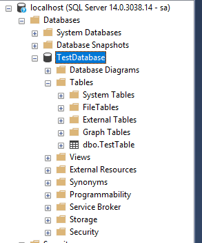
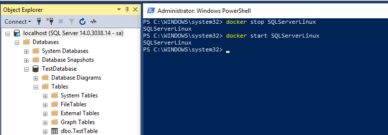
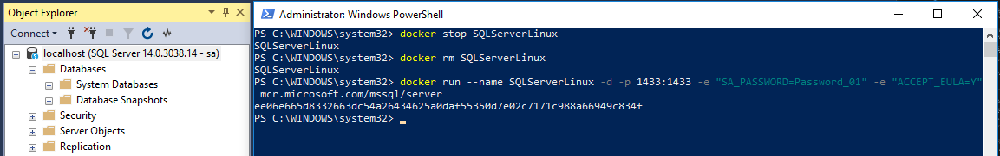
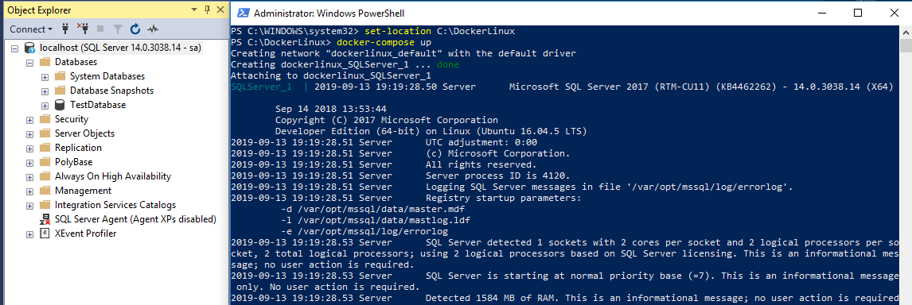

My [previous article](/blog/2019-09/running-sql-server-developer-install-with-docker/index.md) walked through how to get SQL Server running in a Windows-based Docker Container. However, Docker was designed to host Linux-based containers, which offer the following advantages over Windows-based containers.  

- Much less overhead.
- More features available.
- More images are available.
- More examples of containers in use.

SQL Server can run on Linux based containers.  In this article, I will go through what is necessary to get SQL Server up and running in a Linux-based container.

!toc

## Prep work

This article uses [Docker Desktop](https://hub.docker.com/editions/community/docker-ce-desktop-windows). My previous article walks through the steps to [install Docker Desktop](/blog/2019-09/running-sql-server-developer-install-with-docker/index.md), so I won’t repeat that here.

The only downside with Docker Desktop is you can’t run both Windows-based containers and Linux-based containers. If you’ve been using Windows-based containers, you can switch to Linux containers by right-clicking on the Docker icon in the taskbar and selecting `Switch to Linux containers...`. By default, Docker Desktop starts with Linux containers:


Docker treats all containers as stateless. Expect any changes made to the container, such as creating a database, to be destroyed. We are going to solve that problem by using volumes. After you have switched over to Linux Containers, right-click on the Docker desktop icon in the taskbar and go to settings. In settings, select the shared drives option. Click the checkbox to share the drive of your choice with Docker. In my case, I only have the `C:\` drive:



I want to store the databases in the folder `C:\DockerLinux\Volumes\SQLServer` folder on my `C:\` drive:


## Configuring the SQL Server Developer container

Just like before, I want to use this for actual development work. In the last article, I created a Docker Compose file to kick off the SQL Server. Rather than starting there, I want to do the same process as before. Methodically get SQL Server up and running in a Linux container. Taking a systematic approach will make it easier to troubleshoot when I hit that eventual brick wall.

1. Get the container up and running with no extra configuration.
2. Connect to it via SSMS.
3. Persist databases created in a container.

### Running SQL Server Developer container for the first time

First, let’s run a simple command to pull down the SQL Server Windows Developer image from Docker Hub:

```PowerShell
docker pull mcr.microsoft.com/mssql/server
```

The Windows-based image for SQL Server took a long time to download. Not so with the SQL Server Linux-based container. It took me longer to type this paragraph and capture the screenshot:



The [documentation provided](https://hub.docker.com/_/microsoft-mssql-server) for the Linux-based container for SQL Server makes it easy to get the container up and running. Please make a note of the `--name` parameter being sent in. That parameter will make it easier later when we need to figure out how to connect to it. Along with naming the instance, I will set the port to the default SQL Server port, `1433`.

:::warning
The environment variable names are case-sensitive, and sa_password will not work, it has to be SA_PASSWORD.
:::

```PowerShell
docker run --name SQLServerLinux -d -p 1433:1433 -e "SA_PASSWORD=Password_01" -e "ACCEPT_EULA=Y" mcr.microsoft.com/mssql/server
```


### Connecting to the container from SSMS on the host

The SQL Server container is running, but how can SSMS running on the host connect to it? In the above command, we supplied the `-p` parameter, which exposes the port to the host on `localhost`. To connect to SQL Server running in a Linux container from SSMS we just need to type in `localhost` and provide the sa username/password:



Just like regular SQL Server, everything works as expected. I can create a database and tables without any issue:



### Persisting databases created in a container

What happens if the container needs to be restarted?

```PowerShell
docker stop SQLServerLinux
docker start SQLServerLinux
```

The database still exists after the restart:



If the container needs to be re-created, for an upgrade or a configuration change, then we need to call the `rm` command to remove it after stopping it:

```PowerShell
docker stop SQLServerLinux
docker rm SQLServerLinux
docker run --name SQLServerLinux -d -p 1433:1433 -e "SA_PASSWORD=Password_01" -e "ACCEPT_EULA=Y" mcr.microsoft.com/mssql/server
```

When that happens, all the databases in that container are deleted:



If you read my previous article, that wasn’t a big surprise, and just like before, we need to leverage volumes. One nice thing about Docker is it provides a layer of abstraction. Tell Docker to point at the folder on the host, `C:\DockerLinux\Volumes\SQLServer` to the Linux directory where SQL Server configuration is stored, `var/opt/mssql`:

```PowerShell
docker stop SQLServerLinux
docker rm SQLServerLinux
docker run --name SQLServerLinux -d -p 1433:1433 -e "SA_PASSWORD=Password_01" -e "ACCEPT_EULA=Y" -v C:\DockerLinux\Volumes\SQLServer:/var/opt/mssql mcr.microsoft.com/mssql/server
```

When a test database is created, it will appear in that folder on the host:


When the container is restarted, it will mount all those existing databases, including TestDatabase.

## Docker Compose

I like to use [Docker Compose](https://docs.docker.com/compose/). It is very nice to store my Docker container configuration in an easy to read, and run, YAML file. Here is what it looks like for the Linux-based container for SQL Server:

```YAML
version: '3.7'
services:
 SQLServer:
 image: mcr.microsoft.com/mssql/server
 environment:
 - ACCEPT_EULA=Y
 - SA_PASSWORD=Password_01
 ports:
 - '1433:1433'
 volumes:
 - C:\DockerLinux\Volumes\SQLServer:/var/opt/mssql
```

I saved that `docker-compose.yml` file in C:\DockerLinux. Now I run this PowerShell script to get everything up and running:

```PowerShell
set-location C:\DockerLinux
docker-compose up
```

If you don’t want to see the real-time logs, add the `-d` switch to `docker-compose up` to start the container without attaching to it:



## Conclusion

When I started writing this article, I thought I’d have to learn quite a bit about Linux. I mentally prepared myself for a few days of frustration as I learned some of the nuances of Linux. Imagine my surprise when all I needed to do was change to Linux containers, pull a different image, and change the path on the host. I spent more time writing this article than getting the container up and running. This is one of the few times where the learning curve was a lot lower than I expected.

Now I have a choice when I need to run SQL Server locally. I can run it as a Windows Service, a Windows-based container, or a Linux-based container. It’s awesome to have a choice like that.

Until next time, Happy Deployments!
