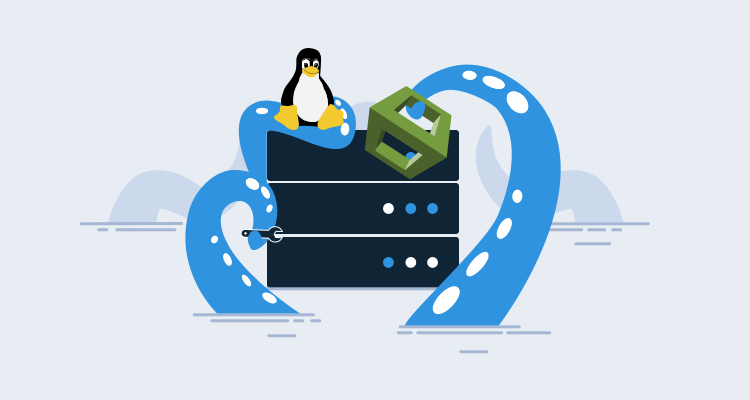
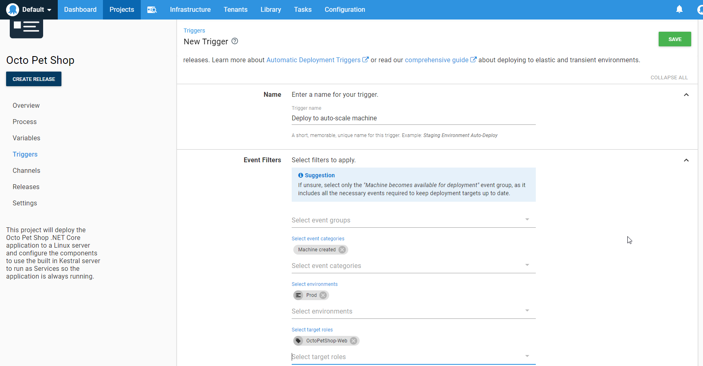

In a world of cloud-based applications with scaling capabilities, it’s essential to have infrastructure automation in place.  Amazon Web Services (AWS) has removed the heavy lifting by providing CloudFormation templates for automatic provisioning of cloud-based resources, but you still need a method to automatically connect your newly created EC2 instances to Octopus Deploy so your applications and services can be deployed.  In this post, I‘ll demonstrate how to install and configure a Tentacle for Linux when using a Linux-based EC2 instance.

## UserData in the CloudFormation template

AWS provides a section within the CloudFormation template where we can include a script called UserData.  In this example, I create an EC2 Linux instance to host [OctoPetShop](https://github.com/OctopusSamples/OctoPetShop), a .NET Core application.  To accomplish this, I need to:

- Install Tentacle for Linux.
- Configure the Tentacle.
- Register the Tentacle with my Octopus server.
- Create the Unit file.
- Configure the Tentacle to run as a Linux service.
- Install .NET Core.

### Install Tentacle for Linux

After the EC2 instance is provisioned, we need to install Tentacle for Linux. First we add the Octopus public key and the Octopus repository to the authorized list for apt.  After those commands have run, we can install Tentacle for Linux:

```bash
sudo apt-key adv --fetch-keys https://apt.octopus.com/public.key # Add Octopus public key to apt
sudo add-apt-repository "deb https://apt.octopus.com/ stretch main" # Add Octopus repository to apt
sudo apt-get update # Make sure everything else is up-to-date
sudo apt-get install tentacle # Install Tentacle for Linux
```

### Configure the Tentacle

When dealing with cloud-hosted Virtual Machines (VMs) that can be spun up dynamically, it makes the most sense to configure the Tentacle as a Polling Tentacle so we don’t have to deal with as many firewall configurations:

```bash
serverUrl="https://YourOctopusServer" # Url to our Octopus server
serverCommsPort=10943 # Port to use for the Polling Tentacle
apiKey="API-XXXXXXXXXXXXXXXXXXXXXXXXXXX" # API key that has permission to add machines
name=$HOSTNAME # Name of the Linux machine
environment="Dev"
role="AWS-MyApplication"
configFilePath="/etc/octopus/default/tentacle-default.config" # Location on disk to store the configuration
applicationPath="/home/Octopus/Applications/" # Location where deployed applications will be installed to

# Create a new Tentacle instance
/opt/octopus/tentacle/Tentacle create-instance --config "$configFilePath"

# Create a new self-signed certificate for secure communication with Octopus server
/opt/octopus/tentacle/Tentacle new-certificate --if-blank

# Configure the Tentacle specifying it is not a listening Tentacle and setting where deployed applications go
/opt/octopus/tentacle/Tentacle configure --noListen True --reset-trust --app "$applicationPath"
```

### Register the Tentacle with Octopus server

Now that we’ve configured the Tentacle, we need to register it with the Octopus server.  This script uses some of the variables that were defined in the previous section:

```bash
# Display that we’re going to register the Tentacle and to where with environments and roles
echo "Registering the Tentacle $name with server $serverUrl in environment $environment with role $role"

# Register the Tentacle with our Octopus server - note that we've included more environments and roles than the ones defined in variables above
/opt/octopus/tentacle/Tentacle register-with --server "$serverUrl" --apiKey "$apiKey" --name "$name" --env "$environment" --env "TearDown" --role "$role" --role "OctoPetShop-Web" --role "OctoPetShop-ProductService" --role "OctoPetShop-ShoppingCartService" --comms-style "TentacleActive" --server-comms-port $serverCommsPort
```

### Install and configure the Tentacle to run as a Linux service

Next we configure Tentacle to start when the OS starts:

```bash
sudo /opt/octopus/tentacle/Tentacle service --install --start
```

### Install .NET Core

The last thing our script needs to do is install .NET Core so our `OctoPetShop` application will run:

```bash
# Download and install the Microsoft packages
wget -q https://packages.microsoft.com/config/ubuntu/18.04/packages-microsoft-prod.deb -O packages-microsoft-prod.deb
sudo dpkg -i packages-microsoft-prod.deb

# Add universe repository
sudo add-apt-repository universe

# Install apt-transport-https
sudo apt-get install apt-transport-https --assume-yes

# Run an update
sudo apt-get update

# Install .NET core SDK
sudo apt-get install dotnet-sdk-2.2 --assume-yes
```

## Sample CloudFormation template

The following is an excerpt from the CloudFormation template. The complete template is available in the OctopusSamples [GitHub Repo](https://github.com/OctopusSamples/CloudFormation-LinuxTentacle/blob/master/src/SampleCloudFormation.yaml).

```
Resources:
  EC2Instance:
    Type: 'AWS::EC2::Instance'
    Properties:
      InstanceType: !Ref InstanceType
      SecurityGroups:
        - !Ref InstanceSecurityGroup
      KeyName: !Ref KeyName
      ImageId: ami-06f2f779464715dc5
      UserData:
        Fn::Base64:
          !Sub |
            #!/bin/bash -xe
            serverUrl="https://YourOctopusServer"
            serverCommsPort=10943
            apiKey="API-XXXXXXXXXXXXXXXXXXXXXXXXXXX"
            name=$HOSTNAME
            environment="Dev"
            role="AWS-MyApplication"
            configFilePath="/etc/octopus/default/tentacle-default.config"
            applicationPath="/home/Octopus/Applications/"

            sudo apt-key adv --fetch-keys https://apt.octopus.com/public.key
            sudo add-apt-repository "deb https://apt.octopus.com/ stretch main"
            sudo apt-get update
            sudo apt-get install tentacle

            /opt/octopus/tentacle/Tentacle create-instance --config "$configFilePath"
            /opt/octopus/tentacle/Tentacle new-certificate --if-blank
            /opt/octopus/tentacle/Tentacle configure --noListen True --reset-trust --app "$applicationPath"
            echo "Registering the Tentacle $name with server $serverUrl in environment $environment with role $role"
            /opt/octopus/tentacle/Tentacle register-with --server "$serverUrl" --apiKey "$apiKey" --name "$name" --env "$environment" --env "TearDown" --role "$role" --role "OctoPetShop-Web" --role "OctoPetShop-ProductService" --role "OctoPetShop-ShoppingCartService" --comms-style "TentacleActive" --server-comms-port $serverCommsPort

            sudo /opt/octopus/tentacle/Tentacle service --install --start

            wget -q https://packages.microsoft.com/config/ubuntu/18.04/packages-microsoft-prod.deb -O packages-microsoft-prod.deb
            sudo dpkg -i packages-microsoft-prod.deb

            sudo add-apt-repository universe
            sudo apt-get install apt-transport-https --assume-yes
            sudo apt-get update
            sudo apt-get install dotnet-sdk-2.2 --assume-yes
```

## Add a project trigger

We can take this automation even further and use a [Project Trigger](https://octopus.com/docs/deployment-process/project-triggers) in our Octopus project to configure the `OctoPetShop` application to automatically deploy whenever a new machine becomes available.



## Conclusion

Now, anytime this CloudFormation template is used to create a new EC2 instance, it will automatically download, install and configure the Tentacle for Linux, attach the Tentacle to your Octopus server, set up the Tentacle as a Linux service, and install .NET Core making our new instance ready to host the `OctoPetShop` application.
