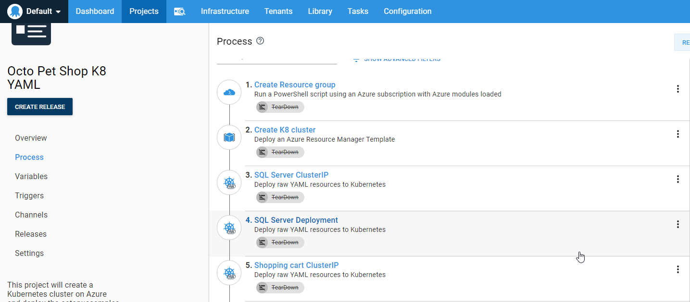
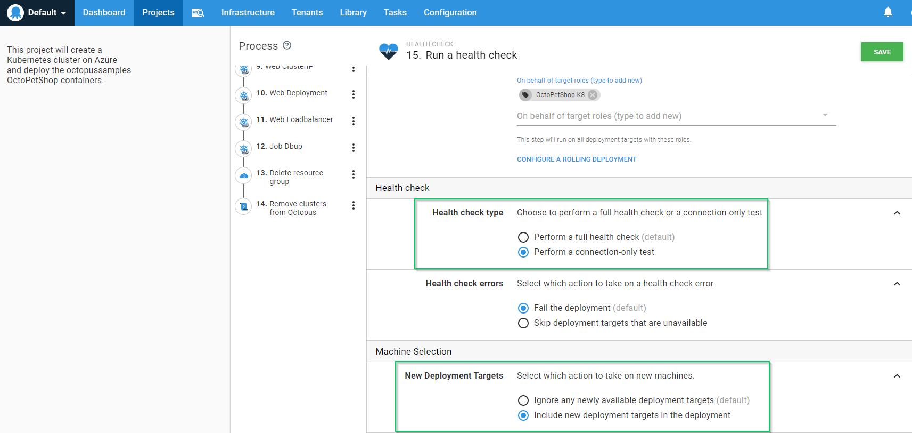

## Introduction
Using Project Triggers, it is possible to have your application deployed to dynamically created deployment targets.  This works especially well when you have an application that is configured with scaling capabilities.  As more servers are added to handle load, your application is automatically deployed.  That being said, there are situations where the creation of your deployment target is part of your deployment process.  This can get a bit tricky as Octopus Deploy chooses the targets to deploy to when the deployment starts.  In this post, I will show you how to include dynamically adding a target during the deployment process.

## Example scenario
Let's say we have an application that uses Kubernetes on Azure.  Our need is to use an Azure Resource Manager (ARM) template to create our Kubernetes cluster, then deploy our application to it.  Once the cluster is no longer needed, we tear it down to conserve cost.  This approach is useful for when the type of cloud resource we need is expensive so we only want it for a limited time.  We create our process that looks something like this

We dynamically create a resource group, a Kubernetes cluster then start deploying to it.

We then update your Project settings to allow deployments to be created, even when targets do not exist.

Now we schedule our deployment and watch it go!

## Wait, what?  Why'd my steps get skipped?
The result of your deploy will look like this with all of your steps for deploying to the Kubernetes cluster skipped.  Despite sucessfully creating the Kubernetes cluster and registering it with Octopus Deploy, deployment targets are chosen at the beginning of a deployment.  Since the cluster hadn't been registered to Octopus Deploy yet, Octopus Deploy determined there were no available targets to deploy to, so all deployment steps were skipped.

## How do I get the new target to be included?
Adding a Health Check step to your process and configuring it to include new targets is how we get around this issue.

When configuring the Health Check, choose `connection-only test` for the Health Check Type and `Include new deployment targets` in the New Deployment Targets section.

Once we have done this, our newly provisioned Kubernetes cluster will be included in the deployment and the rest of our steps will deploy successfully!

## Summary
While not a common scenario, this post demonstrated how you can include targets that were created during the deployment process in your deployment.