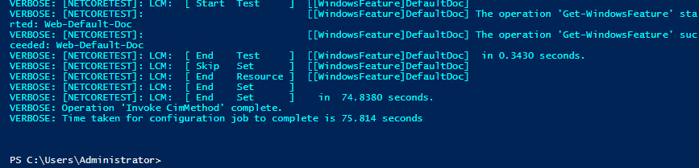
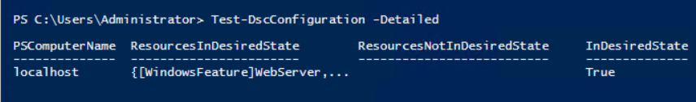
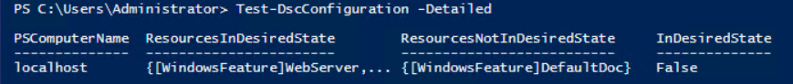

## Introduction
Whether you are a large organization or a small one, use cloud infrastructure or rack-mounted servers, maintaining the known state of a server can be challenging.  Several third-party solutions such as Ansible, Chef, and Puppet exist but are paid, Linux-based products.  For Windows folks, there is a free and Windows-centric option available; PowerShell Desired State Configuration (DSC).  In this post I will show you how to get started with PowerShell DSC and provide some basic examples on how it can be used.

## What is PowerShell DSC
PowerShell DSC is an Infrastructure as Code (IaC) technology that uses PowerShell to create Managed Object Format (MOF) files which Windows Management Instrumentation (WMI) can use to configure a machine.  In other words, PowerShell DSC uses PowerShell to programmatically configure your computer.  Additionally, DSC can monitor the state of the configured resources to make sure your machine stays consistent.  Along with monitoring, DSC can also automatically correct the configuration of your system so it is always in desired state.

### PowerShell != PowerShell DSC
If you've ever taken a course in PowerShell, your instructor may have mentioned PowerShell DSC, but glossed over it stating that it was a completely different animal or that it was another course that is available.  There's a reason for that, it is.  While DSC uses the PowerShell scripting language, the simlarities end there.

### Why use PowerShell DSC
A common method of for maintaining consistency in your Infrastructure is to create base images for the different types of servers you need to spin up.  Need a web server?  Use the web server image.  Need a database server?  Use the database server image.  While this certainly shortens the amount of time it would take to provision resources with a known/good configuration, there are some inherent problems.  What happens when your Chief Information Security Officer (CISO) changes the allowed protocols of your web server.  Sure, you could fix the base image and either re-create all of your web servers or write an automation script to apply the new security configuration to the existing ones.  Re-creating servers or writing then testing an update script could take a siginifant amount of time, especially if you have hundreds of servers.  What if the newly implemented security standards breaks a quarterly interface with a business partner, now you have to undo all of that work.  With PowerShell DSC, you could define your desired state which all new and existing servers could then pick up and implement.  If you had to undo it, simply change the desired state to revert.

### How does it work?
PowerShell DSC takes the components configured with PowerShell and converts them into MOF files for WMI to use to configure a machine.  There are two methods that DSC can use to apply the configuration to your machine; Push and Pull.  You can also create a sort-of hybrid approach using automated deployment tools such as Octopus Deploy.

#### Push method
The Push method is perhaps the easiest method to start with.  This method requires the user to "push" the configuration to the server by calling the Start-DscConfiguration cmdlet.  This has the advantage of starting immediately to apply the configuration.  In terms of automation, the disadvantage to this approach is if the server is offline, it will not be able to apply the new desired state.  This is where the pull method may be a better approach.

#### Pull method
As the name implies, the Pull method reaches out to a server to pull the configuration down and apply it.  This requires that you have a Pull server that houses the configurations for your servers.  The disadvantage of this approach is the requirement of an additional server to host the configuration for the other servers.  The configured servers would then need to be configured to poll the pull server to determine if there is a new MOF file available for it.  

## Getting started
This post is designed for someone who is new to DSC so we're going to be using the easier to use push method to get started.  For our scenario, we're wanting to make sure the configuration of our servers includes some Windows Features.  We'll use just a few

- Web-Server
- Web-Mgmt-Tools
- Web-Default-Doc

(If you're wondering where I got the names, use the `Get-WindowsFeature` cmdlet to get a list.  You can also use a wildcard for the name such as `Get-WindowsFeature Web*`)

### Simple Configuration script
For DSC, we use the `Configuration` keyword to define the configuration.  In this example, `WindowsFeature` is the component that we are configuring.  You can see that we define three separate instances of the `WindowsFeature` component, one for each component we want to configure.  Each instance configured needs to have it's own unique name as it's used as a key when converting into the MOF file.  Every component that you configure will have an Ensure property which can have the value of either Present or Absent.  When you want to make sure the component exists, you specify Present.  If you do not want the component on the machine, you specify Absent.  For this example, we want to make sure the components are installed on the server, so we have specified Present for all of them.

Once we have a `Configuration` completed, we call it similar to a function and provide an `OutputPath` so that DSC knows where to place the generated MOF file.  For this example, we have named it `WebServerConfiguration`.  After the DSC `Configuration` has completed, we call `Start-DscConfiguration` cmdlet providing the path to the MOF file that we generated.

```PS
Configuration WebServerConfiguration
{  
  Node "localhost"
  {        
    WindowsFeature WebServer
    {
      Name = "Web-Server"
      Ensure = "Present"
    }

    WindowsFeature ManagementTools
    {
      Name = "Web-Mgmt-Tools"
      Ensure = "Present"
    }

    WindowsFeature DefaultDoc
    {
      Name = "Web-Default-Doc"
      Ensure = "Present"
    }
  }
}

WebServerConfiguration -OutputPath "C:\DscConfiguration"

Start-DscConfiguration -Wait -Verbose -Path "C:\DscConfiguration"
```
After your configuration has run, you should see some output similar to this



### Separating node data and making the script more dynamic
Our simplistic example is very hard-coded and not dynamic at all.  With PowerShell DSC, we have the ability to separate the configuration data from the configuration itself and make our script more dynamic, it is PowerShell afterall :)

A configuration data file is just a bunch of Hash tables that can contain other Hash tables or Arrays and typically have a psd1 file extension.  Configuration data must have at least one key named AllNodes.  Refer to the [Microsoft documentation](https://docs.microsoft.com/en-us/powershell/scripting/dsc/configurations/configData?view=powershell-6) for more information.

Let's take our original list of three Windows Features and put them into a configuration data file.  

```PS
@{
  AllNodes = @(
    NodeName = $env:COMPUTERNAME
    WindowsFeatures = @(
      @{
        Name = "Web-Server"
        Ensure = "Present"
      },
      @{
        Name = "Web-Mgmt-Tools"
        Ensure = "Present"
      },
      @{
        Name = "Web-Default-Doc"
        Ensure = "Present"
      }
    )
  )
}
```

With the configuration data separated, we can shorten and make our DSC script more generic

```PS
Configuration WebServerConfiguration
{  
  Node $AllNodes.NodeName
  {        
    # Loop through the defined features
    ForEach($Feature in $Node.WindowsFeatures)
    {
      # Define component
      WindowsFeature $Feature.Name
      {
        Name = $Feature.Name
        Ensure = $Feature.Ensure
      }
    }
  }
}

WebServerConfiguration -OutputPath "C:\DscConfiguration" -ConfigurationData "C:\DscConfiguration\WebServer.psd1"

Start-DscConfiguration -Wait -Verbose -Path "C:\DscConfiguration"
```

There are two things to note in our new script:
- The call to WebServerConfiguration now has an additional argument ConfigurationData.  This tells DSC the file that contains the configuration data to load.
- We're able to reference the properties of the configuration data file using dot notation.

## Detecting drift
As previously mentioned, DSC has the ability to detect whether something is no longer in the desired state.  It is important to note that DSC is only able to detect changes that it has been told the care about.  Using our example, if someone had installed the Web-Ftp-Server Windows Feature, our DSC script would not report anything.  However, if someone had removed Web-Default-Doc, DSC would report that the feature was no longer in the desired state.  When a DSC configuration is no longer in desired state, it is referred to as drifted.

To run a test of the current configuration, you run the `Test-DscConfiguration` cmdlet.  If the configuration is in desired state, `Test-DscConfiguration` returns True, if something has drifted, it returns False.  Passing the `-Detailed` argument will return a list of resources both in and out of drift.



Let's remove the Web-Default-Doc by running

```PS
Uninstall-WindowsFeature Web-Default-Doc
```

Run `Test-DscConfiguration -Detailed`



As you can see, the machine has drifted and has identified the [WindowsFeature]DefaultDoc (Web-Default-Doc) as no longer being in desired state!

### Automatically correcting drift
You can configure your Local Configuration Manager (LCM) to automatically correct configuration when drift is detected.  To do this, we place a `LocalConfigurationManager` node within our DSC script and set the `ConfigurationMode` property.  The `ConfigurationMode` can have one of three values:
- ApplyOnly - this setting will instruct the LCM to apply the configuration and do nothing else
- ApplyAndMonitor - this setting will instruct the LCM to apply the configuration and periodically run a consistency check (essentially Test-DscConfiguration).  The default frequency for the consistency check is 15 minutes and can be overridden by setting the `ConfigurationModeFrequencyMins` property.
- ApplyAndAutoCorrect - this setting will instruct LCM to apply the configuration and periodically run a consistency check.  If the consistency check returns false, the LCM will re-apply the configuration to bring the machine back into the desired state.

To configure LCM to automatically correct drift, we'll set it to ApplyAndAutoCorrect

```PS
Configuration WebServerConfiguration
{  
  Node $AllNodes.NodeName
  {
    # Configure the LCM
    LocalConfigurationManager
    {
      ConfigurationMode = "ApplyAndAutoCorrect"
    }        

    # Loop through the defined features
    ForEach($Feature in $Node.WindowsFeatures)
    {
      # Define component
      WindowsFeature $Feature.Name
      {
        Name = $Feature.Name
        Ensure = $Feature.Ensure
      }
    }
  }
}

WebServerConfiguration -OutputPath "C:\DscConfiguration" -ConfigurationData "C:\DscConfiguration\WebServer.psd1"

Start-DscConfiguration -Wait -Verbose -Path "C:\DscConfiguration"
```
Now our server will automatically correct itself whenever drift is detected!  If you enable automatic drift correction, make sure you document it, otherwise you or someone on your team will end up chasing their tail trying to figure out why something you just removed keeps coming back!

## Summary
This post gives you some basic information in how to get started using PowerShell DSC as well as how to detect and optionally automatically correct drift.  For an example of the mentioned hybrid approach, refer to my other [blog post](https://octopus.com/blog/powershelldsc-as-template) where we configure PowerShell DSC to deploy like an application.