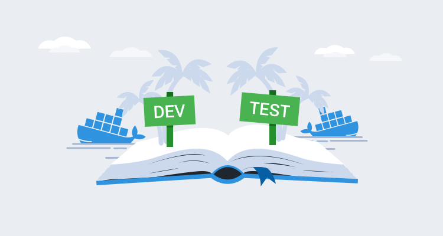
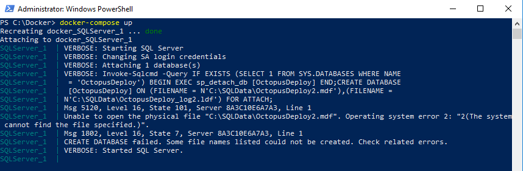
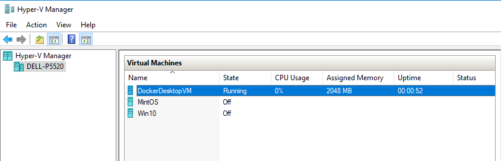
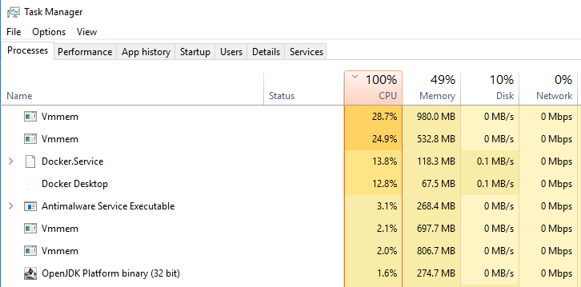
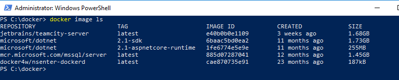
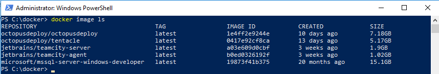

How hard is it to use Docker on a Windows developer machine for development and testing?  Is Docker as big and scary as I think it is?  A couple of weeks ago, I challenged myself to answer those questions.  It turns out, Docker on Windows is neither as big or scary as I thought.  That being said, there was a bit of a learning curve, and I want to share some of the lessons I learned with you.

!toc

## The scenario

I’m a .NET developer at heart.  I love using Visual Studio.  The Docker functionality built into Visual Studio works great.  It’s almost too easy.  Right-click on a project and configure it to run in Docker.  Fire up the debugger, and I’m off to the races.

I wanted to take a step back and learn how Docker actually works, especially on Windows, and I happen to have a perfect scenario to do that.  I demo a lot of CI/CD pipelines, either at conferences or one-to-one with a customer.  I’m not speaking at conferences or doing demos all day every day though, but running a CI/CD pipeline all the time consumes resources.  Could I run a CI/CD pipeline in Docker?

My CI/CD pipeline uses GitHub for source control, TeamCity as the build server, Octopus Deploy as the deployment server (BIG surprise, I know), with SQL Server as the database backend.  As I am typing this, at its core, a CI/CD pipeline is not very different from applications I’ve worked on in the past.  You could swap out all the CI/CD components with an Angular app hosted in [NGINX](https://nginx.com), an ASP.NET Web API hosted in IIS, or a Windows Service for scheduling with SQL Server as the database.  

By learning how to host a CI/CD pipeline in Docker, I also learned how to host pretty much any other application in Docker.

## Lesson #1: It’s hard to bootstrap a stateful app using Docker Compose

[Docker Compose](https://docs.docker.com/compose/) makes it easy to configure multiple containers by defining the application as a YAML file.  Docker Compose works great when all the containers are stateless, but adding a stateful container makes things tricky.  In my CI/CD pipeline, I ran into that straight away when configuring the SQL Server container.  The SQL Server container houses the database for Octopus Deploy.  In a nutshell, I wanted a bootstrap script to:

- Create the Octopus Deploy database if it doesn’t exist.
- Mount the Octopus Deploy database to the container if it does exist.

When the database doesn’t exist the Docker Compose file is:

```YAML
  SQLServer:
   image: microsoft/mssql-server-windows-developer
   environment:
     - ACCEPT_EULA=Y
     - SA_PASSWORD=Password_01
   ports:
     - '1433:1433'   
   volumes:
     - c:\Docker\Volumes\SQLServer\Databases:c:\SQLData     
```

However, the Docker Compose file changes after the databases are created:

```YAML
  SQLServer:
   image: microsoft/mssql-server-windows-developer
   environment:
     - ACCEPT_EULA=Y
     - SA_PASSWORD=Password_01
     - attach_dbs=[{'dbName':'OctopusDeploy','dbFiles':['C:\\SQLData\\OctopusDeploy.mdf','C:\\SQLData\\OctopusDeploy_log.ldf']}]
   ports:
     - '1433:1433'   
   volumes:
     - c:\Docker\Volumes\SQLServer\Databases:c:\SQLData     
```

It is possible to start with a Docker Compose file which includes the attach_dbs environment variable.  The container continues to run if database files are specified that it cannot find.



If that was the only container I needed to run, it isn’t a big deal.  Open up SSMS, add the database, and I’m good to go.  However, I have another container in my Docker Compose file, Octopus Deploy, which requires that database to be there.  And that Octopus Deploy container is required to be there for the Octopus Tentacles to work.  For Octopus Deploy to be hosted entirely in Docker containers, the Docker Compose file has to:

1. Start the SQL Server in a Docker container.
2. Create the Octopus Deploy database if it doesn’t exist.
3. Start the Octopus Deploy Docker container.
4. Configure Octopus Deploy, and create an API key Tentacles can register with.
5. Start the Octopus Deploy Tentacle Docker container.

Both the Octopus Deploy Server and Octopus Deploy Tentacle container need to delay their start-up until their dependent containers are *ready*.  In each case, *ready* means something different, but how would Docker Compose know that?  The simple fact is, it can’t.  If you look at the examples provided on [Docker’s website](https://docs.docker.com/compose/aspnet-mssql-compose/), you’ll see it’s the code’s responsibility to handle retries and waiting.

I’m using pre-built Docker images, so I don’t have that luxury.  I could leverage the [command](https://docs.docker.com/compose/compose-file/#command) option in the Docker Compose file for the Octopus Deploy and Octopus Deploy Tentacle containers, but that overwrites the default command and prevents services from installing and starting up in the container.

In the end, I opted to iterate through the Docker Compose file.  To keep the number of restarts to a minimum, I decided to do both TeamCity and Octopus Deploy at the same time.

1. Add SQL Server to Docker Compose and start it using `docker-compose up`.
2. Create databases, and update the Docker Compose file to ensure they are attached to SQL Server on restart.
3. Run `docker-compose down` to tear everything down.
4. Add TeamCity and Octopus Deploy to Docker Compose and start it up.
5. Configure TeamCity and Octopus Deploy.
6. Tear everything down using the same command as before.
7. Add the TeamCity build agent and Octopus Deploy Tentacle(s) to the Docker Compose file and start it up.

Docker Compose is the desired state of the application’s configuration.  If I wanted to make my CI/CD pipeline portable, I’d include a bootstrap script to download the images and configure everything.  The Docker Compose file would be the final state.  If I wanted to make an application I was working on run in Docker I’d add the necessary code so it would know to wait.  

## Lesson #2: Windows-based containers tend to consume more resources and run differently than Linux-based containers

Linux-based containers run on the Hyper-V VM `Docker Desktop VM`.  That VM is assigned vCPUs and is allocated memory.  



Each Windows-based container runs in its own process which appears as `Vnmem` in the Task Manager.  They can consume as many resources as they need, specifically the CPU.  



My first attempt at a CI/CD pipeline spun up 11 Docker containers.  Needless to say, it consumed a lot of resources.  For roughly 10 minutes after starting, the laptop CPU jumped to 100% as those containers ran their bootstrap scripts.  When I learned each container is a separate process, I scaled back the number of containers to 5.

In addition, Windows-based images consume a lot more disk space.  Here are the Linux-based Docker Images I have on my laptop.  Make a note of the SQL Server image, `mcr.microsoft.com/mssql/server`.  That includes all the dependencies for the image.



Compare that to Windows-based images.  The SQL Server image, `microsoft/mssql-server-windows-developer` when including all the dependencies, is 10x the size.



## Lesson #3: Containers are closer to headless VMs than read-only images

When I read the phrase `Docker Image`, I pictured an ISO file, which cannot be changed.  That’s not the case with Docker containers.  The image is the base of the container.  In fact, a number of Docker Images include a configure script to kick off any necessary configuration.  The Octopus Deploy image does this.  When you start a container with the Octopus Deploy image for the first time, it runs several of the `Octopus.Server.exe` commands, such as `configure`, `admin`, `license`, and `metrics`.  You can see the script that Octopus runs [here](https://github.com/OctopusDeploy/Octopus-Docker/blob/master/Server/Scripts/configure.ps1).

When the Docker container is running, it can be changed.  New software can be installed on it, but it’s important to note, those changes are lost when the container is destroyed.  Containers are destroyed and recreated typically for an update or a change in configuration.  

## Lesson #4: .NET Framework connection strings require SQL Server to be referenced by IP address when using Docker Compose

Getting SQL Server running in a container was easy.  The next question was, how can I get Octopus Deploy to see SQL Server.  Docker Compose provides the ability to name a Docker container, and it does a lot of behind the scenes work so other containers can reference each other by name.  I thought that would work for .NET connection strings.  For example:

```
Server=SQLServer,1433;Initial Catalog=OctopusDeploy;Persist Security Info=False;User ID=sa;Password=Password_01;MultipleActiveResultSets=False;Connection Timeout=30;
```

It did not work for .NET connection strings.  Octopus Deploy is a .NET Framework application, and it could not find SQL Server by the container name on the same Docker network.  It only worked when the connection string used an IP address for the server.  However, the IP address changes each time `docker-compose up` is run. I solved that problem by creating a new network in the Docker Compose file:

```YAML
networks:
  cicd_net:
    ipam:
      driver: default
      config:
        - subnet: 172.28.0.0/16
```

Using that network, I then hardcoded the IP address of each container:

```YAML
  SQLServer:
   image: microsoft/mssql-server-windows-developer
   environment:
     - ACCEPT_EULA=Y
     - SA_PASSWORD=Password_01
     - attach_dbs=[{'dbName':'OctopusDeploy','dbFiles':['C:\\SQLData\\OctopusDeploy.mdf','C:\\SQLData\\OctopusDeploy_log.ldf']}]
   ports:
     - '1433:1433'   
   volumes:
     - c:\Docker\Volumes\SQLServer\Databases:c:\SQLData
     - c:\Docker\Volumes\SQLServer\Backups:c:\Backups
   networks:
    cicd_net:
      ipv4_address: 172.28.1.1   
```

The resulting connection string is:

```
Server=172.28.1.1,1433;Initial Catalog=OctopusDeploy;Persist Security Info=False;User ID=sa;Password=Password_01;MultipleActiveResultSets=False;Connection Timeout=30;
```

The Docker Compose file for Octopus Deploy looks like this:

```YAML
version: '3.7'
services:
  SQLServer:
   image: microsoft/mssql-server-windows-developer
   environment:
     - ACCEPT_EULA=Y
     - SA_PASSWORD=Password_01
     - attach_dbs=[{'dbName':'OctopusDeploy','dbFiles':['C:\\SQLData\\OctopusDeploy.mdf','C:\\SQLData\\OctopusDeploy_log.ldf']}]
   ports:
     - '1433:1433'   
   volumes:
     - c:\Docker\Volumes\SQLServer\Databases:c:\SQLData
     - c:\Docker\Volumes\SQLServer\Backups:c:\Backups
   networks:
    cicd_net:
      ipv4_address: 172.28.1.1   
  OctopusDeploy:
   image: octopusdeploy/octopusdeploy    
   ports:
     - '81:81'
     - '10943:10943'
   depends_on:
     - SQLServer       
   environment:
     - sqlDbConnectionString=Server=172.28.1.1,1433;Initial Catalog=OctopusDeploy;Persist Security Info=False;User ID=sa;Password=Password_01;MultipleActiveResultSets=False;Connection Timeout=30;
     - masterKey=YtnHskuInxiyH5MUIFEdVA==
   volumes:
     - c:\Docker\Volumes\Octopus\Server:c:\Octopus
     - c:\Docker\Volumes\Octopus\Server\Artifacts:c:\Artifacts
     - c:\Docker\Volumes\Octopus\Server\Repository:c:\Repository
     - c:\Docker\Volumes\Octopus\Server\TaskLogs:c:\TaskLogs
   links:
     - SQLServer
   networks:
    cicd_net:
      ipv4_address: 172.28.1.2  
  OctopusDeploy_Worker01:
   image: octopusdeploy/tentacle    
   ports:     
     - '85:80'
   depends_on:
     - OctopusDeploy       
   environment:
     - serverApiKey=API-JSZTATMYECVBOY9CPWARAANHM0
     - serverUrl="http://172.28.1.2:81"
     - targetWorkerPool=DatabaseWorker     
     - serverPort=10943
     - targetName=DockerTentacle-DatabaseWorker01
   volumes:
     - C:\Docker\Volumes\Octopus\Worker01:c:\Applications
     - c:\Docker\Volumes\SQLServer\Backups:c:\Backups     
   links:
     - OctopusDeploy
   networks:
    cicd_net:
      ipv4_address: 172.28.1.3
networks:
  cicd_net:
    ipam:
      driver: default
      config:
        - subnet: 172.28.0.0/16           
```

## Lesson #5: Pointing Docker container volumes at different folders makes local development and testing easier

Knowing how Docker works opens up a world of possibilities.  For this example, I am working on a .NET application with SQL Server on my laptop.  In the past, I ran SQL Server as a Windows service on my laptop.  

Imagine I’m in the middle of working on a feature with lots of database changes, QA manages to cause an error in the test environment, it’s blocking them, and they need it fixed right away to get a release out the door.  Before Docker, when that happened, I would do the following:

- Commit all the pending changes to a branch.
- Checkout the commit which is in test.
- Point the code at the test database and start debugging.

QA are naturally curious people, and while I am still debugging, they poke around the UI a bit and in doing so cause the right piece of code to run which fixes the error.  In hindsight, I shouldn’t have pointed the code running on my laptop at the test database.  I did that because typically bad data happened on one piece of the data model.  To get that one piece of bad data onto my laptop, I would have to clone the entire data model.

I could solve that using a tool like Redgate’s SQL Data Compare.  Or I could write a custom cloning tool for my application.  But for those to work properly I would have revert any pending database changes on my local database.  That was very annoying because I could end up deleting a bunch of test data for the feature I was working on.  I could backup and restore the test database to my local machine, but I wouldn’t want to overwrite my existing database, which means going in and changing the connection strings.

If I ran SQL Server as a Docker container, I could write a script to:

1. Stop the current SQL Server Docker container.
2. Backup the database from the test server to a shared location.
3. Start up a new SQL Server Docker container.
4. Restore that backup into that container.
5. The database name (MyAppDatabase) and the server name (localhost) will be the same as before, so there’s no need to change connection strings.

That is just one example.  Imagine how this could help QA as well.  Rather than have a single central database every QA person has to connect to, they could be given a couple of scripts to get the application running locally.  They could have a pristine database they could clone and use for test runs.

## Conclusion

Docker is not a big and scary tool.  It has a bit of a learning curve, especially if you want to use it in production.  But using it locally has been surprisingly smooth.  When I started building my CI/CD pipeline, I understood the core concepts of Docker.  I’d gotten a container running, but never multiple containers all talking to one another.  All in all, it took me less than a week to get the CI/CD pipeline up and running in Docker containers.  As you can see above, I did run into a few brick walls along the way.  My hope is this article will soften the blow when you run into the same brick wall.
