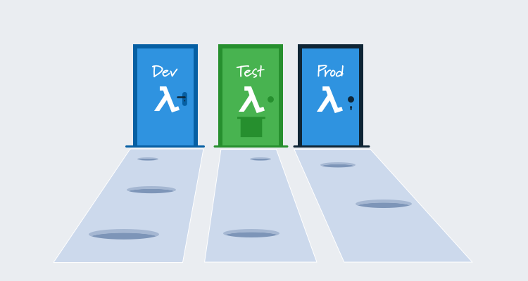

Getting started with serverless applications is relatively easy these days. Tools like [Serverless](https://serverless.com/) and [AWS SAM](https://aws.amazon.com/serverless/sam/) abstract away much of the boilerplate code and hide the finer interactions between services to get you up and running quickly.

Moving from the proof of concept stage to testable and repeatable deployments inevitably means deploying your code across multiple environments. We’ve seen how to [migrate from the SAM CLI to Octopus](/blog/2019-09/aws-sam-and-octopus/index.md) to implement these multi-environment deployments. That previous post advocated for independent CloudFormation stacks as a way of implementing multi-environment deployments, but what about solutions like Lambda aliases?

In this post, we’ll take a look at Lambda aliases, and highlight some of the pitfalls that may not be immediately obvious when using them.

## What are Lambda aliases?

Lambda aliases are essentially named versions of a Lambda deployment. By default, there is a single version called `$LATEST` that always represents the most recent copy of the Lambda that was deployed. You can then publish a version, which creates an immutable snapshot of the Lambda code and configuration. The newly published version has an automatically assigned version number, but by assigning a name, or an alias, to one of these version numbers, it is possible to define a set of Lambda versions that represent an environment.

For example, the alias `Prod` might point to a version of a Lambda created a month ago. Because the published versions are immutable, developers can continue to update the Lambda, but the alias called `Prod` will always reference a known stable version.

Likewise, the `Test` alias might point to a newly published version of the Lambda with the intention of performing testing against it. Then the `Dev` alias can point to the `$LATEST` version, thus creating a development environment that always points to the latest deployed code.

Here is a screenshot from the AWS documentation that illustrates the concept of aliases.

The concept of aliases is easy enough to understand, but there are some things to consider before implementing this strategy.

## What exactly is an environment?

To understand how aliases can go wrong, we first need to ask the rather simple question: *What is an environment?*

In the days of on-premises deployments, an environment was a dedicated server or virtual machine. For example, you would have a production server and a test server. Code and infrastructure deployed to those servers made up the production or test environments.

This topology was very easy to reason about: The production environment was the production server that ran the production code, and the production code interacted with the production database. There is no ambiguity here.

Now consider the case where an AWS Lambda hosts both test and production code. You may even find yourself in the situation where the `Test` alias points to the same version as the `Prod` alias. How do we describe an environment with this topology?

It’s tempting to say that the Lambda environment is the alias, which is to say the production environment is the set of Lambda versions that the `Prod` aliases point to, and the test environment is the set of Lambda versions the `Test` aliases point to. But this description breaks down when we need to implement non-functional requirements like security and performance.

Let’s say you are writing a medical application that processes sensitive information that you’re required not to disclose. This means you have to consider that log files generated by your code, even a stack trace that shows the path your application took, could contain or imply legally sensitive information.

When a production environment can be described simply as *the code running on the production servers*, then security can be implemented as *only people authorized to access the production servers can read the logs*. OK, however, in practice security isn’t quite this easy, but at least there’s no ambiguity as to where the production log files come from.

When using aliases, the concept of a production environment becomes murkier. You may be forced to describe the production environment as *when a Lambda is called from the production host myapp.com*, and then describe the test environment as *when a Lambda is called from the test host test.myapp.com*.

We are now in the position of pushing the concept of environmental awareness down from the infrastructure into the code. Our Lambda code has to be aware of the context in which it was called (by tracking the request hostname for example) and tagging log entries accordingly. This then means our security rules need to consider whether the log entry was tagged with *test* or *production*.

Now your challenge is to tag each log entry, catch all exceptions, create a security rule that scans each CloudWatch log for a specific tag, and limits access to log entries accordingly.

Alternatively, consider the case where a Lambda eventually interacts with a database. You would be hard-pressed to find anyone who advocates for placing test and production data in the same database, which means you will have different databases for each environment. Just as our code had to be made aware of the context in which it was called to tag log entries appropriately, it also needs to know which database it should interact with. Even if your Lambda doesn’t interact directly with a database, it will eventually call one that does, and so it needs to pass this environmental awareness along with each call.

Now your challenge is to create a security rule that allows only a Lambda called in the production context to interact with production data. Keep in mind the production Lambda might be exactly the same as the Test Lambda, and the only thing differentiating it is the context in which it is called.

As you can see, these two seemingly trivial security exercises become unmanageable very quickly, and we haven’t even discussed rate limiting, network segmentation, distributed tracing…

## Hell is not being able to describe your environments

Most non-functional requirements eventually need to be expressed in the form of security, networking, or monitoring rules, and these rules need to be defined per environment. It seems obvious, but this implies you need to be able to define environments.

When environmental awareness is pushed down from the infrastructure layer into the code itself (as it must be when your production code can literally be the same code as your test code), defining an environment becomes tricky, and guaranteeing that environment based rules are enforced is almost impossible.

[This sentiment is echoed by the Lambda developers themselves](https://github.com/awslabs/serverless-application-model/issues/220?source=post_page---------------------------#issuecomment-349054599):

> I do not recommend you (or anyone) use aliases for various environments. The biggest concern I have with this is that you are running the risk of impacting prod with a change to test or dev. You are creating a bigger blast radius in the event something goes wrong with a deploy. My other concern is around the security of your functions. You may have to add credentials or policies specific to dev or test which will or could be replicated in prod. I suggest splitting out dev, test, and prod into separate CloudFormation stacks so that each environment is isolated from each other. You then only have to manage the one CloudFormation template and can deploy it through your CI/CD system at an environment level. You will still only be managing one Lambda function (through SAM), but this setup will reduce the blast radius for deployments and isolate your different environment’s functions and resources.

## Using stacks, regions, or accounts for environments

Rather than trying to use aliases for environments, it is a much better idea to split environments based on other boundaries like CloudFormation stacks, AWS regions, or completely separate AWS accounts.

We’ve seen how to use separate CloudFormation stacks in a [previous blog post](/blog/2019-09/aws-sam-and-octopus/index.md).

Using different AWS regions is the next logical step, although you may find the networking overhead of physical regions interferes with testing or performance monitoring.

For ultimate segregation, you can take the next step of creating environments through separate AWS accounts. In the video [Testing and Deployment Best Practices for AWS Lambda-Based Applications](https://www.youtube.com/watch?v=zJQDAsWm-5k) AWS developer advocate, Chis Munns describes using accounts in this way, and it appears that even AWS have embraced using hundreds of accounts to achieve this kind of separation.

Fortunately, implementing any of these strategies is as simple as scoping the appropriate Octopus variables to an environment, meaning you can easily manage your multi-environment deployments regardless of which strategy you decided to implement.

## Conclusion

For very simple or proof of concept deployments, Lambda aliases can provide a solution for multiple environments. But as we have seen, aliases quickly introduce problems as deployments become more complex.

Independent CloudFormation stacks, AWS regions or accounts provide much cleaner environment boundaries, making security and monitoring much more reliable.

Octopus supports each of these environment boundaries by scoping variable values like CloudFormation stack names, AWS region name, or AWS accounts to environments, meaning your multi-environment deployments are easy to manage and reliable to deploy.
