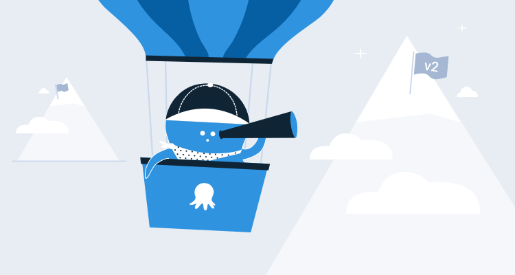
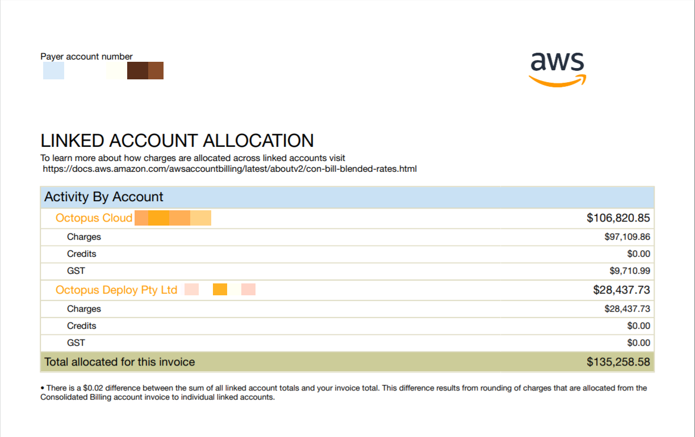

We’re publishing a series about our engineering journey with Octopus Cloud. It’s the story of our v1 launch of Octopus Cloud on AWS, our $100K/month AWS bills, MVP’s and testing customer demand, spending 6 months of engineering effort and then running the service at a loss, spending another 9 months rebuilding it from the ground-up, and of all the considerations we made when rebuilding Octopus Cloud v2, including switching from AWS to Azure, going all-in on Kubernetes, and more.

In this first post in the series, we’ll look at the design choices we made in v1, why it cost so much, and why we decided to start over.

About a year ago [we launched Octopus Cloud](https://octopus.com/blog/announcing-octopus-cloud), a SaaS version of Octopus, as an experiment to see whether it would deliver significant value to our customers and simplify their deployments. We wanted to empower developers to focus on their deployment needs and leave managing the infrastructure to us, but we had no idea how difficult it would be to implement or how much time and money it would cost to get up and running.

Overall, we think it has been a huge success; enough for us to invest the last year rebuilding almost the entire platform from the ground up. I was a part of the team that shipped the current version of Octopus Cloud, and I wanted to take some time to celebrate a few of our wins and reflect on the lessons we learned that have shaped our redesign.

## Will anybody use it?

Going into this experiment, we knew there was interest in a cloud solution, but there were a lot of things we didn’t know:

* How many customers will actually use it?
* What is it all going to cost?
* What should we charge for it? Is it going to cover the infrastructure costs?

We could guess most of these, but knowing the answers was impossible. Engineering time is very expensive too, and it’s time we could spend adding features to our self-hosted product. We didn’t want to spend years designing a perfectly-optimized cloud-native product if there was no demand for it.

We decided to build an [MVP](https://en.wikipedia.org/wiki/Minimum_viable_product) based on our best estimates and test the market that way. The goal was to launch something in 6 months and test if the demand was there; and if it wasn’t, we’d only wasted 6 months. We chose to optimize for getting to market quickly rather than worrying about how much it would cost.

Well, the demand was there. In the first few days, we had over 500 new cloud trials spin up. As customers came to our website and decided between whether to trial Octopus self-hosted or Octopus Cloud, roughly half chose to trial Octopus in the cloud.

## V1 architecture

To bring Octopus Cloud to market quickly, we did the simplest thing possible; we took our self-hosted Octopus Server product and bundled it into an EC2 instance for each customer that signed up. We had to make changes to the product, but mostly around permissions.

We actually had an internal alpha of Octopus Cloud v1 ready within a month or two; I remember the team doing bug bashes to test our security. What took longer, was all the steps required to make something we were happy for customers to use: hardening security, pentesting, planning for recovery, etc.

To ensure there was no way for one user’s data to mingle with another, each cloud instance had its own dedicated VM, database, and a large number of security configurations to prevent any funny business. Here’s a diagram of what it all looked like. Note that we actually use Octopus Deploy to provision and deploy each Octopus Cloud v1 customer:

## Service limits

You know that feeling when you're driving, and you seem to hit every red traffic light? That’s kinda what launching Octopus Cloud felt like; only the red lights were AWS service limits! We quickly learned that *everything* in AWS has some kind of service limit, and we hit all of them. Customers would sign up, we’d hit a limit, we’d ask Amazon to increase it, we’d onboard more customers, and we’d hit another limit. Every time we thought we were in the clear, we’d hit another service limit we didn’t know about.

This caused a few issues as we scaled, and at one point, we had to pause new signups while we tried to provision more headroom.

<blockquote class="twitter-tweet">
Wow, this Octopus Cloud thing has taken off - more than our initial expectations. We&#39;ve temporarily put a hold on new signups while we get Amazon to build some new Data Centers (read: we&#39;re scaling our infra). <a href="https://twitter.com/hashtag/DevOps?src=hash&amp;ref_src=twsrc%5Etfw">#DevOps</a> <a href="https://t.co/gCp6ATxiYf">pic.twitter.com/gCp6ATxiYf</a>
&mdash; OctopusDeploy (@OctopusDeploy) <a href="https://twitter.com/OctopusDeploy/status/1015048915605831680?ref_src=twsrc%5Etfw">July 6, 2018</a></blockquote> 

## Cloud stuff can be really expensive

An EC2 instance for every customer adds up, and as our databases were backed by Amazon RDS, we were limited to 30 databases per RDS instance. Add storage, network, etc. and we were spending over $100 per month to keep a single Octopus Cloud instance online.

Octopus Cloud customers could start a free 30-day trial, which meant that those hundreds of trial signups per month, each of which cost us $100 to host, quickly added up.

We also didn’t have our pricing quite right. We initially launched Octopus Cloud with a $10/month starting tier, with a different pricing model from the one we currently use. Unfortunately, this was one of the most painful lessons we learned because the deficit between what we were charging and spending was magnified by the sheer number of people using Octopus Cloud; continued growth would further amplify the problem.

Two months in, we started having serious conversations about our $100k USD monthly AWS spend, and the fact that we had very little revenue to offset that expense:

We should explain that [Octopus Deploy as a company](https://octopus.com/company) is not publicly listed or VC funded. We’ve been proudly bootstrapped and profitable since Octopus 1.0, and we’ve always run the business conservatively and sustainably. We suddenly found ourselves with a new business that was costing us money at an alarming rate.

We decided to take the lessons we were learning and start a huge body of work we called **Cloud v2**; a reimagining of Octopus Cloud, built to scale sustainably.

Even when we were building v1, the team knew it wasn’t the ideal architecture. Before v1 even launched, there were plenty of conversations in our Slack about whether we should port Octopus to Linux and run it on Kubernetes, or see if we could run it on Windows within Kubernetes or use Nomad by Hashicorp? And all of this was back in early 2018 when everything was churning and not as mature as it is today. So the unit cost wasn’t really a surprise.

What was surprising was the demand. If only a few customers had signed up each month, we could have easily worn the costs (and truth be told, we still can, Octopus self-hosted has great margins!). But with so many customers signing up, it became much more urgent. $100K+ per month is $1.2M+ over the year, which is plenty to justify spending engineering effort to bringing it down.

## Starting over

We explored all kinds of options to bring down our costs, and the initial plan was to iterate on the v1 architecture and look for cost savings, and we did make some progress there, but eventually, we concluded the best way to dramatically reduce our costs (without sacrificing customer performance) involved some substantial architecture changes, and essentially, starting from scratch.

In the rest of this series, we’ll go into each of the decisions we made when re-engineering Octopus Cloud for v2. These include:

 - Switching from AWS to Azure.
 - Porting Octopus Server to Linux.
 - Running Octopus in containers and using Kubernetes.

With Octopus Cloud v2, we’re also backing ourselves to learn and use a lot of technologies at the leading edge of hosting and orchestration. [Terraform](https://github.com/OctopusDeploy/terraform-provider-octopusdeploy), [containers](https://hub.docker.com/r/octopusdeploy/octopusdeploy), [Kubernetes](https://docs.microsoft.com/en-us/azure/aks/), and [Azure Functions](https://docs.microsoft.com/en-us/azure/azure-functions/) are just a few of the spaces we are currently working in. This approach brings its own challenges, but it will also feed into the next generation of Octopus tooling we can build with the expertise we acquire along the way. [Drinking our own champagne](https://en.wikipedia.org/wiki/Eating_your_own_dog_food) has already improved a ton of the functionality within Octopus as we’ve become one of our own biggest customers.

## Conclusion

Deciding to rebuild something from scratch is brutal, it can feel like your earlier attempt was wasted time and effort, and that work is being thrown out. It’s also very easy to go into an “MVP” project knowingly, but then become attached to it, assuming it will be the final architecture. We needed to recognize that a second step was only possible because the first step was taken, and every lesson learned along the way was essential input.

Building Octopus Cloud v2 has been very different from v1, where before we were guessing and flying blind, this time we have real data we can analyze to answer some of the questions we have: we know what users will spend, we know what things will cost, we know what sort of resource consumption to expect, and between those things we know how to make a platform that will truly scale.
