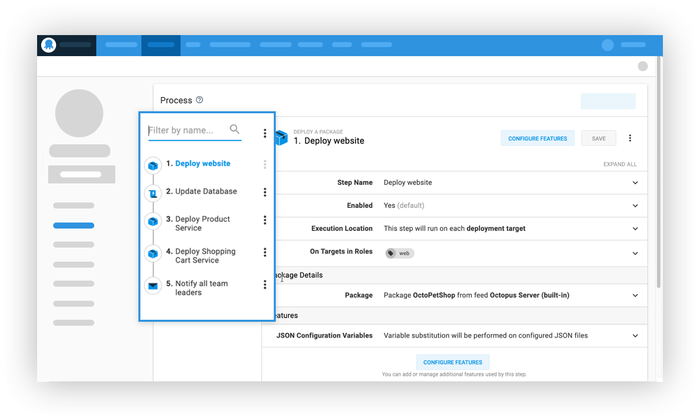
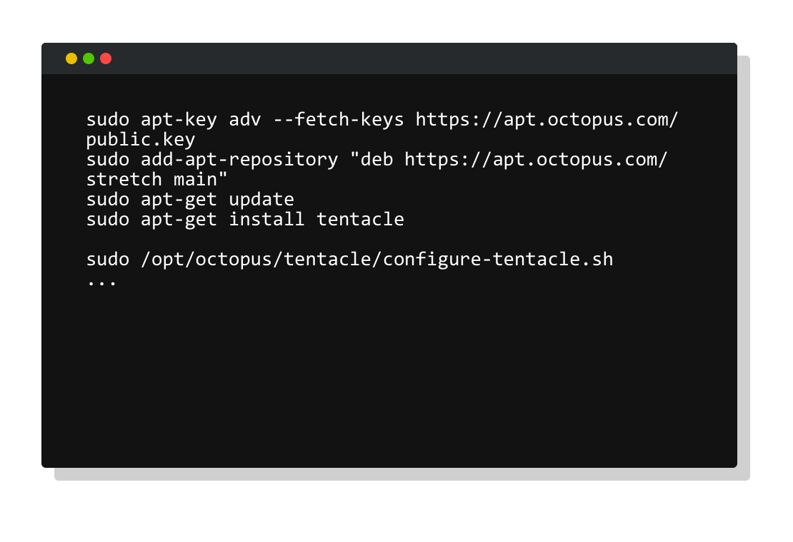

Octopus Deploy `2019.9 LTS` is now available for teams running Octopus Deploy self-hosted, and we recommend this release for these customers. Our [long-term support (LTS) program](https://octopus.com/docs/administration/upgrading/long-term-support) includes releases with six months of support, including critical bug fixes and security patches. The LTS releases do not include new features, minor enhancements, or minor bug fixes; these are rolled up into the next LTS release.

<a href="https://octopus.com/downloads" class="btn btn-primary btn-lg">Download now</a>

The following table shows our current LTS releases. Octopus 2019.3 is no longer supported and we recommend customers on that release upgrade to one of the newer releases.

| Release               | Long term support           |
| --------------------- | --------------------------- |
| Octopus 2019.9        | Yes                         |
| Octopus 2019.6        | Yes                         |
| Octopus 2019.3        | Expired                     |

Keep reading to learn about what's in this release and any breaking changes.

<h2>In this post </h2>

!toc

## Streamlined deployment process editor

We've improved our deployment process editor to streamline the editing process with better visibility. You can now see the entire deployment process, which is useful when referencing other step names in scripts and variables. This should also make navigating between steps faster with fewer clicks, and less scrolling.

[Learn more](https://github.com/OctopusDeploy/Issues/issues/5804)

## Tentacle for Linux

This release includes support for our native Tentacle agent for Linux. This enables teams to deploy to Linux servers in secure environments where it's not possible to open port 22. Tentacle supports secure communication between the Octopus Server and deployment targets in listening and polling modes. In polling mode, the Tentacle agent contacts the Octopus Server and executes deployment work as required, including retrieving application packages and deployment scripts.

Tentacle for Linux provides greater flexibility for teams deploying to Linux in highly secured environments.

[Learn more](https://octopus.com/docs/infrastructure/deployment-targets/linux/tentacle)

## Tenant cloning

Creating and configuring tenants can be time-consuming as it involves multiple steps to link projects and environments, add tags, and enter all the required variable values. Thankfully, this process is now far more straightforward as you can clone a Tenant instead of manually performing all of those steps. Then you can update the new tenant as required.

[Learn more](https://github.com/OctopusDeploy/Issues/issues/5727)

## Other improvements

* Added **health check scheduling options** so they can be configured to run on a cron expression, or to never run.
* Added support to **override namespace in Kubernetes steps**.
* **New Variable Filter expressions** including `Trim`, `Substring`, `Truncate`, `UriEscape`, and `UriDataEscape`.
* Added support to **paste to certificates as text** to add certificates directly in the portal.

[Learn more](https://octopus.com/blog/octopus-release-2019.8)

## Breaking changes

This release includes a single breaking change as [Octopus Server no longer supports for Windows Server 2008 SP2](https://octopus.com/blog/windows-server-2008-eol-hello-linux).

## Wrapping up

Octopus Server 2019.9 is now available and you can depend on it. Happy long-term deployments!
