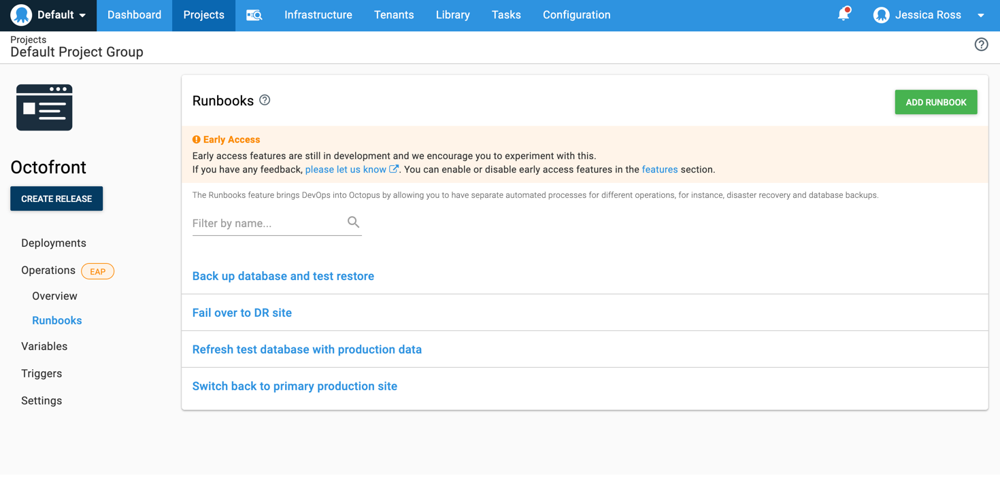

A deployment is only one phase in the life of an application. There are typically many other tasks which are performed to keep an application operating. A large part of DevOps is running operations separate from deploying applications, and Octopus seems like the perfect tool to use given it already knows about the infrastructure and variables.

Let’s use our Octopus website, Octofront, as an example. We use Octopus to deploy Octofront and manage our infrastructure, variables, certificate and accounts. But we also have some routine and emergency tasks we do to "operate" the website. For instance, backing up the database, restoring it, and testing the restore, removing PII, and restoring it to a test environment and failing over to a disaster recovery site.

Currently it’s all in the one Project’s deployment process or executed as separate scripts. Performing all these steps for a deployment doesn’t make sense and doing a deployment just to backup a database doesn’t make sense either.

Operations Runbooks would allow us to simplify the deployment process and enable the operational tasks to be run at different intervals to the deployment. Our list of Runbooks would be:
1. Fail over to DR site
2. Switch back to primary production site
3. Back-up database (and test that restore works)
4. Refresh the test database with production data (sanitized)

We would also clearly see from the overview and task lists the exact operations and their runs performed separately, giving us a true picture of the state of our website.

## Operations Runbooks in Octopus Deploy
To try the early access release of Runbooks, it can be enabled via the Configuration>Features section and accessed from within a Project. This allows you to keep everything related to running an application together. If you have operations that apply to your infrastructure only and not necessarily related to an application, like cleaning up files on machines, we suggest you create a separate project for these types of operations.

In the project menu, everything related to a deployment sits under a new *Deployments* menu-item. The new *Operations* menu-item provides an area for growth of Operations in the future. Resources that can be shared between Deployments and Operations sit outside of these areas. However there are limitations with Variables, Triggers and other areas within the EAP. The limitations are outlined in the [Runbooks documentation](#).

## Creating and running a Runbook
Adding a Runbook can be done from the Operations>Runbooks section and adding steps to a Runbook works the same way as adding steps to a Deployment Process. If you have operational steps within a Deployment Process these can be cloned into a Runbook.

When running a Runbook, a snapshot is created at the time of the run, making it quicker to perform operations. We didn’t design Runbooks to rely on lifecycles, so you can run a Runbook on any environment you have permissions to.

## Cloning steps
If you have steps in your deployment process that would be more suited to a runbook, you can clone the step to your runbook.

## New Permissions
If you want to restrict users from running Runbooks, we have new permissions `RunbookView` and `RunbookEdit` (for creating, editing and deleting). This feature re-uses the existing `ProcessEdit`, `Deployment` and `Release` permissions for runs and snapshots.

Runbooks is available as an early access feature in the [2019.10](#) release. We encourage you to try Runbooks for any processes that aren’t application specific.