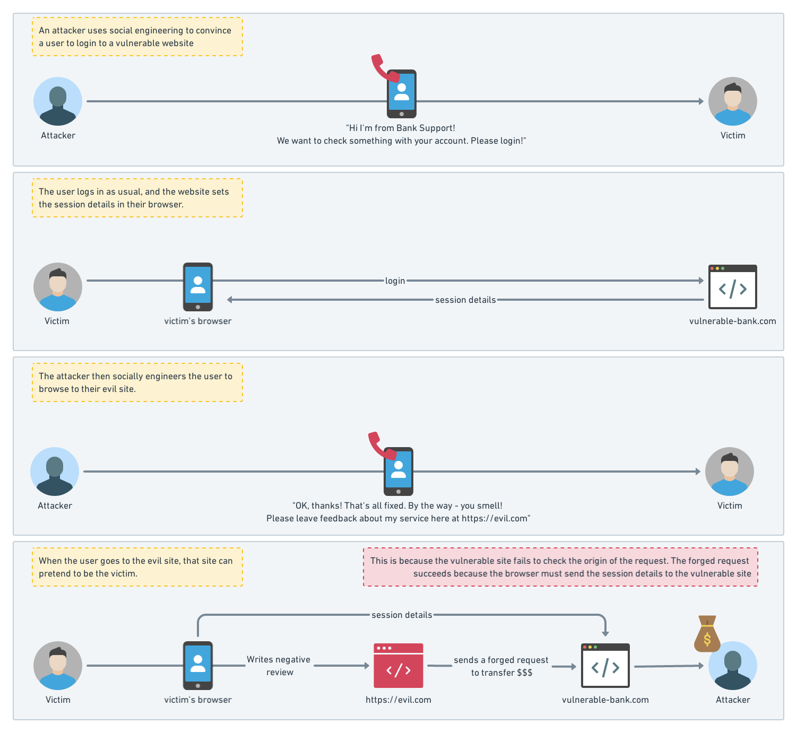
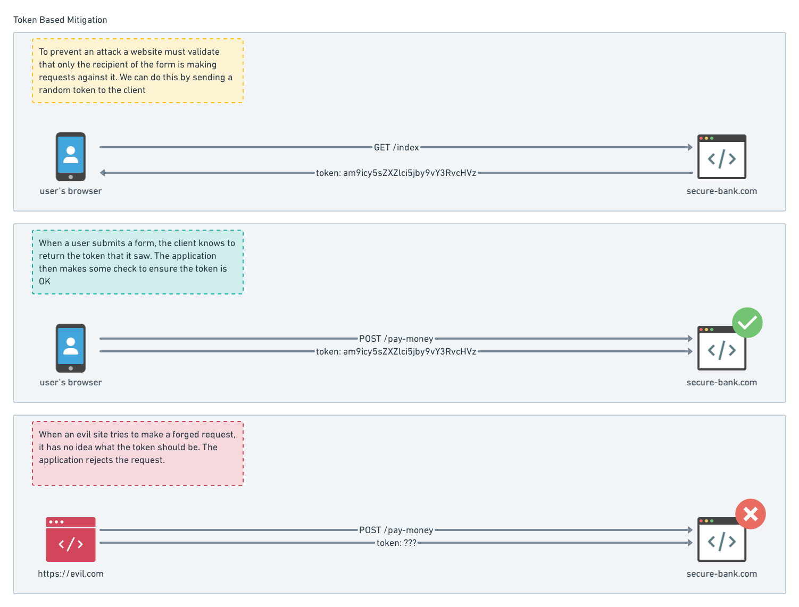
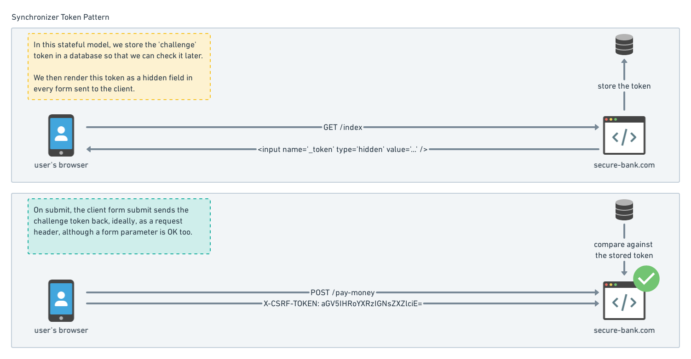

Cross site request forgery (CSRF) prevention is one of those ‘must haves’ that we all take for granted. Popular web frameworks have ready made support for using prevention methods easily. As a result, when you’re building a website it can be all feel a little bit like magic though, and I really don’t like that feeling. Let's bust that sense of magic and mystery!

For these reasons I decided to dive head first into the different implementations out there, and line them up to the [OWASP recommendations](https://cheatsheetseries.owasp.org/cheatsheets/Cross-Site_Request_Forgery_Prevention_Cheat_Sheet.html). The [Open Web Application Security Project](https://www.owasp.org/index.php/About_The_Open_Web_Application_Security_Project)  provides our industry with well considered, well researched patterns for defending our applications.

To share my own journey of (re)discovery, I’ve put together a three part series on CSRF Prevention. In this part, I’ll focus on our current suite of options for mitigation.

## How CSRF attacks work

To recap on the attack itself, a cross site request forgery can have catastrophic results for its victims. For example, an attacker that can fool a user into unwittingly submit a forged request for a vulnerable banking application, could result in that user unknowingly transferring all of their funds to the attackers own account. Depending on how well the application was logging request data, this request would appear to be completely legitimate.  

A successful CSRF attack generally relies on three things:
1. A website that doesn't properly establish the origin of a HTTP requests.
2. Knowledge that an unsuspecting user is logged into the vulnerable website. 
3. Tricking a user access a website that is crafted to perform malicious requests on behalf of the user

What if we could ensure that every request only came from a web page that we control?

One of the best fortifications we have here, is to send the client a secret that only they are able to return to the server. 
Because an attacker has no control over the real website, or the clients browser, this takes away the attackers ability to forge requests.

As you can imagine, there are many ways to do this. This category of approaches is known as ‘token based mitigation’ and is listed as the _primary defense technique_ according to OWASP.

It would be equally bad if an attacker could forge a CSRF token! If they could, then they would be able to trick the server into validating the request and all our hard work would be for nothing. 

For this reason we need to make sure that tokens are practically impossible to forge:

- Unique to each users session - this prevents fixing a token to another user
- Cryptographically random values - not base64 encoded strings ;)
- Large enough to not be guessed or brute forced

## Stateful and Stateless token based mitigation

We can apply the same concept of checking tokens in stateful or stateless ways. Why you would choose one or the other is largely an architectural decision based on the nature of your web application, but I won’t drill too far into that here.

One stateful approach is known as the `synchronizer` token pattern, which places the token in a form, to be returned as a form parameter or in a header (or both). This requires the server to remember the token for each user session. 

This is quite a common approach, because it is reasonably simple to implement and understand, and often implemented in popular web application frameworks.

While this approach is considered rock solid, and work fantastically well, it does have a few downsides. It might be difficult to retrofit such an approach to a large insecure website with lots of forms on it. Second, storing token in a database might not be possible. Sometimes we need other options!

### Encryption based tokens

A stateless approach is to generate tokens based on a private key that only the application knows. This might be sent along as a hidden form field, and expected to be returned as a request header.

Using the users session ID as the thing to encrypt (which should also be a secret), if the server cannot decrypt the value it receives, or if the sessionID is incorrect for the current user, then it is a possible that the request is bogus and the request should be rejected.

### Double submit cookie

[picture of a double submit]

Another typical stateless way to do this is sometimes known as the `double submit cookie` approach. Here, the server stores a session cookie and a CSRF token cookie. 

Forms will render the token, and the client is expected to return the value of the cookie, as well as the form value. The server checks the cookie value against the form value, and also checks the session ID.

For AJAX to work, this pattern requires cookies to be set with the `HttpOnly` flag set to `false` . This is so that the token cookies can be read by JavaScript and then added to the request headers.

> **This technique works as long as you are sure that your subdomains are fully secured and only accept HTTPS connections**  
[OWASP Anti CSRF cheat sheet](https://cheatsheetseries.owasp.org/cheatsheets/Cross-Site_Request_Forgery_Prevention_Cheat_Sheet.html)

The reason for this is that the assumption that an attacker has no control over cookies _can be_ a flawed one. It might be possible to write cookies and dodge cross origin policy in [certain circumstances](https://media.blackhat.com/eu-13/briefings/Lundeen/bh-eu-13-deputies-still-confused-lundeen-wp.pdf) and therefore spoof the double submit with your own value!

## Layered cake is the best cake

[Picture of a layer cake]

Each approach has trade offs, but you are free to implement more than one approach to cover different threat models. Again with the OWASP recommendations (they are just too good not to quote)

> We recommend token based CSRF defense (either stateful/stateless) as a primary defense to mitigate CSRF in your applications.  

> As a defense-in-depth measure, consider implementing one mitigation from Defense in Depth Mitigations section [of the OWASP cheatsheet]  

One option here is using the SameSite flag on cookies. Browsers that respect this flag will protect an unwitting user from submitting a cookie to the wrong website. This will soon become the standard behaviour in most browsers, but because it relies on the browser to do the right thing, it is not a silver bullet.

Another option is to start to validate the source and target origin of the request via the origin or referrer headers. These headers are special, because JavaScript isn’t allowed to set them, only the browser can. If the source and target do not match, we reject the request. Again, not a silver bullet, because a PiTM can rewrite the headers.

### Why more is more

The reason for this suggestion is that no one strategy is _permanently_ perfect. Assumptions that were acceptable at the time they were made, aren’t set in stone.

One of the biggest assumptions is often, “We are free of XSS vulnerabilities” after getting a green light on a penetration test. This is not a permanent state, and there are plenty of reasons for that state to flip to false.

When it comes to securing things, a YAGNI mentality during design is a boon for attackers, all they have to do is bust a single assumption, and they’re in.

If you can afford some time to add layers of protection, and it doesn’t impact your customers, then it could be a cost effective insurance policy.

### Does HSTS and HTTPS protect us from CSRF and session fixation?
Not directly, because an attacker can setup a bogus page with their own certificate and have a user submit that page.

That said HTTPS does ensure that general network sniffing and PiTM is a lot harder to achieve, meaning that outright theft of CSRF and Session tokens is harder. So it is still important to use HTTPS!

HTTP Strict Transport Security (HSTS) headers will force a browser to use HTTPS if the website allows it, which protects users from sites that contain mixed HTTP & HTTPS content. It does have an issue with “trust on first use” (sometimes referred to as TOFU). This means the first request to a HTTP resource will succeed before subsequent requests are forced to use HTTPS. 

If an application owner is 100% confident in delivering HTTPS content _all the time_, then the site itself can be added to a HSTS preload list. More on [that here](https://scotthelme.co.uk/our-journey-to-a-https-only-world/). This means the browser is already aware of the sites HTTPS requirement and will automatically upgrade those requests.

## Identity and session checking
One of the most important aspects of a CSRF check is that the token used are unique to a user per session.

Imagine if this wasn’t the case for a moment. Regardless of how a token may leak in the first place, if it didn’t have some mechanism to expire, then it would be valid forever, which is usually a very bad idea for any secret. Assuming sessions expire, a simple hook point is the users session identifier.

Taking this a step further, we could _also_ expire if the identity of the user changes for some reason. For example an email address or username change fundamentally changes a users identity in an application, and so any tokens generated prior to this point in time could be considered invalid: one good reason to change your email address is if it has been compromised!

And with that, I think I’ll leave it there. We covered a lot of ground: different forms of token validation & secondary measures. 

_If you made through that acronym soup, thanks for reading this far! I know this can be a pretty dry subject, so I’ll leave it there for now. In my next post I’ll take a look at the choices that we made in Octopus Deploy_
