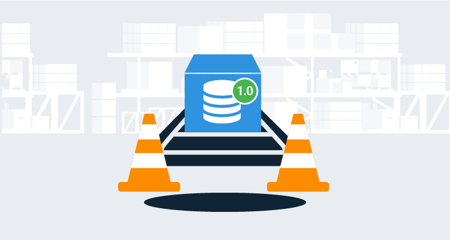

While it is possible to perform SQL rollbacks to revert database changes, the question is, should you?  Rolling back a database change isn’t as straightforward as rolling back a code change.  Databases are the lifeblood of applications.  An unsuccessful rollback can result in bad or deleted data.  This article goes through the pitfalls which result in bad or deleted data and why roll forwards is a better approach.  

:::success
**TL;DR**

Rolling forward is a better option.  In specific instances, it is possible to roll back a database change, but those cases are rare.  The effort spent on designing a database rollback process should instead focus on making deployments as fast and safe as possible.  A fast and safe database deployment allows you to roll forward.
:::

This article is part of a series we have written on [automated database deployments](https://octopus.com/database-deployments).

!toc

## Rollback scenarios

The need to rollback will typically fall into one of three categories:

- During deployment.
- During verification after a deployment.
- After deployment and verification.

Deployment and verification are intentionally split up because users could be using the application during verification.  It depends on the deployment strategy (outage, canary, or blue/green deployments) and what your application supports.  For example, Octopus Deploy has the [maintenance mode](https://octopus.com/docs/administration/managing-infrastructure/maintenance-mode) feature, which prevents other non-admins from deploying code, even though they can still access it.  Features like maintenance mode support verification after a deployment.

Let’s go through a typical application’s deployment process.  The application has a database, a front end written in React, a RESTful API back-end, and a background service.  The deployment process might look like:

1. Approve the deployment to production.
2. Deploy database changes.
3. Deploy background service.
4. For each web server:
    1. Take the server out of the load balancer.
    2. Deploy the RESTful API.
    3. Deploy the Front End.
    4. Run sanity check tests.
    5. Add the server back into the load balancer.
5. Verify the release by running a full suite of tests.
6. Notify the appropriate people of the release.

For some deployments, the database change is simple.  A new index or an efficiency tweak to a stored procedure.  Rolling back those changes would have little impact.  Rolling back complex changes, adding a column, moving a column, adding a table, or splitting a table would have a significant impact.  And don't forget about a migration script.  Those rollbacks are exponentially more complex.

## Why rollback a deployment?

The three common answers I hear are:

1. Something goes wrong with the deployment.
2. We run a series of tests, and one or more of those tests fail.
3. A show stopping bug is found by a user.

Okay, cool, but *something goes wrong* is a bit vague.  Deployment failures can happen for a variety of reasons, for instance:

- Failure because of a network issue. Maybe a network admin restarted a switch, and that killed the connection to the deployment target.
- A DBA applies a role membership change, but the new role doesn’t have data reader permissions.
- The deployment target is turned off.
- The service account that is used for deployments had its password changed earlier in the day, but the deployment is still using the old password.
- The updated application requires .NET Core 3.0, but only .NET Core 2.2 is installed.
- A misconfiguration in the deployment process.

I don’t think any of those would justify rolling back a database change.  Often a retry can resolve those issues.  Situations like that are why we added the [guided failure feature](https://octopus.com/docs/deployment-process/releases/guided-failures) to deployments in Octopus Deploy, which allows you to choose how to handle a deployment failure.  

The second reason, rolling back because one or more of the tests fail.  Do **all** tests need to pass?  Just like deployment failures, tests can fail for a variety of reasons, for instance:

- The integration test causes the application to call out to the external system.  The external system isn’t scheduled to be updated until tomorrow and returns an unexpected result.  The result is correct for the current version of the external system, but it is incorrect for the version going out tomorrow.
- Someone accidentally changed the names of some test customers.  The tests were expecting **Testing User**, but now the data is **Testing User #1**.
- An external system is updated at the same time as your application.  Tests are going to fail until that external system is up and running 20 minutes from now.

Again, I don’t think any of those failures justify rolling back a database change.  It’s common for integration tests to only work when the stars align.  

The volume of changes being deployed can also influence a rollback.  The desire to rollback is a lot higher when a couple of changes are made vs dozens upon dozens of changes.  That desire to rollback increases exponentially when a show stopping bug is found.  The downside is they are typically found by users.  That turns into a catch-22.  In order to find a show stopping bug a user has to use the application.  However, rollbacks are much more difficult once a user starts using the application.

## The pitfalls of backup and restore

You might be thinking to yourself, “Why don’t we take a database backup before the start of the deployment process?  That’ll solve the problem of rolling back those complex changes.”  A backup’s usefulness has a limited lifespan.  A backup becomes useless when:

1. A user starts using the new version of the application.
2. The next scheduled backup occurs.

Those events could happen after 1 minute or several hours.  Rolling back would mean changing data.  Or, even worse,  removing data.

Rollback via a backup restore doesn’t occur in a vacuum.  It is very common for applications to share data.

Before working at Octopus Deploy, I worked on a loan origination system, with the primary purpose of gathering data to send to a decision engine.  The decision engine determined if the loan should be denied, auto-approved, or needed a loan officer to gather more data.  After the loan officer had entered more data, they could submit it for subsequent decisions.  The loan origination system and decision engine were separate applications with separate databases.  The decision engine handled the first decision differently than the second decision.  It kept track of the decisions it was making with a unique identifier sent in by the loan origination system.

The first time we restored the loan origination system from a backup in our test environment, we started getting unexpected results from the decision engine.  The issue was the decision engine’s database wasn’t restored from a backup.  We saw two problems:

**Problem #1:**

1. The user submits a loan.
2. The decision engine auto approves the loan.
3. Restore from backup occurs.
4. The user submits the loan again.
5. The decision engine sees this as a second request and rejects the loan thinking it is a fraudulent loan.

**Problem #2:**

1. The user submits the loan for customer A.
2. The decision engine auto approves the loan.
3. Restore from backup occurs.
4. The restore deleted the entire loan record, along with dozens of other loan records.
5. The user recreates the loan and submits it, but it gets a different unique ID to send to the decision engine.
6. The decision engine already has that unique ID for Customer B, and it decides based on Customer A and B’s information.  

As you can see, backups shouldn’t be used for rollbacks.  They should be used for disaster recovery only.  The typical backup schedule I see is a full backup once a week, partial backups once a day, point in time backups throughout the day.  These backups are done in the event a database server or a data center is lost.

## The pitfalls rollback scripts

I’ve seen some companies institute the rule: *For every database change made, a corresponding SQL rollback script must be written*. However, rollback scripts have their own set of pitfalls.  

Writing SQL rollback scripts takes time.  If the script is never run, then it turns out to be wasted time.  If you have several dozen successful deployments, the motivation to write the rollback script will decrease.  As time goes on, people start openly questioning why it needs to be created in the first place.  Eventually the scripts become the bare minimum to rollback.  They are written to check a checkbox.

Much more importantly, the scripts have to be tested.  That leads to further questions, such as:

- Who tests them?  
- When are they tested?  
- Is it an automated test or a manual test?  

If the answer to those questions is, *Bob tests them in the morning before a production release*, then there’s a chance the tests will happen only half the time.  If it is not a blocking task, and if it is not automated, then it won’t get done.  

Rollback scripts have a limited lifespan, just like database backups.  When the rollback is non-breaking, for instance, a new index is removed, or a tweaked stored procedure is reverted, the lifespan is long.  When the change is breaking, for instance, a new column or table is removed, the lifespan is limited.  

For example, if a column is added to a table, the rollback script removes the column.  Easy.  But if that column was in production for two days, and hundreds of users saved data to that column, should the rollback script still remove that column?  Removing data is a big deal in most applications.  

There is a temptation to come up with a decision tree on when a rollback script is necessary.  In the end, that will make things worse.  Scenario after scenario after scenario will be added to the tree, and it will grow into an unwieldy mess.  

## Rolling forward: A different way of thinking

Once a user starts using the application after a deployment, you have [crossed the Rubicon](https://en.wikipedia.org/wiki/Crossing_the_Rubicon).  One could argue, once verification starts the Rubicon has been crossed.  

:::success
More often than not, the effort to **_successfully_** rollback a deployment far exceeds the effort it would take to push a fix to production.
:::

After database deployments were automated for the loan origination system, deployments took less than 10 minutes.  The database deployment was only 3-4 minutes.  We had four environments, and when we knew what the issue was, we could check in a change, verify it, and have it pushed to all four environments in less than 30 minutes.  If we wanted to skip the two lower environments, it was less than 20 minutes.  

When the topic of rollback is broached during a post-deployment crisis, the team will have to:

- Analyze what changes went out with the previous deployment.  Often it involves opening up a diff tool and going through the changes line by line.
- Create a list of areas to test to ensure the application doesn’t crash after the rollback.
- Identify which data is going to be changed.
- Identify which data is going to be deleted.
- Determine if the database needs to be rolled back or just the code.
- Create a backup of production and restore it on a test server.  
- Rollback the previous deployment and start testing.  

During a post-deployment crisis that analysis is not happening in a vacuum.  Users are demanding to know what is going on.  Higher-ups are asking for status reports.  DBAs have to be contacted to get copies of the production database to test with.  It is unrealistic to expect those steps to be done in less than two hours.  I've seen teams take entire days to finish all those steps.

## The ideal solution: rolling forward and staging backward-compatible changes

Database deployments are often the riskiest part of a deployment.  Is it possible to reduce that risk?  

I think back to all the production deployments I’ve done that included databases.  The stress level was non-existent when the changes were staged hours or days before.  That gave us time to verify the changes during working hours.  The code was still deployed during the deployment window.  Deploying code typically went very quickly.  The verification during the deployment window was much quicker as the majority of it had already been done.

That’s only possible when the database changes are backward compatible, and that takes a great deal of discipline. For details on how backward-compatible database changes should be made, see my article on [Blue/Green Database Deployments](https://octopus.com/blog/databases-with-blue-green-deployments).  That example is a bit extreme, but I would argue that the time spent on it was worth it.  

This approach also means the process of deploying database changes needs to be separate from the process that deploys code changes.  It also requires a more planning as you'll have to juggle two production deployments.  Even with this in place, I'd argue a rollback should be last resort.  The database won't have to rollback, but the code will.  That could remove functionality and frustrate users.

It’s not always feasible to do this.  My personal rules are:

- When possible, make database changes backward compatible.
- When possible, stage database changes in production hours or even days before the code deployment.
- Unless something catastrophic happens, roll forward.

## Conclusion

The effort to **_successfully_** rollback a deployment far exceeds the effort it would take to push a fix to production. The chance of something going wrong with a rollback is much higher than when rolling forward.  That is especially true for database rollbacks.  There are only so many hours in the day, and it’s better to spend the time getting better at deployments than spending time worrying about rollbacks and all the possible scenarios.  

Happy Deployments!

If you enjoyed this article and we have a entire series of [automating database deployments](https://octopus.com/database-deployments) for you to read.
